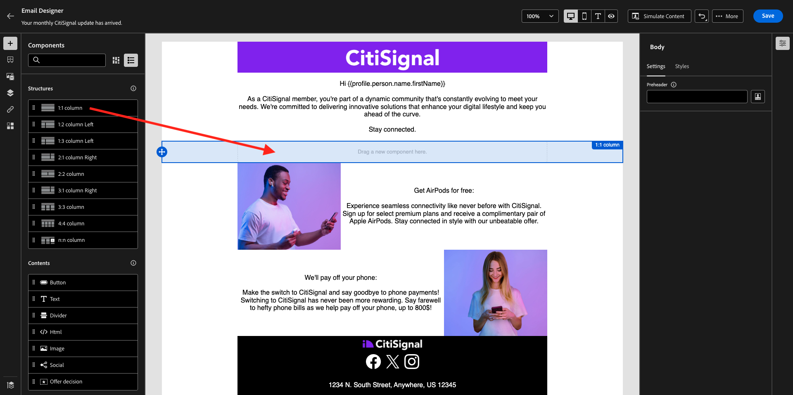

# 3.4.3在電子郵件訊息中套用區段型個人化

前往[Adobe Experience Cloud](https://experience.adobe.com)登入Adobe Experience Cloud。 按一下&#x200B;**Adobe Journey Optimizer**。

您將被重新導向到Journey Optimizer中的&#x200B;**首頁**&#x200B;檢視。 繼續之前，您必須選取&#x200B;**沙箱**。 要選取的沙箱名為``--aepTenantId--``。

## 3.4.3.1區段型個人化

在本練習中，您將使用根據區段會籍建立的個人化文字，來改善您在上一個練習中建立的電子報電子郵件訊息。

前往&#x200B;**行銷活動**。 尋找您在上一個練習中建立的Newsletter歷程。 搜尋`--aepUserLdap-- - CitiSignal Newsletter`。 用滑鼠右鍵按一下3個點&#x200B;**...**，然後按一下&#x200B;**複製**。

您將會看到此訊息。 將此用於&#x200B;**標題**： `--aepUserLdap-- - CitiSignal Newsletter (SBP)`。 按一下&#x200B;**複製**。

按一下複製的促銷活動以開啟。

按一下&#x200B;**編輯**&#x200B;以變更內容。

按一下&#x200B;**編輯電子郵件內文**。

您將會看到此訊息。

開啟&#x200B;**內容元件**，並將&#x200B;**1:1欄**&#x200B;拖曳到AirPods選件上方。

將&#x200B;**Text**&#x200B;元件拖放至該1:1欄。

選取整個預設文字並將其刪除。 然後按一下工具列中的&#x200B;**新增個人化**&#x200B;按鈕。

您將會看到此訊息。 在左側功能表中，按一下&#x200B;**對象**。

選取區段`--aepUserLdap-- - Interest in Plans`並按一下&#x200B;**+**&#x200B;圖示以將其新增至畫布。

然後，您應該保留第一行原樣，並以下列程式碼取代第2行和第3行：

``
    PS: It may be a good idea to check if your plan still meets your needs! Click here to be contacted by one of our experts!

    PS: Thanks for taking the time to read our newsletter. Here is a 10% promo code to use on the website: NEWSLETTER10

``

您就會擁有此專案。 按一下&#x200B;**儲存**。

將文字對齊方式變更為&#x200B;**置中對齊**。

您現在可以按一下右上角的&#x200B;**儲存**&#x200B;按鈕來儲存此訊息。 然後，按一下左上角主旨列文字旁的&#x200B;**箭頭**。

按一下&#x200B;**檢閱以啟動**。

按一下&#x200B;**啟動**。

您具有區段式個人化的電子報現已發佈。 您的電子報電子郵件訊息將根據您的排程傳送，您的歷程將在傳送最後一封電子郵件後立即停止。

如果您符合所使用區段的資格，將會在您將收到的電子郵件中看到以下內容：

您已完成此練習。

## 後續步驟

移至[3.4.4安裝程式並使用iOS的推播通知](./ex4.md){target="_blank"}

返回[Adobe Journey Optimizer](journeyoptimizer.md){target="_blank"}

返回[所有模組](./../../../../overview.md){target="_blank"}
