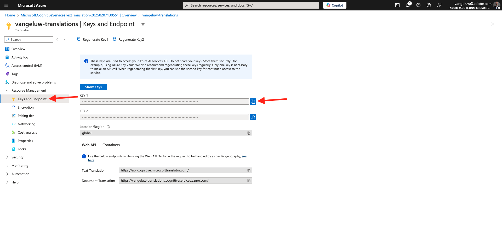
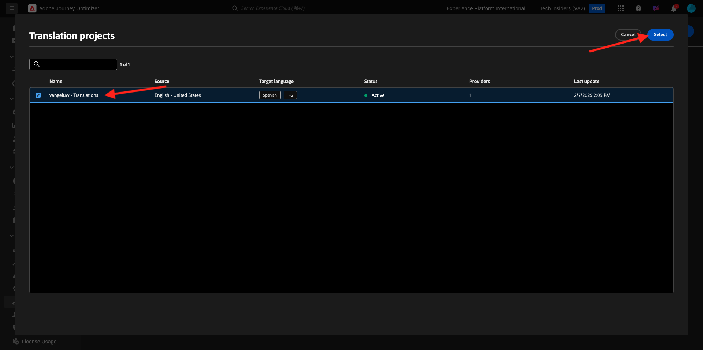

# 3.5.1翻譯提供者

## 3.5.1.1設定Microsoft Azure Translator

移至[https://portal.azure.com/#home](https://portal.azure.com/#home)。

在搜尋列中輸入`translators`。 然後，按一下&#x200B;**+建立**。

選取&#x200B;**建立轉譯器**。

選擇您的&#x200B;**訂閱識別碼**&#x200B;和&#x200B;**資源群組**。
將**區域**&#x200B;設定為&#x200B;**全域**。
將**訂價層**&#x200B;設定為&#x200B;**免費F0**。

選取&#x200B;**檢閱+建立**。

選取「**建立**」。

選取&#x200B;**移至資源**。

在左側功能表中，移至&#x200B;**資源管理** > **金鑰與端點**。 按一下以複製您的金鑰。

## 3.5.1.2地區設定字典

移至[https://experience.adobe.com/](https://experience.adobe.com/)。 按一下&#x200B;**Journey Optimizer**。

在左側功能表中，移至&#x200B;**翻譯**，然後移至&#x200B;**地區設定字典**。 如果您看到此訊息，請按一下&#x200B;**新增預設語言環境**。

您應該會看到此訊息。

## 3.5.1.3在AJO中設定翻譯提供者

移至[https://experience.adobe.com/](https://experience.adobe.com/)。 按一下&#x200B;**Journey Optimizer**。

在左側功能表中，移至&#x200B;**翻譯**，然後移至&#x200B;**提供者**。 按一下&#x200B;**新增提供者**。

在&#x200B;**提供者**&#x200B;底下，選取&#x200B;**Microsoft轉譯器**。 勾選核取方塊以啟用翻譯提供者的使用。 貼上您從Microsoft Azure翻譯人員複製的金鑰。 然後，按一下&#x200B;**驗證認證**。

然後應該會成功驗證您的認證。 如果是，請向下捲動以選取要翻譯的語言。

請務必選取`[en-US] English`、`[es] Spanish`、`[fr] French`、`[nl] Dutch`。

向上捲動並按一下&#x200B;**儲存**。

您的&#x200B;**翻譯提供者**&#x200B;現已準備就緒，可供使用。

## 3.5.1.4設定翻譯專案

移至[https://experience.adobe.com/](https://experience.adobe.com/)。 按一下&#x200B;**Journey Optimizer**。

在左側功能表中，移至&#x200B;**翻譯**，然後移至&#x200B;**地區設定字典**。 如果您看到此訊息，請按一下[建立專案]。****

輸入名稱`--aepUserLdap-- - Translations`、將&#x200B;**Source地區設定**&#x200B;設定為`[en-US] English - United States`，並勾選核取方塊以啟用&#x200B;**自動發佈已核准的翻譯**&#x200B;和&#x200B;**啟用檢閱工作流程**。 接著，按一下&#x200B;**+新增地區設定**。

搜尋`fr`，啟用`[fr] French`的核取方塊，然後啟用&#x200B;**Microsoft Translator**&#x200B;的核取方塊。 按一下&#x200B;**+新增地區設定**。

搜尋`es`，啟用`[es] Spanish`的核取方塊，然後啟用&#x200B;**Microsoft Translator**&#x200B;的核取方塊。 按一下&#x200B;**+新增地區設定**。

搜尋`nl`，啟用`[nl] Spanish`的核取方塊，然後啟用&#x200B;**Microsoft Translator**&#x200B;的核取方塊。 按一下&#x200B;**+新增地區設定**。

按一下&#x200B;**儲存**。

您的&#x200B;**翻譯**&#x200B;專案現已準備就緒，可供使用。

## 3.5.1.5設定語言設定

移至&#x200B;**管道** > **一般設定** > **語言設定**。 按一下&#x200B;**建立語言設定**。

使用名稱`--aepUserLdap--_translations`。 選取&#x200B;**翻譯專案**。 然後，按一下&#x200B;**編輯**&#x200B;圖示。

選取您在上一步建立的翻譯專案。 按一下&#x200B;**選取**。

您應該會看到此訊息。 將&#x200B;**遞補偏好設定**&#x200B;設定為&#x200B;**英文 — 聯合統計資料**。 按一下以選取&#x200B;**選取設定檔語言偏好的屬性**，這會決定使用客戶設定檔中的哪個欄位來載入翻譯。 然後，按一下&#x200B;**編輯**&#x200B;圖示以選取要使用的欄位。

在搜尋列中輸入&#x200B;**偏好語言**，然後選取欄位&#x200B;**偏好語言**。

按一下&#x200B;**英文 — 美國**&#x200B;和&#x200B;**荷蘭文**&#x200B;的&#x200B;**編輯**&#x200B;圖示以檢閱其組態。

這是&#x200B;**英文 — 美國**&#x200B;的組態。 按一下&#x200B;**取消**。

按一下以檢視&#x200B;**荷蘭文**&#x200B;的組態。 按一下&#x200B;**取消**。

向上捲動並按一下&#x200B;**提交**。

您的語言設定現已完成設定。

您已完成此練習。

## 後續步驟

移至[3.5.2建立您的行銷活動](./ex2.md)

返回[Adobe Journey Optimizer：翻譯服務](./ajotranslationsvcs.md){target="_blank"}

返回[所有模組](./../../../../overview.md){target="_blank"}
