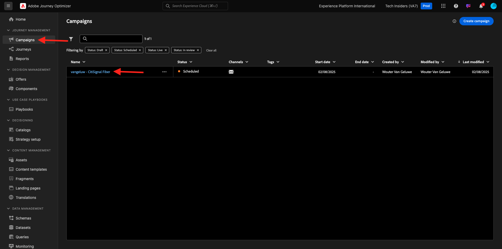

# 3.5.3新增語言至您的電子郵件

移至[https://experience.adobe.com/](https://experience.adobe.com/)。 按一下&#x200B;**Journey Optimizer**。

您將被重新導向到Journey Optimizer中的&#x200B;**首頁**&#x200B;檢視。 首先，確定您使用正確的沙箱。 要使用的沙箱稱為`--aepSandboxName--`。

前往&#x200B;**行銷活動**，然後按一下以開啟您剛才建立的行銷活動。

按一下&#x200B;**修改行銷活動**。

按一下&#x200B;**修改**。

向下捲動至&#x200B;**電子郵件**&#x200B;動作，然後按一下&#x200B;**編輯內容**。

按一下&#x200B;**新增語言**。

選取名為`--aepUserLdap--_translations`的&#x200B;**語言設定**。 按一下&#x200B;**選取**。

您應該會看到此訊息。 按一下&#x200B;**傳送至翻譯**。

之後，您應該會看到如下的訊息。 **傳送至翻譯**&#x200B;工作流程現已開始，需要幾分鐘才能完成。
您會看到狀態變更為&#x200B;**翻譯進行中**。

幾分鐘後，翻譯工作流程的狀態將變更為&#x200B;**翻譯完成**。

按一下&#x200B;**`[es] Spanish`**&#x200B;翻譯。 然後，您將在電子郵件預覽中以及&#x200B;**主旨列**&#x200B;中看到更新的文字。
如有需要，您仍可直接在&#x200B;**主旨列**&#x200B;欄位中檢閱及更新翻譯。

按一下&#x200B;**編輯電子郵件內文**&#x200B;以檢閱電子郵件內的翻譯。

您可以手動變更文字，以備需要檢閱翻譯時使用。

按一下左上角主旨列文字旁的&#x200B;**箭頭**，返回行銷活動概覽。

然後您應該會回到這裡。 無需再次啟用此行銷活動。

按一下左上角的&#x200B;**箭頭**，返回行銷活動。

請確定您的行銷活動處於&#x200B;**已停止**&#x200B;狀態。

您現在已經完成此練習。

## 後續步驟

移至[摘要與優點](./summary.md)

返回[Adobe Journey Optimizer：翻譯服務](./ajotranslationsvcs.md){target="_blank"}

返回[所有模組](./../../../../overview.md){target="_blank"}
