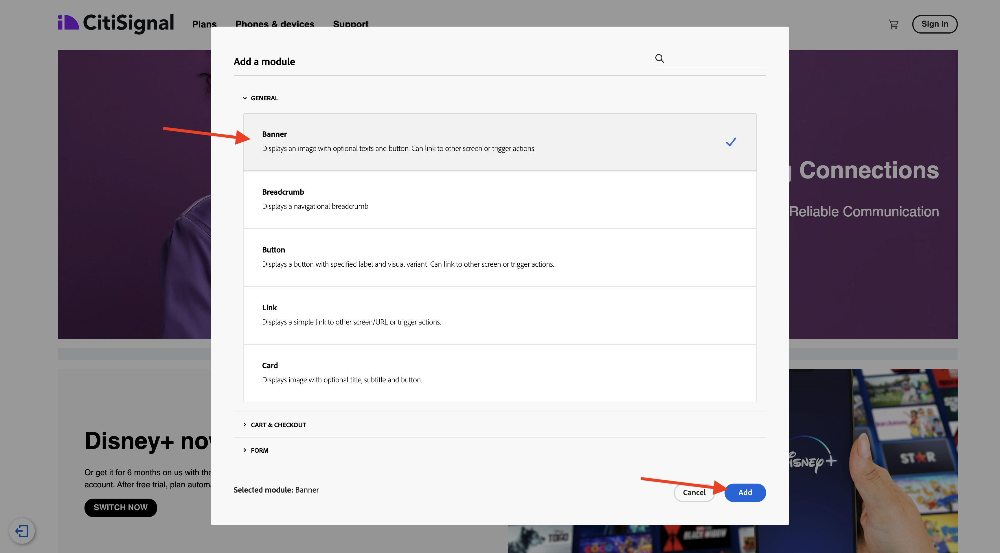
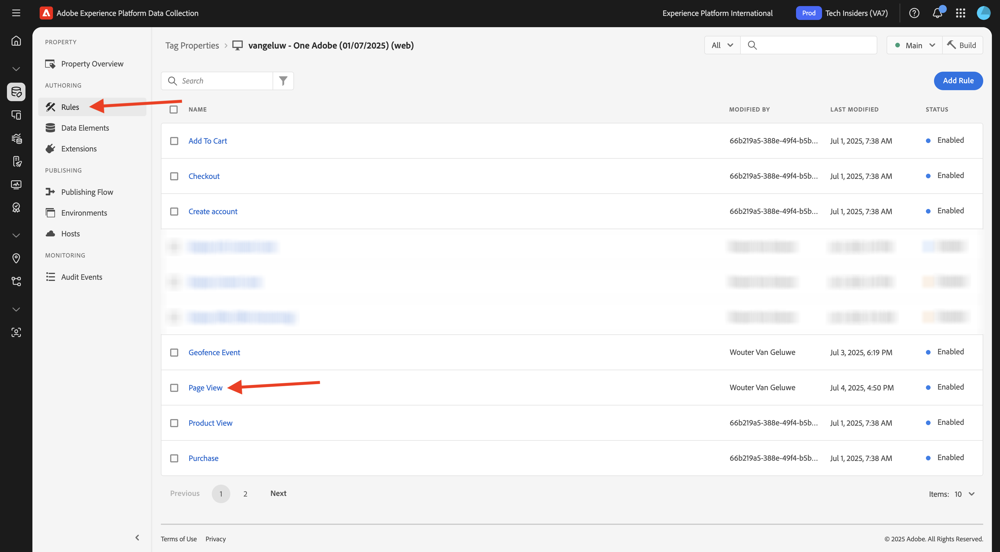
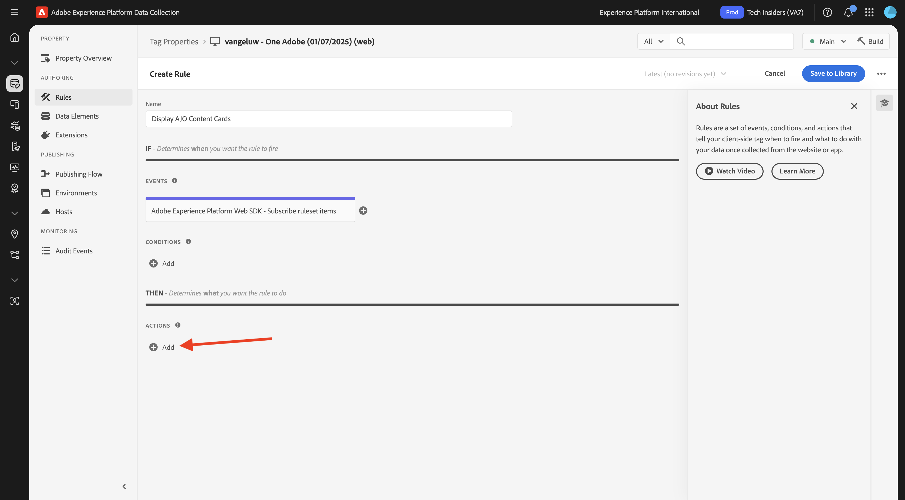
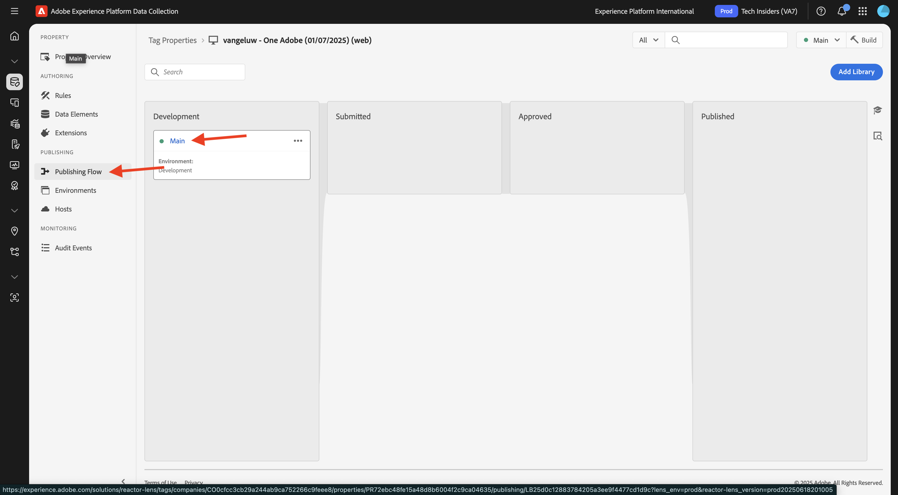

# 3.6.1內容卡

前往[Adobe Experience Cloud](https://experience.adobe.com)登入Adobe Journey Optimizer。 按一下&#x200B;**Journey Optimizer**。


您將被重新導向到Journey Optimizer中的&#x200B;**首頁**&#x200B;檢視。 首先，確定您使用正確的沙箱。 要使用的沙箱稱為`--aepSandboxName--`。 然後您就會進入沙箱&#x200B;**的**&#x200B;首頁`--aepSandboxName--`檢視。


## 3.6.1.1內容卡頻道設定

在左側功能表中，移至&#x200B;**管道**，然後選取&#x200B;**管道設定**。 按一下&#x200B;**建立通道組態**。


輸入名稱： `--aepUserLdap--_Content_Cards_Web`，選取頻道&#x200B;**內容卡**，然後啟用平台&#x200B;**網頁**。


向下捲動，並確認選項&#x200B;**單次頁面**&#x200B;已啟用。

輸入先前在&#x200B;**快速入門**&#x200B;模組中所建立的網站URL，如下所示： `https://dsn.adobe.com/web/--aepUserLdap---XXXX`。 別忘了將&#x200B;**XXXX**&#x200B;變更為您網站的唯一代碼。

>[!IMPORTANT]
>
>以上參考您的CitiSignal示範網站URL `https://dsn.adobe.com/web/--aepUserLdap---XXXX`需要變更為實際的URL。 您可以在[https://dsn.adobe.com/](https://dsn.adobe.com/)上前往您的網站專案來尋找URL。

將頁面&#x200B;**上的欄位**&#x200B;位置設定為`CitiSignalContentCardContainer`。


向上捲動並按一下&#x200B;**提交**。


您的頻道設定現在已可供使用。


## 3.6.1.2設定內容卡的排程行銷活動

在左側功能表中，移至&#x200B;**行銷活動**，然後按一下&#x200B;**建立行銷活動**。


選取&#x200B;**排程 — 行銷**，然後按一下&#x200B;**建立**。


輸入名稱`--aepUserLdap-- - CitiSignal Fiber Max Content Cards`，然後按一下&#x200B;**動作**。


按一下&#x200B;**+新增動作**，然後選取&#x200B;**內容卡**。


選取您在上一步建立的內容卡片頻道設定，其名稱為： `--aepUserLdap--_Content_Cards_Web`。

接著，按一下&#x200B;**編輯規則**。


按一下&#x200B;**X**&#x200B;以移除目前的規則。


按一下&#x200B;**+新增條件**。


選取條件&#x200B;**將資料傳送至Platform**。 按一下&#x200B;**完成**


您應該會看到此訊息。 按一下&#x200B;**編輯內容**。


您應該會看到此訊息。


進行下列設定：

- **標題**： `CitiSignal Fiber Max`
- **內文**： `Lightning speed for gamers`
- **目標URL**： `https://dsn.adobe.com/web/--aepUserLdap---XXXX/plans`

>[!IMPORTANT]
>
>以上參考您的CitiSignal示範網站URL `https://dsn.adobe.com/web/--aepUserLdap---XXXX/plans`需要變更為實際的URL。 您可以在[https://dsn.adobe.com/](https://dsn.adobe.com/)上前往您的網站專案來尋找URL。

按一下圖示以變更URL，方法是從AEM Assets選取資產。


移至資料夾&#x200B;**citisignal-imaes**&#x200B;並選取檔案&#x200B;**`neon_rabbit_banner.jpg`**。 按一下&#x200B;**選取**。


然後您應該擁有此專案。 按一下&#x200B;**+新增按鈕**。


為按鈕設定下列設定：

- **按鈕標題**： `Upgrade now!`
- **互動事件**： `click`
- **目標**： `https://dsn.adobe.com/web/--aepUserLdap---XXXX/plans`

>[!IMPORTANT]
>
>以上參考您的CitiSignal示範網站URL `https://dsn.adobe.com/web/--aepUserLdap---XXXX/plans`需要變更為實際的URL。 您可以在[https://dsn.adobe.com/](https://dsn.adobe.com/)上前往您的網站專案來尋找URL。

按一下&#x200B;**檢閱以啟動**。


按一下&#x200B;**啟動**。


您的行銷活動將隨即啟動，這可能需要幾分鐘的時間。


幾分鐘後，您的行銷活動就會上線。


## 3.6.1.3更新您的DSN網站

若要在網站上顯示內容卡，您需要變更CitiSignal示範網站首頁的設計。

移至[https://dsn.adobe.com/](https://dsn.adobe.com/)。 按一下您網站上的&#x200B;**3點**，然後按一下&#x200B;**編輯**。


按一下以選取頁面&#x200B;**首頁**。 按一下&#x200B;**編輯內容**。


將游標停留在主圖影像上，然後按一下&#x200B;**+**&#x200B;按鈕。


移至&#x200B;**一般**，選取&#x200B;**橫幅**，然後按一下&#x200B;**新增**。



按一下以選取新建立的橫幅。 移至&#x200B;**樣式**&#x200B;並在`CitiSignalContentCardContainer`自訂CSS類別&#x200B;**欄位中輸入**。


移至&#x200B;**對齊**。 將欄位&#x200B;**Alignment**&#x200B;設定為`left`，並將欄位&#x200B;**Vertical Alignment**&#x200B;設定為`middle`。

按一下&#x200B;**X**&#x200B;圖示以關閉對話方塊視窗。


您的網站設計現已變更。

如果您現在在新的瀏覽器視窗中開啟網站，看起來應該像這樣。 灰色區域是新建立的橫幅，但沒有任何內容。


為確保內容在新建立的橫幅中動態載入，您的資料收集標籤屬性需要變更。

## 3.6.1.4更新您的資料收集標籤屬性

移至[https://experience.adobe.com/#/data-collection/](https://experience.adobe.com/#/data-collection/)、**標籤**。 作為[快速入門](./../../../../modules/getting-started/gettingstarted/ex1.md)模組的一部分，已建立資料收集標籤屬性。

您已在先前的模組中使用這些資料收集標籤屬性。

按一下以開啟Web的「資料收集」屬性。


在左側功能表中，移至&#x200B;**規則**&#x200B;並按一下以開啟規則&#x200B;**頁面檢視**。



按一下動作&#x200B;**傳送「頁面檢視」體驗事件**。


作為&#x200B;**頁面檢視**&#x200B;規則的一部分，需要從Edge請求特定表面的個人化指示。 表面是您在上一步中設定的橫幅。 若要這麼做，請向下捲動至&#x200B;**Personalization**，並在`web://dsn.adobe.com/web/--aepUserLdap---XXXX#CitiSignalContentCardContainer`Surfaces **下輸入**。

>[!IMPORTANT]
>
>以上參考您的CitiSignal示範網站URL `web://dsn.adobe.com/web/--aepUserLdap---XXXX#CitiSignalContentCardContainer`需要變更為實際的URL。 您可以在[https://dsn.adobe.com/](https://dsn.adobe.com/)上前往您的網站專案來尋找URL。

按一下&#x200B;**保留變更**。


按一下&#x200B;**儲存**&#x200B;或&#x200B;**儲存至資料庫**。


在左側功能表中，移至&#x200B;**規則**&#x200B;並按一下&#x200B;**新增規則**。


輸入名稱： `Display AJO Content Cards`。 按一下「**+新增**」以新增事件。


選取&#x200B;**擴充功能**： **Adobe Experience Platform Web SDK**，然後選取&#x200B;**事件型別**： **訂閱規則集專案**。

在&#x200B;**結構描述**&#x200B;下，選取&#x200B;**內容卡**。

在&#x200B;**表面**&#x200B;下，輸入`web://dsn.adobe.com/web/--aepUserLdap---XXXX#CitiSignalContentCardContainer`

>[!IMPORTANT]
>
>以上參考您的CitiSignal示範網站URL `web://dsn.adobe.com/web/--aepUserLdap---XXXX#CitiSignalContentCardContainer`需要變更為實際的URL。 您可以在[https://dsn.adobe.com/](https://dsn.adobe.com/)上前往您的網站專案來尋找URL。

按一下&#x200B;**保留變更**。


您應該會看到此訊息。 按一下「**+新增**」以新增動作。



選取&#x200B;**擴充功能**： **核心**，然後選取&#x200B;**動作型別**： **自訂程式碼**。

啟用&#x200B;**語言**： **JavaScript**&#x200B;的核取方塊，然後按一下&#x200B;**開啟編輯器**。


之後，您應該會看到空白的編輯器視窗。


將下列程式碼貼到編輯器中，然後按一下[儲存]。****

```javascript
if (!Array.isArray(event.propositions)) {
  console.log("No personalization content");
  return;
}

console.log(">>> Content Card response from Edge: ", event.propositions);

event.propositions.forEach(function (payload) {
  payload.items.forEach(function (item) {
    if (!item.data || !item.data.content || item.data.content === "undefined") {
      return;
    }
    console.log(">>> Content Card response from Edge: ", item);
    const { content } = item.data;
    const { title, body, image, buttons } = content;
    const titleValue = title.content;
    const description = body.content;
    const imageUrl = image.url;
    const buttonLabel = buttons[0]?.text.content;
    const buttonLink = buttons[0]?.actionUrl;
    const html = `<div  class="Banner Banner--alignment-left Banner--verticalAlignment-left hero-banner ContentCardContainer"  oxygen-component-id="cmp-0"  oxygen-component="Banner"  role="presentation"  style="color: rgb(255, 255, 255); height: 60%;">  <div class="Image" role="presentation">      </div>  <div class="Banner__content">    <div class="Title Title--alignment-left Title--textAlignment-left">      <div class="Title__content" role="presentation">        <strong class="Title__pretitle">${titleValue}</strong>        <h2>${description}</h2>      </div>    </div>    <div class="Button Button--alignment-left Button--variant-cta">              <button          class="Dniwja_spectrum-Button Dniwja_spectrum-BaseButton Dniwja_i18nFontFamily Dniwja_spectrum-FocusRing Dniwja_spectrum-FocusRing-ring"          type="button"          data-variant="accent"          data-style="fill"          onclick="window.open('${buttonLink}')"       style="color:#FFFFFF;padding: 12px 28px;font-size: 24px;font-family: adobe-clean;font-weight: bolder;" >          <span            id="react-aria5848951631-49"            class="Dniwja_spectrum-Button-label"            >${buttonLabel}</span          >        </button>            </div>  </div></div>`;
    if (document.querySelector(".CitiSignalContentCardContainer")) {
      const contentCardContainer = document.querySelector(
        ".CitiSignalContentCardContainer"
      );
      contentCardContainer.innerHTML = html;
      contentCardContainer.style.height = "60%";
    }
  });
});
```


按一下&#x200B;**保留變更**。


按一下&#x200B;**儲存**&#x200B;或&#x200B;**儲存至資料庫**。


在左側功能表中，移至&#x200B;**發佈流程**，然後按一下以開啟&#x200B;**主要**&#x200B;資料庫。



按一下[新增所有變更的資源]**，然後按一下[儲存並建置至開發]****。**


## 3.6.1.5在您的網站上測試您的內容卡

移至[https://dsn.adobe.com](https://dsn.adobe.com)。 使用Adobe ID登入後，您會看到此訊息。 按一下您的網站專案上的3個點&#x200B;**...**，然後按一下&#x200B;**執行**&#x200B;以開啟它。


然後您會看到示範網站已開啟。 選取URL並將其複製到剪貼簿。


開啟新的無痕瀏覽器視窗。


貼上您在上一步中複製的示範網站URL。 接著，系統會要求您使用Adobe ID登入。


選取您的帳戶型別並完成登入程式。


您現在應該會載入CitiSignal網站，而且現在應該顯示您設定的內容卡，而不是您之前使用的空白灰色區域。


## 後續步驟

移至[3.6.2登陸頁面](./ex2.md)

返回[Adobe Journey Optimizer：內容管理](./ajocontent.md){target="_blank"}

返回[所有模組](./../../../../overview.md){target="_blank"}
