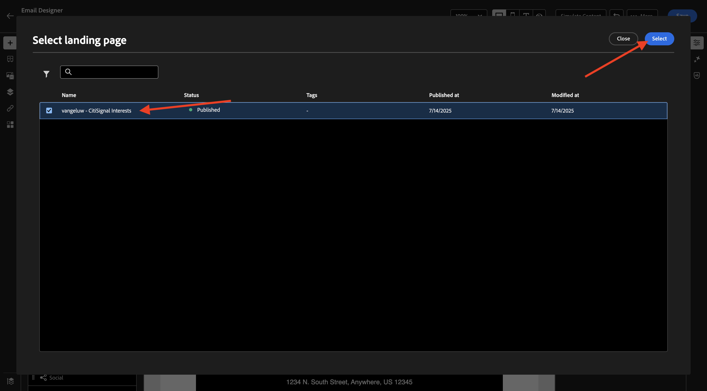
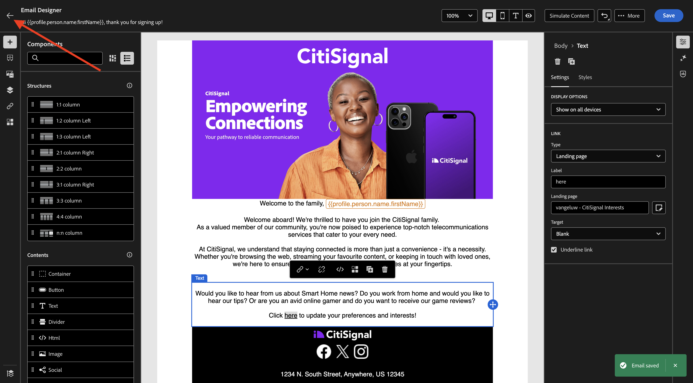
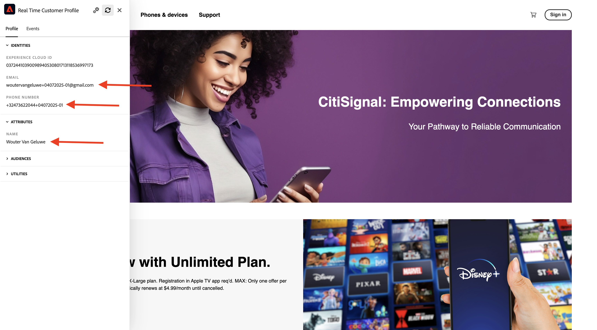

# 3.6.2登陸頁面

前往[Adobe Experience Cloud](https://experience.adobe.com)登入Adobe Journey Optimizer。 按一下&#x200B;**Journey Optimizer**。

您將被重新導向到Journey Optimizer中的&#x200B;**首頁**&#x200B;檢視。 首先，確定您使用正確的沙箱。 要使用的沙箱稱為`--aepSandboxName--`。 然後您就會進入沙箱&#x200B;**的**&#x200B;首頁`--aepSandboxName--`檢視。

## 3.6.2.1個訂閱清單

Adobe Journey Optimizer中的登入頁面可與&#x200B;**訂閱清單**&#x200B;搭配使用。 若要設定登入頁面，您必須先設定&#x200B;**訂閱清單**。

CitiSignal想要詢問客戶對下列網域的興趣：

- 智慧型首頁
- 從首頁工作
- 線上遊戲

一旦客戶表示對其中一個網域感興趣，就應將該客戶新增至特定清單，以便後續作為即將推出的行銷活動的一部分，以特定內容為目標。

您現在將建立3個訂閱清單。

在左側功能表中，移至&#x200B;**訂閱清單**。 按一下&#x200B;**建立訂閱清單**。

對於&#x200B;**Title**，使用： `--aepUserLdap--_SL_Interest_in_Smart_Home`。
對於&#x200B;**描述**，使用： `Interest in Smart Home`。

按一下&#x200B;**提交**。

按一下&#x200B;**建立訂閱清單**&#x200B;以建立其他清單。

對於&#x200B;**Title**，使用： `--aepUserLdap--_SL_Interest_WFH`。
對於&#x200B;**描述**，使用： `Interest in Work From Home`。

按一下&#x200B;**提交**。

按一下&#x200B;**建立訂閱清單**&#x200B;以建立其他清單。

對於&#x200B;**Title**，使用： `--aepUserLdap--_SL_Interest_Online_Gaming`。
對於&#x200B;**描述**，使用： `Interest in Online Gaming`。

按一下&#x200B;**提交**。

您現在已經建立了所需的3份清單。

## 3.6.2.2登陸頁面預設集

若要在Adobe Journey Optimizer中使用登陸頁面，需要建立預設集。

在左側功能表中，前往&#x200B;**管理** > **管道**，然後選取&#x200B;**登陸頁面預設集**。

按一下&#x200B;**建立登陸頁面預設集**。

針對欄位&#x200B;**Name**，使用： `--aepUserLdap-- - CitiSignal LP`並選取執行個體中可用的子網域。

>[!NOTE]
>
>如果您在執行個體中沒有看到子網域，請洽詢AJO管理員以新增子網域。

按一下&#x200B;**提交**。

您的登陸頁面預設集現已建立。

## 3.6.2.3登陸頁面

您現在可以建立登入頁面。 在左側功能表中，前往&#x200B;**內容管理** > **登陸頁面**。

按一下&#x200B;**建立登陸頁面**。

對於欄位&#x200B;**標題**，使用： `vangeluw - CitiSignal Interests`。 接著，選取您在上一步設定的&#x200B;**登陸頁面預設集**。

按一下&#x200B;**建立**。

您應該會看到此訊息。

將欄位&#x200B;**頁面名稱**&#x200B;變更為`--aepUserLdap-- - CitiSignal Interests`。

在&#x200B;**存取設定**&#x200B;下輸入此自訂名稱： `--aepUserLdap---citisignal-interests`。

按一下&#x200B;**開啟Designer**。

選取&#x200B;**從頭開始設計**。

您應該會看到此訊息。

將結構元件&#x200B;**1:1資料行**&#x200B;新增至畫布。

將內容元件&#x200B;**表單**&#x200B;新增至畫布。

將&#x200B;**核取方塊1**&#x200B;的欄位&#x200B;**標籤**&#x200B;更新為`Keep me updated about CitiSignal's offering for Smart Home`。

確定核取方塊&#x200B;**如果選取**&#x200B;則選擇加入，且已選取&#x200B;**訂閱清單**。

然後，按一下&#x200B;**選取訂閱清單**。

接著，選取清單`--aepUserLdap--_SL_Interest_in_Smart_Home`並按一下&#x200B;**選取**。

按一下&#x200B;**+新增欄位**，然後選取&#x200B;**核取方塊**。

您應該會看到此訊息。

將&#x200B;**核取方塊2**&#x200B;的欄位&#x200B;**標籤**&#x200B;更新為`Keep me updated about CitiSignal's offering for Work From Home`。

確定核取方塊&#x200B;**如果選取**&#x200B;則選擇加入，且已選取&#x200B;**訂閱清單**。

然後，按一下&#x200B;**選取訂閱清單**。

接著，選取清單`--aepUserLdap--_SL_Interest_WFH`並按一下&#x200B;**選取**。

按一下&#x200B;**+新增欄位**，然後選取&#x200B;**核取方塊**。

您應該會看到此訊息。

將&#x200B;**核取方塊3**&#x200B;的欄位&#x200B;**標籤**&#x200B;更新為`Keep me updated about CitiSignal's offering for Online Gaming`。

確定核取方塊&#x200B;**如果選取**&#x200B;則選擇加入，且已選取&#x200B;**訂閱清單**。

然後，按一下&#x200B;**選取訂閱清單**。

接著，選取清單`--aepUserLdap--_SL_Interest_Online_Gaming`並按一下&#x200B;**選取**。

您應該會看到此訊息。

前往表單欄位&#x200B;**CALL TO ACTION**。

更新下列欄位：

- **文字** — 按鈕標籤： `Save`。
- **確認動作**：選取&#x200B;**確認文字**。
- **確認文字**：使用： `Thanks for updating your preferences!`
- **錯誤動作**：選取&#x200B;**錯誤文字**。
- **發生錯誤時的文字**：使用： `There was an error updating your preferences.`

按一下&#x200B;**儲存**，然後按一下左上角的箭頭，返回上一個畫面。

按一下&#x200B;**發佈**。

再按一下&#x200B;**發佈**。

您的登入頁面現已發佈，且可用於電子郵件中。

## 3.6.2.4在電子郵件中包含登陸頁面

在練習3.1中，您已建立名為`--aepUserLdap-- - Registration Journey`的歷程。

您現在應該更新該歷程中的電子郵件訊息，以包含登陸頁面的連結。

在左側功能表中，前往&#x200B;**歷程**&#x200B;並按一下以開啟歷程`--aepUserLdap-- - Registration Journey`。

按一下&#x200B;**更多……**，然後選取&#x200B;**建立新版本**。

按一下&#x200B;**建立新版本**。

按一下以選取&#x200B;**電子郵件**&#x200B;動作，然後選取&#x200B;**編輯內容**。

按一下&#x200B;**編輯電子郵件內文**。

您應該會看到類似這樣的內容。 將新的結構元件&#x200B;**1:1資料行**&#x200B;新增至畫布。

在新建立的結構元件中新增內容元件&#x200B;**文字**。

將下列文字貼到&#x200B;**文字**&#x200B;內容元件中。

`Would you like to hear from us about Smart Home news? Do you work from home and would you like to hear our tips? Or are you an avid online gamer and do you want to receive our game reviews? Click here to update your preferences and interests!`

設定文字的樣式，使其看起來像這樣，然後選取`here`這個字。 按一下&#x200B;**連結**&#x200B;圖示。

將連結的&#x200B;**Type**&#x200B;設定為&#x200B;**登陸頁面**，並將欄位&#x200B;**Target**&#x200B;設定為&#x200B;**空白**。

按一下&#x200B;**編輯**&#x200B;圖示以選取要連結的登入頁面。

選取登入頁面`--aepUserLdap-- - CitiSignal Interests`。 按一下&#x200B;**選取**。

您應該會看到此訊息。 按一下&#x200B;**儲存**。

按一下左上角的箭頭，返回上一個畫面。

按一下左上角的箭頭，再次返回上一個畫面。

按一下&#x200B;**儲存**。

按一下&#x200B;**發佈**。

再按一下&#x200B;**發佈**。

您的變更現在已發佈，您可以測試您的歷程。

## 3.6.2.5測試您的歷程和登陸頁面

移至[https://dsn.adobe.com](https://dsn.adobe.com)。 使用Adobe ID登入後，您會看到此訊息。 按一下您的網站專案上的3個點&#x200B;**...**，然後按一下&#x200B;**執行**&#x200B;以開啟它。

然後您會看到示範網站已開啟。 選取URL並將其複製到剪貼簿。

開啟新的無痕瀏覽器視窗。

貼上您在上一步中複製的示範網站URL。 接著，系統會要求您使用Adobe ID登入。

選取您的帳戶型別並完成登入程式。

接著，您會在無痕瀏覽器視窗中看到您的網站已載入。 每次練習都需要使用全新的無痕瀏覽器視窗，才能載入您的示範網站URL。 移至&#x200B;**登入**

按一下&#x200B;**建立帳戶**。 填寫您的詳細資料，然後按一下&#x200B;**註冊**。

您現在會被重新導向至首頁。 開啟設定檔檢視器面板，然後前往即時客戶設定檔。 在「設定檔檢視器」面板上，您應該會看到所有顯示的個人資料，例如新新增的電子郵件和電話識別碼。

建立帳戶1分鐘後，您將會從Adobe Journey Optimizer收到帳戶建立電子郵件。

按一下電子郵件中的連結以更新您的偏好設定。

之後，您應該會看到您建立的表單。 啟用一些核取方塊，然後按一下&#x200B;**儲存**。

之後，您應該會看到一則確認訊息。

## 3.6.2.6訂閱清單報告

若要檢視訂閱清單上的可用報告，請前往左側功能表中的&#x200B;**訂閱清單**，然後按一下以開啟您之前設定的訂閱清單之一。

按一下&#x200B;**報表**。

您應該會看到清單的概觀，其中包含已訂閱或取消訂閱該清單的人員數量。

## 後續步驟

移至[3.6.3 AJO和GenStudio for Performance Marketing](./ex3.md)

返回[Adobe Journey Optimizer：內容管理](./ajocontent.md){target="_blank"}

返回[所有模組](./../../../../overview.md){target="_blank"}
