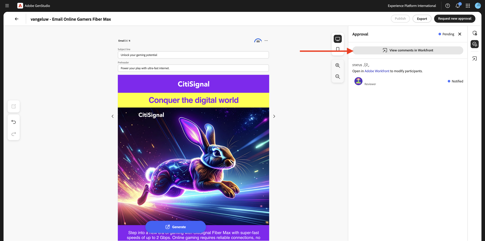
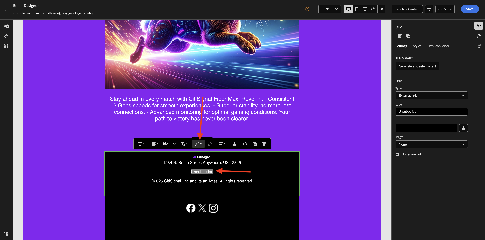

# 3.6.3 AJO和GenStudio for Performance Marketing

>[!IMPORTANT]
>
>為了完成此練習，您需要存取針對與Adobe Journey Optimizer整合（目前為測試版）而布建的GenStudio for Performance Marketing環境。

>[!IMPORTANT]
>
>若要完成此練習，您需要有權存取為Adobe GenStudio for Performance Marketing布建的執行個體。

>[!IMPORTANT]
>
>為了執行本練習中的所有步驟，您需要具有現有Adobe Workfront環境的存取權，而且在該環境中，您需要已建立專案和核准工作流程。 如果您使用Adobe Workfront[進行](./../../../../modules/workflow-planning/module1.2/workfront.md){target="_blank"}工作流程管理練習，您將具備所需的設定。

## 1.3.4.1在Adobe GenStudio中建立和核准電子郵件體驗

移至[https://experience.adobe.com/](https://experience.adobe.com/){target="_blank"}。 開啟&#x200B;**GenStudio**。


您應該會看到此訊息。 在左側功能表中，移至&#x200B;**建立**。 選取&#x200B;**電子郵件**。


選取您之前匯入的&#x200B;**電子郵件**&#x200B;範本，其名稱為`--aepUserLdap---citisignal-email-template`。 按一下&#x200B;**使用**。


您應該會看到此訊息。 將廣告名稱變更為`--aepUserLdap-- - Email Online Gamers Fiber Max`。


在&#x200B;**引數**&#x200B;下，選取下列選項：

- **品牌**： `--aepUserLdap-- - CitiSignal`
- **語言**： `English (US)`
- **角色**： `--aepUserLdap-- - Smart Home Families`
- **產品**： `--aepUserLdap-- - CitiSignal Fiber Max`

按一下&#x200B;**從內容選取**。


選取資產`--aepUserLdap-- - neon rabbit.png`。 按一下&#x200B;**使用**。


輸入提示`convince online gamers to start playing online multiplayer games using CitiSignal internet`並按一下&#x200B;**產生**。


然後您應該會看到類似這樣的內容，並產生4個電子郵件變數。 預設檢視顯示&#x200B;**行動裝置**&#x200B;檢視，您可以按一下&#x200B;**電腦**&#x200B;圖示來切換至案頭檢視。


系統會自動為每封電子郵件計算相容分數。 按一下分數即可檢視更多詳細資訊。


按一下&#x200B;**檢視並修正問題**。


您可以檢視詳細資訊，瞭解如何最佳化複雜度分數。


接下來，按一下&#x200B;**要求核准**，這會連線至Adobe Workfront。


選取您應命名為`--aepUserLdap-- - CitiSignal Fiber Launch`的Adobe Workfront專案。 在&#x200B;**邀請朋友**&#x200B;下輸入您自己的電子郵件地址，並確定您的角色已設為&#x200B;**核准者**。


或者，您也可以使用Adobe Workfront中的現有核准工作流程。 若要這麼做，請按一下&#x200B;**[使用範本**]並選取範本`--aepuserLdap-- - Approval Workflow`。 按一下&#x200B;**傳送**。


按一下&#x200B;**在Workfront中檢視評論**，您現在將會被傳送到Adobe Workfront校訂UI。



在Adobe Workfront校訂UI中，按一下&#x200B;**做出決定**。


選取&#x200B;**已核准**&#x200B;並按一下&#x200B;**做出決定**。


按一下&#x200B;**發佈**。


選取您的行銷活動`--aepUserLdap-- - CitiSignal Fiber Launch Campaign`並按一下&#x200B;**發佈**。


按一下&#x200B;**在內容中開啟**。


4個電子郵件體驗現在可在&#x200B;**內容** > **體驗**&#x200B;下使用。


## 1.3.4.2在AJO中建立行銷活動

前往[Adobe Experience Cloud](https://experience.adobe.com)登入Adobe Journey Optimizer。 按一下&#x200B;**Journey Optimizer**。


您將被重新導向到Journey Optimizer中的&#x200B;**首頁**&#x200B;檢視。 首先，確定您使用正確的沙箱。 要使用的沙箱稱為`--aepSandboxName--`。 然後您就會進入沙箱&#x200B;**的**&#x200B;首頁`--aepSandboxName--`檢視。


您現在將建立行銷活動。 上一個練習的事件型歷程仰賴傳入體驗事件或對象進入或退出，以觸發1個特定客戶的歷程，而行銷活動則以唯一內容（例如電子報、一次性促銷活動或一般資訊）鎖定整個對象，或定期傳送類似內容（例如例項生日行銷活動和提醒）。

在功能表中，前往&#x200B;**行銷活動**&#x200B;並按一下&#x200B;**建立行銷活動**。


選取&#x200B;**排程 — 行銷**&#x200B;並按一下&#x200B;**建立**。


在行銷活動建立畫面上，設定下列專案：

- **名稱**： `--aepUserLdap--  - Online Gamers CitiSignal Fiber Max`。
- **說明**：線上遊戲玩家的Fiber行銷活動

按一下&#x200B;**動作**。


按一下&#x200B;**+新增動作**，然後選取&#x200B;**電子郵件**。


接著，選取現有的&#x200B;**電子郵件組態**，然後按一下&#x200B;**編輯內容**。


您將會看到此訊息。 對於&#x200B;**主旨列**，請使用以下專案：

```
{{profile.person.name.firstName}}, say goodbye to delays!
```

接著，按一下&#x200B;**編輯內容**。


按一下&#x200B;**匯入HTML**。


接著，按一下&#x200B;**Adobe GenStudio for Performance Marketing**&#x200B;的按鈕。


之後，您應該會看到快顯視窗，其中顯示GenStudio for Performance Marketing中發佈的所有電子郵件體驗。 選取其中一個可用的電子郵件體驗，然後按一下[使用]。****


選取您自己的AEM Assets CS存放庫（應命名為`--aepUserLdap-- - CitiSignal dev`），然後按一下&#x200B;**匯入**。


您應該會看到此訊息。 選取缺少的影像按鈕，然後按一下&#x200B;**選取資產**。


移至看起來像這個的資料夾，從&#x200B;**GenStudio.zip開始.....**&#x200B;並選取影像`--aepUserLdap-- - neon rabbit.png`。 按一下&#x200B;**選取**


您應該會看到此訊息。


向下捲動至頁尾，選取&#x200B;**取消訂閱**&#x200B;這個字，然後按一下&#x200B;**連結**&#x200B;圖示。



將&#x200B;**Type**&#x200B;設定為&#x200B;**外部選擇退出/取消訂閱**，並將URL設定為`https://techinsiders.org/unsubscribe.html` （取消訂閱連結不允許有空白URL）。

按一下「儲存」****，然後按一下熒幕左上角的&#x200B;**箭頭**，以返回促銷活動設定。


移至&#x200B;**對象**。


按一下&#x200B;**選取對象**。


選取線上遊戲玩家訂閱清單的對象，其名稱應為`--aepUserLdap--_SL_Interest_Online_Gaming`。 按一下&#x200B;**儲存**。


按一下&#x200B;**檢閱以啟動**。


如果您的行銷活動設定沒有問題，您可以按一下[啟動]。****


您的行銷活動便會啟動，這需要幾分鐘的時間。


幾分鐘後，行銷活動就會上線，電子郵件會傳送至您選取的訂閱清單。


您現在已經完成此練習。

## 後續步驟

移至[摘要與福利](./summary.md)

返回[Adobe Journey Optimizer：內容管理](./ajocontent.md){target="_blank"}

返回[所有模組](./../../../../overview.md){target="_blank"}
