# 3.8.1設定您的關聯式資料基礎

前往[https://experience.adobe.com](https://experience.adobe.com)登入Adobe Journey Optimizer。 按一下&#x200B;**Journey Optimizer**。

您將被重新導向到Journey Optimizer中的&#x200B;**首頁**&#x200B;檢視。 首先，確定您使用正確的沙箱。 要使用的沙箱稱為`--aepSandboxName--`。

## 3.8.1.1關聯式架構設定

關聯式架構是以模型為基礎的資料模型的正式定義。

它會指定：

- 表格集
- 每個表格中的欄
- 限制
- 跨資料表的關係

在以模型為基礎的資料模型中組織結構描述或表格，就是將資料結構化成多個表格。 確保每個表格都儲存一種實體/結構描述型別。

將資料擷取至以用於Adobe Journey Optimizer協調的行銷活動時，可使用下列來源：

- Amazon S3
- Google Cloud Storage
- SFTP
- Snowflake
- Google BigQuery
- 資料登陸區域
- Azure Databricks
- 本機檔案上傳

本練習的第一步是設定關聯式XDM架構。 在左側功能表中，向下捲動至&#x200B;**資料管理**&#x200B;並選取&#x200B;**結構描述**。 按一下&#x200B;**+建立結構描述**。

選取&#x200B;**關聯式**。

選取&#x200B;**上傳DDL檔案**，然後按一下&#x200B;**選擇檔案**。

將檔案[citisignal_ddl_tables_only.sql](./assets/citisignal_ddl_tables_only.sql)下載到您的案頭。

選取檔案&#x200B;**`citisignal_ddl_tables_only.sql`**&#x200B;並按一下&#x200B;**開啟**。

您應該會看到此訊息。 按一下&#x200B;**下一步**。

### 身分識別

您的部分結構描述包含個人識別碼，而這些欄位應該標示為&#x200B;**身分**，而且您必須選取適用於該特定身分型別的&#x200B;**名稱空間**。

**`citisignal_accounts`**

針對此結構描述，請移至&#x200B;**account_id**&#x200B;欄位，並將&#x200B;**身分**&#x200B;型別設定為&#x200B;**示範系統 — CRMID**。

**`citisignal_recipients`**

針對此結構描述，請移至&#x200B;**account_id**&#x200B;欄位，並將&#x200B;**身分**&#x200B;型別設定為&#x200B;**示範系統 — CRMID**，然後移至&#x200B;**電子郵件**&#x200B;欄位，並將&#x200B;**身分**&#x200B;型別設定為&#x200B;**電子郵件**。

### 版本設定

為了追蹤將針對這些結構擷取的資料更新，需要設定用於追蹤上傳資料版本的欄位。 所有這些結構描述中用於此專案的欄位是&#x200B;**lastmodified**&#x200B;欄位，其中包含已上傳資料的時間戳記。

您現在需要勾選每個結構描述中&#x200B;**lastmodified**&#x200B;欄位的&#x200B;**版本設定**&#x200B;核取方塊。

**`citisignal_products`**

核取欄位&#x200B;**lastmodified**&#x200B;的&#x200B;**版本設定**&#x200B;核取方塊。

**`citisignal_product_bundles`**

核取欄位&#x200B;**lastmodified**&#x200B;的&#x200B;**版本設定**&#x200B;核取方塊。

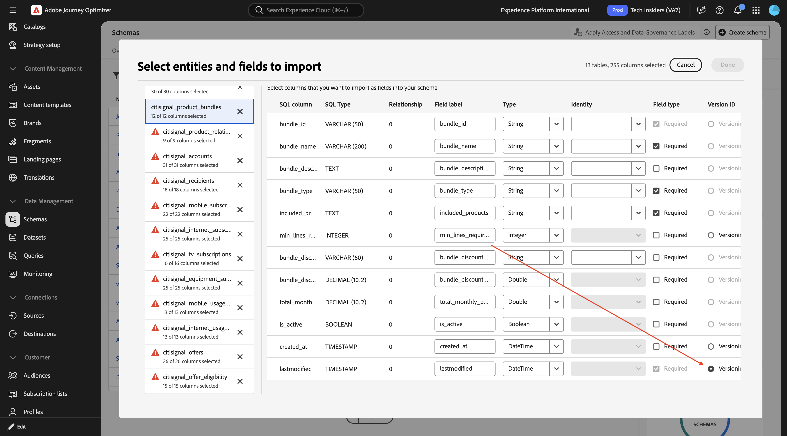

**`citisignal_product_relationships`**

核取欄位&#x200B;**lastmodified**&#x200B;的&#x200B;**版本設定**&#x200B;核取方塊。

**`citisignal_accounts`**

核取欄位&#x200B;**lastmodified**&#x200B;的&#x200B;**版本設定**&#x200B;核取方塊。

**`citisignal_recipients`**

核取欄位&#x200B;**lastmodified**&#x200B;的&#x200B;**版本設定**&#x200B;核取方塊。

**`citisignal_mobile_subscriptions`**

核取欄位&#x200B;**lastmodified**&#x200B;的&#x200B;**版本設定**&#x200B;核取方塊。

**`citisignal_internet_subscriptions`**

核取欄位&#x200B;**lastmodified**&#x200B;的&#x200B;**版本設定**&#x200B;核取方塊。

**`citisignal_tv_subscriptions`**

核取欄位&#x200B;**lastmodified**&#x200B;的&#x200B;**版本設定**&#x200B;核取方塊。

**`citisignal_equipment_subscriptions`**

核取欄位&#x200B;**lastmodified**&#x200B;的&#x200B;**版本設定**&#x200B;核取方塊。

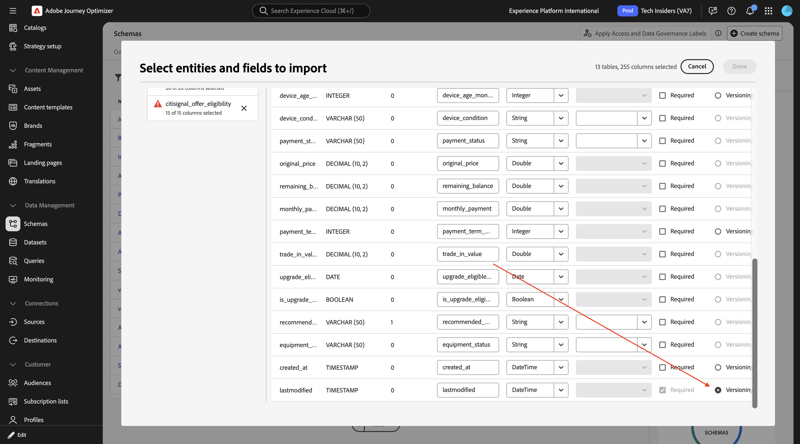

**`citisignal_mobile_usage_summary`**

核取欄位&#x200B;**lastmodified**&#x200B;的&#x200B;**版本設定**&#x200B;核取方塊。

**`citisignal_internet_usage_summary`**

核取欄位&#x200B;**lastmodified**&#x200B;的&#x200B;**版本設定**&#x200B;核取方塊。

**`citisignal_offers`**

核取欄位&#x200B;**lastmodified**&#x200B;的&#x200B;**版本設定**&#x200B;核取方塊。

**`citisignal_offer_eligibility`**

核取欄位&#x200B;**lastmodified**&#x200B;的&#x200B;**版本設定**&#x200B;核取方塊。

### 結構描述名稱

擷取這些結構描述以便在共用沙箱中啟用時，必須變更每個結構描述的名稱，使其在該特定沙箱中是唯一的。 進行此變更的原因是避免綱要命名衝突。

對於這個實驗室，您應該將LDAP新增到每個結構描述名稱前，這表示每個結構描述名稱都應該有這個首碼： `--aepUserLdap--_`

**`citisignal_products`**

將結構描述名稱變更為`--aepUserLdap--_ citisignal_products`。

**`citisignal_product_bundles`**

將結構描述名稱變更為`--aepUserLdap--_ citisignal_product_bundles`。

**`citisignal_product_relationships`**

將結構描述名稱變更為`--aepUserLdap--_ citisignal_product_relationships`。

**`citisignal_accounts`**

將結構描述名稱變更為`--aepUserLdap--_ citisignal_accounts`。

**`citisignal_recipients`**

將結構描述名稱變更為`--aepUserLdap--_ citisignal_recipients`。

**`citisignal_mobile_subscriptions`**

將結構描述名稱變更為`--aepUserLdap--_ citisignal_mobile_subscriptions`。

**`citisignal_internet_subscriptions`**

將結構描述名稱變更為`--aepUserLdap--_ citisignal_internet_subscriptions`。

**`citisignal_tv_subscriptions`**

將結構描述名稱變更為`--aepUserLdap--_ citisignal_internet_subscriptions`。

**`citisignal_equipment_subscriptions`**

將結構描述名稱變更為`--aepUserLdap--_ citisignal_equipment_subscriptions`。

**`citisignal_mobile_usage_summary`**

將結構描述名稱變更為`--aepUserLdap--_ citisignal_mobile_usage_summary`。

**`citisignal_internet_usage_summary`**

將結構描述名稱變更為`--aepUserLdap--_ citisignal_internet_usage_summary`。

**`citisignal_offers`**

將結構描述名稱變更為`--aepUserLdap--_ citisignal_offers`。

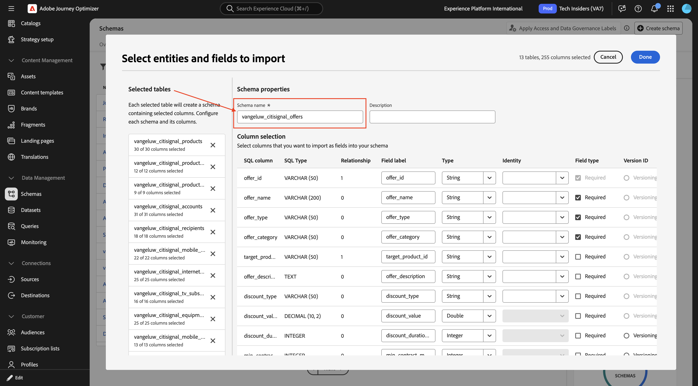

**`citisignal_offer_eligibility`**

將結構描述名稱變更為`--aepUserLdap--_ citisignal_offer_eligibility`。

您的結構描述現在已準備好儲存。 按一下「**完成**」。

您應該會看到此訊息。 按一下&#x200B;**儲存**。

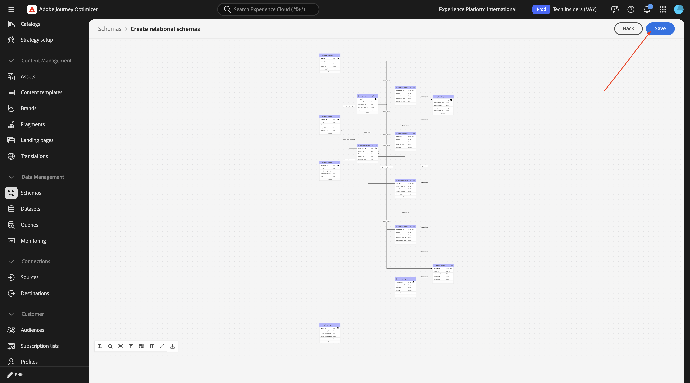

按一下&#x200B;**開啟工作**。

您應該會看到此訊息。 您應等到工作順利完成後再繼續下一個步驟。

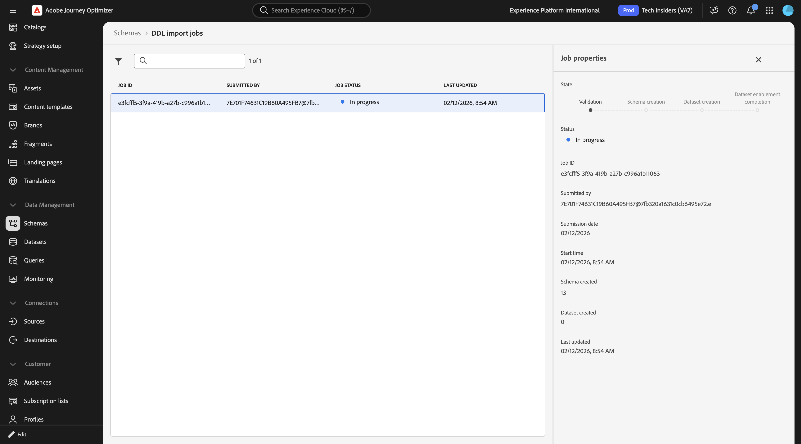

工作成功完成之後，您就可以繼續進行下一個步驟。 這可能需要5到10分鐘。

現在您的關聯式XDM方案已設定完畢，且資料已內嵌，您就可以開始使用該資料來建立下一個練習中的協調行銷活動。

## 3.8.1.2個資料擷取

移至&#x200B;**資料集**。 之後，您應該會看到為您建立的每個結構描述建立的資料集。

將檔案[data.zip](./assets/data.zip)下載到您的案頭並解壓縮。

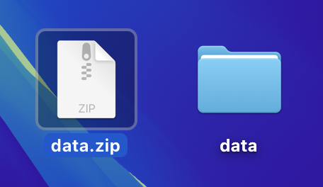

開啟資料夾&#x200B;**資料**。 您應該會看到已建立每個結構描述的CSV檔案。 您現在需要將該資料上傳至每個對應的資料集。 在本實驗中，您將透過將本機檔案上傳至每個資料集來執行此操作。

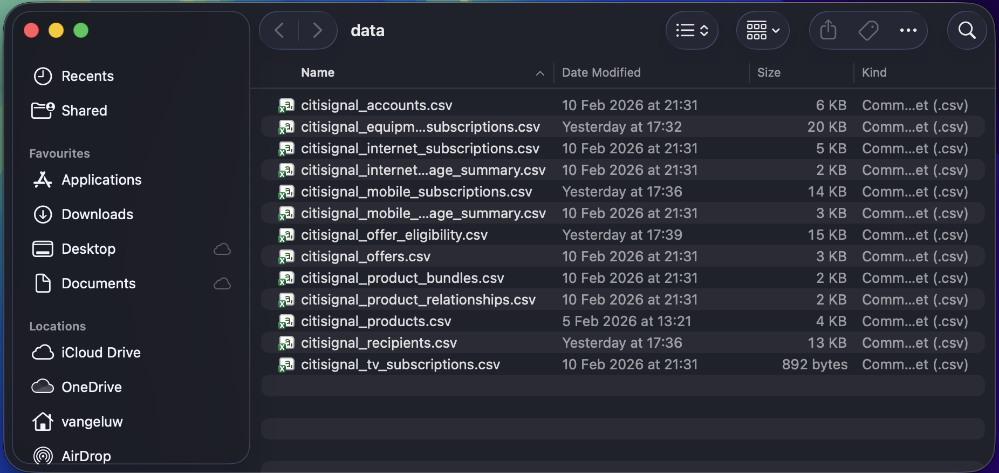

**`vangeluw_citisignal_products`**

移至&#x200B;**來源**，搜尋`local`，然後按一下&#x200B;**本機檔案上傳**&#x200B;下的&#x200B;**新增資料**。

啟用&#x200B;**啟用變更資料擷取**&#x200B;的切換。

選取資料集`vangeluw_citisignal_products`。

按一下&#x200B;**下一步**。

按一下&#x200B;**選擇檔案**。 選取檔案&#x200B;**`citisignal_products.csv`**&#x200B;並按一下&#x200B;**開啟**。

按一下&#x200B;**下一步**

按一下&#x200B;**完成**。

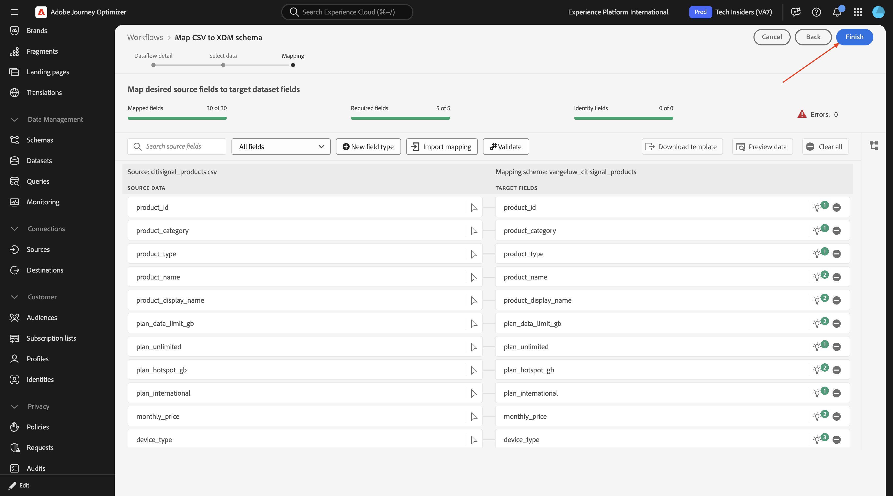

幾分鐘後，您就會在資料集中看到正在擷取的資料。

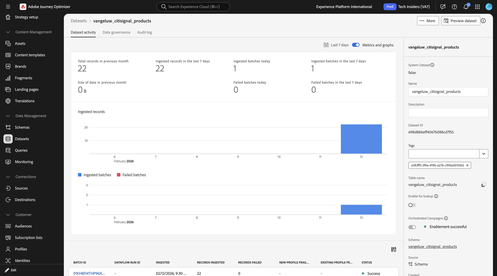

**`vangeluw_citisignal_product_bundles`**

移至&#x200B;**來源**，搜尋`local`，然後按一下&#x200B;**本機檔案上傳**&#x200B;下的&#x200B;**新增資料**。

啟用&#x200B;**啟用變更資料擷取**&#x200B;的切換。

選取資料集`vangeluw_citisignal_product_bundles`。

按一下&#x200B;**下一步**。

按一下&#x200B;**選擇檔案**。 選取檔案&#x200B;**`citisignal_product_bundles.csv`**&#x200B;並按一下&#x200B;**開啟**。

按一下&#x200B;**下一步**

按一下&#x200B;**完成**。

幾分鐘後，您就會在資料集中看到正在擷取的資料。

**`vangeluw_citisignal_product_relationships`**

移至&#x200B;**來源**，搜尋`local`，然後按一下&#x200B;**本機檔案上傳**&#x200B;下的&#x200B;**新增資料**。

啟用&#x200B;**啟用變更資料擷取**&#x200B;的切換。

選取資料集`vangeluw_citisignal_product_relationships`。

按一下&#x200B;**下一步**。

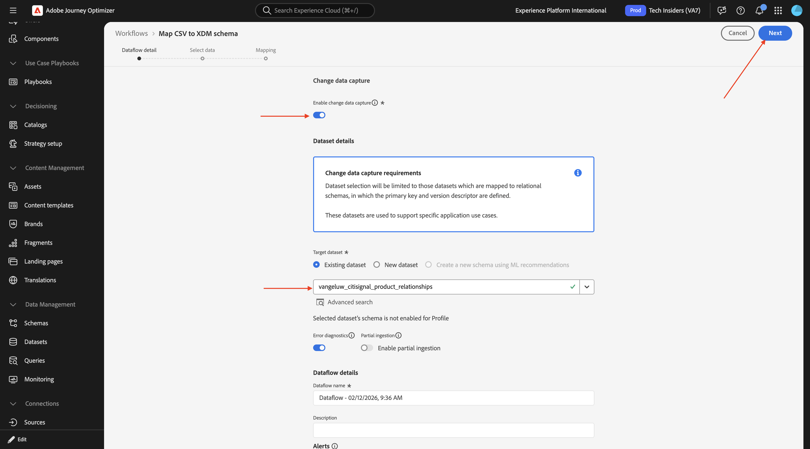

按一下&#x200B;**選擇檔案**。 選取檔案&#x200B;**`citisignal_product_relationships.csv`**&#x200B;並按一下&#x200B;**開啟**。

按一下&#x200B;**下一步**

按一下&#x200B;**完成**。

幾分鐘後，您就會在資料集中看到正在擷取的資料。

**`vangeluw_citisignal_accounts`**

移至&#x200B;**來源**，搜尋`local`，然後按一下&#x200B;**本機檔案上傳**&#x200B;下的&#x200B;**新增資料**。

啟用&#x200B;**啟用變更資料擷取**&#x200B;的切換。

選取資料集`vangeluw_citisignal_accounts`。

按一下&#x200B;**下一步**。

按一下&#x200B;**選擇檔案**。 選取檔案&#x200B;**`citisignal_accounts.csv`**&#x200B;並按一下&#x200B;**開啟**。

按一下&#x200B;**下一步**

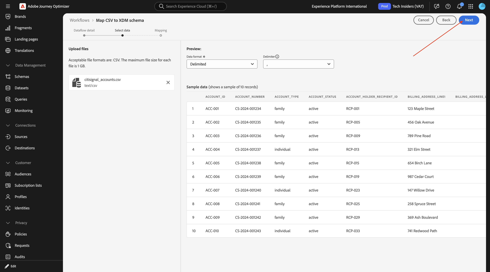

按一下&#x200B;**完成**。

幾分鐘後，您就會在資料集中看到正在擷取的資料。

**`vangeluw_citisignal_recipients`**

移至&#x200B;**來源**，搜尋`local`，然後按一下&#x200B;**本機檔案上傳**&#x200B;下的&#x200B;**新增資料**。

啟用&#x200B;**啟用變更資料擷取**&#x200B;的切換。

選取資料集`vangeluw_citisignal_recipients`。

按一下&#x200B;**下一步**。

按一下&#x200B;**選擇檔案**。 選取檔案&#x200B;**`citisignal_recipients.csv`**&#x200B;並按一下&#x200B;**開啟**。

按一下&#x200B;**下一步**

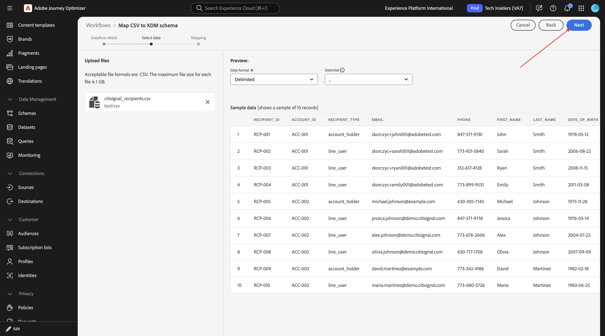

按一下&#x200B;**完成**。

幾分鐘後，您就會在資料集中看到正在擷取的資料。

**`vangeluw_citisignal_mobile_subscriptions`**

移至&#x200B;**來源**，搜尋`local`，然後按一下&#x200B;**本機檔案上傳**&#x200B;下的&#x200B;**新增資料**。

啟用&#x200B;**啟用變更資料擷取**&#x200B;的切換。

選取資料集`vangeluw_citisignal_mobile_subscriptions`。

按一下&#x200B;**下一步**。

按一下&#x200B;**選擇檔案**。 選取檔案&#x200B;**`citisignal_mobile_subscriptions.csv`**&#x200B;並按一下&#x200B;**開啟**。

按一下&#x200B;**下一步**

按一下&#x200B;**完成**。

幾分鐘後，您就會在資料集中看到正在擷取的資料。

**`vangeluw_citisignal_internet_subscriptions`**

移至&#x200B;**來源**，搜尋`local`，然後按一下&#x200B;**本機檔案上傳**&#x200B;下的&#x200B;**新增資料**。

啟用&#x200B;**啟用變更資料擷取**&#x200B;的切換。

選取資料集`vangeluw_citisignal_internet_subscriptions`。

按一下&#x200B;**下一步**。

按一下&#x200B;**選擇檔案**。 選取檔案&#x200B;**`citisignal_internet_subscriptions.csv`**&#x200B;並按一下&#x200B;**開啟**。

按一下&#x200B;**下一步**

按一下&#x200B;**完成**。

幾分鐘後，您就會在資料集中看到正在擷取的資料。

**`vangeluw_citisignal_tv_subscriptions`**

移至&#x200B;**來源**，搜尋`local`，然後按一下&#x200B;**本機檔案上傳**&#x200B;下的&#x200B;**新增資料**。

啟用&#x200B;**啟用變更資料擷取**&#x200B;的切換。

選取資料集`vangeluw_citisignal_tv_subscriptions`。

按一下&#x200B;**下一步**。

按一下&#x200B;**選擇檔案**。 選取檔案&#x200B;**`citisignal_tv_subscriptions.csv`**&#x200B;並按一下&#x200B;**開啟**。

按一下&#x200B;**下一步**

按一下&#x200B;**完成**。

幾分鐘後，您就會在資料集中看到正在擷取的資料。

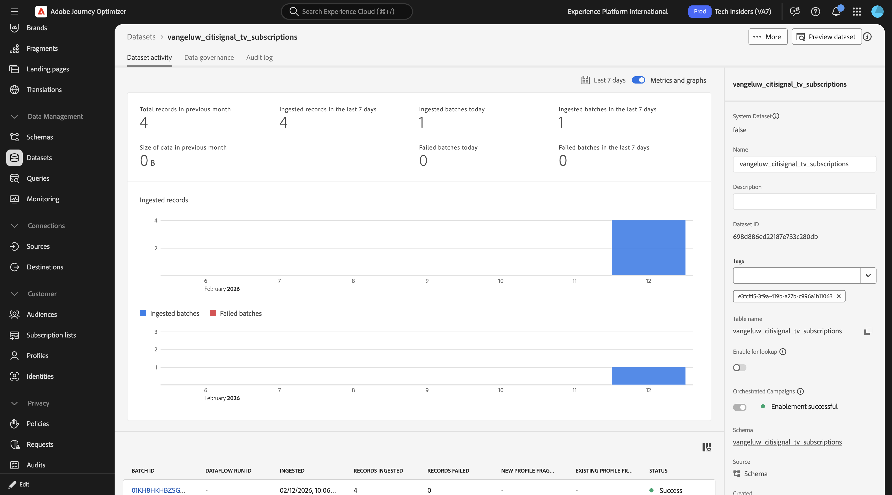

**`vangeluw_citisignal_equipment_subscriptions`**

移至&#x200B;**來源**，搜尋`local`，然後按一下&#x200B;**本機檔案上傳**&#x200B;下的&#x200B;**新增資料**。

啟用&#x200B;**啟用變更資料擷取**&#x200B;的切換。

選取資料集`vangeluw_citisignal_equipment_subscriptions`。

按一下&#x200B;**下一步**。

按一下&#x200B;**選擇檔案**。 選取檔案&#x200B;**`citisignal_equipment_subscriptions.csv`**&#x200B;並按一下&#x200B;**開啟**。

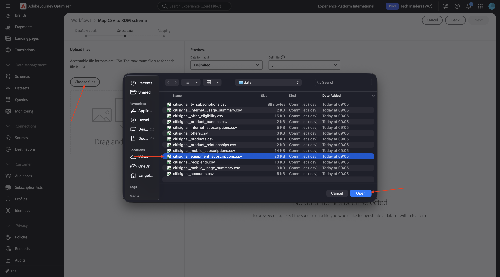

按一下&#x200B;**下一步**

按一下&#x200B;**完成**。

幾分鐘後，您就會在資料集中看到正在擷取的資料。

**`vangeluw_citisignal_mobile_usage_summary`**

移至&#x200B;**來源**，搜尋`local`，然後按一下&#x200B;**本機檔案上傳**&#x200B;下的&#x200B;**新增資料**。

啟用&#x200B;**啟用變更資料擷取**&#x200B;的切換。

選取資料集`vangeluw_citisignal_mobile_usage_summary`。

按一下&#x200B;**下一步**。

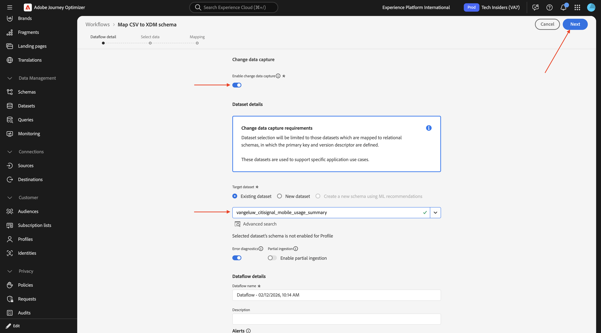

按一下&#x200B;**選擇檔案**。 選取檔案&#x200B;**`citisignal_mobile_usage_summary.csv`**&#x200B;並按一下&#x200B;**開啟**。

按一下&#x200B;**下一步**

按一下&#x200B;**完成**。

幾分鐘後，您就會在資料集中看到正在擷取的資料。

**`vangeluw_citisignal_internet_usage_summary`**

移至&#x200B;**來源**，搜尋`local`，然後按一下&#x200B;**本機檔案上傳**&#x200B;下的&#x200B;**新增資料**。

啟用&#x200B;**啟用變更資料擷取**&#x200B;的切換。

選取資料集`vangeluw_citisignal_internet_usage_summary`。

按一下&#x200B;**下一步**。

按一下&#x200B;**選擇檔案**。 選取檔案&#x200B;**`citisignal_internet_usage_summary.csv`**&#x200B;並按一下&#x200B;**開啟**。

按一下&#x200B;**下一步**

按一下&#x200B;**完成**。

幾分鐘後，您就會在資料集中看到正在擷取的資料。

**`vangeluw_citisignal_offers`**

移至&#x200B;**來源**，搜尋`local`，然後按一下&#x200B;**本機檔案上傳**&#x200B;下的&#x200B;**新增資料**。

啟用&#x200B;**啟用變更資料擷取**&#x200B;的切換。

選取資料集`vangeluw_citisignal_offers`。

按一下&#x200B;**下一步**。

按一下&#x200B;**選擇檔案**。 選取檔案&#x200B;**`citisignal_offers.csv`**&#x200B;並按一下&#x200B;**開啟**。

按一下&#x200B;**下一步**

按一下&#x200B;**完成**。

幾分鐘後，您就會在資料集中看到正在擷取的資料。

**`vangeluw_citisignal_offer_eligibility`**

移至&#x200B;**來源**，搜尋`local`，然後按一下&#x200B;**本機檔案上傳**&#x200B;下的&#x200B;**新增資料**。

啟用&#x200B;**啟用變更資料擷取**&#x200B;的切換。

選取資料集`vangeluw_citisignal_offer_eligibility`。

按一下&#x200B;**下一步**。

按一下&#x200B;**選擇檔案**。 選取檔案&#x200B;**`citisignal_offer_eligibility.csv`**&#x200B;並按一下&#x200B;**開啟**。

按一下&#x200B;**下一步**

按一下&#x200B;**完成**。

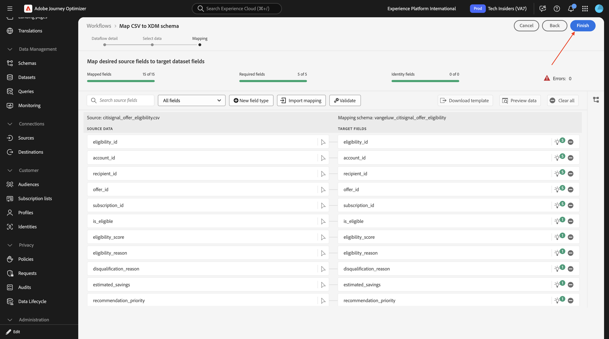

幾分鐘後，您就會在資料集中看到正在擷取的資料。

所有資料現在已內嵌。

## 3.8.1.3設定檔目標Dimension

透過協調的行銷活動，您可以運用Adobe Experience Platform的關聯結構描述功能，在實體層級設計及提供目標式通訊。 Experience Platform使用結構描述，以一致且可重複使用的方式說明資料結構。 將資料擷取至Experience Platform時，會根據XDM結構描述進行架構。

雖然「協調的行銷活動」的區段主要在關聯式結構描述上運作，但實際的訊息傳送總是發生在設定檔層級。

設定鎖定目標時，您可定義兩個關鍵面向：

- 可定位的結構描述：您可以指定哪些關聯式結構描述符合定位條件。 依預設，會使用名為「收件者」的結構描述，但您可以設定替代方案，例如訪客、客戶等

- 設定檔連結：系統必須瞭解目標結構描述如何對應到設定檔結構描述。 這是透過共用身分欄位來達成，該欄位存在於目標架構和設定檔架構中，並被設定為身分名稱空間。

您現在需要設定設定檔目標維度。 移至&#x200B;**管理** > **組態**，然後按一下&#x200B;**設定檔目標Dimension**&#x200B;下的&#x200B;**管理**。

您應該會看到此訊息。 按一下&#x200B;**建立**。

針對&#x200B;**結構描述**，請選取`--aepUserLdap--_citisignal_accounts`。 針對&#x200B;**識別值**，選取&#x200B;**account_id**。

按一下&#x200B;**儲存**。

再按一下&#x200B;**建立**。

針對&#x200B;**結構描述**，請選取`--aepUserLdap--_citisignal_recipients`。 針對&#x200B;**識別值**，選取&#x200B;**account_id**。

按一下&#x200B;**儲存**。

再按一下&#x200B;**建立**。

針對&#x200B;**結構描述**，請選取`--aepUserLdap--_citisignal_recipients`。 針對&#x200B;**識別值**，選取&#x200B;**電子郵件**。

按一下&#x200B;**儲存**。

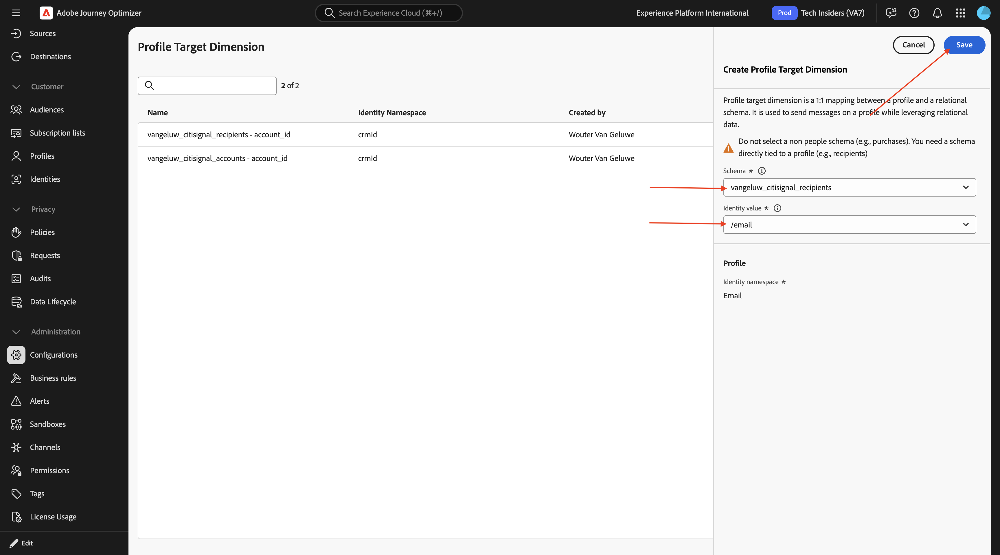

然後您應該擁有此專案。

在下個練習中，您將開始將該資料用於協調的行銷活動。

## 後續步驟

移至[建立您的協調行銷活動](./ex2.md){target="_blank"}

返回[Adobe Journey Optimizer：協調的行銷活動](./ajocampaigns.md){target="_blank"}

返回[所有模組](./../../../../overview.md){target="_blank"}
