# 3.8.2建立您的協調行銷活動

## 3.8.2.1建立您的協調行銷活動

前往&#x200B;**行銷活動**。 按一下&#x200B;**建立行銷活動**。

選取&#x200B;**協調流程 — 行銷**，然後按一下&#x200B;**確認**。

輸入行銷活動名稱： `--aepUserLdap-- - CitiSignal Family Account Optimization Campaign`並按一下&#x200B;**儲存**。

您應該會看到此訊息。 按一下&#x200B;**+**&#x200B;圖示。

選取&#x200B;**分支**。

### 建立對象1

按一下&#x200B;**+**&#x200B;圖示，然後選取&#x200B;**建置對象**。

按一下以開啟&#x200B;**目標維度**&#x200B;的資料夾。

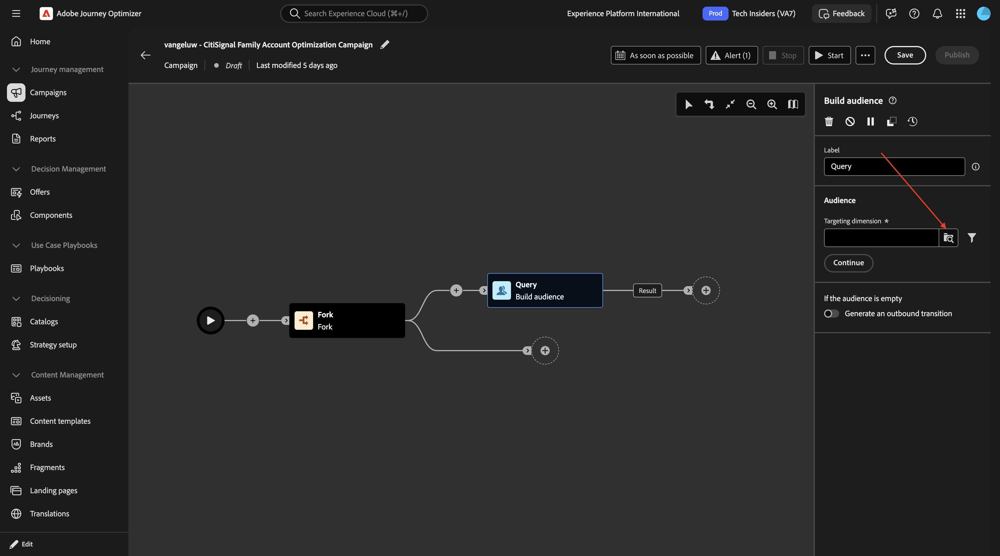

選取&#x200B;**`--aepUserLdap--_citisignal_recipients`**&#x200B;並按一下&#x200B;**確認**。

按一下&#x200B;**建立對象**。

按一下&#x200B;**新增條件**。

選取&#x200B;**recipient_type**&#x200B;並按一下&#x200B;**確認**。

在&#x200B;**`account_holder`**&#x200B;值&#x200B;**欄位中輸入**&#x200B;並按一下&#x200B;**計算**。

您應該會看到&#x200B;**設定檔目標**&#x200B;的數字。 按一下灰色區域中的某處，如圖所示。

按一下&#x200B;**新增條件**。

向下鑽研至&#x200B;**`citisignal_accounts`**。

選取&#x200B;**`account_status`**&#x200B;並按一下&#x200B;**確認**。

在&#x200B;**`active`**&#x200B;值&#x200B;**欄位中輸入**。 然後，按一下灰色區域中的某處（如指示）。

按一下&#x200B;**新增條件**。

向下鑽研至&#x200B;**`citisignal_mobile_subscriptions`**。

選取&#x200B;**`subscription_id`**&#x200B;並按一下&#x200B;**確認**。

啟用&#x200B;**彙總資料**&#x200B;的切換器。 然後選取下列專案：

- **彙總函式**： **計數**
- **運運算元**： **大於或等於**
- **值**： **1**

按一下「**確認**」。

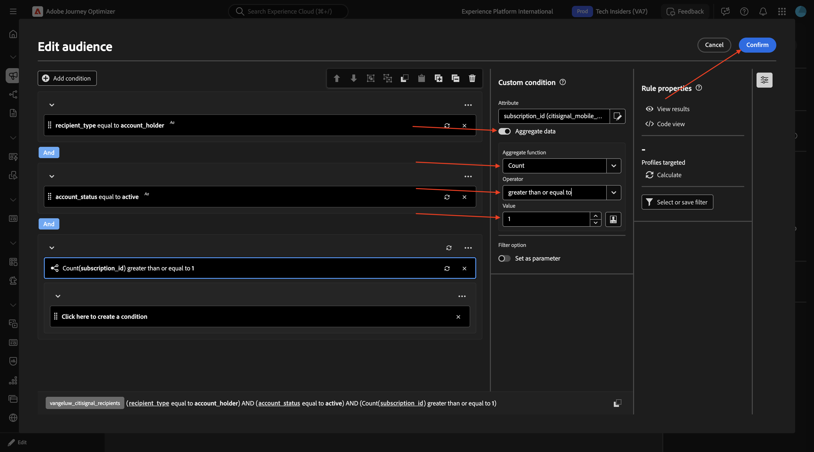

您應該會看到此訊息。 按一下「**確認**」。

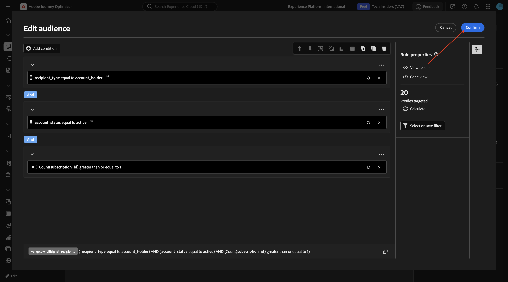

### 建立對象2

按一下另一個路徑中下一個節點上的&#x200B;**+**&#x200B;圖示。

選取&#x200B;**建立對象**。

按一下以開啟&#x200B;**目標維度**&#x200B;的資料夾。

選取&#x200B;**`--aepUserLdap--_mobile_subscriptions`**&#x200B;並按一下&#x200B;**確認**。

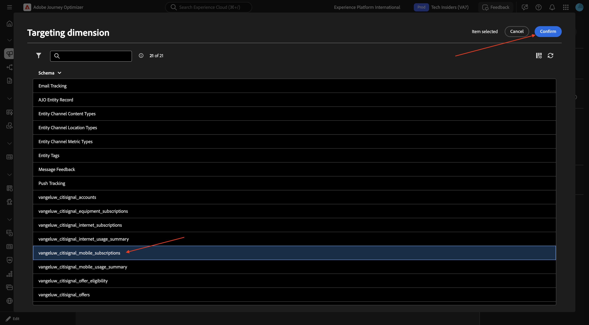

按一下&#x200B;**建立對象**。

按一下&#x200B;**新增條件**。

選取&#x200B;**subscription_status**&#x200B;並按一下&#x200B;**確認**。

在&#x200B;**`active`**&#x200B;值&#x200B;**欄位中輸入**。 然後，按一下&#x200B;**新增條件**。

選取&#x200B;**`is_upgrade_eligible`**&#x200B;並按一下&#x200B;**確認**。

將&#x200B;**值**&#x200B;設為&#x200B;**true**

按一下&#x200B;**計算**，檢視符合此對象資格的設定檔預估值。 然後，按一下&#x200B;**確認**

### 分割

按一下&#x200B;**+**&#x200B;圖示，然後選取&#x200B;**分割**。

將欄位&#x200B;**標籤**&#x200B;變更為&#x200B;**90/10處理方式vs控制項**。 按一下以開啟物件&#x200B;**子集**。

為&#x200B;**啟用限制**&#x200B;啟用切換器，並將&#x200B;**限制大小**&#x200B;設定為&#x200B;**10次近**。

按一下&#x200B;**新增區段**，然後您應該會看到正在新增的&#x200B;**Result**&#x200B;物件。

按一下&#x200B;**儲存**。

### 儲存客群

按一下&#x200B;**+**&#x200B;圖示，然後選取&#x200B;**儲存對象**。

將欄位&#x200B;**對象標籤**&#x200B;設定為&#x200B;**`--aepUserLdap-- - Control Group`**。 按一下&#x200B;**新增對象對應**。

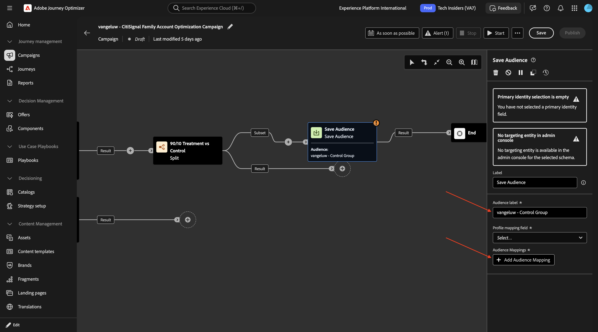

向下展開至&#x200B;**目標維度**。

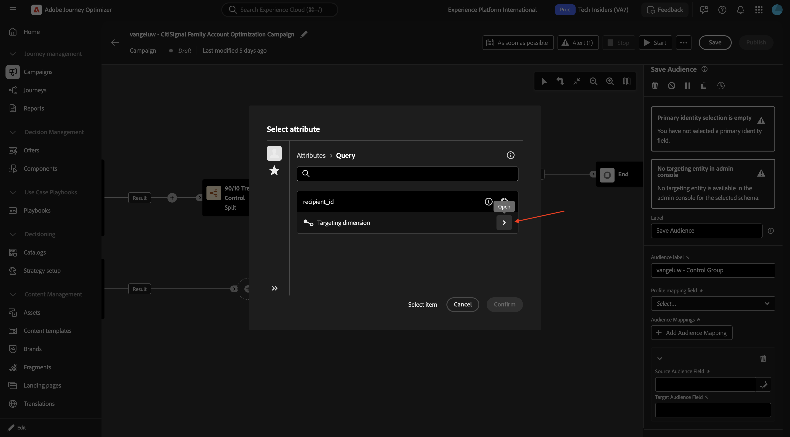

選取&#x200B;**`account_id`**&#x200B;並按一下&#x200B;**確認**。

將&#x200B;**設定檔對應欄位**&#x200B;設定為&#x200B;**`--aepUserLdap--_citisignal_recipients - account_id`**。

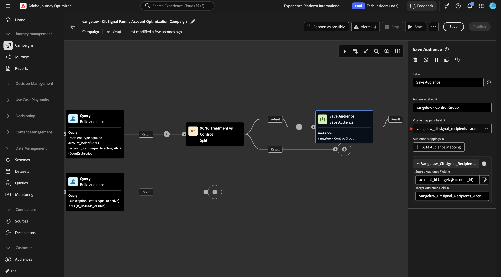

### 擴充：網際網路訂閱

按一下&#x200B;**+**&#x200B;圖示。

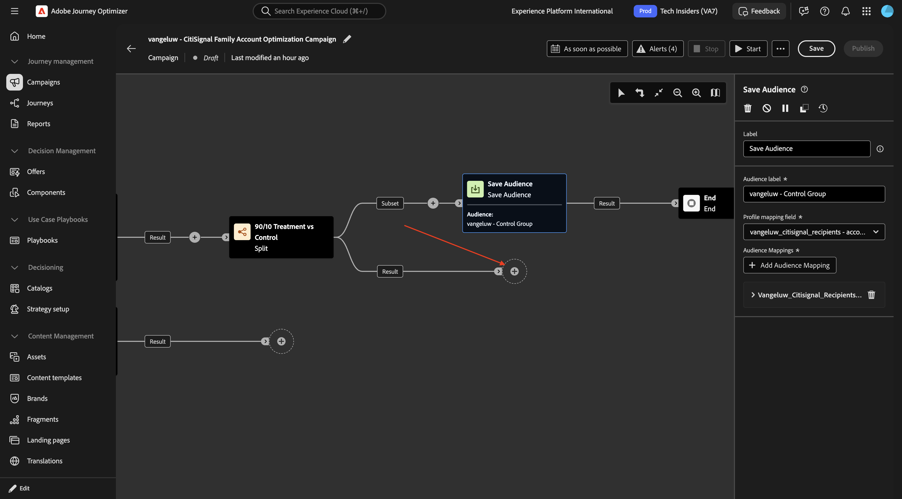

選取&#x200B;**擴充**。

您應該會看到此訊息。 按一下「**新增擴充資料**」。

向下鑽研至&#x200B;**`Targeting dimension`**。

向下鑽研至&#x200B;**`citisignal_accounts`**。

向下鑽研至&#x200B;**`citisignal_internet_subscriptions`**。

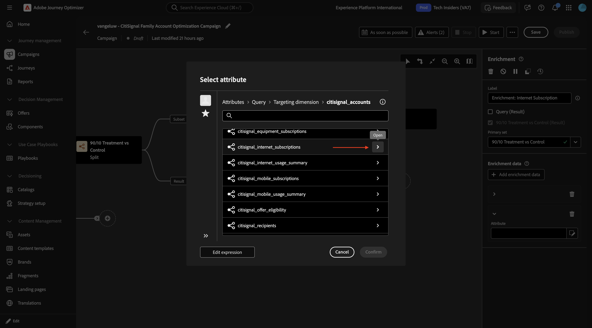

選取&#x200B;**`account_id`**&#x200B;並按一下&#x200B;**確認**。

您應該會看到此訊息。 按一下&#x200B;**新增屬性**。

選取&#x200B;**`subscription_status`**&#x200B;並按一下&#x200B;**確認**。

按一下&#x200B;**新增屬性**。

選取&#x200B;**`connection_type`**&#x200B;並按一下&#x200B;**確認**。

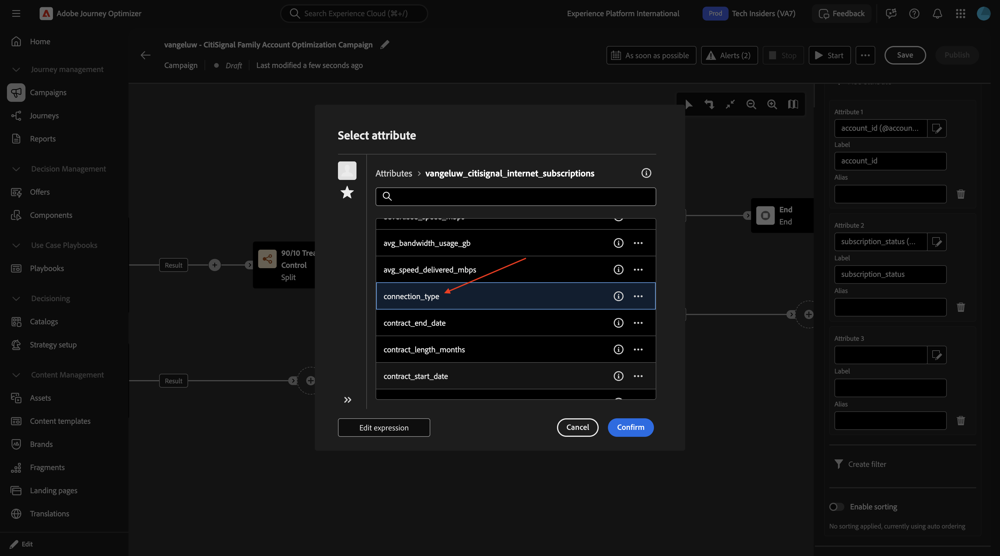

按一下&#x200B;**新增屬性**。

選取&#x200B;**`service_city`**&#x200B;並按一下&#x200B;**確認**。

按一下&#x200B;**新增屬性**。

選取&#x200B;**`avg_bandwidth_usage_gb`**&#x200B;並按一下&#x200B;**確認**。

按一下&#x200B;**新增屬性**。

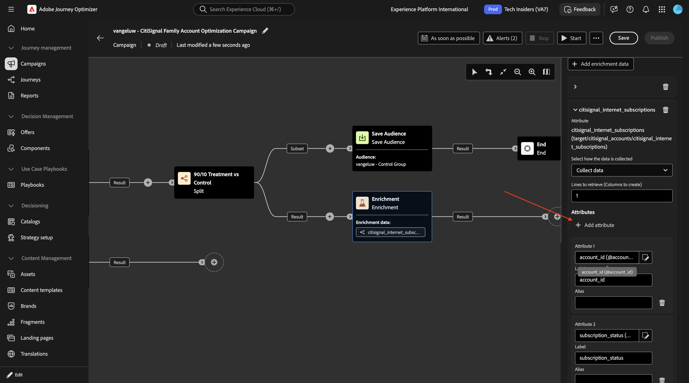

選取&#x200B;**`data_cap_gb`**&#x200B;並按一下&#x200B;**確認**。

按一下&#x200B;**新增屬性**。

選取&#x200B;**`advertised_speed_mbps`**&#x200B;並按一下&#x200B;**確認**。

按一下&#x200B;**新增屬性**。

選取&#x200B;**`monthly_recurring_charge`**&#x200B;並按一下&#x200B;**確認**。

按一下&#x200B;**儲存**。

向上捲動並將欄位&#x200B;**標籤**&#x200B;變更為`Enrichment: Internet Subscription`。

### 擴充：行動裝置訂閱

按一下下一個節點上的&#x200B;**+**&#x200B;圖示，然後選取&#x200B;**擴充**。

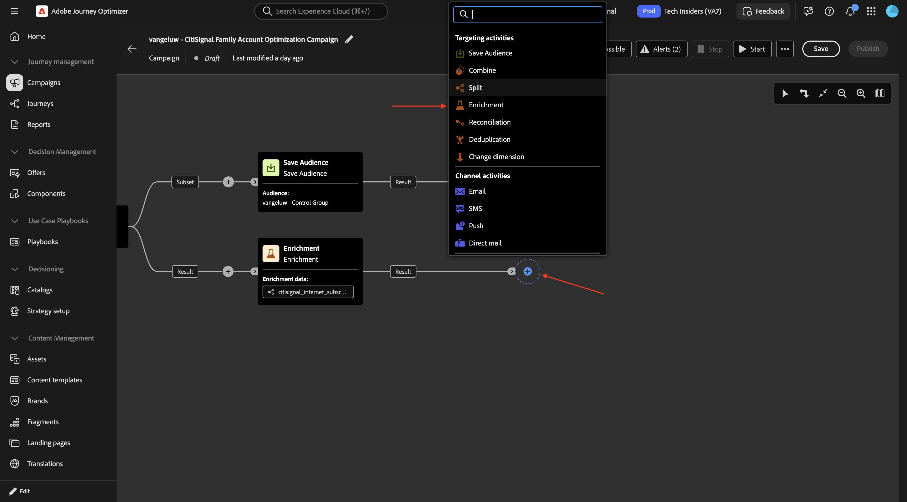

將欄位&#x200B;**標籤**&#x200B;變更為`Enrichment: Mobile Devices Subscription`，然後按一下&#x200B;**新增擴充資料**。

向下展開至&#x200B;**目標維度**。

向下鑽研至&#x200B;**`citisignal_accounts`**。

向下鑽研至&#x200B;**`citisignal_mobile_subscriptions`**。

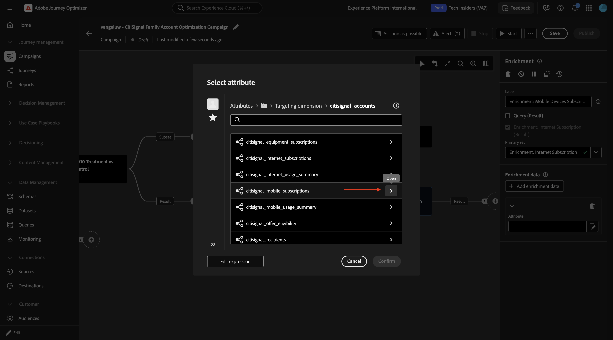

選取&#x200B;**`phone_number`**&#x200B;並按一下&#x200B;**確認**。

按一下&#x200B;**新增屬性**。

向下鑽研至&#x200B;**`citisignal_equipment_subscriptions`**。

選取&#x200B;**`model`**&#x200B;並按一下&#x200B;**確認**。

按一下&#x200B;**新增屬性**。

向下鑽研至&#x200B;**`citisignal_equipment_subscriptions`**。

選取&#x200B;**`recommended_device_model`**&#x200B;並按一下&#x200B;**確認**。

按一下&#x200B;**新增屬性**。

向下鑽研至&#x200B;**`citisignal_equipment_subscriptions`**。

選取&#x200B;**`is_upgrade_eligible`**&#x200B;並按一下&#x200B;**確認**。

您現在可以執行測試回合，以測試進度，並檢視行銷活動中可用的資料。

儲存您的變更，然後按一下[開始]。**&#x200B;**

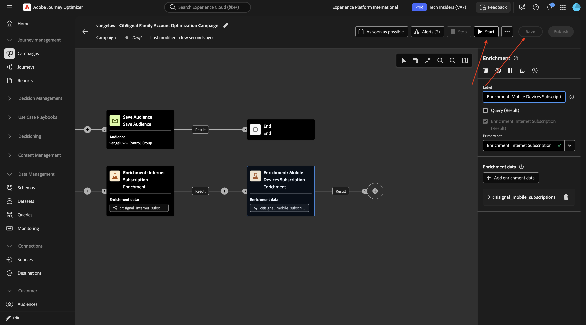

一段時間後，您應該會看到此訊息。 按一下&#x200B;**預覽結果**。

之後，您應該會看到類似以下內容。 按一下 **關閉**。

返回節點&#x200B;**擴充：行動裝置訂閱**。

按一下&#x200B;**新增屬性**。

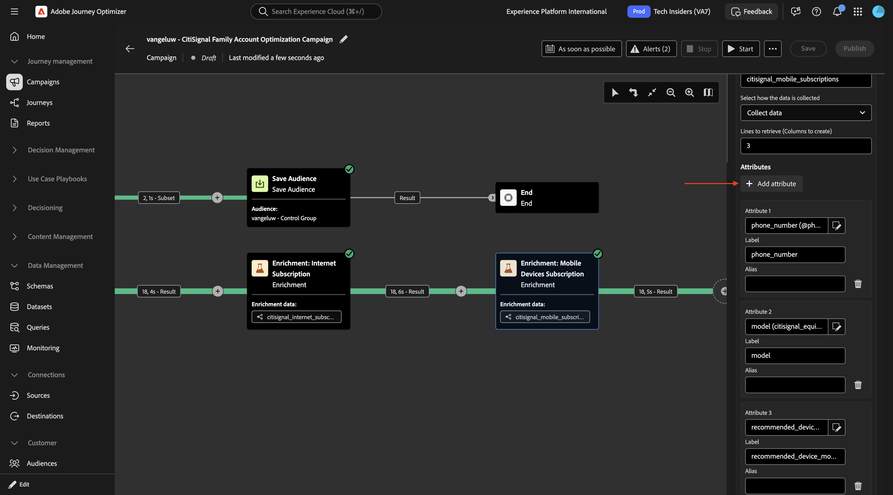

選取&#x200B;**`account_id`**&#x200B;並按一下&#x200B;**確認**。

按一下&#x200B;**新增屬性**。

選取&#x200B;**`subscription_id`**&#x200B;並按一下&#x200B;**確認**。

按一下&#x200B;**新增屬性**。

選取&#x200B;**`renewal_eligibility_date`**&#x200B;並按一下&#x200B;**確認**。

按一下&#x200B;**新增屬性**。

選取&#x200B;**`line_user_recipient_id`**&#x200B;並按一下&#x200B;**確認**。

按一下&#x200B;**新增屬性**。

選取&#x200B;**`current_device_id`**&#x200B;並按一下&#x200B;**確認**。

按一下&#x200B;**新增屬性**。

選取&#x200B;**`contract_start_date`**&#x200B;並按一下&#x200B;**確認**。

按一下&#x200B;**新增屬性**。

向下鑽研至&#x200B;**`citisignal_equipment_subscriptions`**。

選取&#x200B;**`manufacturer`**&#x200B;並按一下&#x200B;**確認**。

按一下&#x200B;**新增屬性**。

向下鑽研至&#x200B;**`citisignal_equipment_subscriptions`**。

選取&#x200B;**`device_age_months`**&#x200B;並按一下&#x200B;**確認**。

按一下&#x200B;**新增屬性**。

向下鑽研至&#x200B;**`citisignal_equipment_subscriptions`**。

選取&#x200B;**`trade_in_value`**&#x200B;並按一下&#x200B;**確認**。

按一下&#x200B;**新增屬性**。

向下鑽研至&#x200B;**`citisignal_equipment_subscriptions`**。

選取&#x200B;**`monthly_payment`**&#x200B;並按一下&#x200B;**確認**。

### 擴充：行動裝置訂閱

然後您應該擁有此專案。 按一下&#x200B;**「儲存」**。然後，按一下&#x200B;**+**&#x200B;圖示以新增節點，並選取&#x200B;**擴充**。

您應該會看到此訊息。 按一下「**新增擴充資料**」。

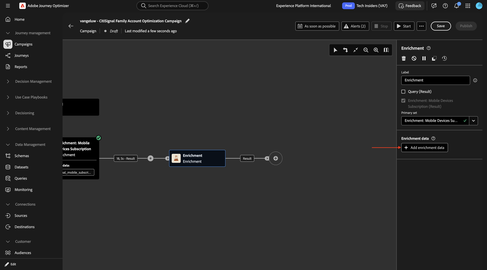

向下展開至&#x200B;**目標維度**。

向下鑽研至&#x200B;**`citisignal_offer_eligibility`**。

向下鑽研至&#x200B;**`citisignal_offers`**。

選取&#x200B;**`offer_name`**&#x200B;並按一下&#x200B;**確認**。

按一下&#x200B;**新增屬性**。

向下鑽研至&#x200B;**`citisignal_offers`**。

選取&#x200B;**`offer_code`**&#x200B;並按一下&#x200B;**確認**。

按一下&#x200B;**新增屬性**。

向下鑽研至&#x200B;**`citisignal_offers`**。

選取&#x200B;**`offer_description`**&#x200B;並按一下&#x200B;**確認**。

按一下&#x200B;**新增屬性**。

向下鑽研至&#x200B;**`citisignal_offers`**。

選取&#x200B;**`offer_description`**&#x200B;並按一下&#x200B;**確認**。

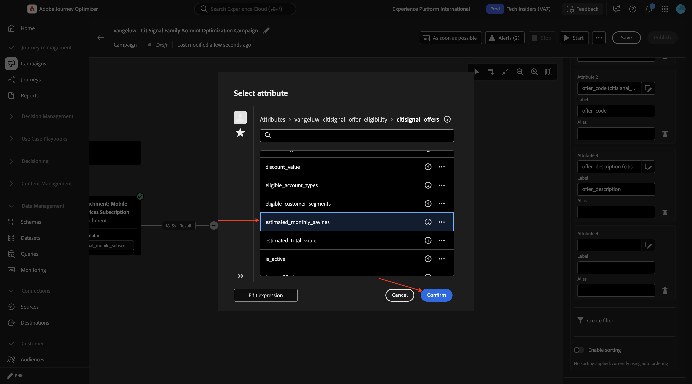

開啟&#x200B;**啟用排序**。

向下鑽研至&#x200B;**`citisignal_offers`**。

選取&#x200B;**`offer_priority`**&#x200B;並按一下&#x200B;**確認**。

您現在可以測試行銷活動。 按一下「**開始**」。

一段時間後，您應該會看到這個訊息。 按一下&#x200B;**結果**，然後選取&#x200B;**預覽結果**。

之後，您應該會看到類似以下內容。

### 電子郵件活動

按一下&#x200B;**+**&#x200B;圖示，然後選取&#x200B;**電子郵件**。

按一下&#x200B;**編輯電子郵件**。

移至&#x200B;**動作**。

選取您之前建立的&#x200B;**電子郵件通道設定**，然後按一下&#x200B;**編輯內容**。

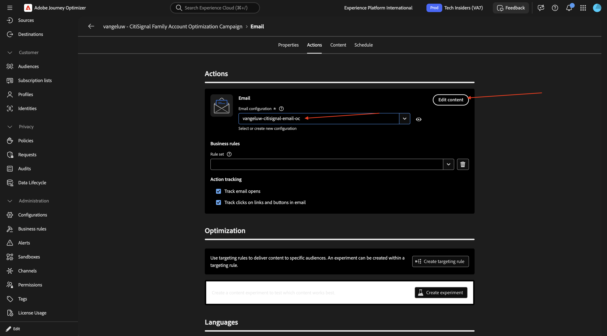

針對&#x200B;**主旨列**，貼上以下內容：

`{{target.--aepUserLdap--_citisignal_recipients.first_name}}, Your CitiSignal Family Account Summary`

按一下&#x200B;**編輯電子郵件內文**。

## 後續步驟

返回[Adobe Journey Optimizer：協調的行銷活動](./ajocampaigns.md){target="_blank"}

返回[所有模組](./../../../../overview.md){target="_blank"}
