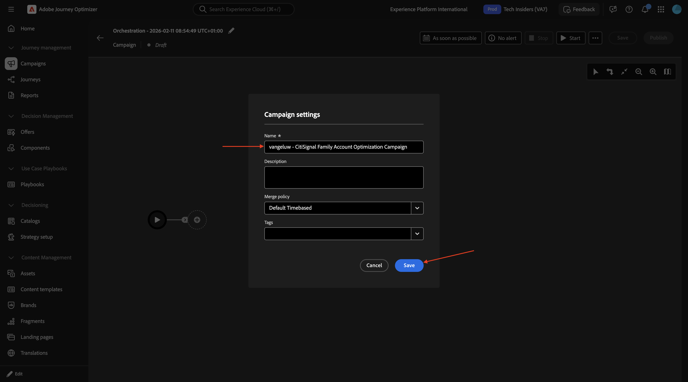

# 3.8.2建立您的協調行銷活動

## 3.8.2.1建立您的協調行銷活動

前往&#x200B;**行銷活動**。 按一下&#x200B;**建立行銷活動**。

選取&#x200B;**協調流程 — 行銷**，然後按一下&#x200B;**確認**。

輸入行銷活動名稱： `--aepUserLdap-- - CitiSignal Family Account Optimization Campaign`並按一下&#x200B;**儲存**。

您應該會看到此訊息。 按一下&#x200B;**+**&#x200B;圖示。

## 後續步驟

返回[Adobe Journey Optimizer：行銷活動](./ajocampaigns.md){target="_blank"}

返回[所有模組](./../../../../overview.md){target="_blank"}
