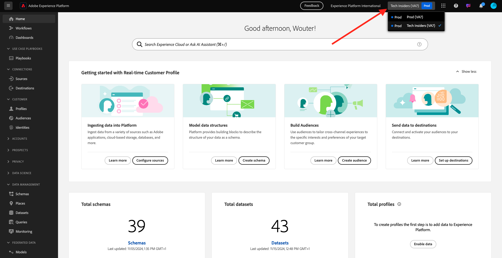
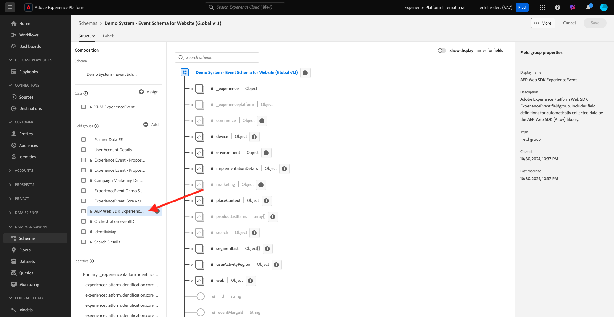

# 1.1.7 Adobe Experience Platform中的XDM結構描述需求

為確保網頁SDK能夠將資料擷取到Adobe Experience Platform，您需要將特定XDM Mixin納入Adobe Experience Platform的XDM結構描述。

前往[https://experience.adobe.com/platform](https://experience.adobe.com/platform)並登入。

登入後，按一下熒幕上方藍線中的文字&#x200B;**Production Prod**&#x200B;以選取適當的沙箱。 選取沙箱`--aepSandboxName--`。

選取您的沙箱後，您會看到畫面變更，現在您已進入沙箱。

在左側功能表中，前往&#x200B;**結構描述**&#x200B;並開啟網站的&#x200B;**示範系統 — 事件結構描述（全域v1.1）**&#x200B;結構描述。

在該結構描述中，您會看到已新增欄位群組&#x200B;**AEP Web SDK ExperienceEvent**&#x200B;欄位群組。 此欄位群組會將所有最低必要欄位新增至結構描述。 Web SDK在Adobe Experience Platform中使用的每個「體驗事件結構描述」，一律都會要求欄位群組成為結構描述的一部分。

在[模組1.2資料擷取](./../dc1.2/data-ingestion.md)中，您將瞭解如何新增欄位群組至結構描述。

下一步：

## 後續步驟

移至[摘要與優點](./summary.md){target="_blank"}

返回[設定Adobe Experience Platform Data Collection和Web SDK標籤擴充功能](./data-ingestion-launch-web-sdk.md){target="_blank"}

返回[所有模組](./../../../../overview.md){target="_blank"}
