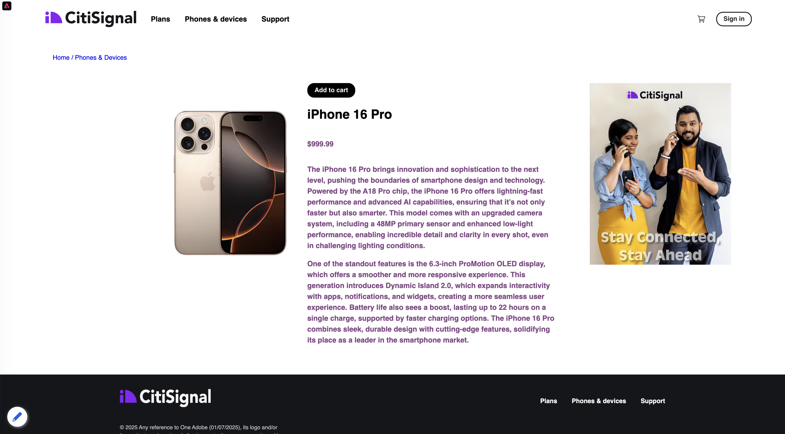
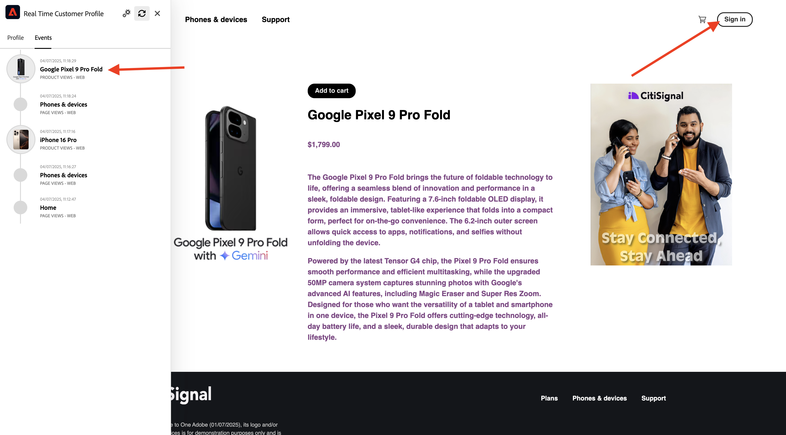

# 1.2.1從未知到網站上已知

## 內容

從未知到已知的歷程是這些天品牌中最重要的主題之一，就像客戶從贏取到保留的歷程。

Adobe Experience Platform在此歷程中擔當著重要角色。 Platform是溝通的大腦，記錄體驗系統。

Platform是一個環境，其中單字&#x200B;**customer**&#x200B;不只是&#x200B;**已知**-customers。 向品牌講話時，請務必注意一件事：從Platform的角度來看，網站上的未知訪客也是客戶，因此，作為未知訪客的所有行為也會傳送到Platform。 由於這種方法，當此客戶最終成為已知客戶時，品牌也可以將那一刻之前發生的事情視覺化。 從歸因和體驗最佳化的角度來看，這很有幫助。

## 您要做什麼

您現在會將資料內嵌至Adobe Experience Platform，且資料會連結至ECID和電子郵件地址等識別碼。 此課程的目標是從設定的角度瞭解您打算做什麼的業務內容。 在下一個練習中，您將開始設定所需的一切，以便在您自己的沙箱環境中實現所有資料擷取。

### 客戶歷程流程

移至[https://dsn.adobe.com](https://dsn.adobe.com)。 使用Adobe ID登入後，您會看到此訊息。 按一下您的網站專案上的3個點&#x200B;**...**，然後按一下&#x200B;**執行**&#x200B;以開啟它。

然後您會看到示範網站已開啟。 選取URL並將其複製到剪貼簿。

開啟新的無痕瀏覽器視窗。

貼上您在上一步中複製的示範網站URL。 接著，系統會要求您使用Adobe ID登入。

選取您的帳戶型別並完成登入程式。

接著，您會在無痕瀏覽器視窗中看到您的網站已載入。 對於每個示範，您都需要使用全新的無痕瀏覽器視窗來載入您的示範網站URL。

按一下畫面左上角的Adobe標誌圖示，開啟設定檔檢視器。

請檢視「設定檔檢視器」面板和「即時客戶設定檔」，將&#x200B;**Experience Cloud ID**&#x200B;設為此目前未知客戶的主要識別碼。

您也可以檢視根據客戶行為收集的所有體驗事件。 清單目前是空的，但很快就會變更。

移至&#x200B;**電話和裝置**&#x200B;產品類別。 接著，按一下產品&#x200B;**iPhone 15 Pro**。

然後您會看到產品詳細資料頁面。 型別&#x200B;**產品檢視**&#x200B;的體驗事件現在已使用您在上一個模組中檢閱的Web SDK實作傳送到Adobe Experience Platform。

開啟「設定檔檢視器」面板，並檢視您的&#x200B;**體驗事件**。

>[!NOTE]
>
>如果您沒有看到事件立即顯示，請重新整理頁面。

返回&#x200B;**電話和裝置**&#x200B;類別頁面，然後按一下其他產品。 另一個體驗事件已傳送至Adobe Experience Platform。

開啟設定檔檢視器面板。 您現在會看到2個型別為&#x200B;**產品檢視**&#x200B;的體驗事件。 雖然行為是匿名的，但在獲得適當同意後，我們仍能追蹤每次點按並將其儲存在Adobe Experience Platform中。 一旦知道匿名客戶，我們就可以自動將所有匿名行為合併到知道的設定檔。

按一下&#x200B;**登入**，即可移至「註冊/登入」頁面。

按一下&#x200B;**建立帳戶**。

填寫您的詳細資料，然後按一下&#x200B;**註冊**，之後您將會被重新導向到上一頁。

開啟設定檔檢視器面板，然後前往即時客戶設定檔。 在「設定檔檢視器」面板上，您應該會看到所有顯示的個人資料，例如新新增的電子郵件和電話識別碼。

在「設定檔檢視器」面板上，前往「體驗事件」。 您將會在「設定檔檢視器」面板上看到先前檢視過的2項產品。 這兩個事件現在也都連線到您的「已知」設定檔。

您現在已將資料內嵌至Adobe Experience Platform，且已將該資料連結至ECID和電子郵件地址等識別碼。 此課程的目標是瞭解您打算進行的業務內容。 在下一個練習中，您將開始設定所需的一切，以讓所有資料擷取成為可能。

## 後續步驟

移至[1.2.2設定結構描述並設定識別碼](./ex2.md){target="_blank"}

返回[資料擷取](./data-ingestion.md){target="_blank"}

返回[所有模組](./../../../../overview.md){target="_blank"}
