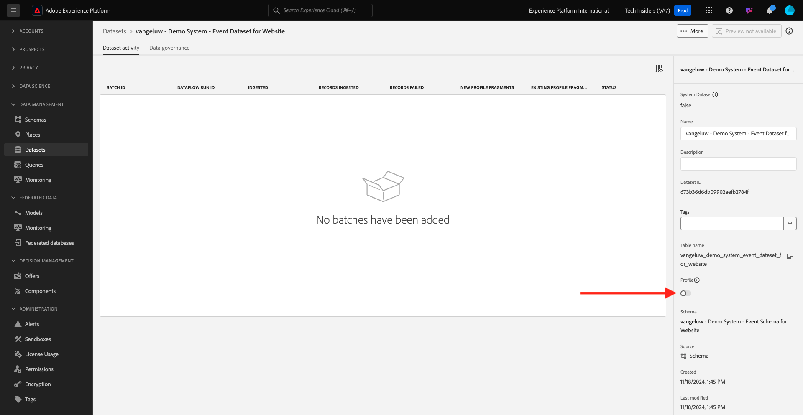

# 1.2.3設定資料集

在本練習中，您將設定資料集以擷取及儲存設定檔資訊和客戶行為。 您在此建立的每個資料集都會使用您在上一步中建立的其中一個結構描述。

## 內容

定義問題的答案後，**此客戶是誰？**&#x200B;和&#x200B;**此客戶做什麼？**&#x200B;看起來應該類似，您現在需要建立使用該資訊的貯體，以接收及驗證傳送至Adobe Experience Platform的資料。

## 建立資料集

您現在需要建立2個資料集：

- 1個資料集以擷取回答&#x200B;**此客戶是誰？** — 問題。
- 1個資料集以擷取回答&#x200B;**此客戶做什麼的資訊？** — 問題。

前往此URL登入Adobe Experience Platform： [https://experience.adobe.com/platform](https://experience.adobe.com/platform)。

登入後，您會登入Adobe Experience Platform的首頁。

繼續之前，您必須選取&#x200B;**[!UICONTROL 沙箱]**。 要選取的沙箱名為``--aepSandboxName--``。 選取適當的[!UICONTROL 沙箱]後，您將會看到畫面變更，現在您已在專屬的[!UICONTROL 沙箱]中。

在Adobe Experience Platform中，按一下畫面左側功能表中的&#x200B;**[!UICONTROL 資料集]**。  然後您會看到以下內容：

讓我們從建立資料集以擷取網站註冊資訊開始。

您應該建立新的資料集。 若要建立新資料集，請按一下[建立資料集]按鈕&#x200B;**[!UICONTROL +。]**

您必須使用上一步中定義的結構描述來定義資料集。 按一下&#x200B;**[!UICONTROL 從結構描述建立資料集]** — 選項。

在下一個畫面中，您必須選取您在1， `--aepUserLdap-- - Demo System - Profile Schema for Website`中建立的結構描述。

按一下&#x200B;**下一步**。

為資料集命名。

將當作資料集名稱，使用下列專案：

`--aepUserLdap-- - Demo System - Profile Dataset for Website`

按一下&#x200B;**完成**。

您現在會看到以下內容：

返回[!UICONTROL 資料集]總覽。 您現在會在概觀中看到您所建立的資料集快顯視窗。

接下來，您將設定第二個資料集以擷取網站互動。

按一下&#x200B;**[!UICONTROL +建立資料集]**。

您必須使用上一步中定義的結構描述來定義資料集。 按一下&#x200B;**[!UICONTROL 從結構描述建立資料集]** — 選項。

在下一個畫面中，您必須選取您建立排程表的結構描述`--aepUserLdap-- - Demo System - Event Schema for Website`。

按一下&#x200B;**下一步**。

為資料集命名。

將當作資料集的名稱，請使用以下專案：

`--aepUserLdap-- - Demo System - Event Dataset for Website`

按一下&#x200B;**完成**。

然後您會看到以下內容：

返回[!UICONTROL 資料集]總覽畫面。

您現在必須啟用資料集，使其成為Adobe Experience Platform即時客戶個人檔案的一部分。

按一下資料集`--aepUserLdap-- - Demo System - Profile Dataset for Website`以開啟它。

在畫面右側找到[!UICONTROL 設定檔]切換圖示。
按一下[!UICONTROL 設定檔]切換即可為[!UICONTROL 設定檔]啟用此資料集。

按一下&#x200B;**[!UICONTROL 啟用]**。

您的資料集現在已啟用[!UICONTROL 設定檔]。

返回資料集總覽，然後按一下以開啟您網站的資料集`--aepUserLdap-- - Demo System - Event Dataset`。

在畫面右側找到[!UICONTROL 設定檔]切換圖示。 按一下[!UICONTROL 設定檔]切換以啟用[!UICONTROL 設定檔]。

按一下&#x200B;**[!UICONTROL 啟用]**。

您的資料集現在已啟用[!UICONTROL 設定檔]。

## 後續步驟

移至[1.2.4從離線來源擷取的資料](./ex4.md){target="_blank"}

返回[資料擷取](./data-ingestion.md){target="_blank"}

返回[所有模組](./../../../../overview.md){target="_blank"}
