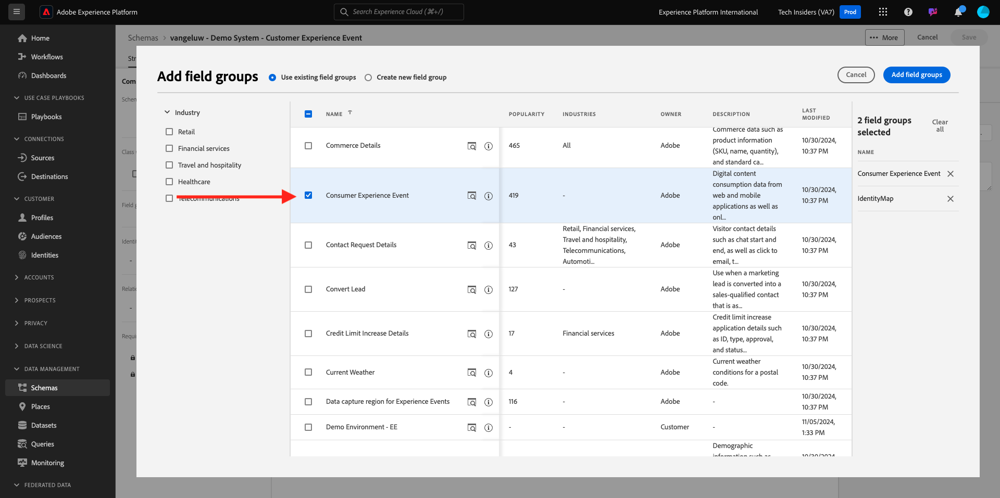
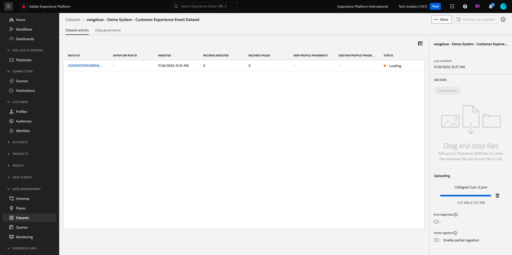
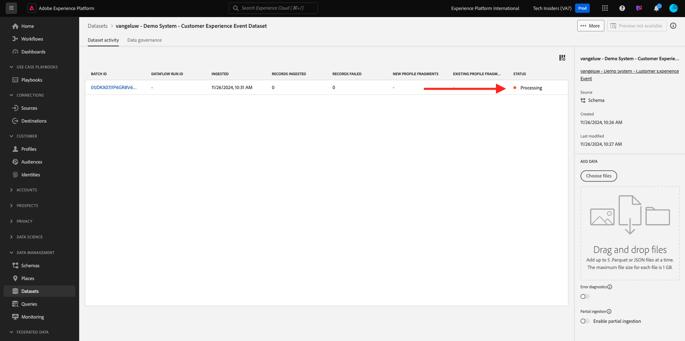

# 2.2.1 Customer AI — 資料準備（擷取）

為了讓智慧型服務從行銷事件資料中探索見解，資料必須在語義上豐富並維護標準結構。 智慧型服務可運用Adobe的Experience Data Model (XDM)結構描述來達成此目的。
具體而言，Intelligent Services中使用的所有資料集都必須符合**消費者體驗事件** XDM結構描述。

## 建立結構描述

在本練習中，您將建立包含&#x200B;**Customer AI** Intelligent Service所需&#x200B;**消費者體驗事件mixin**&#x200B;的結構描述。

前往此URL登入Adobe Experience Platform： [https://experience.adobe.com/platform](https://experience.adobe.com/platform)。

登入後，您會登入Adobe Experience Platform的首頁。

繼續之前，您必須選取&#x200B;**沙箱**。 要選取的沙箱名為``--aepSandboxName--``。 選取適當的沙箱後，您會看到畫面變更，現在您已進入專屬沙箱。

從左側功能表，按一下&#x200B;**結構描述**&#x200B;並移至&#x200B;**瀏覽**。 按一下&#x200B;**建立結構描述**。

在快顯視窗中選取&#x200B;**手動**，然後按一下&#x200B;**選取**。

接著，選取&#x200B;**體驗事件**，然後按一下&#x200B;**下一步**。

您需要現在提供結構描述的名稱。 做為結構描述的名稱，請使用這個： `--aepUserLdap-- - Demo System - Customer Experience Event`並按一下&#x200B;**完成**。

您將會看到此訊息。 按一下[欄位群組]下的[**+新增**]。

搜尋並選取下列&#x200B;**欄位群組**&#x200B;以新增至此結構描述：

- 消費者體驗事件

- 身分對應

按一下&#x200B;**新增欄位群組**。

您將會看到此訊息。 接著，選取結構描述的名稱。 您現在應該按一下&#x200B;**設定檔**&#x200B;切換按鈕，為&#x200B;**設定檔**&#x200B;啟用結構描述。

您將會看到此訊息。 勾選&#x200B;**此結構描述資料在identityMap欄位中將包含主要身分的核取方塊。**。按一下&#x200B;**啟用**。

您現在應該擁有此專案。 按一下[儲存]儲存結構描述。****

## 建立資料集

從左側功能表，按一下&#x200B;**資料集**&#x200B;並移至&#x200B;**瀏覽**。 按一下&#x200B;**建立資料集**。

按一下&#x200B;**從結構描述建立資料集**。

在下一個畫面中，選取您在上一個練習中建立的資料集，名為`--aepUserLdap-- - Demo System - Customer Experience Event`。 按一下&#x200B;**下一步**。

作為資料集的名稱，請使用`--aepUserLdap-- - Demo System - Customer Experience Event Dataset`。 按一下&#x200B;**完成**。

您的資料集現已建立。 啟用&#x200B;**設定檔**&#x200B;切換。

按一下&#x200B;**啟用**。

您現在應該擁有：

您現在已準備好開始內嵌消費者體驗事件資料，並開始使用Customer AI服務。

## 下載體驗事件測試資料

設定&#x200B;**結構描述**&#x200B;和&#x200B;**資料集**&#x200B;後，您就可以內嵌體驗事件資料了。 由於Customer AI需要特定資料需求，因此您將需要擷取外部準備的資料。

為本練習中的體驗事件準備的資料必須符合[消費者體驗事件XDM欄位群組](https://github.com/adobe/xdm/blob/797cf4930d5a80799a095256302675b1362c9a15/docs/reference/context/experienceevent-consumer.schema.md)的要求和結構描述。

請從以下位置下載包含示範資料的zip檔案： [https://one-adobe-tech-insiders.s3.us-west-2.amazonaws.com/CUSTOM_CAI_EVENTS-WEB.zip](https://one-adobe-tech-insiders.s3.us-west-2.amazonaws.com/CUSTOM_CAI_EVENTS-WEB.zip)。

您現在已下載名為&#x200B;**CUSTOM-CAI-EVENTS-WEB.zip**&#x200B;的檔案。 將檔案放在電腦的案頭上並解壓縮，之後您會看到名為&#x200B;**CUSTOM-CAI-EVENTS-WEB**&#x200B;的資料夾。

在該資料夾中，您會找到多個已排序的json檔案，這些檔案都需要在下一個練習中擷取。

## 擷取體驗事件測試資料

在Adobe Experience Platform中，前往&#x200B;**資料集**&#x200B;並開啟您的資料集，名稱為&#x200B;**[!UICONTROL ldap — 示範系統 — 客戶體驗事件資料集]**。

在您的資料集中，按一下&#x200B;**選擇檔案**&#x200B;以新增資料。

在快顯視窗中，選取檔案&#x200B;**WEBSITE-EE-1.json**，直到&#x200B;**WEBSITE-EE-5.json**，然後按一下&#x200B;**開啟**。

對檔案&#x200B;**WEBSITE-EE-6.json**&#x200B;和&#x200B;**WEBSITE-EE-7.json**&#x200B;重複此擷取程式。

您會看到資料正在匯入，且新批次已建立為&#x200B;**正在載入**&#x200B;狀態。 在上傳檔案之前，請勿巡覽到此頁面之外。

上傳檔案後，您會看到批次狀態從&#x200B;**載入**&#x200B;變更為&#x200B;**處理**。

擷取及處理資料可能需要10至20分鐘。

一旦資料擷取成功，各種上傳的批次狀態將變更為&#x200B;**成功**。

## 後續步驟

移至[2.2.2 Customer AI — 建立新執行個體（設定）](./ex2.md){target="_blank"}

返回[智慧型服務](./intelligent-services.md){target="_blank"}

返回[所有模組](./../../../../overview.md){target="_blank"}
