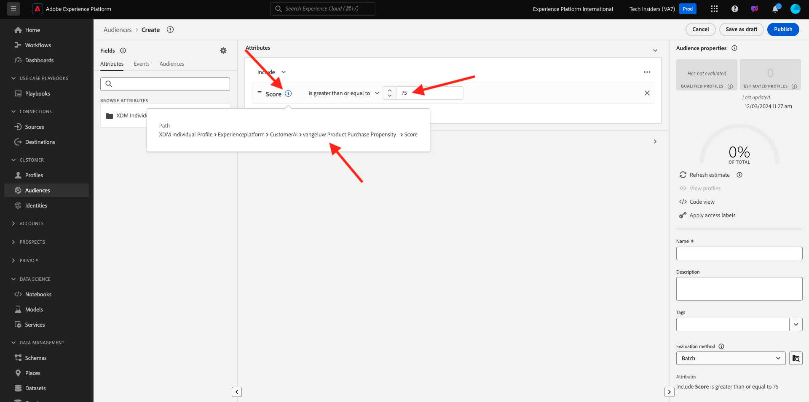
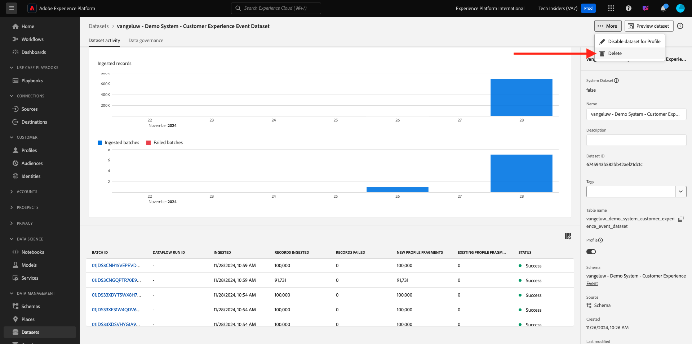

# 2.2.3 Customer AI — 評分儀表板和細分（預測和採取行動）

一旦您的Customer AI執行個體完成模型執行，您將能夠視覺化經過評估的傾向分數，以預測客戶在未來30天內執行購買。

>[!NOTE]
>
>只有狀態為&#x200B;**成功**&#x200B;的Customer AI執行個體可讓您預覽服務的深入分析。

## 傾向性預測

現在，讓我們檢閱Customer AI執行個體模型產生的預測傾向。 按一下例證名稱即可檢視控制面板。

Customer AI儀表板會顯示分數、母體分佈和模型要評估之影響因素的摘要。

暫留在影響因素上，以檢視資料分佈的進一步劃分。

## 業務動作

### 劃分客戶

Customer AI儀表板允許按一下即可定義區段。 按一下傾向卡上的&#x200B;**建立區段**&#x200B;按鈕。

您會看到區段定義已自動建立。

依照此命名慣例，為您的區段命名： `--aepUserLdap-- - Customer AI High Propensity`。 按一下&#x200B;**發佈**。

您現在可以使用此區段來使用進行目標定位，例如Real-time CDP、Journey Optimizer和Adobe Target。

## 清理

為了確保您的環境中不會保留不需要的示範資料，請務必在您成功完成此練習後刪除資料集`--aepUserLdap-- - Demo System - Customer Experience Event Dataset`。 如果您未刪除示範資料，您的AEP執行個體將會受到成本影響。

## 後續步驟

移至[摘要與優點](./summary.md){target="_blank"}

返回[智慧型服務](./intelligent-services.md){target="_blank"}

返回[所有模組](./../../../../overview.md){target="_blank"}
