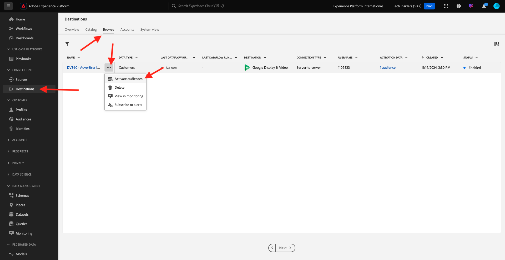

# 2.3.3採取動作：將對象傳送至DV360

移至[Adobe Experience Platform](https://experience.adobe.com/platform)。 登入後，您會登入Adobe Experience Platform的首頁。

繼續之前，您必須選取&#x200B;**沙箱**。 要選取的沙箱名為``--aepSandboxName--``。 選取適當的[!UICONTROL 沙箱]後，您將會看到畫面變更，現在您已在專屬的[!UICONTROL 沙箱]中。

在左側功能表中，移至&#x200B;**目的地**，然後移至&#x200B;**瀏覽**。 然後您會看到&#x200B;**DV360**&#x200B;目的地。 按一下3個點&#x200B;**...**，然後按一下&#x200B;**啟用對象**。

在可用受眾清單中，選取您在上一個練習中建立的受眾。 按一下&#x200B;**下一步**。

在&#x200B;**對象排程**&#x200B;頁面上，按一下&#x200B;**下一步**。

最後，在&#x200B;**檢閱**&#x200B;頁面上按一下&#x200B;**完成**。

您的對象現在已連結至Google DV360。 每當客戶符合此對象的資格時，就會傳送訊號至Google DV360，將該客戶納入Google DV360端的對象中。

## 後續步驟

移至[2.3.4採取動作：將您的對象傳送至S3-destination](./ex4.md){target="_blank"}

返回[Real-time CDP — 建立對象並執行動作](./real-time-cdp-build-a-segment-take-action.md){target="_blank"}

返回[所有模組](./../../../../overview.md){target="_blank"}
