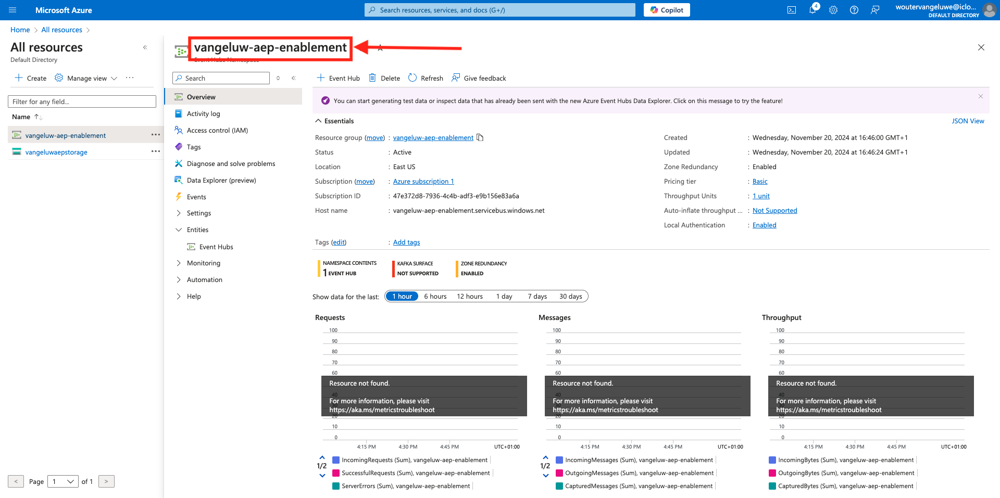

# 2.4.3在Adobe Experience Platform中設定Azure事件中樞目的地

## 識別必要的Azure連線引數

若要在Adobe Experience Platform中設定事件中心目的地，您需要執行下列事項：

- 事件中樞名稱空間
- 事件中樞
- Azure SAS金鑰名稱
- Azure SAS金鑰

已在上一個練習中定義事件中心和EventHub名稱空間： [在Azure中設定事件中心](./ex2.md)

### 事件中樞名稱空間

若要在Azure入口網站中查詢上述資訊，請導覽至[https://portal.azure.com/#home](https://portal.azure.com/#home)。 請確定您使用正確的Azure帳戶。

按一下Azure入口網站中的&#x200B;**所有資源**：

在清單中找到您的&#x200B;**事件中樞名稱空間**，然後按一下它。

您的&#x200B;**事件中樞名稱空間**&#x200B;名稱現在清晰可見。 它應該類似於`--aepUserLdap---aep-enablement`。

### 事件中樞

在您的&#x200B;**事件中樞名稱空間**&#x200B;頁面上，按一下&#x200B;**實體>事件中樞**&#x200B;以取得事件中樞名稱空間中定義的事件中樞清單，如果您遵循上一個練習中所使用的命名慣例，您將會找到名為`--aepUserLdap---aep-enablement-event-hub`的事件中樞。 記下它，您將在下一個練習中用到它。

### SAS金鑰名稱

在您的&#x200B;**事件中樞名稱空間**&#x200B;頁面上，按一下&#x200B;**設定>共用存取原則**。 您將會看到共用存取原則清單。 我們正在尋找的SAS金鑰是&#x200B;**RootManageSharedAccessKey**，即**SAS金鑰名稱。 寫下來。

### SAS金鑰值

接著，按一下&#x200B;**RootManageSharedAccessKey**&#x200B;以取得SAS金鑰值。 然後按&#x200B;**複製到剪貼簿**&#x200B;圖示複製&#x200B;**主索引鍵**，在此例中為`pqb1jEC0KLazwZzIf2gTHGr75Z+PdkYgv+AEhObbQEY=`。

### 目的地值摘要

此時，您應該已找出在Adobe Experience Platform Real-time CDP中定義Azure事件中心目的地所需的所有值。

| 目的地屬性名稱 | 目的地屬性值 | 範例值 |
|---|---|---|
| sasKeyName | SAS金鑰名稱 | RootManageSharedAccessKey |
| sasKey | SAS金鑰值 | pqb1jEC0KLazwZzIf2gTHGr75Z+PdkYgv+AEhObbQEY= |
| 名稱空間 | 事件中樞名稱空間 | `--aepUserLdap---aep-enablement` |
| eventHubName | 事件中樞 | `--aepUserLdap---aep-enablement-event-hub` |

## 在Adobe Experience Platform中建立Azure事件中心目的地

前往此URL登入Adobe Experience Platform： [https://experience.adobe.com/platform](https://experience.adobe.com/platform)。

登入後，您會登入Adobe Experience Platform的首頁。

繼續之前，您必須選取&#x200B;**沙箱**。 要選取的沙箱名為``--aepSandboxName--``。 選取適當的沙箱後，您會看到畫面變更，現在您已進入專屬沙箱。

前往&#x200B;**目的地**，然後前往&#x200B;**目錄**。 選取&#x200B;**雲端儲存空間**，前往&#x200B;**Azure事件中樞**，然後按一下&#x200B;**設定**。

選取&#x200B;**標準驗證**。 填寫您在上一個練習中所收集的連線詳細資料。 接著，按一下&#x200B;**連線到目的地**。

如果認證正確，您將會看到確認： **已連線**。

您現在需要以`--aepUserLdap---aep-enablement`格式輸入名稱和描述。 輸入&#x200B;**eventHubName** （請參閱上一個練習，看起來像這樣： `--aepUserLdap---aep-enablement-event-hub`），然後按一下&#x200B;**下一步**。

您可以選擇選取資料治理原則。 按一下&#x200B;**儲存並結束**。

您的目的地現在已建立，並可在Adobe Experience Platform中使用。

## 後續步驟

移至[2.4.4建立對象](./ex4.md){target="_blank"}

返回[Real-Time CDP： Audience Activation到Microsoft Azure事件中心](./segment-activation-microsoft-azure-eventhub.md){target="_blank"}

返回[所有模組](./../../../../overview.md){target="_blank"}
