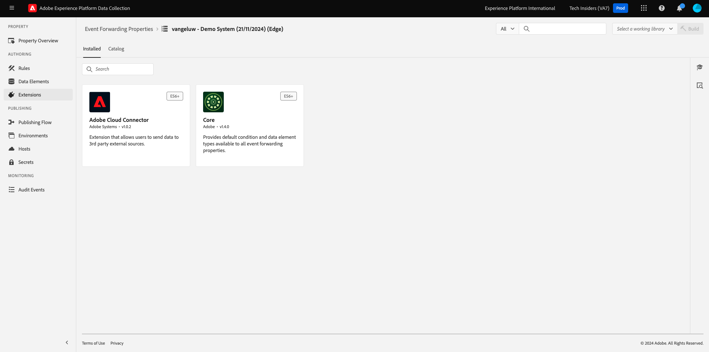

# 2.5.1建立Adobe Experience Platform資料收集事件轉送屬性

## 什麼是Adobe Experience Platform資料收集事件轉送屬性？

通常在使用Adobe Experience Platform Data Collection收集資料時，會在&#x200B;**使用者端**&#x200B;收集資料。 **使用者端**&#x200B;是網站或行動應用程式之類的環境。 在「快速入門」和「資料收集」中，已深入討論Adobe Experience Platform資料收集使用者端屬性的設定，且您已將Adobe Experience Platform資料收集使用者端屬性實施至您的網站和行動應用程式，以便在客戶與網站和行動應用程式互動時可以在那裡收集資料。

當互動資料由Adobe Experience Platform資料收集使用者端屬性收集時，網站或行動應用程式會傳送請求至Adobe的Edge。 Edge是Adobe的資料收集環境，也是點按資料流資料進入Adobe生態系統的入口點。 收集到的資料會從Edge傳送至Adobe Experience Platform、Adobe Analytics、Adobe Audience Manager或Adobe Target等應用程式。

新增Adobe Experience Platform Data Collection Event Forwarding屬性後，您現在可以設定Adobe Experience Platform Data Collection屬性，在Edge上接聽傳入的資料。 在Edge上執行的Adobe Experience Platform Data Collection Event Forwarding屬性看到傳入資料時，將能夠使用該資料並將其轉送至其他位置。 現在其他位置也可以是非Adobe的外部webhook，因此可以將該資料傳送到，例如，您選擇的資料湖、決策應用程式或能夠開啟webhook的任何其他應用程式。

使用者端屬性對Adobe Experience Platform資料收集事件轉送屬性的設定很熟悉，能夠像過去一樣使用Adobe Experience Platform資料收集使用者端屬性來設定資料元素和規則。 不過，存取及使用資料的方式會因您的使用案例而略有不同。

讓我們從建立Adobe Experience Platform資料收集事件轉送屬性開始。

## 建立Adobe Experience Platform資料收集事件轉送屬性

移至[https://experience.adobe.com/#/data-collection/](https://experience.adobe.com/#/data-collection/)。 在左側功能表中，按一下&#x200B;**事件轉送**。 接著，您會看到所有可用Adobe Experience Platform資料收集事件轉送屬性的總覽。 按一下&#x200B;**建立屬性**&#x200B;按鈕。

或者，如果已經建立其他事件轉送屬性，UI看起來會有點不同。 在這種情況下，請按一下&#x200B;**新增屬性**。

您現在需要輸入Adobe Experience Platform資料收集事件轉送屬性的名稱。 作為命名慣例，請使用`--aepUserLdap-- - Demo System (DD/MM/YYYY) (Edge)`。 例如，在此範例中，名稱為&#x200B;**vangeluw - Demo System (22/02/2022) (Edge)**。 按一下&#x200B;**儲存**。

接著，您會回到Adobe Experience Platform資料收集事件轉送屬性清單中。 按一下以開啟您剛建立的屬性。

## 設定Adobe Cloud Connector擴充功能

在左側功能表中，移至&#x200B;**擴充功能**。 您會看到&#x200B;**核心**&#x200B;擴充功能已設定。

移至&#x200B;**目錄**。 您將會看到&#x200B;**Adobe Cloud Connector**&#x200B;擴充功能以及其他許多擴充功能。 按一下&#x200B;**安裝**&#x200B;以進行安裝。

接著會新增擴充功能。 此步驟沒有要執行的設定。 系統會將您傳回已安裝的擴充功能概觀。

## 部署您的Adobe Experience Platform資料收集事件轉送屬性

在左側功能表中，移至&#x200B;**發佈流程**。 按一下&#x200B;**新增資料庫**。

輸入名稱&#x200B;**主要**，選取環境&#x200B;**開發（開發）**，然後按一下&#x200B;**+新增所有變更的資源**。

您將會看到此訊息。 按一下&#x200B;**「儲存並為開發建立」**。

接著將建置您的程式庫，這可能需要1-2分鐘的時間。

## 後續步驟

移至[2.5.2更新您的資料串流，讓您的資料收集事件轉送屬性可以使用資料](./ex2.md){target="_blank"}

返回[Real-Time CDP連線：事件轉送](./aep-data-collection-ssf.md){target="_blank"}

返回[所有模組](./../../../../overview.md){target="_blank"}
