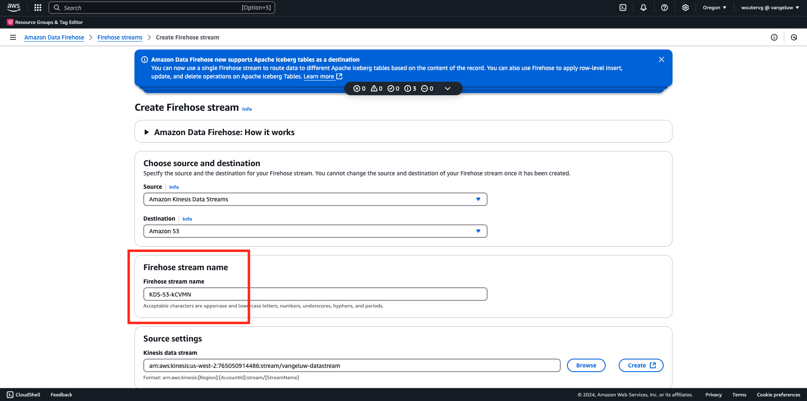
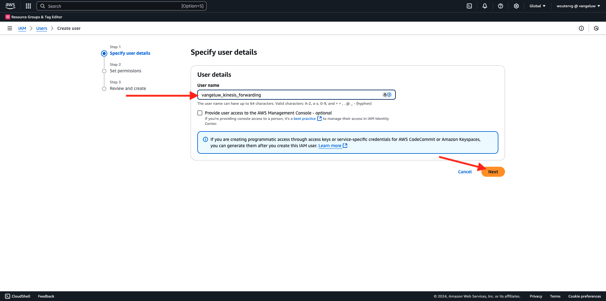

# 2.5.5將事件轉送至AWS Kinesis和AWS S3

>[!IMPORTANT]
>
>完成此練習為選填，且使用AWS Kinesis需支付相關費用。 雖然AWS提供免費套餐帳戶，可讓您免費測試及設定許多服務，但AWS Kinesis不屬於該免費套餐帳戶。 因此，為了實施和測試此練習，使用AWS Kinesis需要支付相關費用。

## 很高興知道

Adobe Experience Platform支援以各種Amazon服務作為目的地。
Kinesis和S3都是[設定檔匯出目的地](https://experienceleague.adobe.com/docs/experience-platform/destinations/destination-types.html?lang=zh-Hant)，可以當作Adobe Experience PlatformReal-Time CDP的一部分使用。
您可以輕鬆地將高價值區段事件和相關設定檔屬性饋送至您選擇的系統。

在本練習中，您將瞭解如何設定自己的Amazon Kinesis串流，以將來自Adobe Experience Platform Edge生態系統的事件資料串流到雲端儲存目的地，例如Amazon S3。 如果您想要從Web和行動屬性收集體驗事件，並將它們推送至您的資料集，以便進行分析和作業報告，這個用法很有用。 資料層級通常會在每日匯入大量檔案時，以批次方式擷取資料，不會公開公開http端點（可搭配事件轉送使用）。

支援上述使用案例表示串流資料在寫入檔案之前需要先進行緩衝或置於佇列中。 必須注意不要開啟檔案以供多個處理序的寫入存取。 將這項工作委託給專屬系統，是規模良好同時確保高服務水準的理想選擇，這也是Kinesis的救命稻草。

Amazon Kinesis Data Streams著重於擷取及儲存資料串流。 Kinesis Data Firehose著重於將資料串流傳送至特定目的地，例如S3貯體。

在本練習中，您將……

- 執行Kinesis資料串流的基本設定
- 建立Firehose傳遞串流並使用S3貯體作為目的地
- 將Amazon API閘道設定為Rest API端點，以接收您的事件資料
- 將原始事件資料從Adobe的Edge轉送至您的Kinesis資料流

## 設定您的AWS S3貯體

移至[https://console.aws.amazon.com](https://console.aws.amazon.com)並使用您的Amazon帳戶登入。

登入後，系統會將您重新導向至&#x200B;**AWS管理主控台**。

在&#x200B;**尋找服務**&#x200B;功能表中，搜尋&#x200B;**s3**。 按一下第一個搜尋結果： **S3 — 雲端中的可擴充儲存空間**。

然後您會看到&#x200B;**Amazon S3**&#x200B;首頁。 按一下&#x200B;**建立貯體**。

在&#x200B;**建立Bucket**&#x200B;畫面中，您需要設定兩個專案：

- 名稱：使用名稱`eventforwarding---aepUserLdap--`。

保留所有其他預設設定。 向下捲動並按一下&#x200B;**建立貯體**。

接著，您會看到儲存貯體已建立，且系統會將您重新導向至Amazon S3首頁。

## 設定您的AWS Kinesis資料串流

在&#x200B;**尋找服務**&#x200B;功能表中，搜尋&#x200B;**kinesis**。 按一下第一個搜尋結果： **Kinesis — 使用即時串流資料**。

選取&#x200B;**Kinesis資料串流**。 按一下&#x200B;**建立資料流**。

對於&#x200B;**資料流名稱**，請使用`--aepUserLdap---datastream`。

不需要變更任何其他設定。 向下捲動並按一下&#x200B;**建立資料流**。

您將會看到此訊息。 一旦您的資料流成功建立，您就可以繼續進行下一個練習。

## 設定AWS Firehose傳遞資料流

在&#x200B;**尋找服務**&#x200B;功能表中，搜尋&#x200B;**kinesis**。 按一下&#x200B;**Kinesis Data Firehose**。

按一下&#x200B;**建立Firehose資料流**。

針對&#x200B;**Source**，選取&#x200B;**Amazon Kinesis資料串流**。 針對&#x200B;**目的地**，選取&#x200B;**Amazon S3**。 按一下&#x200B;**瀏覽**&#x200B;以選取您的資料流。

選取您的資料流。 按一下&#x200B;**選擇**。

您將會看到此訊息。 記住&#x200B;**Firehose資料流名稱**，因為您稍後會需要它。

向下捲動，直到您看到&#x200B;**目的地設定**&#x200B;為止。 按一下&#x200B;**瀏覽**&#x200B;以選取您的S3儲存貯體。

選取您的S3儲存貯體，然後按一下&#x200B;**選擇**。

您將會看到類似這樣的內容。 更新下列設定：

- 新的行分隔符號：設定為&#x200B;**已啟用**
- 動態分割：設定為&#x200B;**未啟用**

再向下捲動一點，然後按一下&#x200B;**建立Firehose資料流**

幾分鐘後，將建立您的Firehose資料流，並&#x200B;**啟用**。

## 建立IAM使用者

在左側AWS IAM功能表中，按一下&#x200B;**使用者**。 然後您會看到&#x200B;**使用者**&#x200B;畫面。 按一下&#x200B;**建立使用者**。

接下來，設定您的使用者：

- 使用者名稱：使用`--aepUserLdap--_kinesis_forwarding`

按一下&#x200B;**下一步**。

然後您會看到此許可權畫面。 按一下&#x200B;**直接附加原則**。

輸入搜尋字詞&#x200B;**kinesisfirehose**&#x200B;以檢視所有相關原則。 選取原則&#x200B;**AmazonKinesisFirehoseFullAccess**。 向下捲動並按一下&#x200B;**下一步**。

檢閱您的設定。 按一下&#x200B;**建立使用者**。

您將會看到此訊息。 按一下&#x200B;**檢視使用者**。

按一下&#x200B;**新增許可權**&#x200B;並按一下&#x200B;**建立內嵌原則**。

您將會看到此訊息。 選取服務&#x200B;**Kinesis**。

移至&#x200B;**寫入**&#x200B;並勾選&#x200B;**PutRecord**&#x200B;的核取方塊。

向下捲動至&#x200B;**資源**&#x200B;並選取&#x200B;**全部**。 按一下&#x200B;**下一步**。

將原則命名為： **Kinesis_PutRecord**，然後按一下&#x200B;**建立原則**。

您將會看到此訊息。 按一下&#x200B;**安全性認證**。

按一下&#x200B;**建立存取金鑰**。

選取&#x200B;**在AWS**&#x200B;外部執行的應用程式。 向下捲動並按一下&#x200B;**下一步**。

按一下&#x200B;**建立存取金鑰**

您將會看到此訊息。 按一下&#x200B;**顯示**&#x200B;檢視您的秘密存取金鑰：

現在顯示您的&#x200B;**秘密存取金鑰**。

>[!IMPORTANT]
>
>將您的認證儲存在電腦的文字檔中。
>
> - 存取金鑰ID： ...
> - 秘密存取金鑰： ...
>
> 按一下&#x200B;**完成**，您將再也看不到您的認證！

按一下&#x200B;**「完成」**。

您現在已成功建立具有適當許可權的IAM使用者，在事件轉送屬性中設定AWS擴充功能時，需要指定此許可權。

## 更新您的事件轉送屬性：擴充功能

設定好「機密」和「資料元素」後，您現在可以在「事件轉送」屬性中設定Google Cloud Platform的擴充功能。

前往[https://experience.adobe.com/#/data-collection/](https://experience.adobe.com/#/data-collection/)，前往&#x200B;**事件轉送**，並開啟您的事件轉送屬性。

接下來，移至&#x200B;**擴充功能**，移至&#x200B;**目錄**。 按一下&#x200B;**AWS**&#x200B;擴充功能，然後按一下&#x200B;**安裝**。

輸入您在上一個練習中所產生的IAM使用者認證。 按一下&#x200B;**儲存**。

接下來，您需要設定開始將事件資料轉送到Kinesis的規則。

## 更新您的事件轉送屬性：規則

在左側功能表中，移至&#x200B;**規則**。 按一下以開啟您在前一個練習中所建立的規則&#x200B;**所有頁面**。

您將會看到此訊息。 按一下&#x200B;**+**&#x200B;圖示以新增動作。

您將會看到此訊息。 進行下列選取：

- 選取&#x200B;**擴充功能**： **AWS**
- 選取&#x200B;**動作型別**： **將資料傳送至Kinesis資料流**
- 名稱： **AWS — 傳送資料至Kinesis資料流**

您現在應該會看到：

接著，設定下列專案：

- 資料流名稱： `--aepUserLdap---datastream`
- AWS地區：在您的AWS資料流設定中檢查您的地區
- 資料分割索引鍵： **0**

您可以在這裡檢視您的AWS地區：

您現在應該擁有此專案。 接著，按一下&#x200B;**資料**&#x200B;欄位的資料元素圖示。

選取&#x200B;**XDM事件**&#x200B;並按一下&#x200B;**選取**。

您就會擁有此專案。 按一下&#x200B;**保留變更**。

您將會看到此訊息。 按一下&#x200B;**儲存**。

移至&#x200B;**發佈流程**&#x200B;以發佈您的變更。
按一下&#x200B;**主要**&#x200B;開啟您的開發程式庫。

按一下&#x200B;**新增所有變更的資源**&#x200B;按鈕，之後您會看到此程式庫中出現了規則和資料元素的變更。 接著，按一下&#x200B;**儲存並建置以供開發**。 正在部署您的變更。

幾分鐘後，您會看到部署已完成並準備好進行測試。

## 測試您的設定

移至[https://dsn.adobe.com](https://dsn.adobe.com)。 使用Adobe ID登入後，您會看到此訊息。 按一下您的網站專案上的3個點&#x200B;**...**，然後按一下&#x200B;**執行**&#x200B;以開啟它。

然後您會看到示範網站已開啟。 選取URL並將其複製到剪貼簿。

開啟新的無痕瀏覽器視窗。

貼上您在上一步中複製的示範網站URL。 接著，系統會要求您使用Adobe ID登入。

選取您的帳戶型別並完成登入程式。

接著，您會在無痕瀏覽器視窗中看到您的網站已載入。 每次練習都需要使用全新的無痕瀏覽器視窗，才能載入您的示範網站URL。

將檢視切換至&#x200B;**AWS**。 開啟您的資料串流並進入&#x200B;**監視**&#x200B;標籤，您現在會看到傳入的流量。

當您接著開啟Data Firehose資料流並進入&#x200B;**監視**&#x200B;標籤時，您也會看到傳入的流量。

最後，檢視S3儲存貯體時，您現在會發現其中已因資料擷取而建立檔案。

當您下載這類檔案並使用文字編輯器開啟時，您會看到它包含來自轉送事件的XDM裝載。

>[!IMPORTANT]
>
>一旦您的設定如預期般運作，別忘了開啟AWS Kinesis Data Stream和Data Firehose以避免收費！

## 後續步驟

移至[摘要與優點](./summary.md){target="_blank"}

返回[Real-Time CDP連線：事件轉送](./aep-data-collection-ssf.md){target="_blank"}

返回[所有模組](./../../../../overview.md){target="_blank"}
