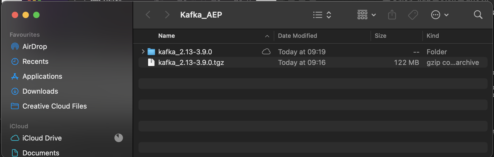
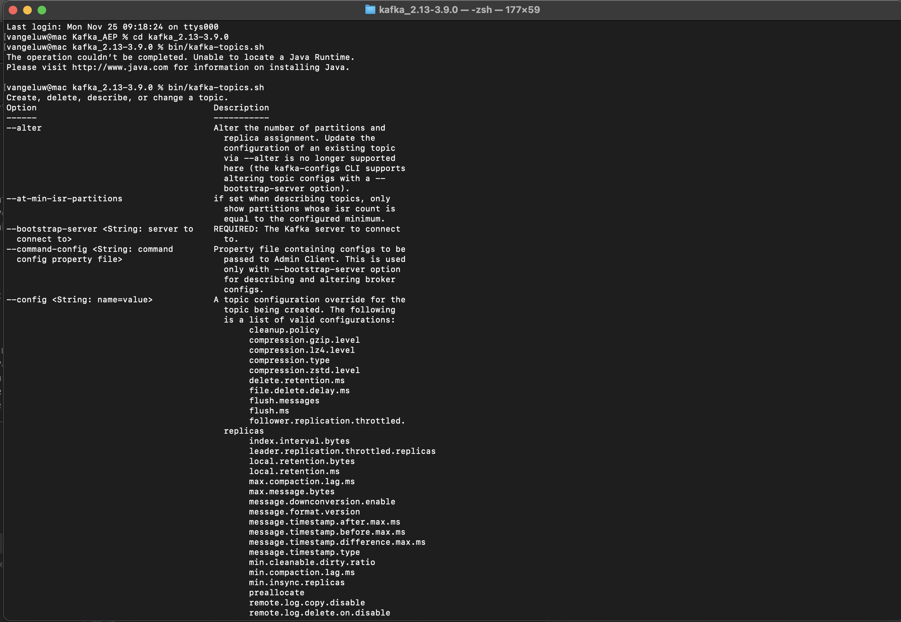

# 2.6.2安裝及設定Kafka叢集

## 下載Apache Kafka

移至[https://kafka.apache.org/downloads](https://kafka.apache.org/downloads)並下載最新發行版本。 選取最新的二進位版本，在此案例中為&#x200B;**3.9.0**。 將會開始下載。

在案頭上建立一個名為&#x200B;**Kafka_AEP**&#x200B;的資料夾，並將下載的檔案放在該目錄中。

開啟&#x200B;**終端機**&#x200B;視窗，方法是以滑鼠右鍵按一下資料夾，然後按一下&#x200B;**資料夾的新終端機**。

在「終端機」視窗中執行此命令，將下載的檔案解壓縮：

`tar -xvf kafka_2.13-3.9.0.tgz`

>[!NOTE]
>
>請確認上述命令與您下載的檔案版本相符。 如果您的版本較新，則需要更新上述命令以符合該版本。

然後您會看到以下內容：

解壓縮該檔案後，您現在會擁有類似以下的目錄：

在該目錄中，您會看到這些子目錄：

返回「終端機」視窗。 輸入下列命令：

`cd kafka_2.13-3.9.0`

>[!NOTE]
>
>請確認上述命令與您下載的檔案版本相符。 如果您的版本較新，則需要更新上述命令以符合該版本。

接下來，輸入命令`bin/kafka-topics.sh`。

之後，您應該會看到此回應。 這表示Kafka已正確安裝，且Java運作正常。 (提醒：您需要安裝Java 23 JDK才能使用此功能！ 您可以使用命令`java -version`檢視您已安裝的Java版本。)

## 啟動Kafka

若要啟動Kafka，您必須依此順序啟動Kafka Zookeeper和Kafka。

開啟&#x200B;**終端機**&#x200B;視窗，方法是以滑鼠右鍵按一下資料夾&#x200B;**kafka_2.13-3.9.0**，然後按一下&#x200B;**資料夾中的新終端機**。

輸入以下命令：

`bin/zookeeper-server-start.sh config/zookeeper.properties`

然後您會看到以下內容：

進行這些練習時，請保持此視窗開啟！

在資料夾&#x200B;**kafka_2.13-3.9.0**&#x200B;上按一下滑鼠右鍵，然後按一下&#x200B;**資料夾**&#x200B;的新終端機，開啟另一個新的&#x200B;**終端機**&#x200B;視窗。

輸入以下命令：

`bin/kafka-server-start.sh config/server.properties`

然後您會看到以下內容：

進行這些練習時，請保持此視窗開啟！

## 建立Kafka主題

開啟&#x200B;**終端機**&#x200B;視窗，方法是以滑鼠右鍵按一下資料夾&#x200B;**kafka_2.13-3.9.0**，然後按一下&#x200B;**資料夾中的新終端機**。

輸入這個命令以建立名稱為&#x200B;**aeptest**&#x200B;的新Kafka主題。 本主題將用於本練習中的測試。

`bin/kafka-topics.sh --create --topic aeptest --bootstrap-server localhost:9092`

然後您會看到確認：

輸入這個命令以建立名稱為&#x200B;**aep**&#x200B;的新Kafka主題。 您將在下個練習中設定的Adobe Experience Platform接收器聯結器將使用此主題。

`bin/kafka-topics.sh --create --topic aep --bootstrap-server localhost:9092`

然後您會看到類似的確認：

## 產生事件

返回您建立第一個Kafka主題的「終端機」視窗，然後輸入以下命令：

`bin/kafka-console-producer.sh --broker-list 127.0.0.1:9092 --topic aeptest`

您將會看到此訊息。 按下Enter按鈕後每新增一行，就會傳送新訊息至主題&#x200B;**aeptest**。

輸入`Hello AEP`並推播Enter。 您的第一個事件現在已傳送到本機Kafka執行個體，並放入主題&#x200B;**aeptest**。

輸入`Hello AEP again.`並推播Enter。

輸入`AEP Data Collection is the best.`並推播Enter。

您現在已產生3個事件至主題&#x200B;**aeptest**。 這些事件現在可供可能需要該資料的應用程式使用。

在鍵盤上，同時按一下`Control`和`C`以關閉製作程式。

## 使用事件

在您用來產生事件的同一個「終端機」視窗中，輸入下列命令：

`bin/kafka-console-consumer.sh --bootstrap-server 127.0.0.1:9092 --topic aeptest --from-beginning`

然後，您將會看到主題&#x200B;**aeptest**&#x200B;在上一個練習中產生的所有訊息，都會顯示在消費者中。 以下是Apache Kafka的運作方式：製作者會在管道中建立事件，消費者會取用這些事件。

在鍵盤上，同時按一下`Control`和`C`以關閉製作程式。

在本練習中，您已完成設定本機Kafka叢集、建立Kafka主題、產生事件和使用事件的所有基本知識。

此模組的目標是模擬如果實際組織已實作Apache Kafka叢集，且想要將資料從其Kafka叢集串流到Adobe Experience Platform中會發生什麼情況。

為方便進行這類實作，已建立Adobe Experience Platform接收器聯結器，可使用Kafka Connect實作。 您可以在這裡找到該Adobe Experience Platform接收器聯結器的檔案： [https://github.com/adobe/experience-platform-streaming-connect](https://github.com/adobe/experience-platform-streaming-connect)。

在下個練習中，您將從自己的本機Kafka叢集中實施使用該Adobe Experience Platform接收器聯結器所需的一切。

關閉您的終端機視窗。

您已完成此練習。

## 後續步驟

移至[2.6.3在Adobe Experience Platform中設定HTTP API端點](./ex3.md){target="_blank"}

返回[將資料從Apache Kafka串流到Adobe Experience Platform](./aep-apache-kafka.md){target="_blank"}

返回[所有模組](./../../../../overview.md){target="_blank"}
