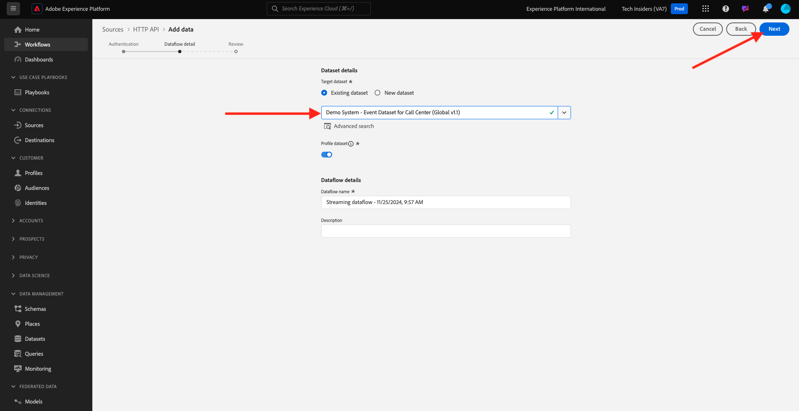

# 2.6.3在Adobe Experience Platform中設定HTTP API串流端點

您必須先在Adobe Experience Platform中建立HTTP API Source Connector，才能在Kafka中設定Adobe Experience Platform Sink Connector。 必須有HTTP API串流端點URL，才能設定Adobe Experience Platform接收器聯結器。

若要建立HTTP API Source Connector，請前往此URL登入Adobe Experience Platform： [https://experience.adobe.com/platform](https://experience.adobe.com/platform)。

登入後，您會登入Adobe Experience Platform的首頁。

繼續之前，您必須選取&#x200B;**沙箱**。 要選取的沙箱名為``--aepSandboxName--``。 選取適當的沙箱後，您會看到畫面變更，現在您已進入專屬沙箱。

在左側功能表中，移至&#x200B;**來源**，並在&#x200B;**來源目錄**&#x200B;中向下捲動，直到您看到&#x200B;**HTTP API**&#x200B;為止。 按一下&#x200B;**設定**。

按一下&#x200B;**新增帳戶**。 使用`--aepUserLdap-- - Kafka`作為您HTTP API連線的名稱，在此案例中為&#x200B;**vangeluw - Kafka**。 啟用&#x200B;**XDM相容**&#x200B;的核取方塊。 按一下&#x200B;**連線到來源**。

您將會看到此專案，請按一下[下一步]。**&#x200B;**

選取&#x200B;**現有資料集**，開啟下拉式功能表。 搜尋並選取呼叫中心（全域v1.1）**的資料集**&#x200B;示範系統 — 事件資料集。

按一下&#x200B;**下一步**。

按一下&#x200B;**完成**。

接著，您會看到剛才建立的HTTP API Source Connector概觀。

您必須複製&#x200B;**串流端點** URL，如下圖所示，因為您會在下一個練習中用到它。

`https://dcs.adobedc.net/collection/63751d0f299eeb7aa48a2f22acb284ed64de575f8640986d8e5a935741be9067`

您已完成此練習。

## 後續步驟

移至[2.6.4安裝並設定Kafka Connect和Adobe Experience Platform接收器聯結器](./ex4.md){target="_blank"}

返回[將資料從Apache Kafka串流到Adobe Experience Platform](./aep-apache-kafka.md){target="_blank"}

返回[所有模組](./../../../../overview.md){target="_blank"}
