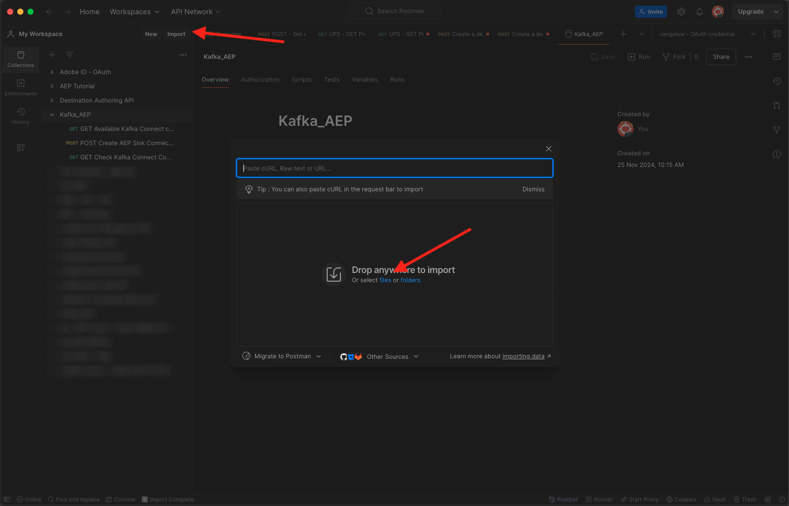
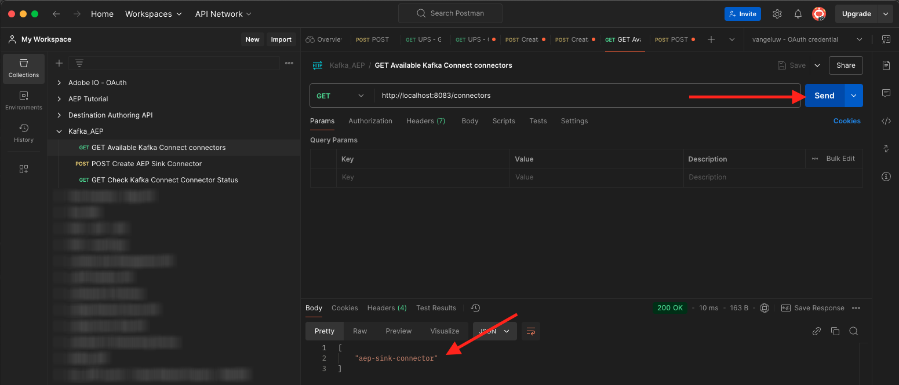

# 2.6.4安裝並設定Kafka Connect和Adobe Experience Platform接收器聯結器

## 下載Adobe Experience Platform接收器聯結器

移至[https://github.com/adobe/experience-platform-streaming-connect/releases](https://github.com/adobe/experience-platform-streaming-connect/releases)並下載Adobe Experience Platform接收器聯結器的最新正式版本。


下載檔案&#x200B;**streaming-connect-sink-0.0.27-java-11.jar**。


將下載檔案&#x200B;**streaming-connect-sink-0.0.27-java-11.jar**&#x200B;放到您的案頭上。


## 設定Kafka Connect

移至案頭上名為&#x200B;**Kafka_AEP**&#x200B;的資料夾，並導覽至資料夾`kafka_2.13-3.9.0/config`。
在該資料夾中，使用任何文字編輯器開啟檔案&#x200B;**connect-distributed.properties**。


在文字編輯器中，移至第34和35行，並確定將欄位`key.converter.schemas.enable`和`value.converter.schemas.enable`設定為`false`

```json
key.converter.schemas.enable=false
value.converter.schemas.enable=false
```

將變更儲存至此檔案。


接著，返回資料夾`kafka_2.13-3.1.0`並手動建立新資料夾，然後將其命名為`connectors`。


在新資料夾上按一下滑鼠右鍵，然後按一下&#x200B;**在資料夾**&#x200B;新增終端機。


您將會看到此訊息。 輸入命令`pwd`以擷取該資料夾的完整路徑。 選取完整路徑並將其複製到剪貼簿。


返回文字編輯器，前往檔案&#x200B;**connect-distributed.properties**，然後向下捲動至最後一行（熒幕擷圖中的第89行）。 您應該取消註解以`# plugin.path=`開頭的行（移除`#`），並且應該貼上名稱為`connectors`的資料夾的完整路徑。 結果看起來應該類似這樣：

`plugin.path=/Users/woutervangeluwe/Desktop/Kafka_AEP/kafka_2.13-3.9.0/connectors`

儲存您對檔案&#x200B;**connect-distributed.properties**&#x200B;所做的變更，並關閉文字編輯器。


接著，複製您下載至名為`connectors`的資料夾的最新正式Adobe Experience Platform接收器聯結器版本。 您之前下載的檔案名稱為&#x200B;**streaming-connect-sink-0.0.27-java-11.jar**，您只需將其移至`connectors`資料夾即可。


接下來，在&#x200B;**kafka_2.13-3.9.0**&#x200B;資料夾的層級開啟新的「終端機」視窗。 以滑鼠右鍵按一下該資料夾，然後按一下&#x200B;**資料夾的新終端機**。

在[終端機]視窗中，貼上此命令： `bin/connect-distributed.sh config/connect-distributed.properties`並按一下&#x200B;**Enter**。 這個指令會啟動Kafka Connect並載入Adobe Experience Platform接收器聯結器的程式庫。


幾秒後，您會看到類似以下畫面：


## 使用Postman建立Adobe Experience Platform接收器聯結器

您現在可以使用Postman與Kafka Connect互動。 若要這樣做，請下載[此Postman集合](./../../../../assets/postman/postman_kafka.zip)，並將其解壓縮至案頭上的本機電腦。 然後，您會擁有名為`Kafka_AEP.postman_collection.json`的檔案。


您需要在Postman中匯入此檔案。 若要這麼做，請開啟Postman，按一下&#x200B;**匯入**，將檔案`Kafka_AEP.postman_collection.json`拖放到快顯視窗中，然後按一下&#x200B;**匯入**。



之後，您會在Postman的左側功能表中找到此集合。 按一下第一個要求&#x200B;**GET Available Kafka Connect聯結器**&#x200B;以開啟它。


您將會看到此訊息。 按一下藍色的&#x200B;**傳送**&#x200B;按鈕，之後您應該會看到空白回應`[]`。 空白回應是因為目前未定義任何Kafka Connect聯結器。


若要建立聯結器，請按一下以開啟Kafka集合中的第二個要求，**POST建立AEP接收器聯結器**，並移至&#x200B;**內文**。 您將會看到此訊息。 在第11行，上面顯示&#x200B;**&quot;aep.endpoint&quot;：&quot;**，您需要貼入您在前一個練習結束時收到的HTTP API串流端點URL。 HTTP API串流端點URL看起來像這樣： `https://dcs.adobedc.net/collection/63751d0f299eeb7aa48a2f22acb284ed64de575f8640986d8e5a935741be9067`。


貼上要求後，其內文看起來應該像這樣。 按一下藍色的&#x200B;**傳送**&#x200B;按鈕以建立您的聯結器。 建立聯結器後，您會立即收到回應。


按一下第一個要求&#x200B;**GET Available Kafka Connect connectors**，再次開啟該要求，然後按一下藍色的&#x200B;**傳送**&#x200B;按鈕。 您現在會看到Kafka Connect聯結器存在。



接著，開啟Kafka集合中的第三個要求&#x200B;**GET Check Kafka Connect Connector Status**。 按一下藍色的&#x200B;**傳送**&#x200B;按鈕，您將會收到如下所示的回應，表示聯結器正在執行。


## 產生體驗事件

開啟新的&#x200B;**終端機**&#x200B;視窗，方法是用滑鼠右鍵按一下資料夾&#x200B;**kafka_2.13-3.9.0**，然後按一下&#x200B;**資料夾中的新終端機**。


輸入下列命令：

`bin/kafka-console-producer.sh --broker-list 127.0.0.1:9092 --topic aep`

您將會看到此訊息。 按下Enter按鈕後每新增一行，就會傳送新訊息至主題&#x200B;**aep**。


您現在可以傳送訊息，訊息會由Adobe Experience Platform接收器聯結器使用，並即時擷取到Adobe Experience Platform中。

取得以下體驗事件裝載範例，並將其複製到文字編輯器中。

```json
{
  "header": {
    "datasetId": "61fe23fd242870194a6d779c",
    "imsOrgId": "--aepImsOrgID--",
    "source": {
      "name": "Launch"
    },
    "schemaRef": {
      "id": "https://ns.adobe.com/experienceplatform/schemas/b0190276c6e1e1e99cf56c99f4c07a6e517bf02091dcec90",
      "contentType": "application/vnd.adobe.xed-full+json;version=1"
    }
  },
  "body": {
    "xdmMeta": {
      "schemaRef": {
        "id": "https://ns.adobe.com/experienceplatform/schemas/b0190276c6e1e1e99cf56c99f4c07a6e517bf02091dcec90",
        "contentType": "application/vnd.adobe.xed-full+json;version=1"
      }
    },
    "xdmEntity": {
      "eventType": "callCenterInteractionKafka",
      "_id": "",
      "timestamp": "2024-11-25T09:54:12.232Z",
      "_experienceplatform": {
        "identification": {
          "core": {
            "phoneNumber": ""
          }
        },
        "interactionDetails": {
          "core": {
            "callCenterAgent": {
              "callID": "Support Contact - 3767767",
              "callTopic": "contract",
              "callFeeling": "negative"
            }
          }
        }
      }
    }
  }
}
```

您將會看到此訊息。 您必須手動更新2個欄位：

- **_id**：請將其設為隨機識別碼，例如`--aepUserLdap--1234`
- **timestamp**：將時間戳記更新為目前的日期和時間
- **phoneNumber**：輸入先前在示範網站上建立之帳戶的phoneNumber。 您可以在「設定檔檢視器」面板的&#x200B;**身分**&#x200B;下找到它。

您也需要檢查並可能更新這些欄位：

- **datasetId**：您必須複製資料集示範系統的資料集ID — 客服中心的事件資料集（全域v1.1）


- **imsOrgID**：您的IMS組織ID為`--aepImsOrgId--`

>[!NOTE]
>
>每個資料擷取的欄位&#x200B;**_id**&#x200B;必須是唯一的。 如果您產生多個事件，請確定您每次都會將欄位&#x200B;**_id**&#x200B;更新為新的唯一值。

之後，您應該會有類似以下的專案：


接下來，將您的完整體驗事件複製到剪貼簿。 需要清除JSON裝載的空白處，我們將使用線上工具執行此操作。 請移至[http://jsonviewer.stack.hu/](http://jsonviewer.stack.hu/)進行此操作。

將您的體驗事件貼到編輯器中，然後按一下&#x200B;**移除空白字元**。


接著，選取所有輸出文字，並將其複製到剪貼簿。


返回「終端機」視窗。


將不含空格的新裝載貼到「終端機」視窗中，然後按一下&#x200B;**Enter**。


接著，返回示範網站並重新整理頁面。 您現在應該會在&#x200B;**體驗事件**&#x200B;底下您的設定檔看到一個體驗事件，就像下列專案一樣：


>[!NOTE]
>
>如果您希望客服中心互動顯示在「設定檔檢視器」面板上，您必須在[https://dsn.adobe.com](https://dsn.adobe.com)上的專案中新增以下標籤和篩選，方法是前往&#x200B;**設定檔檢視器**&#x200B;索引標籤，並在&#x200B;**事件**&#x200B;下新增一行，並使用這些變數：
>- **事件型別標籤**：客服中心互動
>- **事件型別篩選器**： callCenterInteractionKafka
>- **標題**： `--aepTenantId--.interactionDetails.core.callCenterAgent.callID`


您已完成此練習。

## 後續步驟

移至[摘要與優點](./summary.md){target="_blank"}

返回[將資料從Apache Kafka串流到Adobe Experience Platform](./aep-apache-kafka.md){target="_blank"}

返回[所有模組](./../../../../overview.md){target="_blank"}
