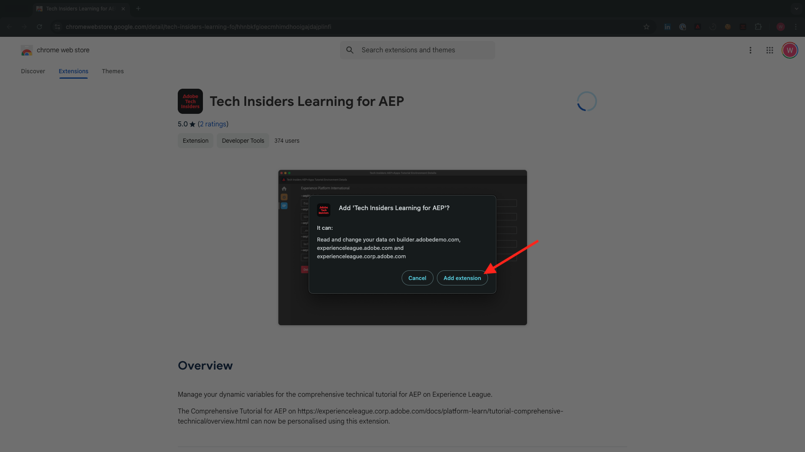
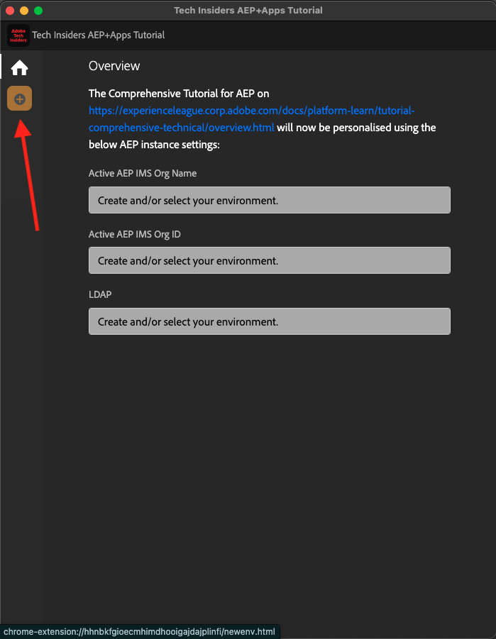
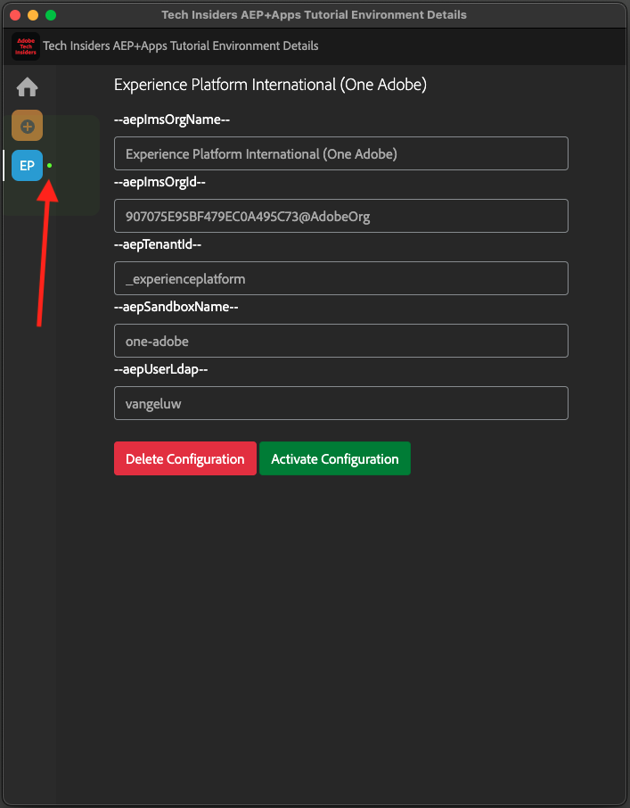

# 安裝適用於Experience League檔案的Chrome擴充功能

## 關於Chrome擴充功能

本教學課程已改成通用版，任何人都能輕鬆重複使用，使用任何Adobe Experience Cloud例項。

為了讓檔案可重複使用，教學課程中引進了&#x200B;**環境變數**，這表示您會在檔案中找到以下&#x200B;**預留位置**。 每個預留位置都是特定環境的特定變數，Chrome擴充功能會變更該變數，方便您從教學課程頁面復製程式碼和文字，並將其貼到您將當作教學課程一部分使用的各種使用者介面中。

您可在下方找到這類值的範例。 目前，這些值尚無法使用，但當您安裝並啟動Chrome擴充功能時，就會看到這些變數變數變更為您可複製並重複使用的正常文字。

| 名稱 | 索引鍵 | 範例 |
|:-------------:| :---------------:| :---------------:|
| IMS 組織 ID | `--aepImsOrgId--` | `907075E95BF479EC0A495C73@AdobeOrg` |
| IMS組織名稱 | `--aepImsOrgName--` | `Adobe Tech Insiders` |
| AEP租使用者ID | `--aepTenantId--` | `_experienceplatform` |
| AEP沙箱名稱 | `--aepSandboxName--` | `one-adobe` |
| 學習者設定檔LDAP | `--aepUserLdap--` | `vangeluw` |

例如，在下方熒幕擷圖中，您可以看到`aepImsOrgName`的參考。

安裝擴充功能後，相同的文字會自動變更，以反映執行個體特定的值。

## 安裝Chrome擴充功能

若要安裝該Chrome擴充功能，請開啟Chrome瀏覽器，並移至： [https://chromewebstore.google.com/detail/tech-insiders-learning-fo/hhnbkfgioecmhimdhooigajdajplinfi](https://chromewebstore.google.com/detail/tech-insiders-learning-fo/hhnbkfgioecmhimdhooigajdajplinfi){target="_blank"}。 您將會看到此訊息。

按一下&#x200B;**新增至Chrome**。

您將會看到此訊息。 按一下&#x200B;**新增擴充功能**。

隨後將安裝擴充功能，而您會看到類似通知。

在&#x200B;**擴充功能**&#x200B;功能表中，按一下&#x200B;**拼圖片段**&#x200B;圖示，並將&#x200B;**Platform Learn - Configuration**&#x200B;擴充功能釘選至擴充功能表。

## 設定Chrome擴充功能

前往[https://experienceleague.adobe.com/zh-hant/docs/platform-learn/tutorial-comprehensive-technical/overview](https://experienceleague.adobe.com/zh-hant/docs/platform-learn/tutorial-comprehensive-technical/overview){target="_blank"}，然後按一下擴充功能圖示以開啟。

然後您會看到此快顯視窗。 按一下&#x200B;**+**&#x200B;圖示。

如以下指示，輸入與您的Adobe Experience Platform執行個體相關的值。

如果您要參加以下其中一個活動，請使用以下所示的值。

| 名稱 | 新奧爾良合作夥伴技術實驗室 | 技術業內人士現場研討會 | 技術內部人員隨選啟用 |
|:-------------:| :---------------:| :---------------:|:---------------:|
| IMS 組織 ID | `907075E95BF479EC0A495C73@AdobeOrg` | `907075E95BF479EC0A495C73@AdobeOrg` | `0B6930256441790E0A495FFE@AdobeOrg` |
| IMS組織名稱 | `Adobe Tech Insiders` | `Adobe Tech Insiders` | `CXO Enablement Training LAB` |
| AEP租使用者ID | `_experienceplatform` | `_experienceplatform` | `_acsultimatesupport` |
| AEP沙箱名稱 | `one-adobe` | `one-adobe` | `one-adobe` |
| 學習者設定檔LDAP | `XXX` | `XXX` | `XXX` |

**您的學習者設定檔LDAP**

這是將用於教學課程的使用者名稱。 在此範例中，LDAP是以此使用者的電子郵件地址為基礎。 如果電子郵件地址是&#x200B;**vangeluw@adobe.com**，LDAP會變成&#x200B;**vangeluw**。

如果您正在參加新奧爾良的Partner Tech Labs活動，請套用相同的邏輯，並使用電子郵件地址的第一部分作為LDAP。

LDAP可用來確保您即將進行的設定會連結至您，而不會與可能使用您所使用的相同例項和沙箱的其他使用者衝突。

您的值應該看起來類似這些。
最後，按一下&#x200B;**新建**。

在擴充功能的左側功能表中，您現在會看到環境縮寫的新圖示。 按一下它。 然後您會看到&#x200B;**環境變數**&#x200B;和您的特定Adobe Experience Platform執行個體值之間的對應。 按一下&#x200B;**啟動設定**。

啟用設定後，您的環境縮寫旁會出現一個綠色圓點。 這表示您的環境現在處於作用中狀態。

## 驗證教學課程內容

作為測試，請移至[此頁面](https://experienceleague.adobe.com/zh-hant/docs/platform-learn/tutorial-one-adobe/agents/agents1/ex1){target="_blank"}。

您現在應該會看到，根據Chrome擴充功能中啟用的環境，此頁面上的所有&#x200B;**環境變數**&#x200B;都已取代為其True值。

您現在應該有類似下列的檢視，其中環境變數`aepSandboxName`已由您的實際AEP沙箱名稱取代，在此案例中是&#x200B;**one-adobe**。

## 後續步驟

移至[要安裝的應用程式](./ex2.md){target="_blank"}

返回[快速入門 — Agentic AI](./getting-started-agentic-ai.md){target="_blank"}

返回[所有模組](./../../../overview.md){target="_blank"}
