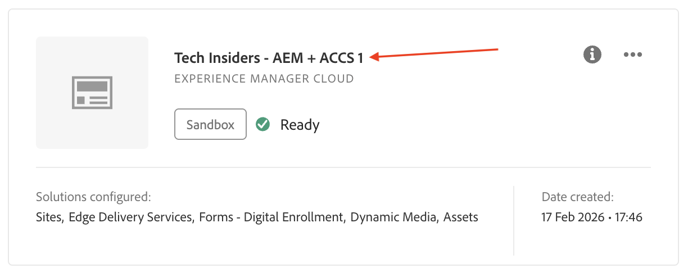
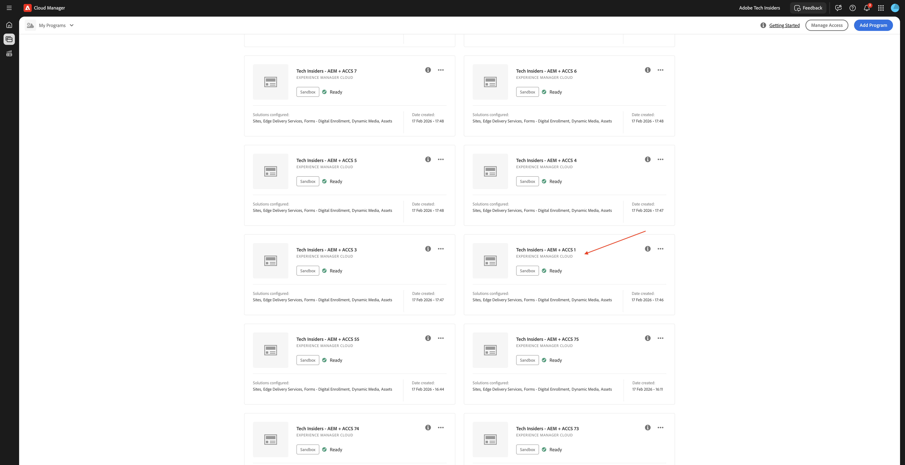
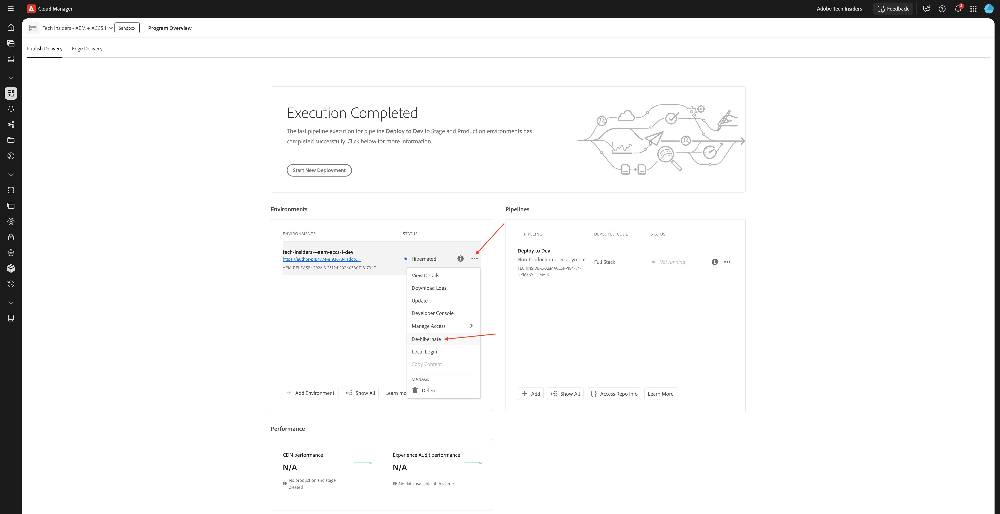
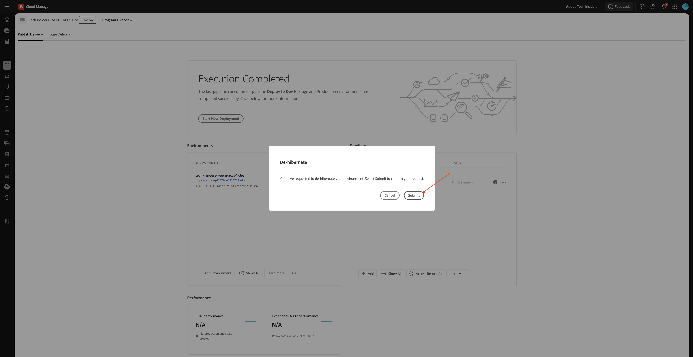

# 使用您的AEM網站和AEP沙箱

參加Agentic AI Tech Labs時，您將使用Edge Delivery Services的現有的AEM as a Cloud Service計畫。 這個使用Edge Delivery Services的AEM as a Cloud Service計畫已經為您建立，並且在Tech Labs開始時即可使用。

## 您的號碼

當您存取啟用環境時，會為您指派一個數字。 此數字代表您需要使用哪個AEM as a Cloud Service程式，也代表您需要為Brand Concierge Tech Lab使用哪個AEP沙箱。

>[!IMPORTANT]
>
>如果您尚未收到此電子郵件，則無法執行下列步驟。 您必須等到收到下列電子郵件之後，才能存取下列Adobe應用程式。

## 您的AEM程式

>[!NOTE]
>
>以下所有熒幕擷取畫面均使用數字1僅供說明之用。 您必須使用指派給您的號碼，作為您進行以下步驟時收到之電子郵件的一部分。

您的AEM程式會使用其名稱中指派給您的編號。 您的AEM程式名稱應該是：

- **技術內部人士 — AEM + ACCS X**&#x200B;其中X代表指派給您的數字。

您可以前往[https://experience.adobe.com/cloud-manager/landing.html](https://experience.adobe.com/cloud-manager/landing.html)存取並尋找您的AEM程式。 請確認選取的環境為&#x200B;**`--aepImsOrgName--`**，您可以在熒幕的右上角確認此專案。

### 解除您的AEM程式休眠

使用的AEM程式是「沙箱」程式。 AEM沙箱在數小時未使用後會自動休眠，這表示您需要在使用沙箱之前解除沙箱的休眠。 若要解除程式休眠，請移至[https://experience.adobe.com/cloud-manager/landing.html](https://experience.adobe.com/cloud-manager/landing.html)。 按一下以開啟您的程式。

您應該會看到此訊息。 按一下3個點&#x200B;**...**，然後選取&#x200B;**解除休眠**。

按一下&#x200B;**提交**。 解除休眠需要10-15分鐘。

### 您的AEM程式的GitHub存放庫

每個AEM程式都會使用Edge Delivery Services來部署您的網站。 這表示您網站的程式碼託管在GitHub存放庫中。 已為您建立GitHub存放庫，並可前往以下網址存取：

**https://github.com/woutervangeluwe/techinsidersX-citisignal-aem-accs**，您必須用您的號碼取代X。

您的GitHub存放庫應如下所示。

在技術實驗室課程開始前的入門流程中，系統會要求您提供GitHub使用者名稱。 提供GitHub使用者名稱后，您就會成為附加至網站的GitHub存放庫的共同作業人員，以便進行變更。

### 存取您的網站

若要存取您的網站，您可以使用下列預設URL：

- **https://main--techinsidersX-citisignal-aem-accs--woutervangeluwe.aem.page/**
- **https://main--techinsidersX-citisignal-aem-accs--woutervangeluwe.aem.live/**

您需要用指派給您的號碼取代這些URL中的X。

此外，已為每個網站建立自訂網域名稱，您可以使用此URL存取該網域名稱：

- **https://techinsidersX.adobedemosystem.com/**

您需要用指派給您的號碼取代這些URL中的X。

接著，您應該可以看到您的網站，看起來類似以下畫面：

## 您的AEP沙箱

>[!NOTE]
>
>以下所有熒幕擷取畫面均使用數字1僅供說明之用。 您必須使用指派給您的號碼，作為您進行以下步驟時收到之電子郵件的一部分。

針對Brand Concierge技術實驗室，您需要使用特定的AEP沙箱。 此AEP沙箱的名稱為： **techinsidersX**，因此，您需要以指派給您的編號取代X。

移至[https://platform.adobe.com](https://platform.adobe.com)。 在畫面的右上角，開啟下拉式清單以選取沙箱。

您只需要將此沙箱用於Brand Concierge技術實驗室。

## 後續步驟

返回[快速入門 — Agentic AI](./getting-started-agentic-ai.md){target="_blank"}

返回[所有模組](./../../../overview.md){target="_blank"}./images
