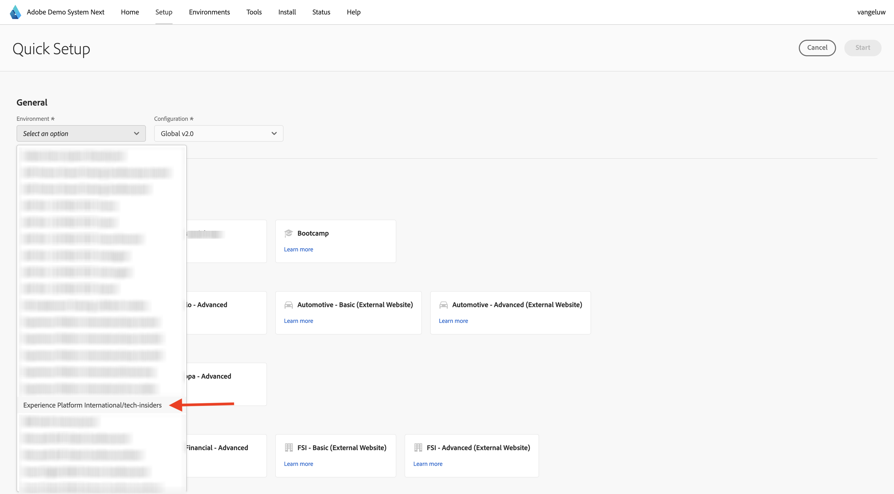

# 使用下一個示範系統來設定您的Adobe Experience Platform資料收集使用者端屬性

為了將本教學課程中的學習內容視覺化，並讓您能夠在安全的環境中測試您的設定，本教學課程使用Adobe的示範系統下一步工具。 為了充分運用本教學課程，您的AEP執行個體需要設定為與示範系統整合「下一步」。

取得示範系統存取權後，請繼續下列步驟。

移至[https://dsn.adobe.com/](https://dsn.adobe.com/)並導覽至&#x200B;**安裝程式**。

在&#x200B;**環境**&#x200B;下拉式清單中，選取您的AEP執行個體和沙箱。

接著，選取預設集&#x200B;**AEP教學課程使用者**。

接著，按一下&#x200B;**開始**。

在快顯視窗中，輸入資料收集屬性和Experience Builder專案的名稱。 請使用此命名慣例： **One Adobe (DD/MM/YYYY)**。 僅供參考：您的LDAP將會自動附加，您不需要自行新增。

按一下&#x200B;**開始**。

接著您會看到這個快顯視窗，其中顯示建立網站和行動應用程式專案時的進度，以及您的資料收集屬性。

快速設定程式完成後，您將會：

- 1個web專案，讓您能夠搭配telco示範品牌使用示範網站
- 1個行動應用程式專案，讓您能透過telco示範品牌使用示範行動應用程式
- 1 CX應用程式專案，讓您能夠搭配telco示範品牌使用客服中心應用程式
- 1個網頁的資料收集屬性，您會使用這個屬性來收集網站的資料
- 1行動裝置的資料收集屬性，您可用來從行動應用程式收集資料

將此畫面保持開啟狀態，以備您後續步驟所需。

## 後續步驟

移至[建立您的資料流](./ex3.md)

返回[快速入門](./getting-started.md){target="_blank"}

返回[所有模組](./../../../overview.md){target="_blank"}