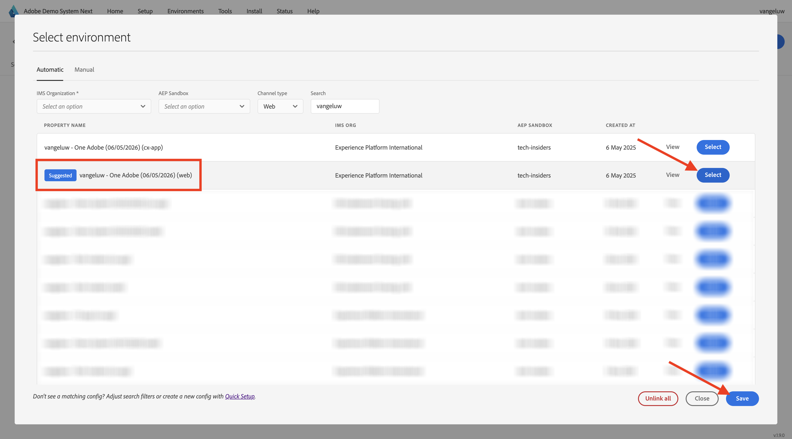

# 使用網站

## 選項1：繼續上一個練習

>[!NOTE]
>
>如果您不再開啟下列畫面，請改為前往選項2。

在上一個練習之後，您得到了此結果。 按一下以開啟為您建立的&#x200B;**Web Telco專案**。

您將會看到此訊息。 按一下&#x200B;**整合**。

在&#x200B;**整合**&#x200B;頁面上，您必須選取在上一個練習中建立的資料收集屬性。 若要這麼做，請按一下&#x200B;**選取環境**。

在上一步建立的資料收集屬性（名為`--aepUserLdap-- - Demo System (DD/MM/YYYY) (web)`）上按一下&#x200B;**選取**。 按一下&#x200B;**儲存**。

您將會看到此訊息。 按一下&#x200B;**執行**&#x200B;以開啟示範網站。

然後您會看到示範網站已開啟。 選取URL並將其複製到剪貼簿。

開啟新的無痕瀏覽器視窗。

貼上您在上一步中複製的示範網站URL。 接著，系統會要求您使用Adobe ID登入。

選取您的帳戶型別並完成登入程式。

接著，您會在無痕瀏覽器視窗中看到您的網站已載入。 對於每個示範，您都需要使用全新的無痕瀏覽器視窗來載入您的示範網站URL。

## 選項2：從新的無痕瀏覽器視窗開始

如果您不小心關閉了瀏覽器視窗，或是在未來的工作階段中，您也可以前往[https://dsn.adobe.com/](https://dsn.adobe.com/)存取您的網站專案。 使用Adobe ID登入後，您會看到此訊息。 按一下您的網站專案上的3個點&#x200B;**...**，然後按一下&#x200B;**編輯**。

您現在可以依照以下流程存取網站。 按一下&#x200B;**整合**。

在&#x200B;**整合**&#x200B;頁面上，您必須選取在上一個練習中建立的資料收集屬性。 若要這麼做，請按一下&#x200B;**選取環境**。

在上一步建立的資料收集屬性（名為`--aepUserLdap - Demo System (DD/MM/YYYY) (web)`）上按一下&#x200B;**選取**。

您將會看到此訊息。 按一下&#x200B;**執行**&#x200B;以開啟示範網站。

然後您會看到示範網站已開啟。 選取URL並將其複製到剪貼簿。

開啟新的無痕瀏覽器視窗。

貼上您在上一步中複製的示範網站URL。 接著，系統會要求您使用Adobe ID登入。

選取您的帳戶型別並完成登入程式。

接著，您會在無痕瀏覽器視窗中看到您的網站已載入。 對於每個示範，您都需要使用全新的無痕瀏覽器視窗來載入您的示範網站URL。

下一步： [使用行動應用程式](./ex5.md)

[返回快速入門](./getting-started.md)

[返回所有模組](./../../../overview.md)
