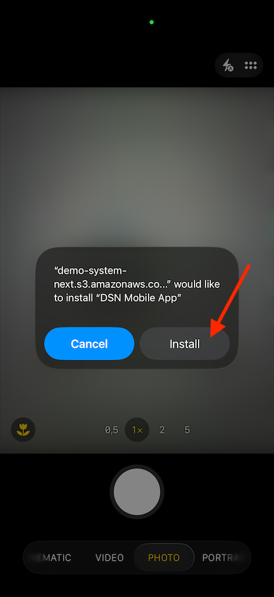

# 使用行動應用程式

## 下載應用程式

在電腦上移至[https://dsn.adobe.com/install](https://dsn.adobe.com/install){target="_blank"}，然後移至&#x200B;**Beta版本**。 使用您的Adobe ID登入，您將會看到此訊息。

在智慧型手機上使用&#x200B;**攝影機**&#x200B;應用程式，為裝置的作業系統安裝行動應用程式。 若要啟用此功能，您必須安裝使用Adobe Experience Platform Mobile SDK的&#x200B;**0.6.1** （或更新版本）。

>[!NOTE]
>
>在iOS裝置上首次安裝應用程式後，嘗試開啟應用程式時可能會收到錯誤訊息，顯示： **不受信任的企業開發人員**。 若要修正此問題，您必須前往&#x200B;**設定>一般> VPN與裝置管理> Adobe Systems Inc.**，然後按一下&#x200B;**信任Adobe Systems Inc.**。

掃描QR碼後，選取&#x200B;**安裝**。

應用程式安裝後，您會在裝置的主畫面上找到。 按一下圖示以開啟應用程式。

登入後，您會看到通知要求您傳送通知的許可權。 我們將在教學課程中傳送通知，因此請按一下[允許]。**&#x200B;**

然後您會看到應用程式的首頁。 移至&#x200B;**設定**。

在設定中，您會看到應用程式目前已載入&#x200B;**公用專案**。 按一下&#x200B;**自訂專案**。

您現在可以載入自訂專案。 按一下QR碼以輕鬆載入您的專案。

在上一個練習之後，您得到了此結果。 按一下以開啟為您建立的&#x200B;**行動Edge Telco專案**。

如果您不小心關閉了瀏覽器視窗，或是為了未來的示範或啟用工作階段，您也可以前往[https://dsn.adobe.com](https://dsn.adobe.com){target="_blank"}存取您的網站專案。 使用Adobe ID登入後，您會看到此訊息。 按一下行動應用程式專案上的三個點&#x200B;**...**，然後按一下&#x200B;**編輯**。

在&#x200B;**整合**&#x200B;頁面上，您必須選取在上一個練習中建立的資料收集屬性。 若要這麼做，請按一下&#x200B;**選取環境**。

在上一步建立的資料收集屬性（名為&#x200B;**）上按一下**&#x200B;選取`--aepUserLdap - One Adobe (DD/MM/YYYY) (mobile)`。 然後，按一下&#x200B;**儲存**。

您將會看到此訊息。 接著，按一下&#x200B;**執行**。

然後您會看到這個快顯視窗，其中包含QR碼。 從行動應用程式內掃描此QR碼。

然後您會看到應用程式中載入您的專案識別碼，之後您可以按一下&#x200B;**切換**。

然後您應該會看到正在載入&#x200B;**CitiSignal**&#x200B;示範品牌。 您的應用程式現在已可供使用。

## 後續步驟

移至[設定您的Adobe I/O專案](./ex6.md){target="_blank"}

返回[快速入門](./getting-started.md){target="_blank"}

返回[所有模組](./../../../overview.md){target="_blank"}