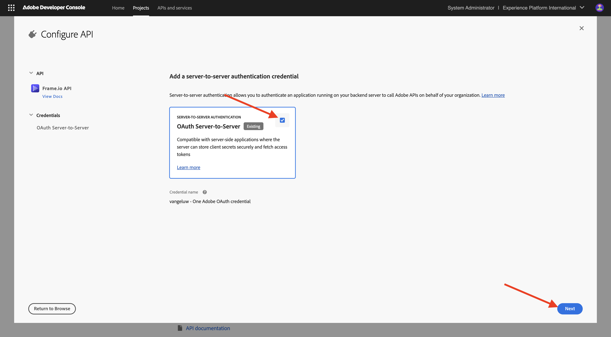

# 設定您的Adobe I/O專案

## 建立您的Adobe I/O專案

在本練習中，Adobe I/O是用來查詢各種Adobe端點。 請依照下列步驟設定Adobe I/O。

移至[https://developer.adobe.com/console/home](https://developer.adobe.com/console/home){target="_blank"}。

請務必在熒幕右上角選取正確的例項。 您的執行個體是`--aepImsOrgName--`。

>[!NOTE]
>
> 下方熒幕擷圖顯示選取的特定組織。 完成本教學課程時，您的組織很可能有不同的名稱。 當您註冊參加本教學課程時，系統已為您提供要使用的環境詳細資訊，請依照這些指示操作。

接著，選取&#x200B;**建立新專案**。

### FIREFLY SERVICES API

>[!IMPORTANT]
>
>根據您選取的學習路徑，您可能無法存取Firefly Services API。 您必須位於學習路徑&#x200B;**Firefly**、**Workfront Fusion**、**全部**，或正在參加&#x200B;**現場現場研討會**，才能存取Firefly Services API。 如果您不在其中一個學習路徑上，可以略過此步驟。

您應該會看到此訊息。 選取&#x200B;**+新增至專案**&#x200B;並選擇&#x200B;**API**。

您的熒幕應如下所示。

選取&#x200B;**Adobe Firefly Services**&#x200B;並選擇&#x200B;**Firefly - Firefly Services**，然後選取&#x200B;**下一步**。

提供認證的名稱： `--aepUserLdap-- - One Adobe OAuth credential`並選取&#x200B;**下一步**。

選取預設設定檔&#x200B;**預設Firefly Services設定**，然後選取&#x200B;**儲存設定的API**。

您應該會看到此訊息。

### PHOTOSHOP SERVICES API

>[!IMPORTANT]
>
>根據您選取的學習路徑，您可能無法存取Photoshop Services API。 您必須位於學習路徑&#x200B;**Firefly**、**Workfront Fusion**、**全部**，或正在參加&#x200B;**現場現場研討會**，才能存取Photoshop Services API。 如果您不在其中一個學習路徑上，可以略過此步驟。
>
選取&#x200B;**+新增至專案**，然後選取&#x200B;**API**。

選取&#x200B;**Adobe Firefly Services**&#x200B;並選擇&#x200B;**Photoshop - Firefly Services**。 選取&#x200B;**下一步**。

選取&#x200B;**下一步**。

接下來，您需要選取產品設定檔，以定義此整合可用的許可權。

選取&#x200B;**預設Firefly Services設定**&#x200B;和&#x200B;**預設Creative Cloud Automation Services設定**。

選取&#x200B;**儲存設定的API**。

您應該會看到此訊息。

### ADOBE EXPERIENCE PLATFORM API

>[!IMPORTANT]
>
>根據您選取的學習路徑，您可能無法存取Adobe Experience Platform API。 只有當您位於學習路徑&#x200B;**AEP + Apps**、**ALL**&#x200B;或參加&#x200B;**現場研討會**&#x200B;時，才能存取Adobe Experience Platform API。 如果您不在其中一個學習路徑上，可以略過此步驟。

選取&#x200B;**+新增至專案**，然後選取&#x200B;**API**。

選取&#x200B;**Adobe Experience Platform**&#x200B;並選擇&#x200B;**Experience Platform API**。 選取&#x200B;**下一步**。

選取&#x200B;**下一步**。

接下來，您需要選取產品設定檔，以定義此整合可用的許可權。

選取&#x200B;**Adobe Experience Platform — 所有使用者 — PROD**。

>[!NOTE]
>
>AEP的產品設定檔名稱取決於環境的設定方式。 如果您沒有看到上述產品設定檔，您可能會有名為&#x200B;**預設生產所有存取**&#x200B;的產品設定檔。 如果您不確定要選擇哪一個，請洽詢您的AEP系統管理員。

選取&#x200B;**儲存設定的API**。

您應該會看到此訊息。

### Frame.io API

>[!IMPORTANT]
>
>根據您選取的學習路徑，您可能無法存取Frame.io API。 只有當您位於學習路徑&#x200B;**Workfront Fusion**、**ALL**&#x200B;或參加&#x200B;**現場研討會**&#x200B;時，才能存取Frame.io API。 如果您不在其中一個學習路徑上，可以略過此步驟。

選取&#x200B;**+新增至專案**，然後選取&#x200B;**API**。

選取&#x200B;**Creative Cloud**&#x200B;並選擇&#x200B;**Frame.io API**。 選取&#x200B;**下一步**。

選取&#x200B;**伺服器對伺服器驗證**，然後按一下&#x200B;**下一步**。

選取&#x200B;**OAuth伺服器對伺服器**，然後按一下[下一步]**。**

接下來，您需要選取產品設定檔，以定義此整合可用的許可權。

選取&#x200B;**預設Frame.io Enterprise - Prime設定**，然後按一下&#x200B;**儲存設定的API**。

您應該會看到此訊息。

### 專案名稱

按一下您的專案名稱。

{zoomable="yes"}

選取&#x200B;**編輯專案**。

{zoomable="yes"}

為您的整合輸入好記的名稱： `--aepUserLdap-- One Adobe tutorial`並選取&#x200B;**儲存**。

{zoomable="yes"}

您的Adobe I/O專案設定現已完成。

{zoomable="yes"}

## 後續步驟

移至[選項1： Postman設定](./ex7.md){target="_blank"}

移至[選項2： PostBuster設定](./ex8.md){target="_blank"}

返回[快速入門](./getting-started.md){target="_blank"}

返回[所有模組](./../../../overview.md){target="_blank"}
