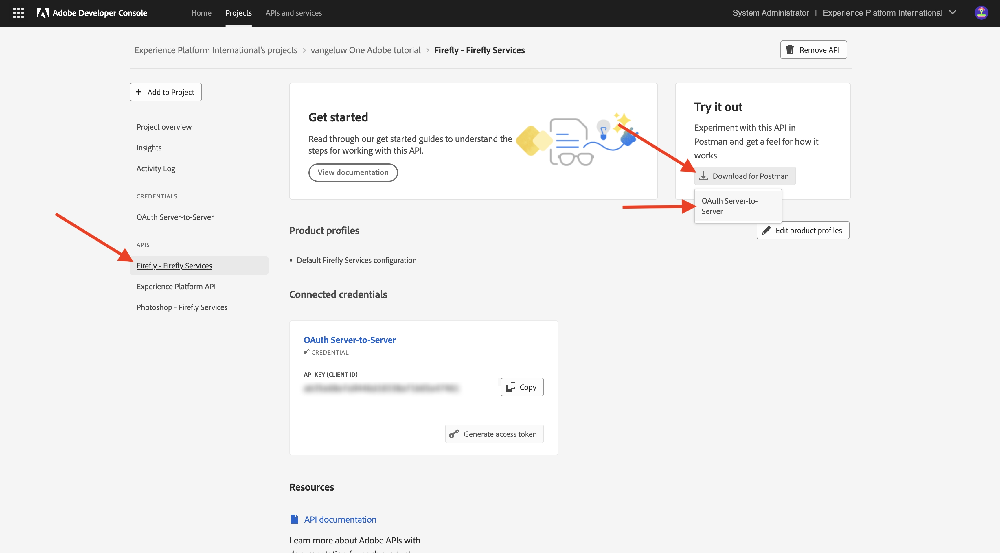
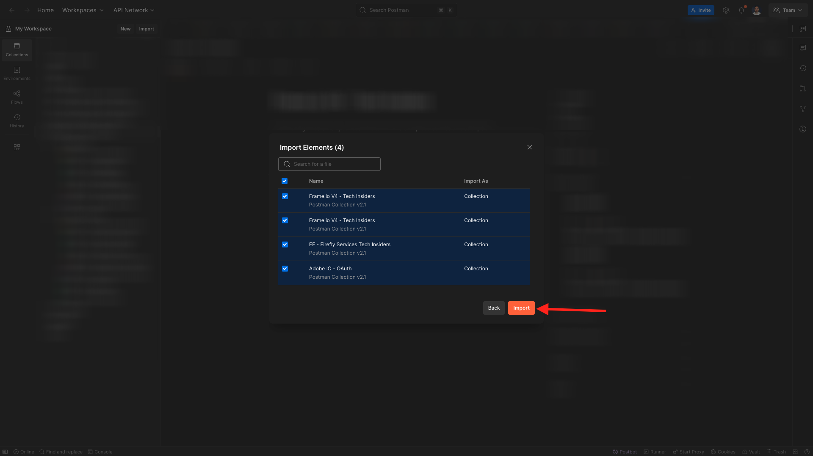

# 選項1：使用Postman

>[!IMPORTANT]
>
>如果您是Adobe員工，請依照指示[安裝PostBuster](./ex8.md){target="_blank"}！

## Postman環境下載

移至[https://developer.adobe.com/console/home](https://developer.adobe.com/console/home){target="_blank"}並開啟您的專案。

按一下&#x200B;**Firefly - Firefly Services** API。 接著，按一下「下載Postman **」，然後選擇「** OAuth伺服器對伺服器&#x200B;**」來下載Postman環境。**

## 對Adobe I/O的Postman驗證

在[Postman下載](https://www.postman.com/downloads/){target="_blank"}下載並安裝作業系統的相關Postman版本。

啟動應用程式。

Postman中有2個概念：「環境」和「集合」。

環境檔案包含您所有大致一致的環境變數。 在環境中，您可以找到Adobe環境的IMSOrg之類的專案，以及使用者端ID和其他專案之類的安全性憑證。 您先前在Adobe I/O設定期間下載了名為&#x200B;**`oauth_server_to_server.postman_environment.json`**&#x200B;的環境檔案。

集合包含許多您可使用的API請求。 您將使用下列集合：

- 1個用於驗證Adobe I/O的集合
- 1本單元中Adobe Firefly服務練習的集合
- 1本單元中Adobe Frame.io V4練習的集合

將[postman-ff.zip](./../../../assets/postman/postman-ff.zip){target="_blank"}下載到您的本機案頭。

在&#x200B;**postman-ff.zip**&#x200B;檔案中有以下檔案：

- `Adobe IO - OAuth.postman_collection.json`
- `FF - Firefly Services Tech Insiders.postman_collection.json`
- `Frame.io V4 - Tech Insiders.postman_collection.json`

解壓縮&#x200B;**postman-ff.zip**，並將下列檔案儲存在您案頭的資料夾中：

- `Adobe IO - OAuth.postman_collection.json`
- `FF - Firefly Services Tech Insiders.postman_collection.json`
- `Frame.io V4 - Tech Insiders.postman_collection.json`
- `oauth_server_to_server.postman_environment.json`

在Postman中，選取&#x200B;**匯入**。

選取&#x200B;**檔案**。

從資料夾中選擇所有檔案，然後選取&#x200B;**開啟**&#x200B;和&#x200B;**匯入**。

按一下&#x200B;**匯入**。

現在您已擁有Postman中所需的一切，可以開始透過API與Firefly Services互動。

## 要求存取權杖

接下來，為確保您經過正確驗證，您需要請求存取權杖。

請確認右上角的環境下拉式清單，在執行任何要求之前，請確定您已選取正確的環境。 所選環境的名稱應該與此環境類似，`--aepUserLdap-- One Adobe OAuth Credential`。

所選環境的名稱應該與此環境類似，`--aepUserLdap-- One Adobe OAuth Credential`。

現在您的Postman環境和集合已設定好並正常運作，您可以從Postman向Adobe I/O進行驗證。

在&#x200B;**Adobe IO - OAuth**&#x200B;集合中，選取名為&#x200B;**POST - Get Access Token**&#x200B;的要求，並選取&#x200B;**傳送**。

請注意，在&#x200B;**查詢引數**&#x200B;下，參考了兩個變數： `API_KEY`和`CLIENT_SECRET`。 這些變數是從選取的環境`--aepUserLdap-- One Adobe OAuth Credential`中取得。

如果成功，Postman的&#x200B;**內文**&#x200B;區段中會顯示包含持有人權杖、存取權杖和到期時間視窗的回應。

您應該會看到包含下列資訊的類似回應：

| 索引鍵 | 值 |
|:-------------:| :---------------:| 
| token_type | **持有人** |
| access_token | **eyJhbGciOiJSUz...** |
| expires_in | **86399** |

Adobe I/O **bearer-token**&#x200B;具有特定值（極長的access_token）和到期視窗，現在有效期為24小時。 這表示24小時後，如果您要使用Postman與Adobe API互動，必須再次執行此請求以產生新Token。

您的Postman環境現已設定完畢，可正常運作。

## 後續步驟

移至[要安裝的應用程式](./ex9.md){target="_blank"}

返回[快速入門](./getting-started.md){target="_blank"}

返回[所有模組](./../../../overview.md){target="_blank"}
