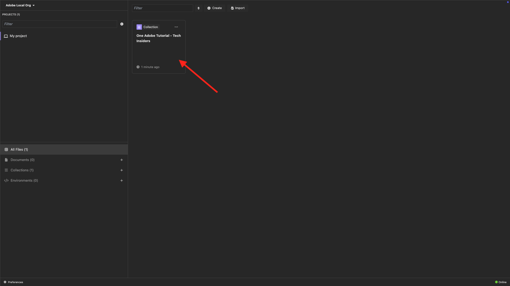
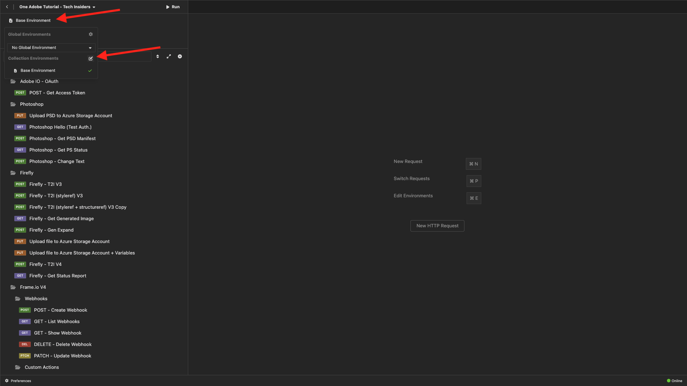
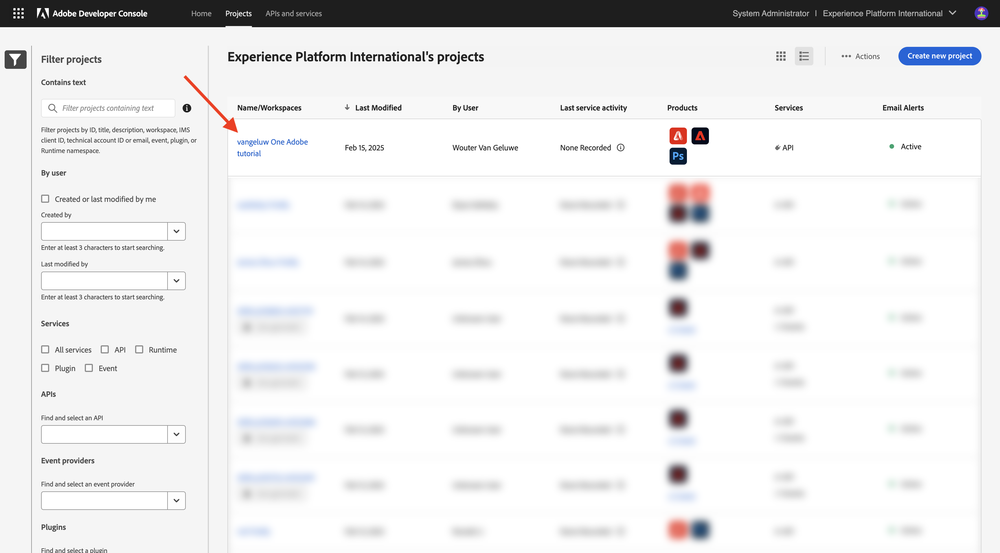
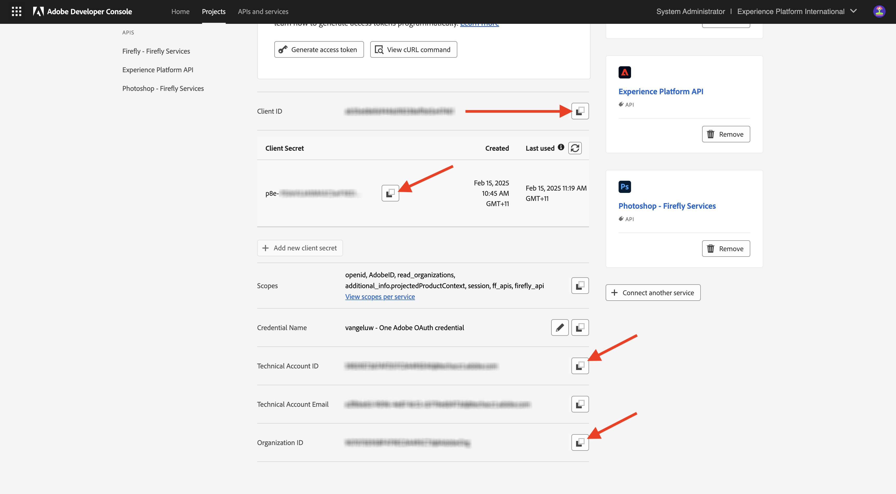

# 選項2：PostBuster設定

>[!IMPORTANT]
>
>如果您不是Adobe員工，請依照指示[安裝Postman](./ex7.md)。 以下指示僅適用於Adobe員工。 如果您已設定Postman，請略過此練習，並移至[要安裝的應用程式](./ex9.md)。

## 安裝PostBuster

移至[https://adobe.service-now.com/esc?id=adb_esc_kb_article&amp;sysparm_article=KB0020542](https://adobe.service-now.com/esc?id=adb_esc_kb_article&amp;sysparm_article=KB0020542)。

按一下以下載&#x200B;**PostBuster**&#x200B;的最新版本。


下載作業系統的正確版本。


下載完成並安裝後，請開啟PostBuster。 您應該會看到此訊息。 按一下&#x200B;**匯入**。


下載[postbuster.json.zip](./../../../assets/postman/postbuster.json.zip)並在您的案頭上解壓縮。


按一下&#x200B;**選擇檔案**。


選取檔案&#x200B;**postbuster.json**。 按一下&#x200B;**「開啟」**。


您應該會看到此訊息。 按一下&#x200B;**掃描**。


按一下&#x200B;**匯入**。


您應該會看到此訊息。 按一下以開啟匯入的集合。



現在您可以看到您的集合。 您仍需要設定環境以保留一些環境變數。


按一下「**基本環境**」，然後按一下「**編輯**」圖示。



您應該會看到此訊息。


複製下列環境預留位置，並將其貼到&#x200B;**基本環境**&#x200B;中。

```json
{
	"CLIENT_SECRET": "",
	"API_KEY": "",
	"ACCESS_TOKEN": "",
	"SCOPES": [
		"openid",
		"AdobeID",
		"read_organizations", 
		"additional_info.projectedProductContext", 
		"session",
		"ff_apis",
		"firefly_api"
	],
	"TECHNICAL_ACCOUNT_ID": "",
	"IMS": "ims-na1.adobelogin.com",
	"IMS_ORG": "",
	"access_token": "",
	"IMS_TOKEN": "",
	"AZURE_STORAGE_URL": "",
	"AZURE_STORAGE_CONTAINER": "",
	"AZURE_STORAGE_SAS_READ": "",
	"AZURE_STORAGE_SAS_WRITE": ""
}
```

然後您應該擁有此專案。


## 輸入您的Adobe I/O變數

移至[https://developer.adobe.com/console/home](https://developer.adobe.com/console/home){target="_blank"}並開啟您的專案。

{zoomable="yes"}

移至&#x200B;**OAuth伺服器對伺服器**。

{zoomable="yes"}

您現在需要從Adobe I/O專案複製下列值，並將其貼到您的PostBuster基本環境中。

- 用戶端 ID
- 使用者端密碼（按一下&#x200B;**擷取使用者端密碼**）
- 技術帳戶ID
- 組織ID （向下捲動以尋找組織ID）

{zoomable="yes"}

請逐一複製上述變數，然後在PostBuster的&#x200B;**基本環境**&#x200B;中貼上。

| Adobe I/O中的變數名稱 | PostBuster基本環境中的變數名稱 |
|:-------------:| :---------------:| 
| 用戶端 ID | `API_KEY` |
| 使用者端密碼 | `CLIENT_SECRET` |
| 技術帳戶ID | `TECHNICAL_ACCOUNT_ID` |
| 組織 ID | `IMS_ORG` |

逐一複製這些變數後，您的PostBuster基本環境應該如下所示：

{zoomable="yes"}

在&#x200B;**Adobe IO - OAuth**&#x200B;集合中，選取名為&#x200B;**POST - Get Access Token**&#x200B;的要求，並選取&#x200B;**傳送**。

您應該會看到包含下列資訊的類似回應：

| 索引鍵 | 值 |
|:-------------:| :---------------:| 
| token_type | **持有人** |
| access_token | **eyJhbGciOiJS...** |
| expires_in | **86399** |

Adobe I/O **bearer-token**&#x200B;具有特定值（極長的access_token）和到期視窗，現在有效期為24小時。 這表示24小時後，如果您要使用Postman與Adobe API互動，必須再次執行此請求以產生新Token。

{zoomable="yes"}

您的PostBuster環境現已設定完畢，可正常運作。 您現在已完成快速入門模組。

## 後續步驟

移至[要安裝的應用程式](./ex9.md){target="_blank"}

返回[快速入門](./getting-started.md){target="_blank"}

返回[所有模組](./../../../overview.md){target="_blank"}