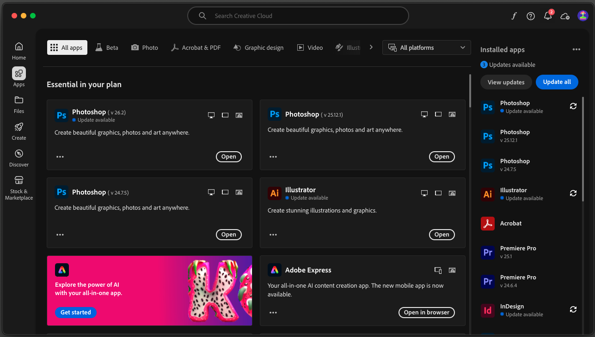
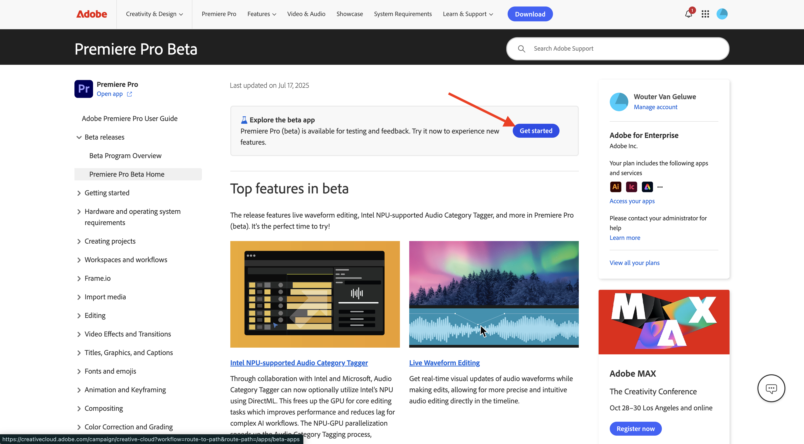

# 要安裝的應用程式

以下是啟動教學課程之前，您在電腦上需要安裝的應用程式概述。

## Adobe Creative Cloud

移至[https://creativecloud.adobe.com/apps/download/creative-cloud](https://creativecloud.adobe.com/apps/download/creative-cloud){target="_blank"}。

## Adobe Photoshop

開啟&#x200B;**Adobe Creative Cloud**&#x200B;應用程式，前往&#x200B;**應用程式**。 在電腦上安裝Photoshop。

## Adobe Illustrator

開啟&#x200B;**Adobe Creative Cloud**&#x200B;應用程式，前往&#x200B;**應用程式**。 在電腦上安裝Illustrator。

## Adobe Premiere Pro

從[https://helpx.adobe.com/premiere-pro/using/premiere-pro-beta.html](https://helpx.adobe.com/premiere-pro/using/premiere-pro-beta.html)在您的電腦上安裝Adobe Premiere Pro Beta版本

按一下&#x200B;**開啟Creative Cloud案頭應用程式**。

在&#x200B;**Premiere Pro (Beta)**&#x200B;應用程式的卡片上，按一下&#x200B;**安裝**。

## Frame.io傳輸應用程式

移至[https://frame.io/transfer](https://frame.io/transfer)下載電腦的版本。

## Visual Studio Code

移至[https://code.visualstudio.com/](https://code.visualstudio.com/){target="_blank"}，下載並安裝&#x200B;**Visual Studio Code**。

## 文字編輯器

如果您沒有文字編輯器應用程式，可以前往[https://www.sublimetext.com/](https://www.sublimetext.com/){target="_blank"}下載並安裝此文字編輯器。

## GitHub帳戶

如果您還沒有GitHub帳戶，請前往[https://github.com/](https://github.com/){target="_blank"}，然後按一下&#x200B;**註冊**。 使用您的個人電子郵件地址並建立您的帳戶。

## GitHub Desktop

移至[https://desktop.github.com/download/](https://desktop.github.com/download/){target="_blank"}，下載並安裝&#x200B;**Github案頭版**。

## Azure儲存體總管

[下載Microsoft Azure Storage Explorer以管理您的檔案](https://azure.microsoft.com/en-us/products/storage/storage-explorer#Download-4){target="_blank"}。 選取適合您特定作業系統的正確版本，下載並安裝。

{zoomable="yes"}

您現在已完成快速入門模組。

## 後續步驟

返回[快速入門](./getting-started.md){target="_blank"}

返回[所有模組](./../../../overview.md){target="_blank"}。/images
