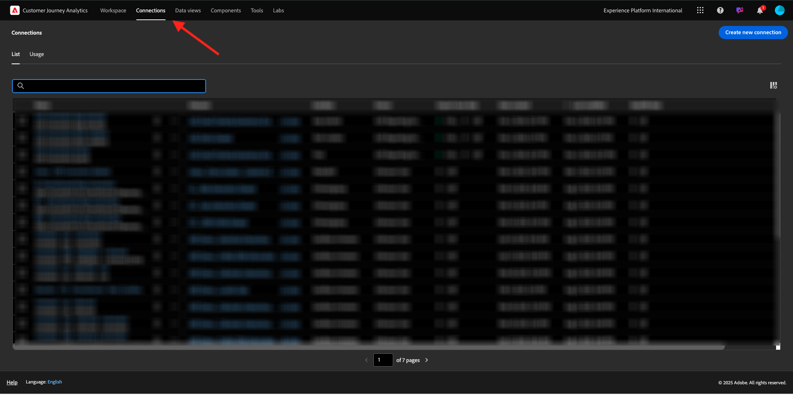

# 1.1.2在Customer Journey Analytics中連線Adobe Experience Platform資料集

## 目標

- 瞭解Data Connection UI
- 將Adobe Experience Platform資料帶入CJA
- 瞭解人員ID與資料彙整
- 瞭解Customer Journey Analytics中的資料串流的概念

## 1.1.2.1連線

前往[analytics.adobe.com](https://analytics.adobe.com)存取Customer Journey Analytics。

在Customer Journey Analytics首頁上，移至&#x200B;**連線**。

在這裡，您可以看到CJA與Platform之間建立的所有不同連線。 這些連線與Adobe Analytics中的報表套裝有相同的目標。 不過，資料的收集是完全不同的。 所有資料都來自Adobe Experience Platform資料集。

讓我們建立您的第一個連線。 按一下&#x200B;**建立新連線**。

然後您會看到&#x200B;**建立連線** UI。

您現在可以為連線命名。

請使用此命名慣例： `--aepUserLdap-- – Omnichannel Data Connection`。

您也需要選取要使用的正確沙箱。 在沙箱功能表中，選取您的沙箱，應為`--aepSandboxName--`。 在此範例中，沙箱是&#x200B;**技術內部人士**。 您也必須將&#x200B;**每日事件平均數量**&#x200B;設定為&#x200B;**小於100萬**。

選取沙箱後，您可以開始新增資料集。 按一下&#x200B;**新增資料集**。

## 1.1.2.2選取Adobe Experience Platform資料集

搜尋資料集`Demo System - Event Dataset for Website (Global v1.1)`。 啟用此資料集的方塊，以將其新增至此連線。

停留在相同的畫面中，現在搜尋並核取`Demo System - Event Dataset for Call Center (Global v1.1)`的核取方塊。

您就會擁有此專案。 按一下&#x200B;**下一步**。

## 1.1.2.3人員ID與資料彙整

### 人員 ID

目標現在是要聯結這些資料集。 對於您選取的每個資料集，您都會看到名為&#x200B;**人員ID**&#x200B;的欄位。 每個資料集都有專屬的人員ID欄位。

如您所見，其中大多數都會自動選取人員ID。 這是因為在Adobe Experience Platform的每個結構描述中都會選取主要身分。 例如，這裡是`Demo System - Event Schema for Website (Global v1.1)`的結構描述，您可以看到主要身分設定為`ecid`。

不過，您仍然可以影響要用來將連線中的資料集拼接在一起的識別碼。 您可以使用在連結至資料集的結構描述中設定的任何識別碼。 按一下下拉式清單，探索每個資料集上可用的ID。

如前所述，您可以為每個資料集設定不同的人員ID。 這可讓您在CJA中將來自多個來源的不同資料集彙整在一起。 想像一下，請引進NPS或調查資料吧，這些資料會很有趣，並且有助於瞭解背景以及某些事情為何會發生。

只要人員ID欄位中的值對應，人員ID欄位的名稱就不重要。 假設我們在一個資料集中有`email`，在另一個定義為「人員ID」的資料集中有`emailAddress`。 如果兩個資料集上的人員ID欄位的`delaigle@adobe.com`值相同，CJA將能夠拼接資料。

請在此檢閱CJA常見問題集，以瞭解身分拼接的細微差異： [常見問題集](https://experienceleague.adobe.com/docs/analytics-platform/using/cja-overview/cja-faq.html?lang=zh-Hant)。

### 使用人員ID彙整資料

現在您已瞭解使用人員ID彙整資料集的概念，接下來讓我們選擇`email`作為每個資料集的人員ID。

前往每個資料集以更新人員ID。 現在在下拉式清單中選擇`email`，填寫欄位人員ID。

一旦您彙整好這兩個資料集，您就可以繼續了。

| 資料集 | 人員 ID |
| ----------------- |-------------| 
| 示範系統 — 網站的事件資料集（全域v1.1） | 電子郵件 |
| 示範系統 — 客服中心的事件資料集（全域v1.1） | 電子郵件 |

您還需要確保針對這兩個資料集啟用以下選項：

- 匯入所有新資料
- 回填所有現有資料

（別忘了為第二個資料集啟用這兩個選項）

您還需要為每個資料集選取&#x200B;**資料來源型別**。

這些是資料集&#x200B;**示範系統 — 網站（全域v1.1）**&#x200B;的事件資料集的設定。

這些是資料集&#x200B;**示範系統 — 網站（全域v1.1）**&#x200B;的事件資料集的設定。

按一下&#x200B;**新增資料集**。

按一下&#x200B;**儲存**，然後前往下一個練習。

建立您的&#x200B;**連線**&#x200B;後，可能需要幾個小時才能在CJA中使用您的資料。

## 後續步驟

移至[1.1.3建立資料檢視](./ex3.md)(./ex2.md){target="_blank"}

返回[Customer Journey Analytics](./customer-journey-analytics-build-a-dashboard.md){target="_blank"}

返回[所有模組](./../../../../overview.md){target="_blank"}
