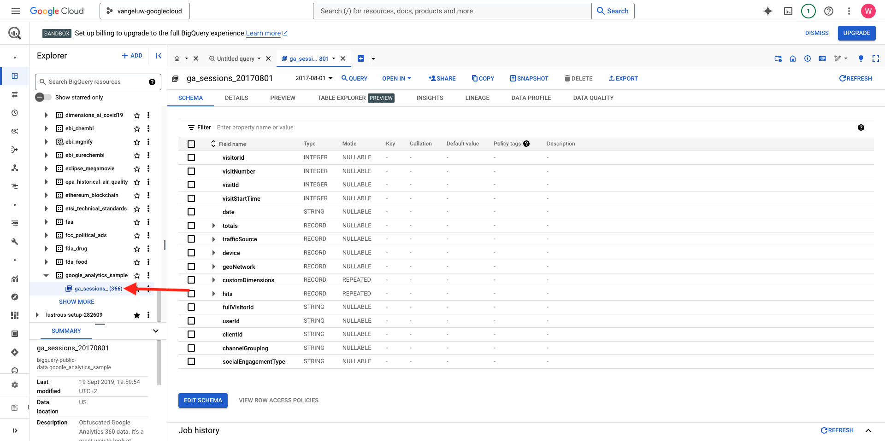

# 1.2.1開始使用Google Cloud Platform

>[!NOTE]
>
>此練習需要存取Google Cloud Platform環境。 如果您還沒有GCP的存取權，請使用您的個人電子郵件地址建立新帳戶。

## 1.2.1.1為何將Google BigQuery連線至Adobe Experience Platform以取得Google Analytics資料

Google雲端平台(GCP)是Google提供的一套公用雲端運算服務。 Google Cloud Platform包含在Google硬體上執行的一系列託管服務，用於運算、儲存和應用程式開發。

BigQuery是這些服務之一，並一律包含在Google Analytics 360中。 當我們嘗試直接從Google Analytics資料中取得資料時（例如API），便會經常對其進行取樣。 這就是為什麼Google包含BigQuery來取得未取樣資料，讓品牌可以使用SQL進行進階分析，並從GCP的強大功能中獲益。

Google Analytics資料會每天使用批次機制載入BigQuery中。 因此，將此GCP/BigQuery整合用於即時個人化和啟動使用案例沒有任何意義。

如果品牌想要根據Google Analytics資料提供即時個人化使用案例，可以透過Google Tag Manager在網站上收集該資料，然後即時將其串流至Adobe Experience Platform。

GCP/BigQuery Source Connector應該用於……

- 追蹤網站上的所有客戶行為，並在Adobe Experience Platform中載入這些資料，以利分析、資料科學和個人化使用案例，不需要即時啟用。
- 將Google Analytics歷史資料載入Adobe Experience Platform，再次用於分析和資料科學使用案例

## 1.2.1.2您的Google帳戶

>[!NOTE]
>
>此練習需要存取Google Cloud Platform環境。 如果您還沒有GCP的存取權，請使用您的個人電子郵件地址建立新帳戶。

## 1.2.1.3選取或建立專案

移至[https://console.cloud.google.com/](https://console.cloud.google.com/)。

接著，按一下&#x200B;**選取專案**&#x200B;或按一下現有專案。

如果您還沒有專案，請按一下&#x200B;**新增專案**。 如果您已經有專案，您可以選取該專案並繼續下一步驟。

依照此命名慣例為專案命名。 按一下&#x200B;**建立**。

| 慣例 |
| ----------------- |
| `--aepUserLdap---googlecloud` |

等到熒幕右上方的通知告訴您建立已完成。 然後，按一下&#x200B;**選取專案**。

接著，移至熒幕上方的搜尋列，並輸入&#x200B;**BigQuery**。 選取第一個結果。

此模組的目標是將Google Analytics資料匯入Adobe Experience Platform。 若要這麼做，您首先需要Google Analytics資料集中的虛擬資料。

按一下&#x200B;**+新增**，然後在右方功能表中按一下&#x200B;**公用資料集**。

然後您會看到此視窗：

在搜尋列中輸入搜尋字詞&#x200B;**Google Analytics範例**，然後按一下第一個搜尋結果。

您會看到下列畫面，其中包含資料集的說明。 按一下&#x200B;**檢視資料集**。

接著，系統會將您重新導向至BigQuery，您會在&#x200B;**總管**&#x200B;下看到此&#x200B;**bigquery-public-data**&#x200B;資料集。

在&#x200B;**Explorer**&#x200B;中，您現在應該會看到一些表格。 歡迎探索這些內容。 移至`google_analytics_sample`。

按一下以開啟資料表`ga_sessions`。

在繼續進行下一個練習之前，請在您電腦上的個別文字檔中寫下下列內容：

| 認證 | 命名 | 範例 |
| ----------------- |-------------| -------------|
| 專案名稱 | `--aepUserLdap---googlecloud` | vangeluw-googlecloud |
| 專案ID | random | possible-bee-447102-h3 |

按一下頂端功能表列中的您的&#x200B;**專案名稱**，即可找到您的專案名稱和專案識別碼：

您將在右側看到您的專案ID：

您現在可以移至下一個練習，透過查詢Google Analytics資料來弄髒您的雙手。

## 後續步驟

移至[1.2.2在BigQuery](./ex2.md){target="_blank"}中建立您的第一個查詢

返回[使用BigQuery Google Analytics Connector在Adobe Experience Platform中擷取和分析Source資料](./customer-journey-analytics-bigquery-gcp.md){target="_blank"}

返回[所有模組](./../../../../overview.md){target="_blank"}
