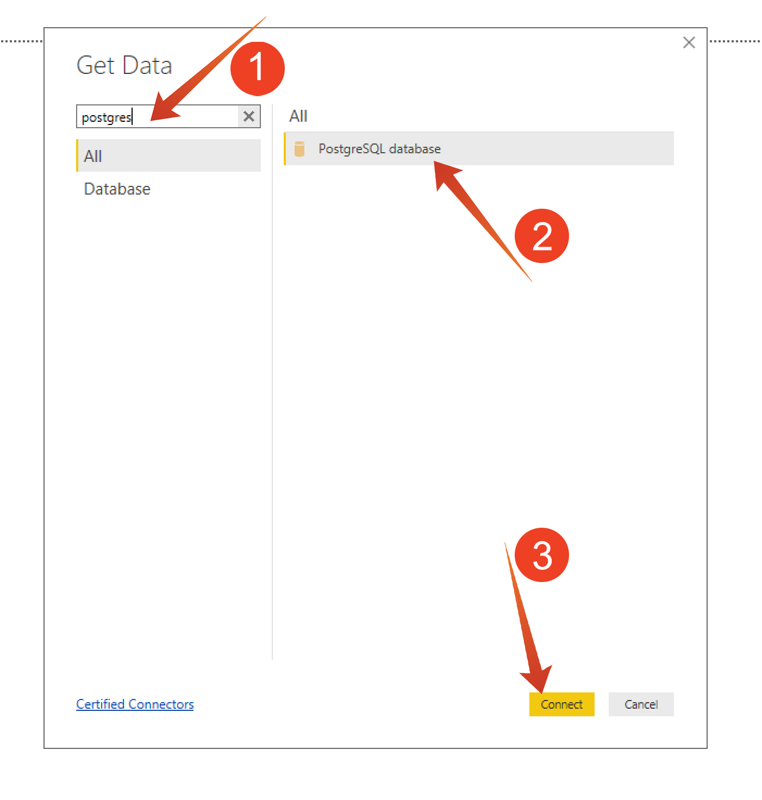

# 2.1.6查詢服務和Power BI

開啟Microsoft Power BI Desktop。

按一下&#x200B;**取得資料**。

搜尋&#x200B;**Postgres** (1)，從清單中選取&#x200B;**Postgres** (2)，然後選取&#x200B;**Connect** (3)。

移至Adobe Experience Platform、移至&#x200B;**查詢**&#x200B;和&#x200B;**認證**。

從Adobe Experience Platform的&#x200B;**認證**&#x200B;頁面，複製&#x200B;**主機**&#x200B;並將其貼到&#x200B;**伺服器**&#x200B;欄位，複製&#x200B;**資料庫**&#x200B;並將其貼到PowerBI中的&#x200B;**資料庫**&#x200B;欄位，然後按一下[確定] (2)。

>[!IMPORTANT]
>
>請確定在Server值的結尾包含連線埠&#x200B;**：80**，因為查詢服務目前未使用預設的PostgreSQL連線埠5432。

在下一個對話方塊中，在Adobe Experience Platform查詢的&#x200B;**認證**&#x200B;中找到您的使用者名稱和密碼，並填入使用者名稱和密碼。

在「導覽器」對話方塊中，將&#x200B;**LDAP**&#x200B;放入搜尋欄位(1)以找出您的CTAS資料集，並勾選每個(2)旁的方塊。 然後按一下「載入」(3)。

確定已選取&#x200B;**報告**&#x200B;標籤(1)。

選取地圖(1)，將地圖新增至報告畫布後，放大地圖(2)。

接下來，我們需要定義測量和維度，您可以從&#x200B;**欄位**&#x200B;區段將欄位拖曳到對應的預留位置（位於&#x200B;**視覺效果**&#x200B;下）來執行此操作，如下所示：

做為測量，我們將使用&#x200B;**customerId**&#x200B;的計數。 將&#x200B;**crmid**&#x200B;欄位從&#x200B;**欄位**&#x200B;區段拖曳至&#x200B;**大小**&#x200B;預留位置：

最後，若要執行一些&#x200B;**callTopic**&#x200B;分析，請將&#x200B;**callTopic**&#x200B;欄位拖曳到&#x200B;**頁面層級篩選器**&#x200B;預留位置（您可能必須捲動&#x200B;**視覺效果**&#x200B;區段）；

選取/取消選取要調查的&#x200B;**callTopics**：

您現在已經完成此練習。

## 後續步驟

移至[2.1.8查詢服務API](./ex8.md){target="_blank"}

返回[查詢服務](./query-service.md){target="_blank"}

返回[所有模組](./../../../../overview.md){target="_blank"}
