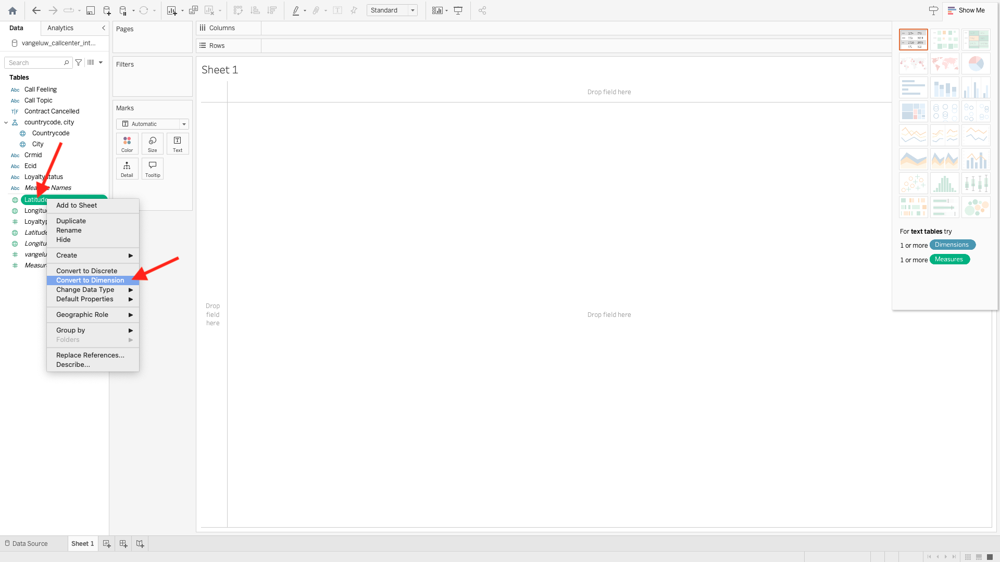

# 2.1.7查詢服務和Tableau

開啟Tableau

在&#x200B;**連線到伺服器**&#x200B;中，按一下&#x200B;**更多**，然後按一下&#x200B;**PostgreSQL**。

如果您尚未使用PostgeSQL搭配Tableau，您可能會看到這個情況。 按一下&#x200B;**下載驅動程式**。

依照指示下載並安裝PostgreSQL驅動程式。

安裝完驅動程式後，請結束並重新啟動Tableau Desktop。 重新啟動後，請再移至&#x200B;**連線到伺服器**，按一下&#x200B;**更多**，然後再次按一下&#x200B;**PostgreSQL**。

您將會看到此訊息。

移至Adobe Experience Platform、移至&#x200B;**查詢**&#x200B;和&#x200B;**認證**。

從Adobe Experience Platform的&#x200B;**認證**&#x200B;頁面，複製&#x200B;**主機**&#x200B;並將其貼到&#x200B;**伺服器**&#x200B;欄位中，複製&#x200B;**資料庫**&#x200B;並將其貼到Tableau的&#x200B;**資料庫**&#x200B;欄位中，複製&#x200B;**連線埠**&#x200B;並將其貼到Tableau的&#x200B;**連線埠**&#x200B;欄位中，對&#x200B;**使用者名稱**&#x200B;和&#x200B;**密碼**&#x200B;執行相同的操作。 接著，按一下&#x200B;**登入**。

在可用的表格清單中，找出您在上一個練習中建立的表格，稱為`--aepUserLdap--_callcenter_interaction_analysis`。 將其拖曳至畫布上。

您將會看到此訊息。 按一下&#x200B;**立即更新**。

接著，您會看到AEP中的資料在Tableau中變得可用。 按一下&#x200B;**工作表1**&#x200B;以開始處理資料。

若要在地圖上視覺化您的資料，您必須將經度和緯度轉換為維度。 在&#x200B;**測量**&#x200B;中，用滑鼠右鍵按一下&#x200B;**緯度**，在功能表中選取&#x200B;**轉換成Dimension**。 對&#x200B;**經度**&#x200B;量值執行相同操作。

將&#x200B;**Longitude**&#x200B;量值拖曳至&#x200B;**欄**，並將&#x200B;**緯度**&#x200B;量值拖曳至&#x200B;**列**。 **Belgium**&#x200B;的地圖會自動出現，並以小點表示out資料集中的城市。

選取&#x200B;**量值名稱**，按一下&#x200B;**新增至工作表**。

您現在會有一張地圖，內含各種大小的點。 大小代表該特定城市的客服中心互動次數。 若要改變點的大小，請導覽至右側面板，然後開啟&#x200B;**量值** （使用下拉式圖示）。 從下拉式清單中選取&#x200B;**編輯大小**。 玩不同大小的遊戲。

若要進一步顯示每個&#x200B;**呼叫主題**&#x200B;的資料，請將&#x200B;**呼叫主題**&#x200B;維度拖曳到&#x200B;**頁面**。 使用畫面右側的&#x200B;**通話主題**，瀏覽不同的&#x200B;**通話主題**：

您現在已經完成此練習。

## 後續步驟

移至[2.1.8查詢服務API](./ex8.md){target="_blank"}

返回[查詢服務](./query-service.md){target="_blank"}

返回[所有模組](./../../../../overview.md){target="_blank"}
