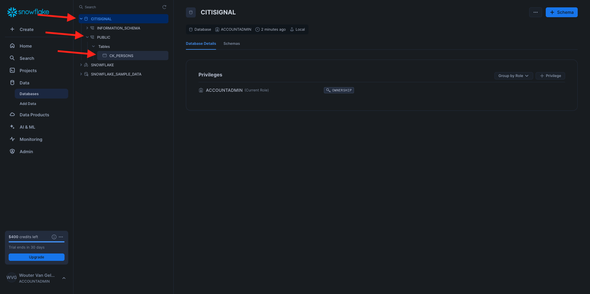

# 3.1.1設定您的Snowflake環境

## 3.1.1.1建立您的帳戶

移至[https://snowflake.com](https://snowflake.com)。 按一下&#x200B;**免費啟動**。


輸入您的詳細資料，然後按一下&#x200B;**繼續**。


輸入您的詳細資料，選擇您的雲端提供者，然後按一下&#x200B;**開始使用**。


輸入您的詳細資料，或按一下&#x200B;**略過** (x2)。


您將會看到此訊息。 檢查您的電子郵件，然後按一下傳送給您的確認電子郵件。


按一下確認電子郵件中的連結，以啟動您的帳戶、定義您的使用者名稱和密碼。 按一下&#x200B;**開始使用**。在下一個練習中，您需要使用此使用者名稱和密碼。


接著，您會登入Snowflake。 按一下&#x200B;**立即跳過**。


## 3.1.1.2建立您的資料庫

移至&#x200B;**資料>資料庫**。 按一下&#x200B;**+資料庫**。


使用資料庫的名稱&#x200B;**CITISIGNAL**。 按一下&#x200B;**建立**。


## 3.1.1.3建立您的表格

您現在可以在Snowflake中開始建立表格。 您可以在下方找到執行以建立表格的指令碼。

### 表格CK_PERSONES

按一下&#x200B;**+建立**，然後按一下&#x200B;**表格**，再按一下&#x200B;**標準**。


您將會看到此訊息。 複製以下查詢並貼上Snowflake。 在建立表格之前，請務必選取畫面左上角的&#x200B;**CITISIGNAL**&#x200B;資料庫。

```sql
create or replace TABLE CITISIGNAL.PUBLIC.CK_PERSONS (
	PERSON_ID NUMBER(38,0) NOT NULL,
	NAME VARCHAR(255),
	AGE NUMBER(38,0),
	EMAIL VARCHAR(255),
	PHONE_NUMBER VARCHAR(20),
	GENDER VARCHAR(10),
	OCCUPATION VARCHAR(100),
	ISATTMOBILESUB BOOLEAN,
	primary key (PERSON_ID)
);
```

按一下&#x200B;**建立資料表**。


執行指令碼後，您可以在&#x200B;**資料庫> CITISIGNAL > PUBLIC**&#x200B;下找到您的資料表。



### 表格CK_HOMEOUSES

按一下&#x200B;**+建立**，然後按一下&#x200B;**表格**，再按一下&#x200B;**標準**。


您將會看到此訊息。 複製以下查詢並貼上Snowflake。 在建立表格之前，請務必選取畫面左上角的&#x200B;**CITISIGNAL**&#x200B;資料庫。

```sql
create or replace TABLE CITISIGNAL.PUBLIC.CK_HOUSEHOLDS (
	HOUSEHOLD_ID NUMBER(38,0) NOT NULL,
	ADDRESS VARCHAR(255),
	CITY VARCHAR(100),
	STATE VARCHAR(50),
	POSTAL_CODE VARCHAR(20),
	COUNTRY VARCHAR(100),
	ISELIGIBLEFORFIBER BOOLEAN,
	PRIMARY_PERSON_ID NUMBER(38,0),
	ISFIBREENABLED BOOLEAN,
	primary key (HOUSEHOLD_ID)
);
```

按一下&#x200B;**建立資料表**。


執行指令碼後，您可以在&#x200B;**資料庫> CITISIGNAL > PUBLIC**&#x200B;下找到您的資料表。


### 表格CK_USERS

按一下&#x200B;**+建立**，然後按一下&#x200B;**表格**，再按一下&#x200B;**標準**。


您將會看到此訊息。 複製以下查詢並貼上Snowflake。 在建立表格之前，請務必選取畫面左上角的&#x200B;**CITISIGNAL**&#x200B;資料庫。

```sql
create or replace TABLE CITISIGNAL.PUBLIC.CK_USERS (
	USER_ID NUMBER(38,0) NOT NULL,
	PERSON_ID NUMBER(38,0),
	HOUSEHOLD_ID NUMBER(38,0),
	primary key (USER_ID),
	foreign key (PERSON_ID) references CITISIGNAL.PUBLIC.CK_PERSONS(PERSON_ID),
	foreign key (HOUSEHOLD_ID) references CITISIGNAL.PUBLIC.CK_HOUSEHOLDS(HOUSEHOLD_ID)
);
```

按一下&#x200B;**建立資料表**。


執行指令碼後，您可以在&#x200B;**資料庫> CITISIGNAL > PUBLIC**&#x200B;下找到您的資料表。


### 表格CK_MONTHLY_DATA_USAGE

按一下&#x200B;**+建立**，然後按一下&#x200B;**表格**，再按一下&#x200B;**標準**。


您將會看到此訊息。 複製以下查詢並貼上Snowflake。 在建立表格之前，請務必選取畫面左上角的&#x200B;**CITISIGNAL**&#x200B;資料庫。

```sql
create or replace TABLE CITISIGNAL.PUBLIC.CK_MONTHLY_DATA_USAGE (
	USAGE_ID NUMBER(38,0) NOT NULL autoincrement start 1 increment 1 noorder,
	USER_ID NUMBER(38,0),
	MONTH DATE,
	DATA_USAGE_GB NUMBER(10,2),
	primary key (USAGE_ID)
);
```

按一下&#x200B;**建立資料表**。


執行指令碼後，您可以在&#x200B;**資料庫> CITISIGNAL > PUBLIC**&#x200B;下找到您的資料表。


### 表格CK_MOBILE_DATA_USAGE

按一下&#x200B;**+建立**，然後按一下&#x200B;**表格**，再按一下&#x200B;**標準**。


您將會看到此訊息。 複製以下查詢並貼上Snowflake。 在建立表格之前，請務必選取畫面左上角的&#x200B;**CITISIGNAL**&#x200B;資料庫。


```sql
create or replace TABLE CITISIGNAL.PUBLIC.CK_MOBILE_DATA_USAGE (
	USAGE_ID NUMBER(38,0) NOT NULL autoincrement start 1 increment 1 noorder,
	USER_ID NUMBER(38,0),
	DATE DATE,
	TIME TIME(9),
	APP_NAME VARCHAR(255),
	DATA_USAGE_MB NUMBER(10,2),
	NETWORK_TYPE VARCHAR(50),
	DEVICE_TYPE VARCHAR(50),
	COUNTRY_CODE VARCHAR(10),
	primary key (USAGE_ID)
);
```

按一下&#x200B;**建立資料表**。


執行指令碼後，您可以在&#x200B;**資料庫> CITISIGNAL > PUBLIC**&#x200B;下找到您的資料表。


現在已建立您的所有表格。


## 3.1.1.4擷取範例資料

您現在可以開始將範例資料載入資料庫。

...

您現在已完成Snowflake中的設定。


下一步： [3.1.2建立結構描述、資料模型和連結](./ex2.md)

[返回模組3.1](./fac.md)

[返回所有模組](../../../overview.md)
