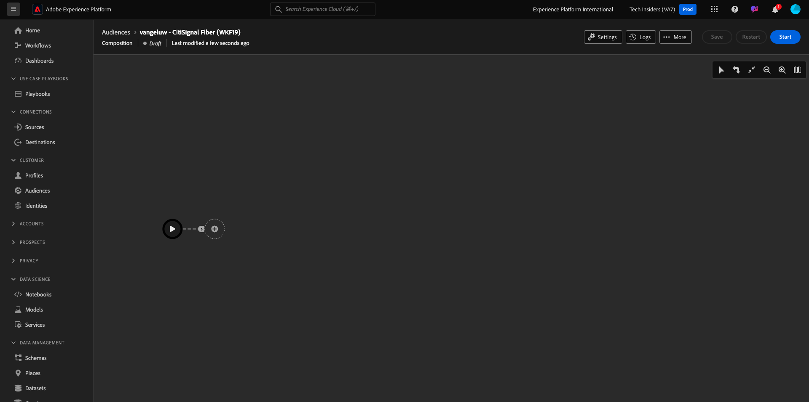
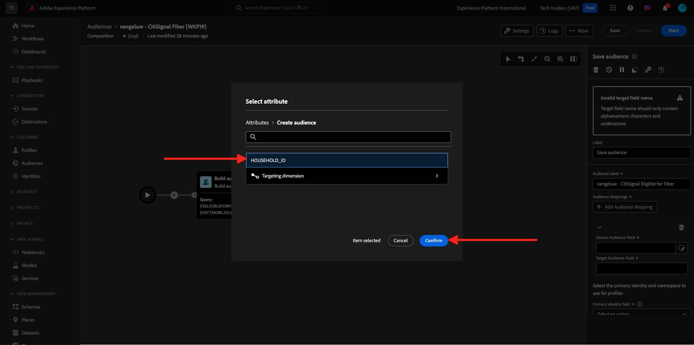

# 3.1.3建立同盟組合

您現在可以在AEP中設定同盟對象構成。

前往此URL登入Adobe Experience Platform： [https://experience.adobe.com/platform](https://experience.adobe.com/platform)。

登入後，您會登入Adobe Experience Platform的首頁。

繼續之前，您必須選取&#x200B;**沙箱**。 要選取的沙箱名為``--aepSandboxName--``。 選取適當的沙箱後，您會看到畫面變更，現在您已進入專屬沙箱。

## 3.1.3.1建立您的對象

在左側功能表中，前往&#x200B;**對象**，然後前往&#x200B;**同盟組合**。 按一下&#x200B;**建立組合**。

對於標籤，請使用這個： `--aepUserLdap-- - CitiSignal Fiber`。 選取您在上一個練習中建立的資料模型，名為`--aepUserLdap-- - CitiSignal Snowflake Data Model`。 按一下&#x200B;**建立**。

您將會看到此訊息。

按一下&#x200B;**+**&#x200B;圖示，然後按一下&#x200B;**建置對象**。

您將會看到此訊息。 選取&#x200B;**建立對象**。 按一下&#x200B;**搜尋**&#x200B;圖示以選取結構描述。

選取結構描述&#x200B;**CK_HOMETHERS**。 按一下「**確認**」。

接著，按一下[繼續]。****

您現在可以開始建立將傳送至Snowflake的查詢。 按一下&#x200B;**+**&#x200B;圖示，然後按一下&#x200B;**自訂條件**。

選取屬性&#x200B;**ISELIGIBLEFORFIBRE**&#x200B;按一下&#x200B;**確認**。

您將會看到此訊息。 將欄位&#x200B;**值**&#x200B;設定為&#x200B;**True**。 按一下&#x200B;**計算**，將查詢向下推入Snowflake，並取得目前符合資格的設定檔的估計。

然後，再按一下&#x200B;**+**&#x200B;圖示，再按一下&#x200B;**自訂條件**&#x200B;以新增另一個條件。

要新增的第二個條件是： `Is the user an existing CitiSignal Mobile subscriber?`。 要回答這個問題，請使用家庭與家庭中主要客戶之間的關係，這已在另一個資料表&#x200B;**CK_PERSONES**&#x200B;中定義。 您可以使用&#x200B;**household2person**&#x200B;連結，在屬性功能表中向下展開。

選取屬性&#x200B;**ISMOBILESUB**&#x200B;並按一下&#x200B;**確認**。

將欄位&#x200B;**值**&#x200B;設定為&#x200B;**True**&#x200B;再次按一下&#x200B;**計算**&#x200B;以更新將定位的設定檔數目。 按一下「**確認**」。

按一下&#x200B;**+**&#x200B;圖示，然後按一下&#x200B;**儲存對象**。

將&#x200B;**對象標籤**&#x200B;設為`--aepUserLdap-- - CitiSignal Eligible for Fiber`。

按一下&#x200B;**+新增對象對應**。

選取&#x200B;**HOUSEHOLD_ID**&#x200B;並按一下&#x200B;**確認**。

按一下&#x200B;**+新增對象對應**。

按一下&#x200B;**目標維度**&#x200B;以深入研究。

按一下連結&#x200B;**household2person**&#x200B;以深入分析。

選取欄位&#x200B;**名稱**。 按一下「**確認**」。

按一下&#x200B;**+新增對象對應**。

按一下&#x200B;**目標維度**&#x200B;以深入研究。

按一下連結&#x200B;**household2person**&#x200B;以深入分析。

選取欄位&#x200B;**電子郵件**。 按一下「**確認**」。

您將會看到此訊息。 您現在需要設定&#x200B;**主要身分欄位**，將其設為&#x200B;**Household2person_EMAIL**。

按一下&#x200B;**儲存**。

您的構成現已完成。 按一下&#x200B;**開始**&#x200B;執行。

現在會將查詢向下推送到Snowflake，以便在該處查詢來源資料。 結果將會推送回AEP，但來源資料仍會保留在Snowflake中。

對象現在已填入，並且可在AEP生態系統中定位對象。

下一步： [摘要與優點](./summary.md)

[返回模組3.1](./fac.md)

[返回所有模組](../../../overview.md)
