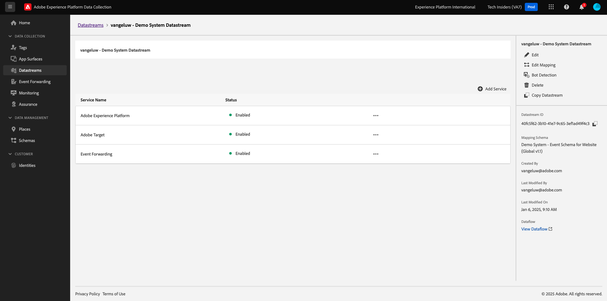
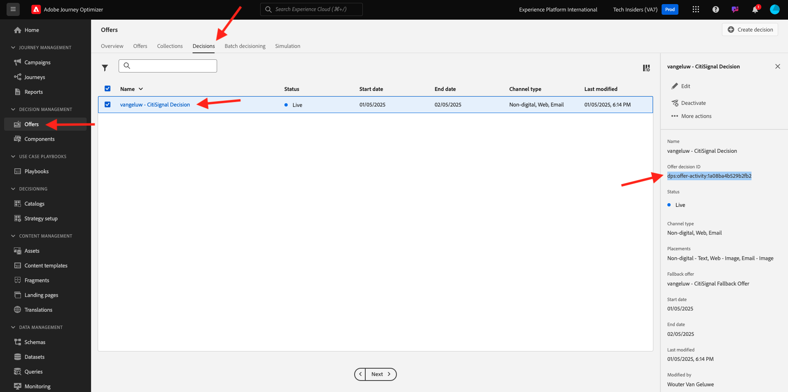

# 3.3.3準備您的Adobe Experience Platform資料收集使用者端屬性和Web SDK設定以進行Offer decisioning

## 3.3.3.1更新您的資料流

在[快速入門](./../../../modules/getting-started/gettingstarted/ex2.md)中，您已建立自己的&#x200B;**資料流**。 您接著使用名稱`--aepUserLdap-- - Demo System Datastream`。

在本練習中，您需要設定該&#x200B;**資料串流**&#x200B;以搭配&#x200B;**Offer decisioning**&#x200B;使用。

若要這麼做，請前往[https://experience.adobe.com/#/data-collection/](https://experience.adobe.com/#/data-collection/)。 您將會看到此訊息。 按一下&#x200B;**資料流**。

在熒幕的右上角，選取您的沙箱名稱，應為`--aepSandboxName--`。


搜尋您名為`--aepUserLdap-- - Demo System Datastream`的&#x200B;**資料流**。 按一下您的&#x200B;**資料流**&#x200B;以開啟。


您將會看到此訊息。 按一下&#x200B;**Adobe Experience Platform**&#x200B;旁的&#x200B;**...**，然後按一下&#x200B;**編輯**。


若要啟用&#x200B;**Offer decisioning**，請核取&#x200B;**Offer decisioning**&#x200B;的方塊。 按一下&#x200B;**儲存**。


您的&#x200B;**資料流**&#x200B;現在已準備好與&#x200B;**Offer decisioning**&#x200B;搭配使用。



## 3.3.3.2設定您的Adobe Experience Platform資料收集使用者端屬性，以要求個人化優惠

移至[https://experience.adobe.com/#/data-collection/](https://experience.adobe.com/#/data-collection/)、**標籤**。 搜尋名稱為`--aepUserLdap-- - Demo System (DD/MM/YYYY)`的資料收集屬性。 開啟Web的資料收集使用者端屬性。


在您的屬性中，移至&#x200B;**規則**&#x200B;並開啟規則&#x200B;**頁面檢視**。


按一下以開啟動作&#x200B;**傳送「頁面檢視」體驗事件**。


您將會看到此訊息。 在&#x200B;**Personalization**&#x200B;底下，您會注意到&#x200B;**範圍**&#x200B;的選項。


對於傳送至Edge和Adobe Experience Platform的每個要求，都可以提供一個或多個&#x200B;**決定範圍**。 **決定範圍**&#x200B;是兩個元素的組合：

- 決定ID
- 位置 ID

首先，讓我們看看您可在何處找到這兩個元素。

### 3.3.3.2.1擷取您的版位ID

位置ID可識別所需的位置與資產型別。 例如，CitiSignal網站首頁上的主圖影像與網頁 — 影像的版位ID相對應。

>[!NOTE]
>
>在練習2.3.5中，您已設定Adobe Target體驗鎖定目標活動，此活動將會變更首頁上主圖位置的影像（如熒幕擷取畫面所示）。 在本練習中，您將會讓您的選件顯示在主圖影像下方的影像中，如熒幕擷取畫面所示。


若要尋找網頁版位ID — 請移至[Adobe Experience Cloud](https://experience.adobe.com)，將影像移至Adobe Journey Optimizer。 按一下&#x200B;**Journey Optimizer**。

您將被重新導向到Journey Optimizer中的&#x200B;**首頁**&#x200B;檢視。 首先，確定您使用正確的沙箱。 要使用的沙箱稱為`--aepSandboxName--`。 然後您就會進入沙箱`--aepSandboxName--`的&#x200B;**首頁**&#x200B;檢視。

接著，前往「元件」，然後前往「位置」。 按一下&#x200B;**網頁 — 影像**&#x200B;位置以檢視其詳細資料。


如上圖所示，在此範例中，版位ID為`dps:offer-placement:1a08a14ccfe533b6`。 寫下您網頁版位的版位ID — 在下個練習中需要的影像。

### 3.3.3.2.2擷取您的優惠決定ID

**優惠決定ID**&#x200B;會識別您要使用的個人化優惠和遞補優惠組合。 在上一個練習中，您建立了自己的決定，並將其命名為`--aepUserLdap-- - CitiSignal Decision`。

若要尋找您`--aepUserLdap-- - CitiSignal Decision`的優惠決定ID，請移至[優惠]，然後移至[決定]。 按一下以選取名為`--aepUserLdap-- - CitiSignal Decision`的決定。



如上圖所示，在此範例中，決定ID為`dps:offer-activity:1a08ba4b529b2fb2`。 寫下您決定`--aepUserLdap-- - CitiSignal Decision`的優惠決定ID，因為您會在下一個練習中需要它。

現在您已擷取建立&#x200B;**決定範圍**&#x200B;所需的兩個元素，您可以繼續下一個步驟，包括編碼決定範圍。

### 3.3.3.2.3基底編碼

您需要輸入的&#x200B;**決定範圍**&#x200B;是BASE64編碼的字串。 此BASE64編碼字串是位置ID和決定ID的組合，如下所示：

```json
{
  "xdm:activityId": "dps:offer-activity:1a08ba4b529b2fb2",
  "xdm:placementId": "dps:offer-placement:1a08a14ccfe533b6"
}
```

您可以從Adobe Experience Platform擷取BASE64編碼字串。 前往決定，然後按一下以開啟名為`--aepUserLdap-- - CitiSignal Decision`的決定。


開啟`--aepUserLdap-- - CitiSignal Decision`後，您將會看到此專案。 找到版位網頁 — 影像，然後按一下&#x200B;**複製**&#x200B;按鈕。 接著，按一下&#x200B;**編碼決定範圍**。 **決定範圍**&#x200B;現在已複製到您的剪貼簿。


接下來，返回Launch，進行您的動作&#x200B;**AEP Web SDK — 傳送事件**。


在輸入欄位中貼上編碼的決定範圍。 按一下&#x200B;**[!UICONTROL 保留變更]**，儲存動作&#x200B;**AEP Web SDK — 傳送事件**&#x200B;中的變更。


接著，按一下&#x200B;**[!UICONTROL 儲存]**。


在Adobe Experience Platform Data Collection中，移至&#x200B;**[!UICONTROL 發佈流程]**&#x200B;並開啟名為&#x200B;**[!UICONTROL Main]**&#x200B;的&#x200B;**[!UICONTROL 開發程式庫]**。 按一下「**[!UICONTROL +新增所有變更的資源]**」，然後按一下「**[!UICONTROL 儲存並建置以供開發]**」。 您的變更現在將發佈到您的示範網站。


每次您現在載入&#x200B;**一般頁面**&#x200B;時（例如示範網站的首頁），Offer Decisioning都會評估適用的選件，並傳回包含要顯示之選件詳細資訊的回應給網站。 在網站上顯示選件需要其他設定，您將在下一個步驟中進行。

## 3.3.3.3設定您的Adobe Experience Platform資料收集使用者端屬性，以接收並套用個人化優惠

移至[https://experience.adobe.com/#/data-collection/](https://experience.adobe.com/#/data-collection/)，移至&#x200B;**[!UICONTROL 屬性]**。 搜尋名稱為`--aepUserLdap-- - Demo System (DD/MM/YYYY)`的資料收集屬性。 開啟Web的資料收集屬性。


在您的屬性中，移至&#x200B;**規則**。 搜尋並開啟規則&#x200B;**顯示選件(Offer decisioning)**。


您將會看到此訊息。 開啟動作&#x200B;**在頁面**&#x200B;上顯示選件。


按一下&#x200B;**[!UICONTROL 開啟編輯器]**


在編輯器中貼上下列程式碼以覆寫程式碼。

```javascript
if (!Array.isArray(event.decisions)) {
  console.log("No personalization decisions");
  return;
}

console.log("Received response from Offer Decisioning", event.decisions);

event.decisions.forEach(function (payload) {
  payload.items.forEach(function (item) {
    console.log("Offer", item.data.deliveryURL);

    if (!item.data || item.data?.deliveryURL==null) {
      return;
    }
    console.log("item.data.deliveryURL", item.data.deliveryURL)
    //document.querySelector(".TopRibbon").innerHTML = item.data.content;
    document.querySelector("#SpectrumProvider > div.App > div > div.Page.home > main > div:nth-child(2)").innerHTML = "";
    document.querySelector("#SpectrumProvider > div.App > div > div.Page.home > main > div:nth-child(2) > img").style.backgroundRepeat="no-repeat";
    document.querySelector("#SpectrumProvider > div.App > div > div.Page.home > main > div:nth-child(2) > img").style.backgroundPosition="center center";
    document.querySelector("#SpectrumProvider > div.App > div > div.Page.home > main > div:nth-child(2) > img").style.backgroundSize = "contain";
  });
});
```

第17行將套用Offer decisioning傳回的影像至網站。 按一下&#x200B;**[!UICONTROL 儲存]**。


按一下&#x200B;**[!UICONTROL 保留變更]**。


接著，按一下&#x200B;**[!UICONTROL 儲存]**。


在Adobe Experience Platform Data Collection中，移至&#x200B;**[!UICONTROL 發佈流程]**&#x200B;並開啟名為&#x200B;**[!UICONTROL Main]**&#x200B;的&#x200B;**[!UICONTROL 開發程式庫]**。 按一下「**[!UICONTROL +新增所有變更的資源]**」，然後按一下「**[!UICONTROL 儲存並建置以供開發]**」。 您的變更現在將發佈到您的示範網站。


經過此變更後，Adobe Experience Platform資料收集中的此規則現在會聆聽Offer Decisioning的回應，此回應是網頁SDK回應的一部分，收到回應時，會在首頁上顯示選件的影像。

瀏覽示範網站，您會發現現在將取代此影像。 現在您將看到類似這樣的選件，而不是預設的CitiSignal網站影像。 在此情況下，會顯示遞補優惠。


您現在已設定2種個人化型別：

- 1在練習2.3.5中使用Adobe Target的體驗鎖定目標活動
- 使用您的資料收集屬性實施1個Offer decisioning

在下一個練習中，您將瞭解如何將在Adobe Journey Optimizer中建立的優惠和決定與Adobe Target體驗鎖定目標活動結合。

下一步： [3.3.4結合Adobe Target和Offer Decisioning](./ex4.md)

[返回模組3.3](./offer-decisioning.md)

[返回所有模組](./../../../overview.md)
