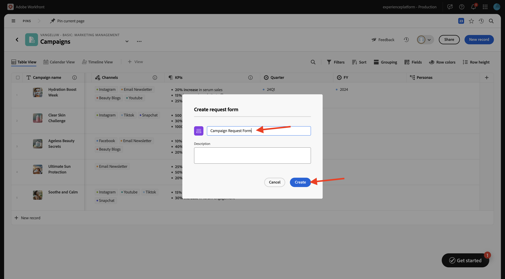

# 1.1.1 Workfront Planning入門

## 1.1.1.1 Workfront規劃術語

以下是主要的Workfront Planning物件和概念：

| 術語 | 說明 |
| --- | ---|
| **Workspace** | 定義特定組織作業生命週期的記錄型別集合。 工作區是組織單位的工作框架。 |
| **記錄型別** | Workfront Planning中的物件型別名稱。 記錄型別會填入工作區。 與Workfront Workflow預先定義物件型別不同，在Workfront Planning中，您可以建立自己的物件型別。 |
| **記錄** | 記錄型別的例項。 |
| **Workspace範本** | 您可以使用預先定義的範本來建立工作區。 您可以使用範本中預先定義的記錄型別和欄位，也可以新增您自己的記錄型別和欄位。 |
| **欄位** | 欄位是您可以新增到記錄型別的屬性。 欄位包含有關記錄型別的資訊。 |

>[!NOTE]
>
>您可以建立的Workfront Planning物件數目存在限制。 如需詳細資訊，請參閱Adobe Workfront Planning物件限制總覽。

您現在會親自開始建立其中一些物件。

## 1.1.1.2 Workspace，記錄型別，欄位

移至[https://experience.adobe.com/](https://experience.adobe.com/){target="_blank"}。 按一下以開啟&#x200B;**Workfront**。


在Workfront中，按一下以開啟功能表，然後選取&#x200B;**規劃**。


您應該會看到此訊息。 按一下&#x200B;**建立Workspace**。


按一下範本&#x200B;**基本行銷管理**&#x200B;的&#x200B;**使用範本**。


現在已建立新工作區。 繼續之前，您需要變更工作區的名稱。 按一下3個點&#x200B;**...**，然後選取&#x200B;**編輯**。


將名稱變更為`--aepUserLdap-- - Basic: Marketing Management`。 按一下&#x200B;**儲存**。


然後您應該擁有此專案。


## 1.1.1.3分類：記錄型別和欄位

在&#x200B;**分類**&#x200B;下，按一下&#x200B;**+新增記錄型別**，然後選取&#x200B;**手動新增**。


然後您應該會看到&#x200B;**新增記錄型別**&#x200B;快顯視窗。


更新&#x200B;**外觀**&#x200B;標籤上的下列資訊：

- 以&#x200B;**取代**&#x200B;未命名的記錄型別`Business Unit`。
- 描述： `Defines which BU is leading campaign planning.`。
- 選取您所選圖示的顏色和形狀

按一下&#x200B;**儲存**。


按一下以開啟新建立的&#x200B;**業務單位**&#x200B;記錄型別。


您現在會看到空白的表格檢視，因為您新建立的記錄型別尚未定義任何欄位。


按一下欄位&#x200B;**開始日期**&#x200B;上的下拉式清單按鈕，然後選取&#x200B;**刪除**。


選取「**刪除**」。


按一下欄位&#x200B;**結束日期**&#x200B;上的下拉式清單按鈕，然後選取&#x200B;**刪除**。


選取「**刪除**」。


接著，按一下&#x200B;**+**&#x200B;圖示以新增欄位。 向下捲動可用欄位型別清單，並選取&#x200B;**人員**。


將欄位的&#x200B;**Name**&#x200B;設定為`Business Unit Lead`，並將欄位的描述設定為`Business Unit Lead responsible for budget and resources (VP, Head).`

按一下&#x200B;**儲存**。


您現在已建立新的記錄型別，且您已刪除和建立欄位。 按一下左上角的箭頭，返回Workspace概觀畫面。


您應該會看到此訊息。


## 1.1.1.4操作記錄型別：欄位

按一下以開啟&#x200B;**行銷活動**。


按一下&#x200B;**+**&#x200B;圖示以建立新欄位。 選取&#x200B;**新連線**，然後選取&#x200B;**角色**。


保留預設設定。 按一下&#x200B;**建立**。


選取&#x200B;**略過**。


然後，您的新欄位會顯示在表格檢視中。


## 1.1.1.5建立請求表單

在行銷活動概觀畫面上，按一下3個點&#x200B;**...**，然後選取&#x200B;**建立請求表單**。


將名稱變更為`Campaign Request Form`。 按一下&#x200B;**儲存**。



目前不需要對表單進行任何變更。 您無需變更即可使用。 首先，按一下&#x200B;**儲存**，然後按一下&#x200B;**發佈**。


按一下左上角的箭頭，返回「請求Forms」概述畫面。


按一下左上角的箭頭，返回Campaigns概述畫面。


## 1.1.1.6使用請求表單提交新記錄

在行銷活動概觀畫面上，按一下&#x200B;**+新增記錄**。


選取&#x200B;**送出要求**&#x200B;並按一下&#x200B;**繼續**。


將&#x200B;**主旨**&#x200B;設定為`--aepUserLdap-- - New Campaign Creation Request`。

將&#x200B;**行銷活動名稱**&#x200B;設為`--aepUserLdap-- - CitiSignal Fiber Launch`。

將&#x200B;**行銷活動摘要**&#x200B;設為：

```
The CitiSignal Fiber Launch campaign introduces CitiSignal’s flagship fiber internet service—CitiSignal Fiber Max—to key residential markets. This campaign is designed to build awareness, drive sign-ups, and establish CitiSignal as the go-to provider for ultra-fast, reliable, and future-ready internet. The campaign will highlight the product’s benefits for remote professionals, online gamers, and smart home families, using persona-driven messaging across digital and physical channels.
```

按一下&#x200B;**送出要求**。


按一下&#x200B;**X**&#x200B;關閉快顯視窗。


之後，您應該會在概述中看到新建立的行銷活動。


## 1.1.1.7建立Portfolio和自訂表單

在下一步中，您將建立自動化系統，此系統將會從您在Workfront Planning中建立的行銷活動中取得資訊，並會在Workfront中使用該資訊來建立方案。 建立自動化之前，請先在Workfront中設定兩件事：投資組合和自訂表單。

若要建立投資組合，請開啟功能表並按一下&#x200B;**投資組合**。


按一下&#x200B;**+新Portfolio**。


將投資組合的名稱設定為`--aepUserLdap-- - Marketing`。


接著，開啟功能表並按一下&#x200B;**設定**&#x200B;以建立自訂表單。


在左側功能表中，移至&#x200B;**自訂Forms**，移至&#x200B;**Forms**，然後按一下&#x200B;**+新增自訂表單**。


選取&#x200B;**程式**&#x200B;並按一下&#x200B;**繼續**。


將表單名稱變更為`--aepUserLdap-- - Program Information`。


接著，前往&#x200B;**欄位程式庫**&#x200B;搜尋`budget`。 將現有欄位&#x200B;**預算**&#x200B;拖放到表單上。

按一下&#x200B;**套用**。


您的自訂表單設定現已儲存。


## 1.1.1.8建立自動化

建立投資組合和自訂表單後，您現在就可以建立自動化。

按一下以開啟功能表，然後選取&#x200B;**規劃**。


按一下以開啟您之前建立的工作區，名為`--aepUserLdap-- - Basic: Marketing Management`。


按一下以開啟&#x200B;**行銷活動**。


在行銷活動總覽畫面上，按一下3個點&#x200B;**...**，然後選取&#x200B;**管理自動化**。


按一下&#x200B;**新增自動化**。


將Automation的名稱設定為`Campaign to Program`。

將描述設為`This automation will convert a Planning Campaign record to a Workfront Program.`

按一下&#x200B;**儲存**。


將&#x200B;**動作**&#x200B;設定為&#x200B;**建立程式**。 按一下&#x200B;**+新增連線的欄位**。


選取&#x200B;**方案組合**： `--aepUserLdap-- - Marketing`。

選取此&#x200B;**自訂表單**： `--aepUserLdap-- Program information`。

按一下&#x200B;**儲存**。


您應該會看到此訊息。 按一下箭頭，返回Campaigns概觀畫面。


勾選您先前建立之行銷活動前面的核取方塊。 然後，按一下&#x200B;**Campaign to Program**&#x200B;自動化。


幾秒後，您應該會看到自動化已成功完成的確認。 這表示已根據Workfront規劃中的Campaign物件，在Workfront中建立方案。


若要在Workfront中檢查程式，請開啟功能表並按一下&#x200B;**投資組合**。


開啟應名為`--aepUserLdap-- - Marketing`的投資組合。


移至&#x200B;**程式**，然後您應該會看到剛才由您設定的自動化所建立的程式。


下一步： [1.2.2待定](./ex1.md){target="_blank"}

返回[Workfront Planning簡介](./wfplanning.md){target="_blank"}

[返回所有模組](./../../../overview.md){target="_blank"}
