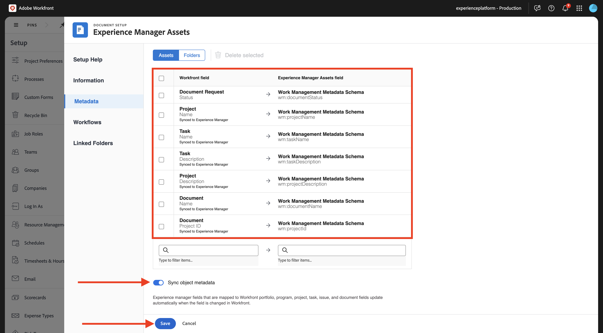
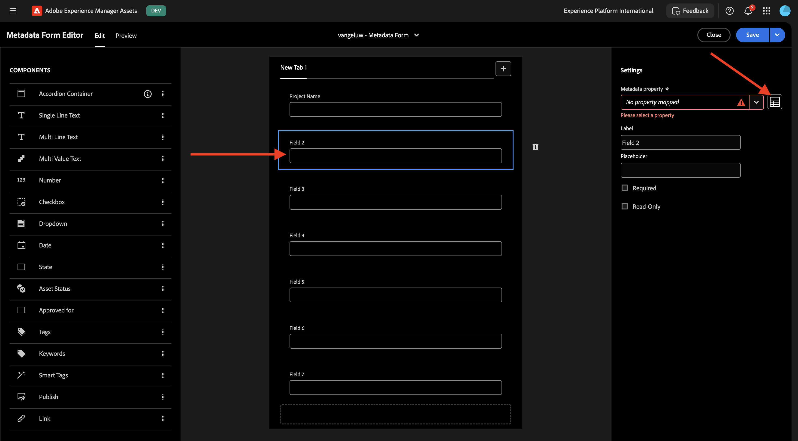
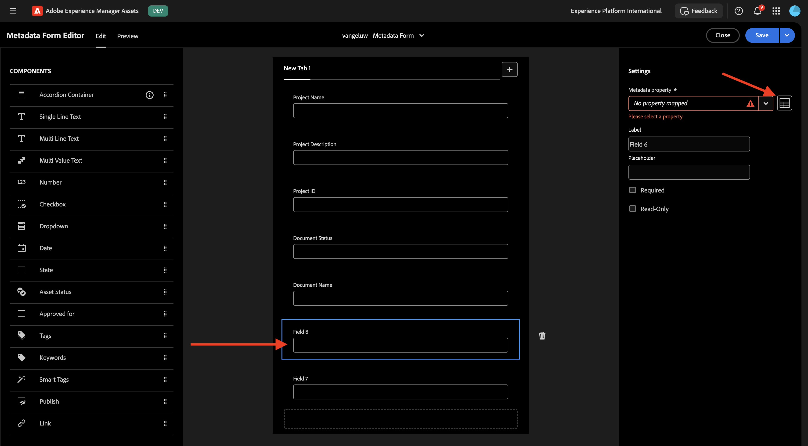

# 1.2.1 Workfront + AEM Assets CS中繼資料整合

>[!IMPORTANT]
>
>為了完成此練習，您需要有權存取運作中的AEM Assets CS作者環境。
>
>您需考慮2個選項：
>
>- 如果您參加GenStudio的CSC技術支援工作坊，您的講師已經為您建立了AEM Assets CS作者環境。 請和他們確認名稱及步驟。
>
>- 如果您依照完整的One Adobe教學課程路徑進行，請前往練習[Adobe Experience Manager Cloud Service &amp; Edge Delivery Services](./../../../modules/asset-mgmt/module2.1/aemcs.md){target="_blank"}。 按照這裡的指示操作，您將可以存取這樣的環境。

>[!IMPORTANT]
>
>如果您先前已使用AEM Assets CS環境設定AEM CS計畫，可能是您的AEM CS沙箱已休眠。 鑑於讓這樣的沙箱解除休眠需要10-15分鐘，最好現在開始解除休眠過程，這樣以後就不必等待了。

## 1.2.1.1 Workfront工作流程術語

以下是主要的Workfront物件和概念：

| 名稱 | 上次更新日期 |
| ---------------------- | ------------ | 
| 產品組合 | 具有統一特性的專案集合。 這些專案通常會爭奪相同的資源、預算或時段。 |
| 方案 | 產品組合中的子集，可將類似的專案分組在一起，以獲得明確定義的利益。 |
| 專案 | 必須在特定時間範圍內完成的大量工作，且必須使用特定預算和資源數量。 為了讓專案易於管理，您可將專案分成一系列工作。 完成所有任務會導致專案完成。 |
| 專案範本 | 您可以使用專案範本來擷取與組織中專案相關的大部分可重複流程、資訊和設定。 建立範本後，您可以將範本附加至現有專案，也可以使用範本建立新專案。 |
| 任務 | 作為達成最終目標（完成專案）的步驟而必須執行的活動。 工作永遠無法獨立存在。 它們永遠是專案的一部分。 |
| 指定任務 | 指派給問題或任務的使用者、工作角色或團隊。 專案、專案組合或方案不能有指派。 |
| 檔案/版本 | 附加至Workfront中物件的任何檔案。 每次將相同的檔案上傳到相同的物件時，都會為其指定版本編號。 使用者可以檢視和變更舊版檔案的多個選項。 |
| 核准 | 指定的工作專案，例如工作、檔案或時程表，可能需要主管或其他使用者登出該工作專案。 此登出程式稱為核准。 |

移至[https://experience.adobe.com/](https://experience.adobe.com/){target="_blank"}。 按一下以開啟&#x200B;**Workfront**。

您將會看到此訊息。

## 1.2.1.1設定您的AEM Assets整合

按一下&#x200B;**功能表**&#x200B;圖示，然後選取&#x200B;**設定**。

在左側功能表中，向下捲動至&#x200B;**檔案**，然後按一下&#x200B;**Experience Manager Assets**。 按一下&#x200B;**+新增Experience Manager整合**。

對於整合的名稱，請使用`--aepUserLdap-- - CitiSignal AEM`。

開啟&#x200B;**Experience Manager存放庫**&#x200B;下拉式清單，然後選取您應命名為`--aepUserLdap-- - CitiSignal`的AEM CS執行個體。

在&#x200B;**中繼資料**&#x200B;下，設定下列對應：

| Workfront欄位 | Experience Manager Assets欄位 |
| --------------- | ------------------------------ | 
| **檔案** > **名稱** | **wm:documentName** |
| **專案** > **名稱** | **wm:projectName** |
| **專案** > **描述** | **wm:projectDescription** |
| **檔案要求** > **狀態** | **wm:wm:documentStatus** |
| **任務** > **名稱** | **wm:taskName** |
| **工作** > **描述** | **wm:taskDescription** |
| **專案** > **識別碼** | **wm:projectId** |

啟用&#x200B;**同步處理物件中繼資料**&#x200B;的開關。

按一下&#x200B;**儲存**。

您從Workfront到AEM Assets CS的整合現已設定完成。

## 1.2.1.2設定與AEM Assets的中繼資料整合

接下來，您需要設定AEM Assets CS，好讓Workfront中資產的中繼資料欄位與AEM Assets CS共用。

若要這麼做，請前往[https://experience.adobe.com/](https://experience.adobe.com/)。 按一下&#x200B;**Experience Manager Assets**。

按一下以選取您的AEM Assets環境，應命名為`--aepUserLdap-- - CitiSignal dev`。

您應該會看到此訊息。 在左側功能表中，移至&#x200B;**Assets**。

接著，按一下&#x200B;**建立資料夾**。

為資料夾命名`--aepUserLdap-- - CitiSignal Fiber Launch Assets`並按一下&#x200B;**建立**。

接著，前往左側功能表中的&#x200B;**中繼資料Forms**，然後按一下&#x200B;**建立**。

使用名稱`--aepUserLdap-- - Metadata Form`並按一下&#x200B;**建立**。

新增7個&#x200B;**單行文字**&#x200B;欄位至表單，並選取第一個欄位。 然後，按一下第一個欄位的&#x200B;**中繼資料屬性**&#x200B;欄位旁的&#x200B;**結構描述**&#x200B;圖示。

然後您會看到此快顯視窗。 在搜尋欄位中輸入`wm:project`，然後選取欄位&#x200B;**專案名稱**。 按一下&#x200B;**選取**。

將欄位標籤變更為`Project Name`。 按一下&#x200B;**儲存**。

移至第二個欄位，然後按一下&#x200B;**中繼資料屬性**&#x200B;欄位旁的&#x200B;**結構描述**&#x200B;圖示。

在搜尋欄位中輸入`wm:project`，然後選取欄位&#x200B;**專案描述**。 按一下&#x200B;**選取**。

將欄位標籤變更為`Project Description`。

接著，選取第三個欄位，然後再次按一下&#x200B;**中繼資料屬性**&#x200B;欄位旁的&#x200B;**結構描述**&#x200B;圖示。

之後您會再次看到此快顯視窗。 在搜尋欄位中輸入`wm:project`，然後選取欄位&#x200B;**專案識別碼**。 按一下&#x200B;**選取**。

將欄位標籤變更為`Project ID`。

接著，選取第四個欄位，然後再次按一下&#x200B;**中繼資料屬性**&#x200B;欄位旁的&#x200B;**結構描述**&#x200B;圖示。

之後您會再次看到此快顯視窗。 在搜尋欄位中輸入`wm:document`，然後選取欄位&#x200B;**專案識別碼**。 按一下&#x200B;**選取**。

將欄位標籤變更為`Document Status`。

接著，選取第五個欄位，然後再次按一下&#x200B;**中繼資料屬性**&#x200B;欄位旁的&#x200B;**結構描述**&#x200B;圖示。

之後您會再次看到此快顯視窗。 在搜尋欄位中輸入`wm:document`，然後選取欄位&#x200B;**專案識別碼**。 按一下&#x200B;**選取**。

將欄位標籤變更為`Document Name`。

接著，選取第六個欄位，然後再次按一下&#x200B;**中繼資料屬性**&#x200B;欄位旁的&#x200B;**結構描述**&#x200B;圖示。

之後您會再次看到此快顯視窗。 在搜尋欄位中輸入`wm:task`，然後選取欄位&#x200B;**工作名稱**。 按一下&#x200B;**選取**。

將欄位標籤變更為`Task Name`。

接著，選取第七個欄位，然後再次按一下&#x200B;**中繼資料屬性**&#x200B;欄位旁的&#x200B;**結構描述**&#x200B;圖示。

之後您會再次看到此快顯視窗。 在搜尋欄位中輸入`wm:task`，然後選取欄位&#x200B;**任務描述**。 按一下&#x200B;**選取**。

將欄位標籤變更為`Task Description`。

將表單上的&#x200B;**索引標簽名稱**&#x200B;變更為`--aepUserLdap-- - Workfront Metadata`。

按一下&#x200B;**儲存**&#x200B;和&#x200B;**關閉**。

您的&#x200B;**中繼資料表單**&#x200B;現已設定。

接下來，您需要將中繼資料表單指派給您之前建立的資料夾。 勾選中繼資料表單的核取方塊，然後按一下&#x200B;**指派至資料夾**。

選取應命名為`--aepUserLdap-- - CitiSignal Fiber Launch Assets`的資料夾。 按一下&#x200B;**指派**。

中繼資料表單現在已成功指派至您的資料夾。

下一步： [使用Workfront校訂1.2.2](./ex2.md){target="_blank"}

使用Adobe Workfront[返回](./workfront.md){target="_blank"}工作流程管理

[返回所有模組](./../../../overview.md){target="_blank"}
