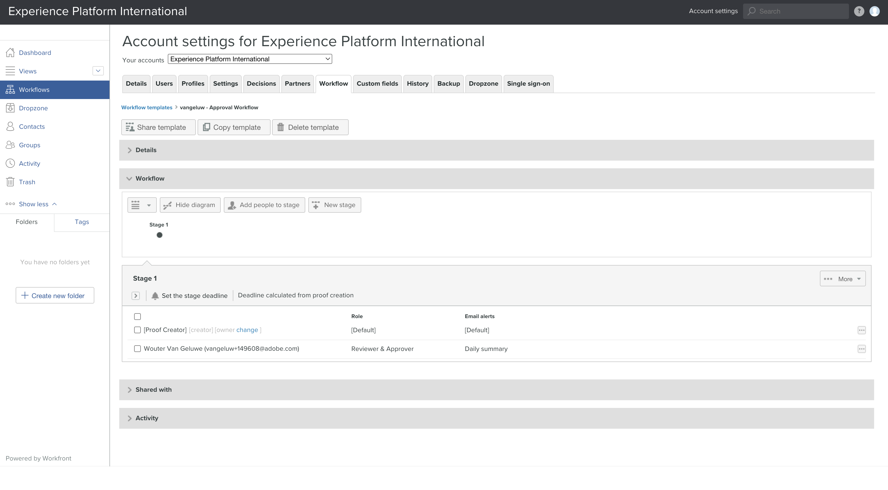

# 1.2.2 Workfront校訂

>[!IMPORTANT]
>
>如果您先前已使用AEM Assets CS環境設定AEM CS計畫，可能是您的AEM CS沙箱已休眠。 鑑於讓這樣的沙箱解除休眠需要10-15分鐘，最好現在開始解除休眠過程，這樣以後就不必等待了。

## 1.2.2.1建立新的核准流程

返回&#x200B;**Adobe Workfront**。 按一下&#x200B;**功能表**&#x200B;圖示並選取&#x200B;**校樣**。

移至&#x200B;**工作流程**，按一下&#x200B;**+新增**，然後選取&#x200B;**新增範本**。

將&#x200B;**範本名稱**&#x200B;設為`--aepUserLdap-- - Approval Workflow`，並將&#x200B;**範本擁有者**&#x200B;設為您自己。

向下捲動，在&#x200B;**階段** > **階段1**&#x200B;下，加入&#x200B;**檢閱者和核准者**&#x200B;的&#x200B;**角色**。

按一下&#x200B;**建立**。

您的基本核准工作流程現已準備就緒，可供使用。

## 1.2.2.2建立新專案

開啟&#x200B;**功能表**&#x200B;並移至&#x200B;**程式**。

按一下您之前建立的程式，名為`--aepUserLdap-- CitiSignal Fiber Launch`。

>[!NOTE]
>
>您已使用您建立並執行的自動化功能，在[Workfront Planning](./../module1.1/ex1.md)上建立方案作為練習的一部分。 如果您尚未執行此動作，您可以在這裡找到指示。

在您的程式中，移至&#x200B;**專案**。 按一下&#x200B;**+新增專案**，然後選取&#x200B;**新增專案**。

您應該會看到此訊息。 將名稱變更為`--aepUserLdap-- - CitiSignal Fiber Launch`。

移至&#x200B;**專案詳細資料**。 按一下「**描述**」下的「**+新增**」。

將描述設為`The CitiSignal Fiber Launch project is used to plan the upcoming launch of CitiSignal Fiber.`

按一下&#x200B;**儲存變更**。

您的專案現已建立。

## 1.2.2.3建立新任務

移至&#x200B;**工作**&#x200B;並按一下&#x200B;**+新工作**。

為您的工作輸入此名稱： `Create assets for Fiber campaign`。

將欄位&#x200B;**描述**&#x200B;設定為： `This task is used to track the progress of the creation of the assets for the CitiSignal Fiber Launch Campaign.`

按一下&#x200B;**建立工作**。

您應該會看到此訊息。

在&#x200B;**工作分派**&#x200B;欄中，新增您自己的名稱。

接著，系統會將工作指派給您。

## 1.2.2.4新增檔案至您的任務會通過核准流程

按一下&#x200B;**Workfront**&#x200B;標誌以返回概觀頁面。 之後，您應該會看到剛才建立的專案出現在概覽中。 按一下您的專案以開啟。

在&#x200B;**工作**&#x200B;中，按一下以開啟工作。

移至&#x200B;**檔案**。 按一下[新增&#x200B;**]，然後選取[檔案****]。**

將[此檔案](./images/2048x2048.png)下載到您的案頭。

{width="50px" align="left"}

選取檔案&#x200B;**2048x2048.png**&#x200B;並按一下&#x200B;**開啟**。

然後您應該擁有此專案。 暫留在上傳的檔案上。 按一下&#x200B;**建立校訂**，然後選擇&#x200B;**進階校訂**。

在&#x200B;**新校訂**&#x200B;視窗中，選取&#x200B;**自動**，然後選取您之前建立的工作流程範本，其名稱應該是`--aepUserLdap-- - Approval Workflow`。 按一下&#x200B;**建立校訂**。

按一下&#x200B;**處理它**。

按一下&#x200B;**開啟校訂**

您現在可以檢閱證明。 選取&#x200B;**新增註解**&#x200B;以新增需要變更檔案的註解。

輸入您的註解並按一下&#x200B;**貼文**。 按一下 **關閉**。

接下來，您需要將您的角色從&#x200B;**檢閱者**&#x200B;變更為&#x200B;**檢閱者和核准者**。 若要這麼做，請返回您的工作並按一下&#x200B;**校訂工作流程**。

將您的角色從&#x200B;**稽核者**&#x200B;變更為&#x200B;**稽核者和核准者**。

返回您的任務並再次開啟校樣。 您現在看到新按鈕&#x200B;**做出決定**。 按一下它。

選取&#x200B;**必要的變更**，然後按一下&#x200B;**做出決定**。

返回您的&#x200B;**工作**&#x200B;和&#x200B;**檔案**。 您現在需要上傳第二個影像，該影像會考量您提供的評論。

將[此檔案](./images/2048x2048_buynow.png)下載到您的案頭。

{width="50px" align="left"}

在您的[工作]檢視中，選取未核准的舊影像檔。 接著，按一下[新增] **+ [新增]**，選取[版本] ****，然後選取[檔案] ****。

選取檔案&#x200B;**2048x2048_buynow.png**，然後按一下&#x200B;**開啟**。

然後您應該擁有此專案。 按一下&#x200B;**建立校訂**，然後再次選取&#x200B;**進階校訂**。

您將會看到此訊息。 **工作流程範本**&#x200B;現在已預先選取，因為Workfront假設先前的核准工作流程仍然有效。 按一下&#x200B;**建立校訂**。

選取&#x200B;**開啟校訂**。

您現在可以看到2個版本的檔案彼此相鄰。

按一下&#x200B;**做出決定**，選取&#x200B;**已核准**，然後按一下&#x200B;**再次做出決定**。

按一下&#x200B;**任務名稱**&#x200B;以返回任務總覽。

接著，您會帶著已核准的資產返回「任務」檢視。 此資產現在需要與AEM Assets共用。

選取核准的檔案。 按一下&#x200B;**共用箭頭**&#x200B;圖示，然後選取您應命名為`--aepUserLdap-- - CitiSignal AEM`的AEM Assets整合。

連按兩下您之前建立的資料夾，該資料夾應命名為`--aepUserLdap-- - CitiSignal Fiber Launch Assets`。

按一下&#x200B;**選取資料夾**。

1-2分鐘後，您的檔案將發佈到AEM Assets中。 您會在檔名稱旁邊看到AEM圖示。

按一下&#x200B;**標籤為完成**&#x200B;以完成此工作。

您應該會看到此訊息。

## 1.2.2.5在AEM Assets中檢視您的檔案

移至AEM Assets CS中名為`--aepUserLdap-- - CitiSignal Fiber Launch Assets`的資料夾。

選取影像，然後選擇&#x200B;**詳細資料**。

接著，您就會看到先前建立的中繼資料表單，其中包含Workfront與AEM Assets整合自動填入的值。

使用Adobe Workfront[返回](./workfront.md){target="_blank"}工作流程管理

[返回所有模組](./../../../overview.md){target="_blank"}
