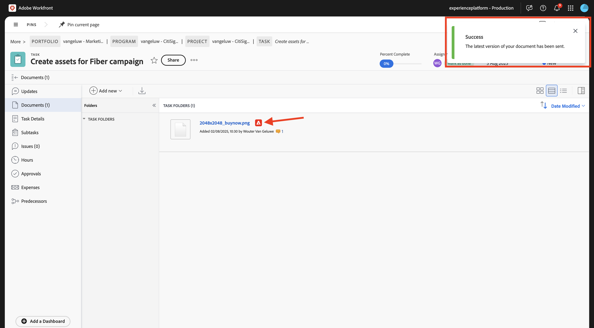

# 1.2.2 Workfront校訂

>[!IMPORTANT]
>
>如果您先前已使用AEM Assets CS環境設定AEM CS計畫，可能是您的AEM CS沙箱已休眠。 鑑於讓這樣的沙箱解除休眠需要10-15分鐘，最好現在開始解除休眠過程，這樣以後就不必等待了。

## 1.2.2.1建立新的核准流程

返回&#x200B;**Adobe Workfront**。 按一下&#x200B;**功能表**&#x200B;圖示並選取&#x200B;**校樣**。

移至&#x200B;**工作流程**，按一下&#x200B;**+新增**，然後選取&#x200B;**新增範本**。

將&#x200B;**範本名稱**&#x200B;設為`--aepUserLdap-- - Approval Workflow`，並將&#x200B;**範本擁有者**&#x200B;設為您自己。

向下捲動，並在&#x200B;**階段** > **階段1**&#x200B;下，將&#x200B;**校訂建立者**&#x200B;角色變更為&#x200B;**檢閱者和核准者**。 您也可以新增其他人，例如，選取您的使用者並設定&#x200B;**檢閱者和核准者**&#x200B;的&#x200B;**角色**，即可新增您自己。

按一下&#x200B;**建立**。

您的基本核准工作流程現已準備就緒，可供使用。

## 1.2.2.2啟用Workfront Blueprint

在下一步中，您將使用範本建立新專案。 Adobe Workfront提供您許多隻需啟用的可用Blueprint。

針對CitiSignal的使用案例，您需要使用&#x200B;**整合式行銷活動執行**&#x200B;藍圖。

若要安裝該Blueprint，請開啟功能表並選取&#x200B;**Blueprint**。

選取篩選器&#x200B;**行銷**，然後向下捲動以尋找&#x200B;**整合式行銷活動執行**&#x200B;藍圖。 按一下&#x200B;**安裝**。

按一下&#x200B;**繼續**。

按一下&#x200B;**依原樣安裝……**。

您應該會看到此訊息。 安裝可能需要幾分鐘的時間。

幾分鐘後，將安裝Blueprint。

## 1.2.2.3建立新專案

開啟&#x200B;**功能表**&#x200B;並移至&#x200B;**程式**。

按一下您之前建立的程式，名為`--aepUserLdap-- CitiSignal Fiber Launch`。

>[!NOTE]
>
>您已使用您建立並執行的自動化功能，在[Workfront Planning](./../module1.1/ex1.md)上建立方案作為練習的一部分。 如果您尚未執行此動作，您可以在這裡找到指示。

在您的程式中，移至&#x200B;**專案**。 按一下「**+新增專案**」，然後從範本選取「**新增專案**」。

選取範本&#x200B;**整合式行銷活動執行**，然後按一下&#x200B;**使用範本**。

您應該會看到此訊息。 將名稱變更為`--aepUserLdap-- - CitiSignal Fiber Launch Winter 2026`並按一下&#x200B;**建立專案**。

您的專案現已建立。 移至&#x200B;**專案詳細資料**。

移至&#x200B;**專案詳細資料**。 按一下以選取&#x200B;**描述**&#x200B;下的目前文字。

將描述設為`The CitiSignal Fiber Launch project is used to plan the upcoming launch of CitiSignal Fiber.`

按一下&#x200B;**儲存變更**。

您的專案現在已可供使用。

專案中的任務和相依性是根據您選擇的範本建立的，並且您已經設定為。 專案的所有者。 專案狀態已設定為&#x200B;**規劃**。 您可以在清單中選取其他值來變更專案狀態。

## 1.2.2.4建立新任務

將滑鼠停留在工作&#x200B;**開始建立設計範本**&#x200B;並按一下3個點&#x200B;**...**。

選取選項&#x200B;**在下方插入任務**。

為您的工作輸入此名稱： `Create layout using approved assets and copy`。

將欄位&#x200B;**指派**&#x200B;設定為角色&#x200B;**Designer**。
將欄位&#x200B;**Duration**&#x200B;設定為&#x200B;**5天**。
將前置工作列位設定為&#x200B;**9**。
輸入欄位&#x200B;**開始日期**&#x200B;和&#x200B;**到期日期**&#x200B;的日期。

按一下畫面中的其他位置以儲存新任務。

您應該會看到此訊息。 按一下工作以開啟它。

移至&#x200B;**任務詳細資料**&#x200B;並將欄位&#x200B;**描述**&#x200B;設定為： `This task is used to track the progress of the creation of the assets for the CitiSignal Fiber Launch Campaign.`

按一下&#x200B;**儲存變更**。

您應該會看到此訊息。 按一下&#x200B;**專案**&#x200B;欄位，返回您的專案。

在&#x200B;**專案**&#x200B;檢視中，移至&#x200B;**工作負載平衡器**。

按一下&#x200B;**大量指派**。

選取&#x200B;**Designer**&#x200B;的&#x200B;**角色指派**，然後按一下&#x200B;**使用者欄位以指派**。 這會顯示在您的Workfront執行個體中擁有&#x200B;**Designer**&#x200B;角色的所有使用者。 在這種情況下，請選取虛擬使用者&#x200B;**Melissa Jenkins**。

按一下&#x200B;**指派**。 現在會將您選取的使用者指派給連結至&#x200B;**Designer**&#x200B;角色的專案任務。

任務現已指派。 按一下&#x200B;**任務**&#x200B;以返回&#x200B;**任務**&#x200B;概觀頁面。

按一下您建立的工作，其名稱為
**使用核准的資產建立版面配置並複製**。

您現在會開始處理此任務，作為此練習的一部分。 您可以看到Melissa Jenkins目前已指派給此任務。 若要變更給您自己，請按一下&#x200B;**工作總攬**&#x200B;欄位，然後選取&#x200B;**指派給我**。

按一下&#x200B;**儲存**。

按一下&#x200B;**處理它**。

您應該會看到此訊息。

在此任務中，您需要建立新影像，然後將其上傳為Workfront中的檔案。 您現在將會使用Adobe Express自行建立該資產。

## 1.2.2.5新增檔案至您的任務並開始核准流程

若要進行此練習，您必須下載並使用此資產： [timetravelnow.png](./images/timetravelnow.png)

返回&#x200B;**任務詳細資料**&#x200B;畫面。 移至&#x200B;**檔案**。 按一下「**+新增**」，然後選取您的AEM Assets CS存放庫（應該命名為`--aepUserLdap-- - CitiSignal`）。

按兩下以開啟資料夾`--aepUserLdap-- CitiSignal Fiber Campaign`。

選取您在上一步建立的檔案，名為&#x200B;**CitiSignal - Neon Rabbit - Timetravel Now！。png**。 按一下&#x200B;**選取**。

{width="50px" align="left"}

然後您應該擁有此專案。 暫留在上傳的檔案上。 按一下&#x200B;**建立校訂**，然後選擇&#x200B;**進階校訂**。

在&#x200B;**新校訂**&#x200B;視窗中，選取&#x200B;**自動**，然後選取您之前建立的工作流程範本，其名稱應該是`--aepUserLdap-- - Approval Workflow`。 按一下&#x200B;**建立校訂**。

按一下&#x200B;**開啟校訂**

您現在可以檢閱證明。 選取&#x200B;**新增註解**&#x200B;以新增需要變更檔案的註解。

輸入您的註解並按一下&#x200B;**貼文**。 接著，按一下&#x200B;**做出決定**。

選取&#x200B;**必要的變更**，然後按一下&#x200B;**做出決定**。

返回您的&#x200B;**工作**&#x200B;和&#x200B;**檔案**。 您會看到文字&#x200B;**需要的變更**&#x200B;也會顯示在該處。

您現在需要進行設計變更，您將在Adobe Express中進行此操作。

## 1.2.2.6將檔案的新版本新增至您的工作

為了進行此練習，您需要下載及使用此資產： [getonboard.png](./images/getonboard.png)

在Adobe Workfront的「工作」檢視中，選取未核准的舊影像檔案。 接著，按一下[新增&#x200B;**]、[新增**]、[選取&#x200B;**版本**]，然後選取您的AEM Assets CS存放庫，此存放庫應命名為`--aepUserLdap-- - CitiSignal`。

導覽至資料夾`--aepUserLdap-- CitiSignal Fiber Campaign`並選取檔案`CitiSignal - Neon Rabit - Get On Board Now!.png`。 按一下&#x200B;**選取**。

然後您應該擁有此專案。 按一下&#x200B;**建立校訂**，然後再次選取&#x200B;**進階校訂**。

您將會看到此訊息。 **工作流程範本**&#x200B;現在已預先選取，因為Workfront假設先前的核准工作流程仍然有效。 按一下&#x200B;**建立校訂**。

選取&#x200B;**開啟校訂**。

您現在可以看到2個版本的檔案彼此相鄰。 按一下&#x200B;**比較校樣**&#x200B;按鈕。

然後您應該會看到兩個版本的影像並排放在一起。 按一下&#x200B;**做出決定**。

選取&#x200B;**已核准**，然後按一下&#x200B;**再次做出決定**。

關閉影像的左側版本，以關閉&#x200B;**比較校樣**&#x200B;檢視。 按一下&#x200B;**任務名稱**&#x200B;以返回任務總覽。

接著，您會帶著已核准的資產返回「任務」檢視。 此資產現在需要與AEM Assets共用。

選取核准的檔案。 按一下&#x200B;**共用箭頭**&#x200B;圖示，然後選取您應命名為`--aepUserLdap-- - CitiSignal AEM`的AEM Assets整合。

連按兩下您之前建立的資料夾，該資料夾應命名為`--aepUserLdap-- - CitiSignal Fiber Launch Assets`。

按一下&#x200B;**選取資料夾**。

1-2分鐘後，您的檔案將發佈到AEM Assets中。 您會在檔名稱旁邊看到AEM圖示。

按一下&#x200B;**標籤為完成**&#x200B;以完成此工作。

您應該會看到此訊息。

## 1.2.2.7在AEM Assets中檢視您的檔案

移至AEM Assets CS中名為`--aepUserLdap-- - CitiSignal Fiber Launch Assets`的資料夾。

選取影像，然後選擇&#x200B;**詳細資料**。

接著，您就會看到先前建立的中繼資料表單，其中包含Workfront與AEM Assets整合自動填入的值。

使用Adobe Workfront[返回](./workfront.md){target="_blank"}工作流程管理

[返回所有模組](./../../../overview.md){target="_blank"}
