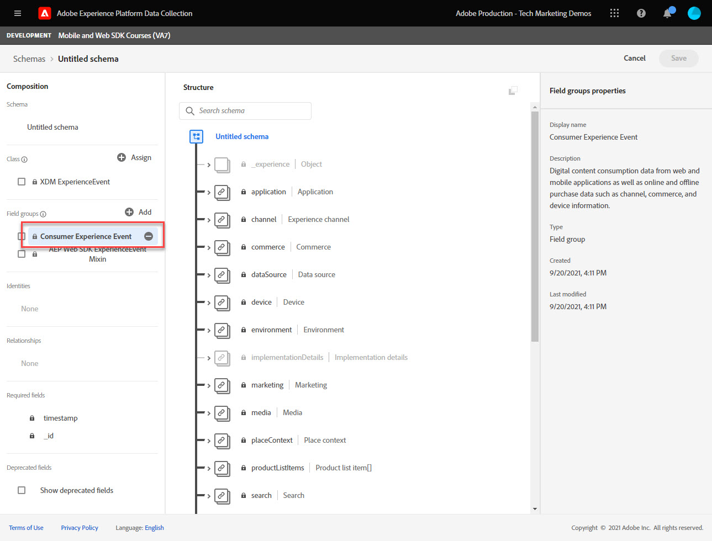

# 為網頁資料建立XDM結構描述

瞭解如何在資料收集介面中為網頁資料建立XDM結構描述。

Experience Data Model (XDM)方案是在Adobe Experience Platform中構成方案的建置組塊、原則和最佳作法。

Platform Web SDK會使用您的結構描述將網頁事件資料標準化、傳送至Platform Edge Network，最終將資料轉送至資料流中設定的任何Experience Cloud應用程式。 此步驟至關重要，因為它會定義將客戶體驗資料擷取到Experience Platform所需的標準資料模型，並啟用建置在這些標準上的下游服務和應用程式。

>[!NOTE]
>
> 為了示範，本課程中的練習會建立範例結構描述，以擷取客戶在中檢視的內容和購買的產品。 [Luma示範網站](https://luma.enablementadobe.com/content/luma/us/en.html). 雖然您可以使用這些步驟建立不同的結構描述以供您個人使用，但建議您先依照建立範例結構描述一起來瞭解結構描述編輯器的功能。

若要進一步瞭解XDM結構描述，請參加課程»[使用XDM為您的客戶體驗資料建立模型](https://experienceleague.adobe.com/?recommended=ExperiencePlatform-D-1-2021.1.xdm)」或檢視 [XDM系統概覽](https://experienceleague.adobe.com/docs/experience-platform/xdm/home.html?lang=zh-Hant).

## 學習目標

在本課程結束時，您將能夠：

* 從資料收集介面中建立XDM結構描述
* 新增欄位群組至您的XDM結構描述
* 使用最佳實務為網頁事件資料建立XDM結構描述

## 先決條件

如需資料收集和Adobe Experience Platform的所有必要布建和使用者許可權，請參閱 [設定許可權](configure-permissions.md) 課程。

## 建立 XDM 結構描述

XDM結構描述是以Experience Platform描述資料的標準方式，可讓所有符合結構描述的資料在組織間重複使用，而不會產生衝突，甚至可在多個組織間共用。 若要進一步瞭解，請參閱 [結構描述組合的基本面](https://experienceleague.adobe.com/docs/experience-platform/xdm/schema/composition.html?lang=zh-Hant).

在本練習中，您將使用建議的基準欄位群組來建立XDM結構描述，以擷取 [Luma示範網站](https://luma.enablementadobe.com/content/luma/us/en.html){target="_blank"}：

1. 開啟 [資料收集介面](https://launch.adobe.com/tw/){target="_blank"}
1. 確定您在正確的沙箱中

   >[!NOTE]
   >
   >如果您是Real-Time CDP等平台型應用程式的客戶，我們建議您在本教學課程中使用開發沙箱。 如果沒有，請使用 **[!UICONTROL Prod]** 沙箱。

1. 前往 **[!UICONTROL 方案]** 在左側導覽列中
1. 選取 **[!UICONTROL 建立結構描述]** 右上角的按鈕
1. 從下拉式功能表中選取 **[!UICONTROL XDM ExperienceEvent]**

## 新增欄位群組

如前所述，XDM是標準化客戶體驗資料的核心架構，可提供用於下游Adobe Experience Platform服務的通用結構和定義。 遵循XDM標準， _所有客戶體驗資料_ 可以併入一般表示中。 此方法可讓您從客戶動作中獲得有價值的深入分析、透過區段定義客戶對象，以及使用來自多個來源的資料來針對個人化目的表達客戶屬性。 另請參閱 [資料模型化的最佳實務](https://experienceleague.adobe.com/docs/experience-platform/xdm/schema/best-practices.html?lang=en) 以取得詳細資訊。

可能的話，建議使用現有的欄位群組，並遵守與產品無關的模型和命名慣例。 若貴組織的特定資料不符合上述預先定義的欄位群組，您可以建立自訂欄位群組。 另請參閱 [使用結構編輯器建立結構](https://experienceleague.adobe.com/docs/experience-platform/xdm/tutorials/create-schema-ui.html?lang=en#create) 以取得自訂綱要的詳細步驟。

>[!TIP]
> 
>在本練習中，您將新增建議的預先定義欄位群組以用於網路資料收集： _**[!UICONTROL AEP Web SDK ExperienceEvent]**_、和 _**[!UICONTROL 消費者體驗事件]**_.

1. 在 **[!UICONTROL 欄位群組]** 區段，選取 **[!UICONTROL 新增]**
1. 搜尋 [!UICONTROL `AEP Web SDK ExperienceEvent`]
1. 核取方塊
1. 搜尋 [!UICONTROL `Consumer Experience Event`]
1. 核取方塊
1. 選取 **[!UICONTROL 新增欄位群組]**

   

選取欄位群組後，您就可以為結構描述命名了。 XDM結構描述的常見命名慣例是在資料來源後面命名結構描述：

1. 在**中[!UICONTROL 組合**] 面板，選取 `Untitled schema name`
1. 在 **[!UICONTROL 結構描述屬性]** 面板，輸入 **[!UICONTROL 顯示名稱]** `Luma Web Event Data`
1. 選擇任何超出範圍的 **[!UICONTROL 顯示名稱]** 欄位以啟用 **[!UICONTROL 儲存]** 選項
1. 選取 **[!UICONTROL 儲存]**

對於這兩個欄位群組，請注意，您有權存取網站上資料收集所需的最常用索引鍵/值組。 此 [!UICONTROL 顯示名稱] 對行銷人員顯示在平台式應用程式的區段產生器介面中的每個欄位，而您可以變更標準欄位的顯示名稱以符合您的需求。 您也可以移除不要的欄位。 當您按一下任一欄位群組名稱時，介面會醒目顯示哪些索引鍵/值組群組屬於該介面。 在下列範例中，您會看到哪些群組屬於 **[!UICONTROL 消費者體驗事件]**.

本課程只是一個起點。 建立您自己的網頁事件結構描述時，您必須探索並記錄您的業務需求。 此程式類似於建立 [業務需求檔案](https://experienceleague.adobe.com/docs/analytics-learn/tutorials/implementation/implementation-basics/creating-a-business-requirements-document.html) 和 [解決方案設計參考資料](https://experienceleague.adobe.com/docs/analytics-learn/tutorials/implementation/implementation-basics/creating-and-maintaining-an-sdr.html) 適用於Adobe Analytics實施，但應包含下列要求 _所有下游資料收件者_ 例如Platform、Target和事件轉送目的地。

### identitymap物件

需要有一組特殊的資料來識別名為的網頁使用者。 `[!UICONTROL identityMap]`.

它是任何網路相關資料收集的必備物件，因為它內含識別網路使用者所需的Experience CloudID。 這也是為已驗證身分的使用者設定內部客戶ID的關鍵。 `[!UICONTROL identityMap]` 詳情請參閱 [設定身分](configure-identities.md) 課程。 它會使用以下專案自動納入所有結構描述中： **[!UICONTROL XDM ExperienceEvent]** 類別。

>[!IMPORTANT]
>
> 您可以啟用 **[!UICONTROL 個人資料]** 在儲存結構描述之前針對結構描述。 **不要** 此時啟用它。 為設定檔啟用結構描述後，就無法停用或刪除它。 此外，此時之後無法從結構描述中移除欄位。 當您在生產環境中使用自己的資料時，請務必牢記這些含意。
>
>此設定的討論內容會在以下章節中詳述： [設定Experience Platform](setup-experience-platform.md) 課程。
>

現在，當您將Web SDK擴充功能新增至標籤屬性時，就能參考此結構描述。

[下一步： ](configure-identities.md)

>[!NOTE]
>
>感謝您投入時間學習Adobe Experience Platform Web SDK。 如果您有疑問、想要分享一般意見或有關於未來內容的建議，請在此分享這些內容 [Experience League社群討論貼文](https://experienceleaguecommunities.adobe.com/t5/adobe-experience-platform-launch/tutorial-discussion-implement-adobe-experience-cloud-with-web/td-p/444996)
