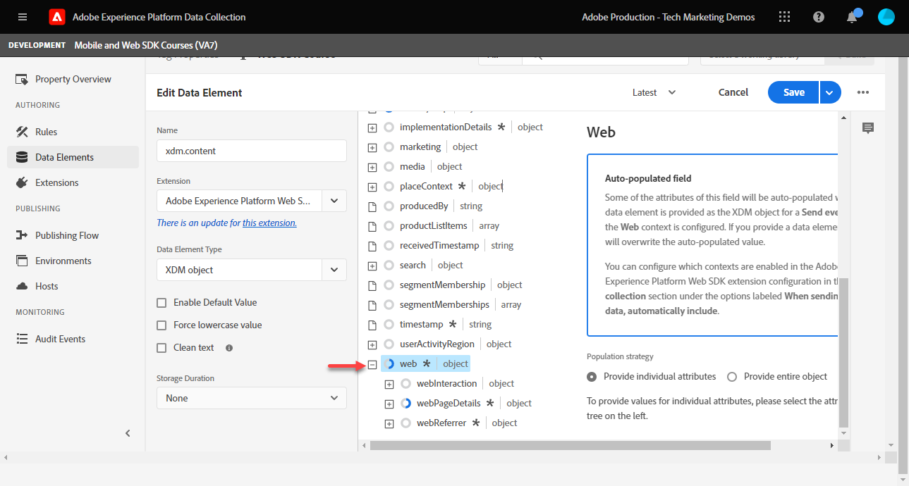

# 建立資料元素

瞭解如何使用Experience Platform Web SDK建立擷取資料所需的基本資料元素。 擷取上的內容和身分資料 [Luma示範網站](https://luma.enablementadobe.com/content/luma/us/en.html). 瞭解如何使用您先前建立的XDM結構描述，以使用名為Variable的Platform Web SDK資料元素型別收集資料。

>[!NOTE]
>
> 為了示範，本課程中的練習會以期間使用的範例為基礎 [設定結構描述](configure-schemas.md) 步驟；建立範例XDM物件，擷取上已檢視的內容和使用者的身分 [Luma示範網站](https://luma.enablementadobe.com/content/luma/us/en.html).

>[!IMPORTANT]
>
>本課程的資料來自 `[!UICONTROL digitalData]` Luma網站上的資料層。 若要檢視資料層，請開啟您的開發人員主控台，然後輸入 `[!UICONTROL digitalData]` 以檢視完整的可用資料層。


無論Platform Web SDK為何，您都必須繼續在tags屬性內建立資料元素，以對應至來自網站的資料收集變數，例如資料層、HTML屬性或其他。 建立這些資料元素後，您必須將它們對應至您在期間建立的XDM結構描述 [設定方案](configure-schemas.md) 課程。 因此，建立資料元素包含兩個動作：

1. 將網站變數對應至資料元素，以及
1. 將這些資料元素對應至XDM物件

在步驟1，您會使用任何核心標籤擴充功能的資料元素型別，繼續以您目前的方式將資料層對應至資料元素。 對於步驟2，Platform Web SDK擴充功能有下列可用的資料元素型別：

* 事件合併ID
* 身分對應
* 變數
* xdm物件

本課程著重於變數資料元素型別。 您可以根據Luma網站上可用的資料層，建立資料元素來擷取Luma訪客的活動。 在下一個課程中，您將瞭解身分對應。

>[!NOTE]
>
> 事件合併ID和XDM物件資料元素型別很少用於邊緣案例。

## 學習目標

在本課程結束時，您能夠：

* 瞭解將資料層對應至XDM的不同方法
* 建立資料元素以擷取內容資料
* 將資料元素對應至XDM物件資料元素


## 先決條件

您已瞭解資料層是什麼，並熟悉 [Luma示範網站](https://luma.enablementadobe.com/content/luma/us/en.html){target="_blank"} 資料層，並瞭解如何參照標籤中的資料元素。 您必須完成本教學課程中下列先前的步驟。

* [設定XDM結構描述](configure-schemas.md)
* [設定身分名稱空間](configure-identities.md)
* [設定資料流](configure-datastream.md)
* [安裝在標籤屬性中的Web SDK擴充功能](install-web-sdk.md)

>[!IMPORTANT]
>
>此 [Experience CloudID服務擴充功能](https://exchange.adobe.com/experiencecloud.details.100160.adobe-experience-cloud-id-launch-extension.html) 實作Adobe Experience Platform Web SDK時不需要使用，因為ID服務功能內建於Platform Web SDK中。

## 資料層方法

有多種方式可使用Adobe Experience Platform的標籤功能，將資料從資料層對應至XDM。 以下是三種不同方法的一些優點和缺點：

* [在資料層中實作XDM](create-data-elements.md#implement-xdm-in-the-data-layer)
* [在資料流中對應到XDM](create-data-elements.md#map-to-xdm-in-the-datastream)
* [在標籤中對應到XDM](create-data-elements.md#map-data-layer-in-tags)

>[!NOTE]
>
>本教學課程中的範例會依照標籤中的「對應至XDM」方法進行。


### 在資料層中實作XDM

此方法涉及使用完整定義的XDM物件作為資料層的結構。 然後將整個資料層對應至Adobe標籤中的XDM物件資料元素。 如果您的實作未使用標籤管理程式，此方法可能是最理想的方法，因為您可以使用直接從應用程式傳送資料至XDM。 [XDM sendEvent命令](https://experienceleague.adobe.com/docs/experience-platform/edge/fundamentals/tracking-events.html?lang=en#sending-xdm-data). 如果您使用Adobe標籤，可以建立自訂程式碼資料元素，將擷取整個資料層作為傳遞JSON物件至XDM。 然後，您將傳遞JSON對應到「傳送事件動作」中的XDM物件欄位。

以下是資料層使用Adobe使用者端資料層格式的範例：

資料層中的+++XDM範例

```JSON
window.adobeDataLayer.push({
"eventType": "web.webPageDetails.pageViews",
"web":{
         "webInteraction":{
            "linkClicks":{
               "id":"",
               "value":""
            },
            "URL":"",
            "name":"",
            "region":"",
            "type":""
         },
         "webPageDetails":{
            "pageViews":{
               "id":"",
               "value":"1"
            },
            "URL":"https://luma.enablementadobe.com/",
            "isErrorPage":"",
            "isHomePage":"",
            "name":"luma:home",
            "server":"enablementadobe.com",
            "siteSection":"home",
            "viewName":""
         },
         "webReferrer":{
            "URL":"",
            "type":""
         }
      }
});
```

+++

優點

* 略過將個別資料層變數對應至XDM的步驟
* 如果您的開發團隊擁有標籤數位行為，可更快速地部署

缺點

* 完全依賴開發團隊和開發週期來更新要傳送到XDM的資料
* XDM從資料層接收確切的裝載，因此彈性有限
* 無法使用標籤內建功能，例如刮取、持續性、快速部署功能
* 無法對第三方畫素使用資料圖層
* 無法在資料層和XDM之間轉換資料

### 在資料流中對應到XDM

此方法使用資料流設定中內建的功能，稱為 [資料收集的資料準備](https://experienceleague.adobe.com/docs/experience-platform/datastreams/data-prep.html) 和會略過將資料層變數對應至標籤中的XDM。

優點

* 靈活地對應個別變數至XDM
* 能夠 [計算新值](https://experienceleague.adobe.com/docs/experience-platform/data-prep/functions.html) 或 [轉換資料型別](https://experienceleague.adobe.com/docs/experience-platform/data-prep/data-handling.html) 資料層中的資料轉移到XDM之前
* 善用 [對應UI](https://experienceleague.adobe.com/docs/experience-platform/datastreams/data-prep.html#create-mapping) 使用指向並按一下UI將來源資料中的欄位對應至XDM

缺點

* 資料層變數無法當作使用者端協力廠商畫素的資料元素使用，但可搭配Adobe標籤事件轉送來使用
* 無法使用Adobe Experience Platform標籤功能的刮擦功能
* 如果將資料層對應到標籤和資料流中，維護複雜性就會增加

### 在標籤中對應資料層

此方法包括將個別資料層變數或資料層物件對應至標籤中的資料元素，並最終對應至XDM。 這是使用標籤管理系統實作的傳統方法。

優點

* 最靈活的方法，因為您可以在資料進入XDM之前控制個別變數並轉換資料
* 可使用Adobe標籤觸發器和刮取功能將資料傳遞至XDM
* 可以將資料元素對應至第三方畫素使用者端

缺點

* 實作可能需要更長的時間

>[!TIP]
>
> Google資料層
> 
> 如果您的組織已使用Google Analytics，且您的網站上已有傳統的Google dataLayer物件，您可以使用 [Google資料層擴充功能](https://experienceleague.adobe.com/docs/experience-platform/tags/extensions/client/google-data-layer/overview.html?lang=en) 在Adobe標籤中。 這可讓您更快部署Adobe技術，而不需要向IT團隊請求支援。 將Google資料層對應至XDM會遵循上述相同步驟。

>[!IMPORTANT]
>
>如先前所述，本教學課程中的範例依照標籤中的「對應至XDM」方法進行。

## 建立資料元素以擷取資料層

在建立XDM物件之前，請為 [Luma示範網站](https://luma.enablementadobe.com/content/luma/us/en.html){target="_blank"} 資料層：

1. 前往 **[!UICONTROL 資料元素]** 並選取 **[!UICONTROL 新增資料元素]** (或 **[!UICONTROL 建立新資料元素]** 如果標籤屬性中沒有現有的資料元素)

   

1. 將資料元素命名為 `page.pageInfo.pageName`
1. 使用 **[!UICONTROL javascript變數]** **[!UICONTROL 資料元素型別]** 指向Luma資料層中的值： `digitalData.page.pageInfo.pageName`

1. 勾選方塊 **[!UICONTROL 強制小寫值]** 和 **[!UICONTROL 清除文字]** 標準化大小寫格式並移除多餘空格

1. 離開 `None` 作為 **[!UICONTROL 儲存期間]** 設定，因為每個頁面上的這個值都不相同

1. 選取 **[!UICONTROL 儲存]**

   

請依照相同的步驟建立這四個額外的資料元素：

* **`page.pageInfo.server`**  已對應至
  `digitalData.page.pageInfo.server`

* **`page.pageInfo.hierarchie1`**  已對應至
  `digitalData.page.pageInfo.hierarchie1`

* **`user.profile.attributes.username`**  已對應至
  `digitalData.user.0.profile.0.attributes.username`

* **`user.profile.attributes.loggedIn`** 已對應至
  `digitalData.user.0.profile.0.attributes.loggedIn`

* **`cart.orderId`** 已對應至 `digitalData.cart.orderId` (您會在以下期間使用此功能： [設定Analytics](setup-analytics.md) 課程)


>[!CAUTION]
>
>此 [!UICONTROL JavaScript變數] 資料元素型別會將陣列參照視為點而非括弧，因此參照使用者名稱資料元素的方式為 `digitalData.user[0].profile[0].attributes.username` **將無法運作**.

## 建立變數資料元素

建立資料元素後，請使用 **[!UICONTROL 變數]** 定義用於XDM物件的結構描述的資料元素。 此物件應符合您在「 」期間建立的XDM結構描述 [設定結構描述](configure-schemas.md) 課程。

若要建立「變數」資料元素：

1. 選取 **[!UICONTROL 新增資料元素]**
1. 為資料元素命名 `xdm.variable.content`. 建議您為XDM專屬的資料元素加上前置詞「xdm」，以便更妥善地組織標籤屬性
1. 選取 **[!UICONTROL Adobe Experience Platform Web SDK]** 作為 **[!UICONTROL 副檔名]**
1. 選取 **[!UICONTROL 變數]** 作為 **[!UICONTROL 資料元素型別]**
1. 選取適當的Experience Platform **[!UICONTROL Sandbox]**
1. 選取適當的 **[!UICONTROL 結構描述]**，在本例中 `Luma Web Event Data`
1. 選取 **[!UICONTROL 儲存]**

   

<!-- There are different ways to map data elements to XDM object fields. You can map individual data elements to individual XDM fields or map data elements to entire XDM objects as long as your data element matches the exact key-value pair schema present in the XDM object. In this lesson, you will capture content data by mapping to individual fields. You will learn how to [map a data element to an entire XDM object](setup-analytics.md#Map-an-entire-array-to-an-XDM-Object) in the [Setup Analytics](setup-analytics.md) lesson. 

Create an XDM object to capture content data:

1. In the left navigation, select **[!UICONTROL Data Elements]**
1. Select **[!UICONTROL Add Data Element]**
1. **[!UICONTROL Name]** the data element **`xdm.content`**
1. As the **[!UICONTROL Extension]** select `Adobe Experience Platform Web SDK`
1. As the **[!UICONTROL Data Element Type]** select `XDM object`
1. Select the Platform **[!UICONTROL Sandbox]** in which you created the XDM schema in during the [Configure an XDM Schema](configure-schemas.md) lesson, in this example `DEVELOPMENT Mobile and Web SDK Courses`
1. As the **[!UICONTROL Schema]**, select your `Luma Web Event Data` schema:

    

    >[!NOTE]
    >
    >The sandbox corresponds to the Experience Platform sandbox in which you created the schema. There can be multiple sandboxes available in your Experience Platform instance, so make sure to select the right one. Always work in development first, then production.

1. Scroll down until you reach the **`web`** object
1. Select to open it

    


1. Map the following web XDM variables to data elements

    * **`web.webPageDetials.name`** to `%page.pageInfo.pageName%`
    * **`web.webPageDetials.server`** to `%page.pageInfo.server%`
    * **`web.webPageDetials.siteSection`** to `%page.pageInfo.hierarchie1%`

    

1. Next, find the `identityMap` object in the schema and select it
 
1. Map to the `identityMap.loginID` data element

1. Select **[!UICONTROL Save]**

   

-->

在這些步驟結束時，您應該建立下列資料元素：

| 核心擴充功能資料元素 | Platform Web SDK資料元素 |
-----------------------------|-------------------------------
| `cart.orderId` | `xdm.variable.content` |
| `page.pageInfo.hierarchie1` | |
| `page.pageInfo.pageName` | |
| `page.pageInfo.server` | |
| `user.profile.attributes.loggedIn` | |
| `user.profile.attributes.username` | |


>[!TIP]
>
>未來 [建立標籤規則](create-tag-rule.md) 課程，您將學習如何 **[!UICONTROL 變數]** 資料元素可讓您使用將多個規則棧疊在標籤中 **[!UICONTROL 更新變數動作型別]**. 接著，您可以使用個別的XDM物件來獨立傳送至Adobe Experience Platform Edge Network **[!UICONTROL 傳送事件動作型別]**.

設定好這些資料元素後，您就可以開始使用標籤規則將資料傳送至Platform Edge Network了。 但首先，瞭解如何使用Web SDK收集身分資料。

[下一步： ](create-identities.md)

>[!NOTE]
>
>感謝您投入時間學習Adobe Experience Platform Web SDK。 如果您有疑問、想分享一般意見或有關於未來內容的建議，請分享這些內容 [Experience League社群討論貼文](https://experienceleaguecommunities.adobe.com/t5/adobe-experience-platform-launch/tutorial-discussion-implement-adobe-experience-cloud-with-web/td-p/444996)
