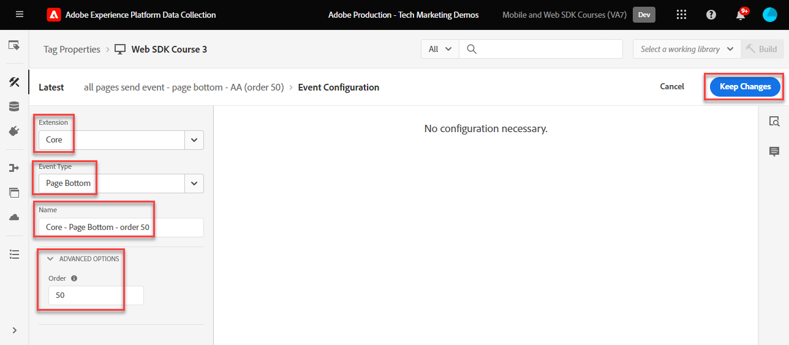
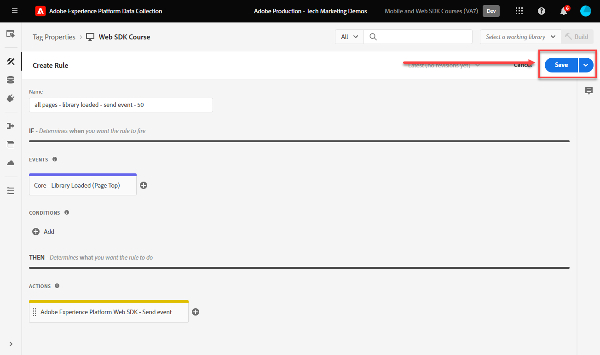
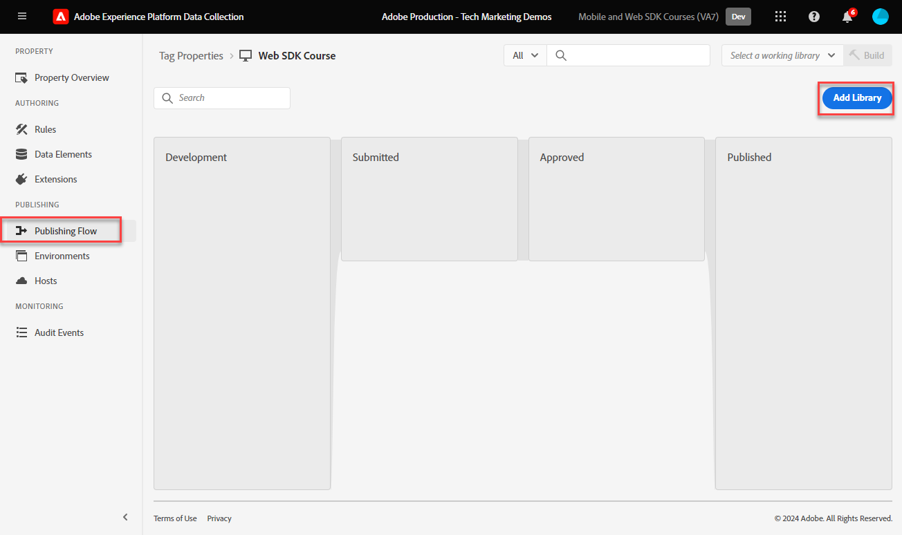

# 建立標籤規則

瞭解如何使用標籤規則，透過XDM物件將事件傳送至Platform Edge Network。 標籤規則是事件、條件和動作的組合，可告知標籤屬性執行動作。

>[!NOTE]
>
> 為了示範，本課程中的練習會以期間使用的範例為基礎進行 [建立身分](create-identities.md) 步驟；傳送XDM事件動作以從上的使用者擷取內容和身分 [Luma示範網站](https://luma.enablementadobe.com/content/luma/us/en.html).

## 學習目標

在本課程結束時，您能夠：

* 使用命名慣例來管理標籤內的規則
* 在標籤規則中使用更新變數和傳送事件動作型別來傳送XDM事件
* 將標籤規則發佈至開發程式庫

## 先決條件

您熟悉資料收集標籤和 [Luma示範網站](https://luma.enablementadobe.com/content/luma/us/en.html)，而且您必須先完成本教學課程中的下列課程：

* [設定XDM結構描述](configure-schemas.md)
* [設定身分名稱空間](configure-identities.md)
* [設定資料流](configure-datastream.md)
* [安裝在標籤屬性中的Web SDK擴充功能](install-web-sdk.md)
* [建立資料元素](create-data-elements.md)
* [建立身分](create-identities.md)

## 命名慣例

若要更妥善地管理標籤中的規則，建議遵循標準命名慣例。 本教學課程使用三部分命名慣例：

* [**位置**] - [**事件**] - [**工具**] (**序列**)

其中；

1. **位置** 是規則觸發所在網站的一或多個頁面
1. **事件** 是規則的觸發器
1. **工具** 是該規則之動作步驟中使用的特定應用程式
1. **序列** 是規則相對於其他規則所應引發的順序
<!-- minor update -->

## 建立標籤規則

在標籤中，規則是用來在不同的條件下執行動作（引發呼叫）。 Platform Web SDK標籤擴充功能包含本課程將使用的兩個動作：

* **[!UICONTROL 更新變數]** 將資料元素對應至XDM欄位
* **[!UICONTROL 傳送事件]** 傳送XDM物件至Experience Platform Edge Network

首先，我們使用定義規則 **[!UICONTROL 更新變數]** 動作，定義我們要在網站的每個頁面上傳送之XDM欄位的「全域設定」（例如頁面名稱）。

然後，我們可以使用定義其他規則 **[!UICONTROL 更新變數]** 此動作會使用只能在特定條件下使用的其他欄位來補充全域XDM欄位（例如，在產品頁面上新增產品詳細資訊）。

最後，我們將使用另一個規則搭配 **[!UICONTROL 傳送事件]** 此動作會將完整的XDM物件傳送至Adobe Experience Platform Edge Network。

### 更新變數規則

#### 全域欄位

若要為全域XDM欄位建立標籤規則：

1. 開啟您在本教學課程中使用的標籤屬性

1. 前往 **[!UICONTROL 規則]** 在左側導覽列中

1. 選取 **[!UICONTROL 建立新規則]** 按鈕

   

1. 將規則命名為 `all pages global content variables - library loaded - AA (order 1)`

1. 在 **[!UICONTROL 活動]** 區段，選取 **[!UICONTROL 新增]**

   

1. 使用 **[!UICONTROL 核心擴充功能]** 並選取 `Page Bottom` 作為 **[!UICONTROL 事件型別]**

1. 在 **[!UICONTROL 名稱]** 欄位，將其命名 `Core - Page Bottom - order 1`. 這可協助您以有意義的名稱說明觸發器。

1. 選取 **[!UICONTROL 進階]** 下拉式清單並輸入 `1` 在 **[!UICONTROL 訂購]**

   >[!NOTE]
   >
   > 您輸入的數字越高，其觸發的整體作業順序越靠後。

1. 選取 **[!UICONTROL 保留變更]** 以返回主規則畫面
   

1. 在 **[!UICONTROL 動作]** 區段，選取 **[!UICONTROL 新增]**

1. 作為 **[!UICONTROL 副檔名]**，選取 **[!UICONTROL Adobe Experience Platform Web SDK]**

1. 作為 **[!UICONTROL 動作型別]**，選取 **[!UICONTROL 更新變數]**

1. 作為 **[!UICONTROL 資料元素]**，選取 `xdm.variable.content` 您已在以下位置建立： [建立資料元素](create-data-elements.md) 課程

   

現在對應您的 [!UICONTROL 資料元素] 至 [!UICONTROL 綱要] 由您的XDM物件使用。

>[!NOTE]
> 
> 您可以對應至個別屬性或整個物件。 在此範例中，您會對應至個別屬性。

1. 向下捲動，直到達到 **`web`** 物件

1. 選取以開啟

1. 將下列資料元素對應至對應的 `web` XDM變數

   * **`web.webPageDetials.name`** 至 `%page.pageInfo.pageName%`
   * **`web.webPageDetials.server`** 至 `%page.pageInfo.server%`
   * **`web.webPageDetials.siteSection`** 至 `%page.pageInfo.hierarchie1%`

1. 將 `web.webPageDetials.pageViews.value` 設為 `1`

   

1. 接下來，尋找 `identityMap` 物件並選取它

1. 將對應至 `identityMap.loginID` 資料元素

   

1. 接著，尋找eventType欄位並加以選取

1. 輸入值 `web.webpagedetails.pageViews`

   >[!WARNING]
   >
   > 此下拉式清單會填入 **`xdm.eventType`** 變數中識別資料中心。 雖然您也可以在此欄位中輸入任意格式的標籤，強烈建議您這麼做 **不要** 因為它對Platform有負面影響。

   >[!TIP]
   >
   > 若要瞭解要填入 `eventType` 欄位，您必須移至「綱要」頁面並選取 `eventType` 欄位以檢視右側邊欄上的建議值。

   >[!TIP]
   >
   > 兩者皆非 `web.webPageDetials.pageViews.value` 也不 `eventType` 設為 `web.webpagedetails.pageViews` 是Adobe Analytics將信標設為頁面檢視加以處理的必要專案，如果有標準方式來指定其他下游應用程式的頁面檢視，就十分實用。

   

1. 選取 **[!UICONTROL 保留變更]** 然後 **[!UICONTROL 儲存]** 下一個畫面中要完成規則建立的規則

#### 透過更新變數動作使用其他規則擴充XDM物件

您可以使用 **[!UICONTROL 更新變數]**  以多個循序規則傳送，擴充XDM物件後再傳送至 [!UICONTROL Platform Edge Network].

>[!TIP]
>
>規則順序會決定觸發事件時先執行哪個規則。 如果兩個規則具有相同的事件型別，數字最低的規則會先執行。
> 
>

##### 產品頁面欄位

首先，請追蹤Luma產品詳細資料頁面上的產品檢視：

1. 選取 **[!UICONTROL 新增規則]**
1. 將其命名  [!UICONTROL `ecommerce - pdp library loaded - AA (order 20)`]
1. 選取  在「事件」底下以新增觸發器
1. 在 **[!UICONTROL 副檔名]**，選取 **[!UICONTROL 核心]**
1. 在 **[!UICONTROL 事件型別]**，選取 **[!UICONTROL 頁面底部]**
1. 將其命名 `Core - Page Bottom - order 20`
1. 選取以開啟 **[!UICONTROL 進階選項]**，輸入 `20`. 這可確保規則在 `all pages global content variables - library loaded - AA (order 1)` 會設定全域內容變數，但在 `all pages send event - library loaded - AA (order 50)` 會傳送XDM事件。

   

1. 在 **[!UICONTROL 條件]**，選取 **[!UICONTROL 新增]**
1. 離開 **[!UICONTROL 邏輯型別]** 作為 **[!UICONTROL 一般]**
1. 離開 **[!UICONTROL 擴充功能]** 作為 **[!UICONTROL 核心]**
1. 選取 **[!UICONTROL 條件型別]** 作為 **[!UICONTROL 不含查詢字串的路徑]**
1. 在右側，啟用 **[!UICONTROL 規則運算式]** 切換
1. 在 **[!UICONTROL 路徑等於]** 設定 `/products/`. 對於Luma示範網站，這可確保規則僅在產品頁面上觸發
1. 選取 **[!UICONTROL 保留變更]**

   

1. 在 **[!UICONTROL 動作]** 選取 **[!UICONTROL 新增]**
1. 選取 **[!UICONTROL Adobe Experience Platform Web SDK]** 副檔名
1. 選取 **[!UICONTROL 動作型別]** 作為 **[!UICONTROL 更新變數]**
1. 向下捲動至 `commerce` 物件並選取「 」以開啟它。
1. 開啟 **[!UICONTROL 產品檢視]** 物件與集合 **[!UICONTROL 值]** 至 `1`

   

   >[!TIP]
   >
   >在XDM中設定commerce.productViews.value=1會自動對應至 `prodView` Analytics中的事件

1. 向下捲動至並選取 `productListItems` 陣列
1. 選取 **[!UICONTROL 提供個別專案]**
1. 選取 **[!UICONTROL 新增專案]**

   

   >[!CAUTION]
   >
   >此 **`productListItems`** 是 `array` 資料型別，因此預期資料會以元素集合的形式輸入。 由於Luma示範網站的資料層結構，以及由於一次只能在Luma網站上檢視一個產品，因此您可個別新增專案。 在您自己的網站上實作時，根據資料層結構，您或許可以提供整個陣列。

1. 選取以開啟 **[!UICONTROL 專案1]**
1. 將 **`productListItems.item1.SKU`** 對應到 `%product.productInfo.sku%`

   

1. 尋找 `eventType` 並將其設為 `commerce.productViews`

1. 選取 **[!UICONTROL 保留變更]**

1. 選取 **[!UICONTROL 儲存]** 儲存規則的方式

### 購物車欄位

您可以將整個陣列對應至XDM物件，前提是陣列符合XDM結構描述的格式。 自訂程式碼資料元素 `cart.productInfo` 您透過建立較早的回圈 `digitalData.cart.cartEntries` Luma上的資料層物件，並將其轉譯為 `productListItems` XDM結構描述的物件。

如需說明，請參閱Luma網站資料層（左）與轉譯資料元素（右）下方比較：

比較資料元素與 `productListItems` 結構（提示，它應該相符）。

>[!IMPORTANT]
>
>請注意數值變數的轉譯方式，以及資料層中的字串值，例如 `price` 和 `qty` 重新格式化為資料元素中的數字。 這些格式需求對於Platform中的資料完整性十分重要，並在以下期間決定： [設定方案](configure-schemas.md) 步驟。 在此範例中， **[!UICONTROL 數量]** 使用 **[!UICONTROL 整數]** 資料型別。
> 

現在，我們將陣列對應至XDM物件」

1. 建立名為的新規則 `ecommerce - cart library loaded - AA (order 20)`
1. 選取  在「事件」底下以新增觸發器
1. 在 **[!UICONTROL 副檔名]**，選取 **[!UICONTROL 核心]**
1. 在 **[!UICONTROL 事件型別]**，選取 **[!UICONTROL 頁面底部]**
1. 將其命名 `Core - Page Bottom - order 20`
1. 選取以開啟 **[!UICONTROL 進階選項]**，輸入 `20`
1. 選取 **[!UICONTROL 保留變更]**

   

1. 在 **[!UICONTROL 條件]**，選取 **[!UICONTROL 新增]**
1. 離開 **[!UICONTROL 邏輯型別]** 作為 **[!UICONTROL 一般]**
1. 離開 **[!UICONTROL 擴充功能]** 作為 **[!UICONTROL 核心]**
1. 選取 **[!UICONTROL 條件型別]** 作為 **[!UICONTROL 不含查詢字串的路徑]**
1. 在右邊， **不要** 啟用 **[!UICONTROL 規則運算式]** 切換
1. 在 **[!UICONTROL 路徑等於]** 設定 `/content/luma/us/en/user/cart.html`. 對於Luma示範網站，這可確保規則僅在購物車頁面上觸發
1. 選取 **[!UICONTROL 保留變更]**

   

1. 在 **[!UICONTROL 動作]** 選取 **[!UICONTROL 新增]**
1. 選取 **[!UICONTROL Adobe Experience Platform Web SDK]** 副檔名
1. 選取 **[!UICONTROL 動作型別]** 作為 **[!UICONTROL 更新變數]**
1. 向下捲動至 `commerce` 物件並選取「 」以開啟它。
1. 開啟 **[!UICONTROL productListView]** 物件與集合 **[!UICONTROL 值]** 至 `1`

   

   >[!TIP]
   >
   >在XDM中設定commerce.productListViews.value=1會自動對應至 `scView` Analytics中的事件

1. 向下捲動至並選取 **[!UICONTROL productListItems]** 陣列

1. 選取 **[!UICONTROL 提供整個陣列]**

1. 將對應到 **`cart.productInfo`** 資料元素

1. 選取 `eventType` 並將設為 `commerce.productListViews`

1. 選取 **[!UICONTROL 保留變更]**

1. 選取 **[!UICONTROL 儲存]** 儲存規則的方式

建立兩個其他規則，用於遵循相同模式的結帳和購買，但有下列差異：

**規則名稱**： `ecommerce - checkout library loaded - AA (order 20)`

* **[!UICONTROL 條件]**： /content/luma/us/en/user/checkout.html
* 將 `eventType` 設為 `commerce.checkouts`
* 設定 **XDM商務事件**： commerce.checkout.value至 `1`

  >[!TIP]
  >
  >這等於設定 `scCheckout` Analytics中的事件

**規則名稱**： `ecommerce - purchase library loaded - AA (order 20)`

* **[!UICONTROL 條件]**： /content/luma/us/en/user/checkout/order/thank-you.html
* 將 `eventType` 設為 `commerce.purchases`
* 設定 **XDM商務事件**： commerce.purchases.value至 `1`

  >[!TIP]
  >
  >這等於設定 `purchase` Analytics中的事件

擷取所有必要專案時還有其他步驟 `purchase` 事件變數：

1. 開啟 **[!UICONTROL 商務]** 物件
1. 開啟 **[!UICONTROL 訂購]** 物件
1. 地圖 **[!UICONTROL purchaseID]** 至 `cart.orderId` 資料元素
1. 設定 **[!UICONTROL currencyCode]** 至硬式編碼值 `USD`

   

   >[!TIP]
   >
   >這等於設定 `s.purchaseID` 和 `s.currencyCode` Analytics中的變數

1. 向下捲動至並選取 **[!UICONTROL productListItems]** 陣列
1. 選取 **[!UICONTROL 提供整個陣列]**
1. 將對應到 **`cart.productInfo.purchase`** 資料元素
1. 選取 **[!UICONTROL 儲存]**

完成後，您應該會看到下列已建立的規則。

### 傳送事件

現在您已設定變數，您可以建立第二個規則，使用將XDM物件傳送至Platform Edge Network **[!UICONTROL 傳送事件]** 動作型別。

1. 在右側，選取 **[!UICONTROL 新增規則]** 以建立其他規則

1. 將規則命名為 `all pages send event - library loaded - AA (order 50)`

1. 在 **[!UICONTROL 活動]** 區段，選取 **[!UICONTROL 新增]**

1. 使用 **[!UICONTROL 核心擴充功能]** 並選取 `Page Bottom` 作為 **[!UICONTROL 事件型別]**

1. 在 **[!UICONTROL 名稱]** 欄位，將其命名 `Core - Page Bottom - order 50`. 這可協助您以有意義的名稱說明觸發器。

1. 選取 **[!UICONTROL 進階]** 下拉式清單並輸入 `50` 在 **[!UICONTROL 訂購]**. 這將確保第二個規則會在您設定為觸發的第一個規則之後觸發 `1`.

1. 選取 **[!UICONTROL 保留變更]** 以返回主規則畫面
   

1. 在 **[!UICONTROL 動作]** 區段，選取 **[!UICONTROL 新增]**

1. 作為 **[!UICONTROL 副檔名]**，選取  **[!UICONTROL Adobe Experience Platform Web SDK]**

1. 作為  **[!UICONTROL 動作型別]**，選取  **[!UICONTROL 傳送事件]**

1. 作為 **[!UICONTROL XDM]**，選取 `xdm.variable.content` 在上一課程中建立的資料元素

1. 選取 **[!UICONTROL 保留變更]** 以返回主規則畫面

   
1. 選取 **[!UICONTROL 儲存]** 儲存規則的方式

   

## 在程式庫中發佈規則

接下來，將規則發佈至您的開發環境，以便您可以驗證其是否有效。

若要建立程式庫：

1. 前往 **[!UICONTROL 發佈流程]** 在左側導覽列中

1. 選取 **[!UICONTROL 新增程式庫]**

   
1. 對於 **[!UICONTROL 名稱]**，輸入 `Luma Web SDK Tutorial`
1. 對於 **[!UICONTROL 環境]**，選取 `Development`
1. 選取  **[!UICONTROL 新增所有變更的資源]**

   >[!NOTE]
   >
   >    除了Adobe Experience Platform Web SDK擴充功能和 `all pages global content variables - library loaded - AA (order 50)` 規則中，您會看見前述課程中建立的標籤元件。 核心擴充功能包含所有Web標籤屬性所需的基本JavaScript。

1. 選取 **[!UICONTROL 儲存並為開發環境建置]**

   

程式庫可能需要幾分鐘的時間才能建置，建置完成後，程式庫名稱左側會顯示一個綠色點：

如您所見 [!UICONTROL 發佈流程] 畫面中，發佈程式還有許多不在本教學課程的討論範圍內。 本教學課程僅在您的開發環境中使用單一程式庫。

現在您已準備好使用Adobe Experience Platform Debugger驗證請求中的資料。

[下一個 ](validate-with-debugger.md)

>[!NOTE]
>
>感謝您投入時間學習Adobe Experience Platform Web SDK。 如果您有疑問、想分享一般意見或有關於未來內容的建議，請分享這些內容 [Experience League社群討論貼文](https://experienceleaguecommunities.adobe.com/t5/adobe-experience-platform-launch/tutorial-discussion-implement-adobe-experience-cloud-with-web/td-p/444996)
