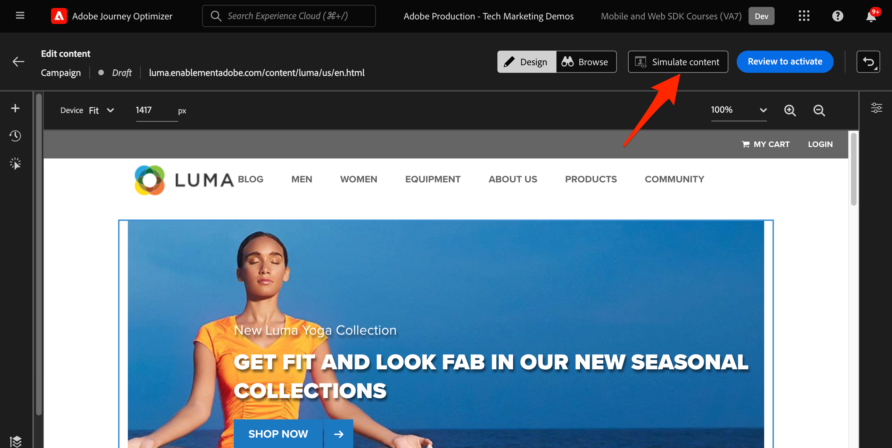

# 使用Platform Web SDK設定Web Channel

瞭解如何使用Platform Web SDK實作Web Channel。 本指南涵蓋基本Web Channel必要條件、設定的詳細步驟，以及以忠誠度狀態為中心的使用案例深入探討。

依照本指南，Journey Optimizer使用者可以使用Journey Optimizer網頁設計工具，有效套用進階線上個人化的網路管道。

## 學習目標

在本課程結束時，您能夠：

* 瞭解Web SDK在提供網路頻道體驗方面的功能和重要性。
* 利用範例Luma忠誠度獎勵使用案例，從頭到尾瞭解建立網路通路行銷活動的流程。
* 在介面中設定促銷活動屬性、動作和排程。
* 瞭解Adobe Experience Cloud Visual Editing Helper擴充功能的功用和優點。
* 瞭解如何使用網頁設計工具編輯網頁內容，包括影像、標題和其他元素。
* 瞭解如何使用優惠決定元件將優惠插入網頁。
* 請熟悉確保網路頻道行銷活動品質和成功的最佳實務。

## 先決條件

若要完成本節中的課程，您必須先：

* 確認您的AEP Web SDK版本為2.16或更高版本。
* 如果您使用Journey Optimizer網頁設計工具來製作您的網路頻道體驗，請務必使用Google Chrome或Microsoft® Edge瀏覽器。
* 另請確保您已下載Adobe Experience Cloud Visual Editing Helper瀏覽器擴充功能。 在建立Web Channel體驗之前，請在瀏覽器工具列中啟用Visual Editing Helper瀏覽器擴充功能。
   * 在Journey Optimizer網頁設計工具中，由於下列其中一個原因，某些網站可能無法可靠地開啟：
      1. 網站有嚴格的安全政策。
      1. 網站內嵌於iframe中。
      1. 無法從外部存取客戶的QA或中繼網站（這是內部網站）。
* 確認您的瀏覽器允許第三方Cookie。 可能也需要停用瀏覽器中的任何廣告封鎖程式。
* 建立Web體驗，並從Adobe Experience Manager Assets Essentials資料庫納入內容時，必須設定用於發佈此內容的子網域。 [了解更多](https://experienceleague.adobe.com/docs/journey-optimizer/using/web/web-delegated-subdomains.html?lang=en)。
* 如果使用內容實驗功能，請確保您的網路資料集也包含在您的報告設定中。
* 目前，支援兩種型別的實施，以便在Web屬性上製作和傳送Web Channel行銷活動：
   * 僅限使用者端：若要修改您的網站，您必須實作Adobe Experience Platform Web SDK。
   * 混合模式：您可以利用AEP Edge Network Server API來要求個人化伺服器端。 來自API的回應會提供給Adobe Experience Platform Web SDK，以便在使用者端上轉譯修改。 如需詳細資訊，請參閱Adobe Experience Platform Edge Network Server API檔案。 此部落格中提供混合模式的其他詳細資訊和實作範例。

>[!NOTE]
>
>目前不支援僅伺服器端實作。

## 術語

首先，您應該瞭解在網路通路行銷活動中使用的術語。

* **網頁管道**：透過網路進行通訊或內容傳送的媒體。 就本指南而言，其內容是指Adobe Journey Optimizer中，透過Platform Web SDK將個人化內容傳遞至網站訪客的機制。
* **網頁表面**：參照由傳送內容的URL所識別的Web屬性。 它可以包含單一或多個網頁。
* **Journey Optimizer Web Designer**：Journey Optimizer中的特定工具或介面，使用者可在此設計其Web Channel體驗。
* **Adobe Experience Cloud Visual Editing Helper**：一種瀏覽器擴充功能，可協助您以視覺化方式編輯和設計Web Channel體驗。
* **資料流**：Adobe Experience Platform服務中的一種設定，可確保傳遞網路頻道體驗。
* **合併原則**：此設定可確保準確啟用和發佈傳入行銷活動。
* **對象**：符合特定條件的使用者或網站訪客的特定區段。
* **網頁設計工具**：有助於視覺化編輯和設計Web體驗的介面或工具，無需深入探究程式碼。
* **運算式編輯器**：網頁設計工具中的工具，可讓使用者根據資料屬性或其他條件，將個人化新增至網頁內容。
* **優惠決定元件**：網頁設計工具中的元件，可協助您根據決策管理，決定最適合向特定訪客顯示的選件。
* **內容實驗**：測試不同內容變數的方法，以找出哪個變數在所需量度（例如入站點按）方面表現最佳。
* **處理**：在內容實驗中，處理是指標對其他內容所測試的特定內容變體。
* **模擬**：一種預覽機制，可在為即時受眾啟用該Web頻道體驗之前，將其視覺化。

## 設定資料串流

確定已在Adobe Experience Platform服務中定義資料流，且已啟用Adobe Journey Optimizer選項。 必須先設定此專案，Platform Web SDK才能提供任何Web Channel體驗。

若要在資料流中設定Adobe Journey Optimizer：

1. 前往資料收集介面。
1. 在左側導覽中選取 **資料串流**.
1. 選取先前建立的Luma Web SDK資料流。

   

1. 選取 **編輯** Adobe Experience Platform服務內。

   

1. 檢查 **Adobe Journey Optimizer** 方塊。

   

1. 選取「**儲存**」。

這可確保Adobe Experience Platform Edge可正確處理Journey Optimizer的傳入事件。

## 設定合併原則

確定已使用定義合併原則 **Active-On-Edge合併原則** 選項已啟用。 Journey Optimizer傳入頻道會使用此合併原則選項，以確保在邊緣準確啟用和發佈傳入行銷活動。

若要在合併原則中設定選項：

1. 前往 **客戶>設定檔** 介面。
1. 在導覽列中，選取 **合併原則**.
1. 選取您的原則，並切換 **Active-On-Edge合併原則** 中的選項 **設定** 步驟。

   

## 設定用於內容實驗的網路資料集

若要在Web Channel行銷活動中使用內容實驗，您必須確保使用的網路資料集也包含在您的報告設定中。 Journey Optimizer報表系統以唯讀方式使用資料集來填入OOTB內容實驗報表。

[本節詳細介紹了如何新增內容實驗報告的資料集](https://experienceleague.adobe.com/docs/journey-optimizer/using/campaigns/content-experiment/reporting-configuration.html?lang=en#add-datasets).

## 使用案例概述 — 忠誠度獎勵

在本課程中，熟客獎勵使用案例範例用於詳細說明使用Web SDK實施網路通路體驗。

此使用案例可讓您更瞭解Journey Optimizer如何運用Journey Optimizer行銷活動和Web設計工具，協助為客戶提供最佳傳入體驗。

>[!NOTE]
>
>由於本教學課程的目標是實施者，因此請注意，本課程涉及在AJO中進行大量的UI工作。 雖然此類UI工作通常由行銷人員處理，但對於實作者來說，即便他們最終並不負責建立網路通路行銷活動，獲得對流程的深入瞭解也會很有幫助。

### 建立熟客獎勵行銷活動

讓我們從Adobe Journey Optimizer中建立熟客獎勵網路頻道行銷活動開始。

若要建立範例行銷活動：

1. 在左側導覽中導覽至「歷程管理>行銷活動」
1. 按一下 **建立行銷活動** 在右上角。
1. 在 **屬性** 區段，指定您要如何執行行銷活動。 若為「熟客獎勵」使用案例，請選擇 **已排程**.

   

1. 在 **動作** 區段，選擇 **網路頻道**. 在此階段，也請選擇Web表面。

>[!NOTE]
>
>Web介面是指由傳送內容的URL所識別的Web屬性。 它可以對應至單一頁面URL或包含多個頁面，讓您在一或多個網頁上套用修改。

選擇 **頁面URL** 網頁表面選項，用於將體驗部署在此行銷活動的單一頁面上。 輸入Luma頁面的URL。

1. 定義Web表面後，選取 **建立**.

   

1. 現在新增一些其他詳細資料至新的網路頻道行銷活動。 首先，為行銷活動命名。 呼叫它&#39;*Luma忠誠度獎勵 — Gold Status - 2023年10月*&#39;. 您可以選擇新增說明至行銷活動。 同時新增 **標籤** 以改進整體行銷活動分類法。

   

1. 依預設，促銷活動對所有網站訪客都有效。 就此使用案例而言，只有金級狀態獎勵會員應該會看到體驗。 若要啟用此功能，請按一下 **選取對象** 並選擇&#39;*Luma忠誠度獎勵 — 金級狀態*&#39;對象。

1. 在 **身分名稱空間** 欄位中，選取名稱空間以識別所選區段內的個人。 由於您是在Luma網站上部署行銷活動，因此可以選擇ECID名稱空間。 「 」中的設定檔&#x200B;*Luma忠誠度獎勵 — 金級狀態*&#39;網路頻道行銷活動不會將各種身分識別中缺少ECID名稱空間的對象設為目標。

   

1. 使用排程行銷活動於12月1日開始 **行銷活動開始** 選項於12月31日結束，使用 **行銷活動結束** 選項。

   

>[!NOTE]
>
>請記住，針對網路頻道行銷活動，當訪客開啟頁面時會顯示網路體驗。 因此，與Adobe Journey Optimizer中的其他型別行銷活動不同， **動作觸發程式** 區段不可設定。

### 實驗忠誠度獎勵內容

在 **動作** 區段，您可以選擇建立實驗，以測試哪些內容更適合「*Luma忠誠度獎勵 — 金級狀態*&#39;對象。 讓我們建立並測試兩個處理作為行銷活動設定的元件。

若要建立內容實驗：

1. 按一下 **建立實驗**.

   

1. 首先選擇 **成功量度**. 這是判斷內容有效性的量度。 選擇 **不重複傳入點按次數**，以瞭解哪些內容處理產生更多點按網頁體驗CTA。

   

1. 使用Web Channel設定實驗並選擇 **傳入點按次數**， **不重複傳入點按次數**， **頁面檢視**，或 **不重複頁面檢視** 量度， **點按動作** 下拉式清單可讓您精確追蹤和監控特定頁面上的點按次數和檢視次數。

1. 您可以選擇指定 **保留樣本** 兩種處理方式均不適用。 現在不要勾選此方塊。

1. 另外，也可以選擇 **平均分配**. 核取此選項，以確保處理分割始終平均分割。

[進一步瞭解Adobe Journey Optimizer Web Channel的內容實驗](https://experienceleague.adobe.com/docs/journey-optimizer/using/campaigns/content-experiment/get-started-experiment.html?lang=en).

### 使用視覺化協助程式編輯內容

現在，讓我們編寫網路頻道體驗。 若要這麼做，請使用Adobe Experience Cloud **Visual Helper**. 此工具是與Google Chrome和Microsoft® Edge相容的瀏覽器擴充功能。 在嘗試建置您的體驗之前，請確定您已下載擴充功能。 也請確定網頁包含Web SDK。

1. 在 **動作** 索引標籤中，按一下 **編輯內容**. 由於您輸入了單一頁面URL作為介面，因此您應該已準備好開始在撰寫器中工作。

   

1. 現在按一下 **編輯網頁** 以開始編寫。

   

1. 首先，使用網頁撰寫器編輯某些元素。 使用內容功能表來編輯Luma主圖影像標題。 調整右側內容窗格的樣式。

   

1. 也使用將個人化新增至容器 **運算式編輯器**.

   

1. 請確保已正確追蹤點選體驗。 選擇 **點選追蹤元素** 從內容功能表。

   

1. 使用 **優惠決定元件** 以在網頁中插入選件。 此元件使用 **決定管理** 以挑選要傳送給Luma訪客的最佳優惠方案。

### HTML設計變更

如果您想要更進階，或對網站進行自訂變更，以作為忠誠獎勵行銷活動的元件，可使用一些方法。

使用 **元件** 窗格，直接將HTML或其他內容新增至Luma網站。

在頁面頂端新增新的HTML元件。 從設計介面編輯元件內的HTML或 **關聯式** 窗格。

或者，從新增HTML編輯 **修改** 窗格。 此窗格可讓您在頁面上選取元件，並從設計工具介面編輯元件。

在編輯器中，為「 」新增HTML *Luma忠誠度獎勵 — 金級狀態*&#39;對象。 按一下 **驗證**.

現在檢閱新的自訂HTML元件，瞭解其適應和風格。

使用編輯特定元件 **CSS選擇器型別** 修改。

使用新增自訂程式碼 **頁面 `<head>` type** 修改。

使用「 」的可能性是無限的 **Visual Helper**.

### 模擬熟客獎勵內容

在啟動行銷活動之前，檢視已修改網頁的預覽。 請記住，您必須將測試設定檔設定為模擬Web Channel體驗。

若要模擬體驗：

1. 選取 **模擬內容** 在行銷活動中。

   

1. 選擇要接收模擬的測試設定檔。 請記住，測試設定檔應在「*Luma忠誠度獎勵 — 金級狀態*」對象以得到適當的處理。

1. 測試設定檔會顯示預覽。

### 啟用忠誠度獎勵行銷活動

最後，啟動網路通路行銷活動。

1. 選取 **檢閱以啟動**.

1. 系統會提示您最後一次確認行銷活動詳細資料。 選取 **啟動**. 行銷活動最多可能需要15分鐘的時間在網站上上線。

### 熟客方案獎勵QA

作為最佳實務，請監控 **Web** 活動特定KPI的行銷活動即時和全域報告的標籤。 針對此行銷活動，監視體驗曝光數，然後按一下比率。

### 使用Adobe Experience Platform Debugger進行網頁通道驗證

適用於Chrome和Firefox的Adobe Experience Platform Debugger擴充功能會分析您的網頁，以識別Adobe Experience Cloud解決方案實作中的問題。

您可以使用Luma網站上的除錯工具，驗證生產環境中的網路通道體驗。 一旦忠誠獎勵使用案例啟動並執行，這是最佳實務，以確保所有專案皆已正確設定。

[瞭解如何使用這裡的指南，在瀏覽器中設定除錯工具](https://experienceleague.adobe.com/docs/platform-learn/data-collection/debugger/overview.html?lang=en).

若要使用除錯工具開始驗證：

1. 使用網路頻道體驗導覽至Luma網頁。
   <!--
    
    -->
1. 在網頁上，開啟 **Adobe Experience Platform debugger**.
   <!--
    
    -->
1. 瀏覽至 **摘要**. 確認 **資料串流ID** 符合 **資料流** 在 **Adobe資料彙集** 您已為其啟用Adobe Journey Optimizer的。
   <!--
    
    -->
1. 接著，您可以使用各種Luma忠誠度帳戶登入網站，並使用Debugger驗證傳送至Adobe Experience Platform Edge網路的請求。
   <!--
    
    -->
1. 在 **解決方案** 導覽至 **Experience PlatformWeb SDK**.
   <!--
    
    -->
1. 在 **設定** 標籤，切換開啟 **啟用偵錯**. 如此可啟用記錄中的工作階段 **Adobe Experience Platform保證** 工作階段。
   <!--
    
    -->
1. 使用各種Luma忠誠度帳戶登入網站，並使用除錯工具驗證傳送至的請求 **Adobe Experience Platform Edge網路**. 這些要求均應擷取至 **保證** 用於記錄追蹤。
<!--
   
-->