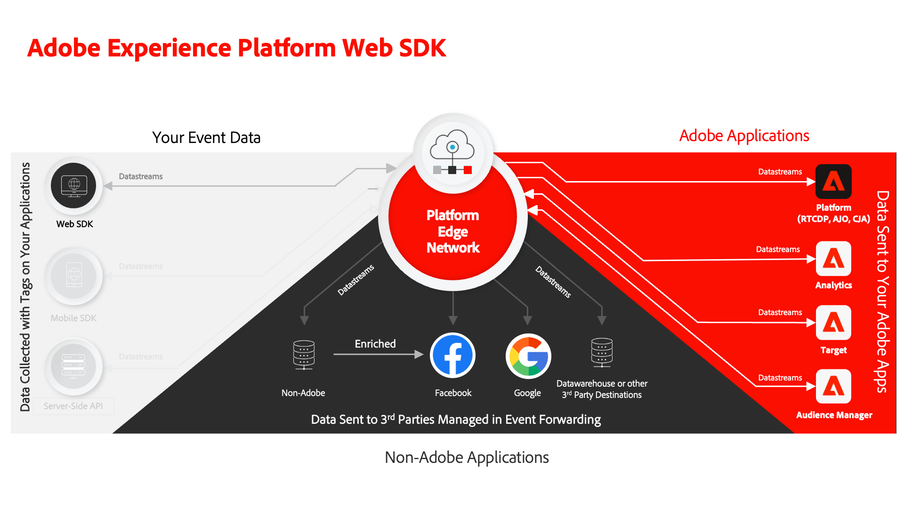

# 使用 Web SDK 教學課程實作 Adobe Experience Cloud

瞭解如何使用Adobe Experience Platform Web SDK實作Experience Cloud應用程式。

Experience Platform Web SDK是使用者端的JavaScript資料庫，可讓Adobe Experience Cloud的客戶透過Adobe Experience Platform Edge Network與Adobe應用程式和協力廠商服務互動。 另請參閱 [Adobe Experience Platform Web SDK總覽](https://experienceleague.adobe.com/docs/experience-platform/edge/home.html?lang=zh-Hant) 以取得更多詳細資訊。

本教學課程會引導您在名為Luma的範例零售網站上實作Platform Web SDK。 此 [Luma網站](https://luma.enablementadobe.com/content/luma/us/en.html) 具備豐富的資料層和功能，可讓您建置逼真的實施。 在本教學課程中，您可以：

* 使用Luma網站的Platform Web SDK實作，在您自己的帳戶中建立您自己的標籤屬性。
* 設定Web SDK實作的所有資料收集功能，例如資料串流、結構描述和身分識別名稱空間。
* 新增下列Adobe Experience Cloud應用程式：
   * **[Adobe Experience Platform](setup-experience-platform.md)** (以及以Adobe Real-time Customer Data Platform、Adobe Journey Optimizer和Adobe Customer Journey Analytics等平台建置的應用程式)
   * **[Adobe Analytics](setup-analytics.md)**
   * **[Adobe Audience Manager](setup-audience-manager.md)**
   * **[Adobe Target](setup-target.md)**
* 實作事件轉送以將Web SDK收集的資料傳送至非Adobe目的地。
* 使用Experience Platform偵錯工具和Assurance驗證您自己的Platform Web SDK實作。

完成本教學課程後，您應已準備好開始透過Platform Web SDK在您自己的網站上實作所有的行銷應用程式！

>[!NOTE]
>
>類似的多重解決方案教學課程適用於 [行動SDK](../tutorial-mobile-sdk/overview.md).

## 先決條件

所有Experience Cloud客戶都可以使用Platform Web SDK。 授權Real-time Customer Data Platform或Journey Optimizer等平台式應用程式使用Web SDK並非必要條件。

這些課程假設您擁有Adobe帳戶和完成課程所需的許可權。 如果沒有，您必須聯絡您的Experience Cloud管理員以請求存取權。

* 的 **資料彙集**，您必須具有：
   * **[!UICONTROL 平台]** — 許可權 **[!UICONTROL Web]** 如果獲得授權， **[!UICONTROL Edge]**
   * **[!UICONTROL 屬性權利]** — 許可權 **[!UICONTROL 核准]**， **[!UICONTROL 開發]**， **[!UICONTROL 編輯屬性]**， **[!UICONTROL 管理環境]**， **[!UICONTROL 管理擴充功能]**、和 **[!UICONTROL 發佈]**，
   * **[!UICONTROL 公司權利]** — 許可權 **[!UICONTROL 管理屬性]**

     如需有關標籤許可權的詳細資訊，請參閱 [說明檔案](https://experienceleague.adobe.com/docs/experience-platform/tags/admin/user-permissions.html).

* 的 **Experience Platform**，您必須具有：

   * 存取 **預設生產**， **&quot;Prod&quot;** 沙箱。
   * 存取目標 **[!UICONTROL 管理結構描述]** 和 **[!UICONTROL 檢視結構描述]** 在 **[!UICONTROL 資料模式]**.
   * 存取目標 **[!UICONTROL 管理身分識別名稱空間]** 和 **[!UICONTROL 檢視身分識別名稱空間]** 在 **[!UICONTROL Identity Management]**.
   * 存取目標 **[!UICONTROL 管理資料串流]** 和 **[!UICONTROL 檢視資料串流]** 在 **[!UICONTROL 資料彙集]**.
   * 如果您是平台式應用程式的客戶，並將完成 [設定Experience Platform](setup-experience-platform.md) 課程，您也應該有：
      * 存取 **開發** 沙箱。
      * 下的所有許可權專案 **[!UICONTROL 資料管理]**、和 **[!UICONTROL 設定檔管理]**：

     所有Experience Cloud客戶都應該可以使用所需的功能，即使您不是Real-Time CDP等平台型應用程式的客戶。

     如需有關Platform存取控制的詳細資訊，請參閱 [說明檔案](https://experienceleague.adobe.com/docs/experience-platform/access-control/home.html?lang=zh-Hant).

* （選填） **Adobe Analytics** 課程，您必須擁有 [管理員對報表套裝設定、處理規則和Analysis Workspace的存取權](https://experienceleague.adobe.com/docs/analytics/admin/admin-console/home.html?lang=zh-Hant)

* （選填） **Adobe Target** 課程，您必須擁有 [編輯者或核准者](https://experienceleague.adobe.com/docs/target/using/administer/manage-users/enterprise/properties-overview.html#section_8C425E43E5DD4111BBFC734A2B7ABC80) 存取。

* （選填） **Audience Manager** 課程，您必須有建立、讀取和寫入特徵、區段和目的地的存取權。 如需詳細資訊，請參閱以下教學課程： [Audience Manager的角色型存取控制](https://experienceleague.adobe.com/docs/audience-manager-learn/tutorials/setup-and-admin/user-management/setting-permissions-with-role-based-access-control.html?lang=en).

>[!NOTE]
>
>我們假設您熟悉HTML和JavaScript等前端開發語言。 您不需要精通這些語言，但如果您能閱讀並瞭解程式碼，可進一步瞭解本教學課程。

## 載入Luma網站

載入 [Luma網站](https://luma.enablementadobe.com/content/luma/us/en.html) 在個別的瀏覽器索引標籤中並將它加入書籤，這樣就能在教學課程中視需要輕鬆載入。 除了能夠載入我們的託管生產網站，您不需要任何其他存取Luma的許可權。

我們開始吧！

[下一步： ](configure-schemas.md)

>[!NOTE]
>
>感謝您投入時間學習Adobe Experience Platform Web SDK。 如果您有疑問、想分享一般意見或有關於未來內容的建議，請分享這些內容 [Experience League社群討論貼文](https://experienceleaguecommunities.adobe.com/t5/adobe-experience-platform-launch/tutorial-discussion-implement-adobe-experience-cloud-with-web/td-p/444996)
