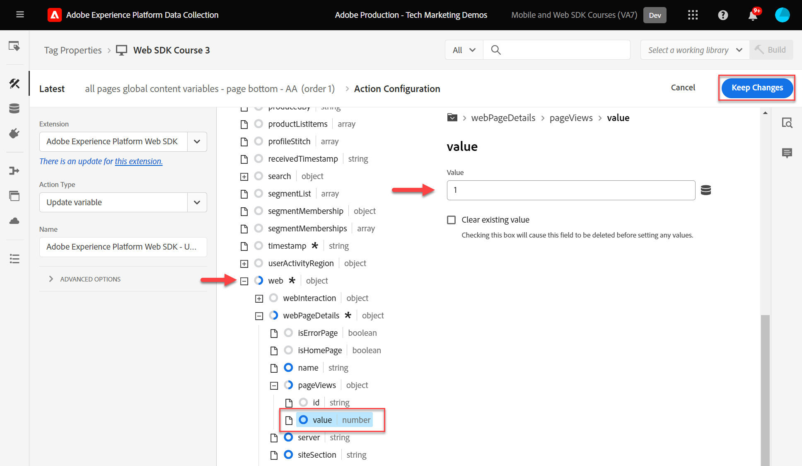
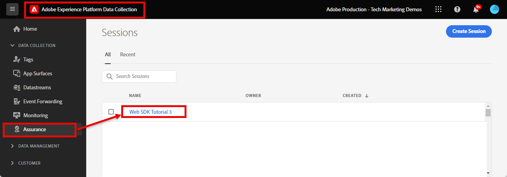
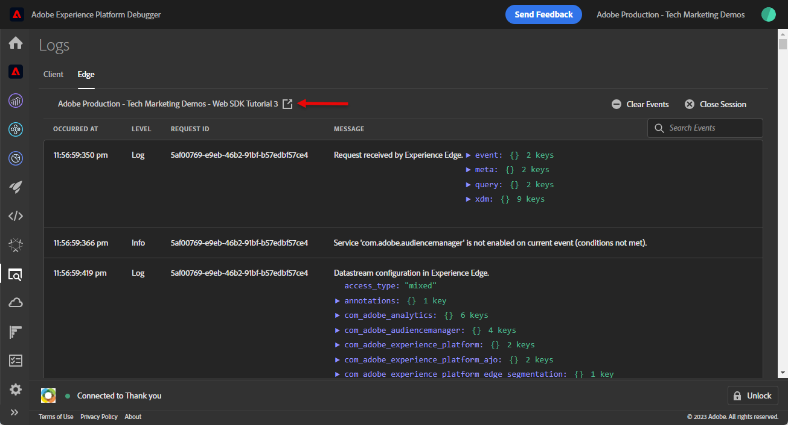

# 使用Platform Web SDK設定Adobe Analytics

瞭解如何使用設定Adobe Analytics [Experience PlatformWeb SDK](https://experienceleague.adobe.com/docs/platform-learn/data-collection/web-sdk/overview.html)，建立標籤規則以將資料傳送至Adobe Analytics，並驗證Analytics是否如預期擷取資料。

[Adobe Analytics](https://experienceleague.adobe.com/docs/analytics.html) 是領先業界的應用程式，能夠讓您從使用者觀點瞭解客戶，並掌握客戶情報來為您的企業指引方向。


## 學習目標

在本課程結束時，您將能夠：

* 為Adobe Analytics設定XDM結構描述
* 瞭解Analytics的自動對應和手動對應XDM變數之間的差異
* 設定資料流以啟用Adobe Analytics
* 覆寫資料流，將資料傳送至其他Adobe Analytics報表套裝
* 將個別或整個陣列資料元素對應至XDM物件
* 使用更新變數規則動作型別，將多個規則棧疊到一個XDM事件中
* 使用XDM物件在Adobe Analytics中擷取頁面檢視
* 使用Adobe Analytics產品字串的XDM物件擷取電子商務資料
* 使用XDM設定產品語法銷售eVar
* 驗證Adobe Analytics變數是使用Experience Platform偵錯工具透過XDM物件設定的
* 使用Adobe Analytics處理規則來設定自訂變數
* 驗證Adobe Analytics使用Adobe Experience Platform保證擷取的資料
* 驗證Adobe Analytics是否使用即時報表擷取資料

## 先決條件

您熟悉標籤、Adobe Analytics以及 [Luma示範網站](https://luma.enablementadobe.com/content/luma/us/en.html){target="_blank"} 登入和購物功能。

您至少需要一個測試/開發報表套裝ID。 如果您沒有任何可用於本教學課程的測試/開發報表套裝， [請建立一個](https://experienceleague.adobe.com/docs/analytics/admin/manage-report-suites/new-report-suite/t-create-a-report-suite.html).

您必須完成教學課程前幾節的所有步驟：

* 初始設定
   * [設定XDM結構描述](configure-schemas.md)
   * [設定身分名稱空間](configure-identities.md)
   * [設定資料流](configure-datastream.md)
* 標籤設定
   * [安裝 Web SDK 擴充功能](install-web-sdk.md)
   * [建立資料元素](create-data-elements.md)
   * [建立身分](create-identities.md)
   * [建立標籤規則](create-tag-rule.md)
   * [使用Adobe Experience Platform Debugger進行驗證](validate-with-debugger.md)

您也需要 [啟用使用者存取Adobe Experience Platform保證](https://experienceleague.adobe.com/docs/experience-platform/assurance/user-access.html) 以便您可以使用Adobe Experience Platform保證來驗證Adobe Analytics資料。 （如果您有存取結構描述、身分名稱空間和資料串流，即表示您已經可以存取Assurance）

## XDM結構描述和Analytics變數

恭喜！您已在「 」中設定與Adobe Analytics相容的結構描述 [設定結構描述](configure-schemas.md) 課程！ 不過，對於Adobe Analytics，有兩個一般方法可為Adobe Analytics定義XDM。

<!-- Implementing Platform Web SDK should be as product-agnostic as possible. For Adobe Analytics, mapping eVars, props, and events doesn't occur during schema creation, nor during the tag rules configuration as it has been done traditionally. Instead, every XDM key-value pair becomes a Context Data Variable that maps to an Analytics variable in one of two ways: 

1. Automatically mapped variables using reserved XDM fields
1. Manually mapped variables using Analytics Processing Rules

To understand what XDM variables are auto-mapped to Adobe Analytics, please see [Variables automatically mapped in Analytics](https://experienceleague.adobe.com/docs/experience-platform/edge/data-collection/adobe-analytics/automatically-mapped-vars.html?lang=en). Any variable that is not auto-mapped must be manually mapped. -->

1. **與產品無關的XDM**：維護語意索引鍵值配對XDM結構描述並使用 [Adobe Analytics處理規則](https://experienceleague.adobe.com/docs/analytics/admin/admin-tools/manage-report-suites/edit-report-suite/report-suite-general/c-processing-rules/processing-rules.html) 將XDM欄位對應至eVar、prop等。 語意XDM結構描述是指欄位名稱本身具有意義。 例如，欄位名稱 `web.webPageDetails.pageName` 比說更有意義 `prop1` 或 `evar3`.

   >[!IMPORTANT]
   >
   > XDM結構描述中的所有欄位，都可供Adobe Analytics做為前置詞為的內容資料變數使用 `a.x.`. 例如, `a.x.web.webinteraction.region`

1. **Analytics專屬的XDM**：在XDM結構描述中使用專門建置的Adobe Analytics欄位群組，稱為 `Adobe Analytics ExperienceEvent Template`

Adobe發現客戶偏好的方法是 **Analytics專屬的XDM**，因為它會略過Adobe Analytics處理規則介面中的對應步驟。 本課程中的步驟使用 **Analytics專屬的XDM** 方法。

## 將XDM對應至Adobe Analytics

許多XDM欄位會自動對應至Analytics變數。

在中建立的綱要 [設定結構描述](configure-schemas.md) 課程包含一些自動對應至Analytics變數的專案，如下表所述：

| XDM至Analytics自動對應的變數 | Adobe Analytics變數 |
|-------|---------|
| `identitymap.ecid.[0].id` | mid |
| `web.webPageDetails.name` | s.pageName |
| `web.webPageDetails.server` | s.server |
| `web.webPageDetails.siteSection` | s.channel |
| `commerce.productViews.value` | prodView |
| `commerce.productListViews.value` | scView |
| `commerce.checkouts.value` | scCheckout |
| `commerce.purchases.value` | 購買 |
| `commerce.order.currencyCode` | s.currencyCode |
| `commerce.order.purchaseID` | s.purchaseID |
| `productListItems[].SKU` | s.products=；product name；；；；； (primary - see note below) |
| `productListItems[].name` | s.products=；product name；；；；； （備援 — 請參閱下方的注意事項） |
| `productListItems[].quantity` | s.products=；；product quantity；；； |
| `productListItems[].priceTotal` | s.product=；；；product price； |

>[!NOTE]
>
>Analytics產品字串的個別區段是透過下的不同XDM變數設定的。 `productListItems` 物件。
>自2022年8月18日起， `productListItems[].SKU` 優先將對應至s.products變數中的產品名稱。
>設定為的值 `productListItems[].name` 只有在下列情況下，才會對應至產品名稱 `productListItems[].SKU` 不存在。 否則，它將會取消對應，並可在內容資料中使用。
>請勿將空字串或Null設為  `productListItems[].SKU`. 這會產生不想要的效果，讓對應至s.products變數中的產品名稱。

如需最新的對應清單，請參閱 [Adobe Experience Edge中的Analytics變數對應](https://experienceleague.adobe.com/docs/experience-platform/edge/data-collection/adobe-analytics/automatically-mapped-vars.html?lang=zh-Hant).

對於未自動對應的XDM變數，請使用 `Adobe Analytics ExperienceEvent Template` 欄位群組，詳情請見下方下一節。


## 設定資料串流

Platform Web SDK會將資料從您的網站傳送至Platform Edge Network。 您的資料流接著會通知Platform Edge Network要將資料轉送至哪個Adobe Analytics報表套裝。

1. 前往 [資料彙集](https://experience.adobe.com/#/data-collection){target="blank"} 介面
1. 在左側導覽中選取 **[!UICONTROL 資料串流]**
1. 選取先前建立的 `Luma Web SDK: Development Environment` 資料流

   

1. 選取 **[!UICONTROL 新增服務]**
   
1. 選取 **[!UICONTROL Adobe Analytics]** 作為 **[!UICONTROL 服務]**
1. 輸入  **[!UICONTROL 報告套裝ID]** 開發報表套裝的
1. 選取 **[!UICONTROL 儲存]**

   

   >[!TIP]
   >
   >選取「 」以新增更多報表套裝 **[!UICONTROL 新增報表套裝]** 等於多套裝標籤。

>[!WARNING]
>
>在本教學課程中，您只會針對開發環境設定Adobe Analytics報表套裝。 當您為自己的網站建立資料串流時，您會為中繼和生產環境建立其他資料串流和報表套裝。

### 設定資料流報表套裝覆寫

訪客位於特定頁面時，您可能會想要變更要傳送至哪個Adobe Analytics報表套裝資料。 若要設定Adobe Analytics的資料流覆寫設定：

1. 編輯 **[!UICONTROL Adobe Analytics]** 透過開啟  功能表，然後選取 **[!UICONTROL 編輯]**

   

1. 選取 **[!UICONTROL 進階選項]** 以開啟 **[!UICONTROL 報表套裝覆寫]**

1. 選取您要覆寫的報告套裝。 在這種情況下， `Web SDK Course Dev` 和 `Web SDK Course Stg`

1. 選取儲存

   

在本課程的後面部分 [建立規則以使用資料流覆寫將頁面檢視傳送至不同的報表套裝](setup-analytics.md###send-a-page-view-to-a-different-report-suite-with-datastream-override).

## 建立其他電子商務資料元素

接著，從Luma資料層擷取其他資料，並傳送至Platform Edge Network。 雖然本課程著重於常見的Adobe Analytics需求，但根據您的資料流設定，所有擷取的資料都可以輕鬆傳送至其他目的地。 例如，如果您已完成Adobe Experience Platform課程，您在本課程中擷取的其他資料也會傳送至Platform。

在建立資料元素課程中，您 [已建立的JavaScript資料元素](create-data-elements.md#create-data-elements-to-capture-the-data-layer) 擷取的內容和身分詳細資訊。 現在您可以建立其他資料元素來擷取電子商務資料。 因為 [Luma示範網站](https://luma.enablementadobe.com/content/luma/us/en.html){target="_blank"} 針對產品詳細資料頁面和購物車中的產品使用不同的資料層結構，您必須為每個案例建立個別的資料元素。 使用自訂程式碼資料元素從Luma資料層取得您需要的內容，在您自己的網站上實作時，這可能不是必要的。 在這種情況下，您必須重複執行一系列購物車專案，以抓取每個產品的特定詳細資料。 使用以下提供的程式碼片段：

1. 開啟您在本教學課程中使用的標籤屬性

1. 前往 **[!UICONTROL 資料元素]**

1. 選取 **[!UICONTROL 新增資料元素]**

1. 將其命名 **`product.productInfo.sku`**

1. 使用 **[!UICONTROL 自訂程式碼]** **[!UICONTROL 資料元素型別]**

1. 保留核取方塊 **[!UICONTROL 強制小寫值]** 和 **[!UICONTROL 清除文字]** 未勾選

1. 離開 `None` 作為 **[!UICONTROL 儲存期間]** 設定，因為每個頁面上的這個值都不相同

1. 選取 **[!UICONTROL 開啟編輯器]**

   

1. 複製並貼上下列程式碼


   ```javascript
   var cart = digitalData.product;
   var cartItem;
   cart.forEach(function(item){
   cartItem = item.productInfo.sku;
   });
   return cartItem;
   ```

1. 選取 **[!UICONTROL 儲存]** 儲存自訂程式碼的方式

1. 選取 **[!UICONTROL 儲存]** 儲存資料元素的方式

請依照相同的步驟建立這些其他資料元素：

* **`product.productInfo.title`**

  ```javascript
  var cart = digitalData.product;
  var cartItem;
  cart.forEach(function(item){
  cartItem = item.productInfo.title;
  });
  return cartItem;
  ```

<!--* **`product.productInfo.name`**

    ```javascript
    var cart = digitalData.product;
    var cartItem;
    cart.forEach(function(item){
    cartItem = item.productInfo.name;
    });
    return cartItem;
    ```-->

<!--* **`cart.productInfo`**

    ```javascript
    var cart = digitalData.cart.cartEntries; 
    var cartItem = [];
    cart.forEach(function(item, index, array){
    var qty;
    if(window.location.pathname.includes("thank-you.html")){
    qty = parseInt(item.qty);
    }else{
    qty = "";
    }
    var price = parseInt(item.price);
    cartItem.push({
    "SKU": item.sku,
    "quantity": qty,
    "priceTotal": price
    });
    });
    return cartItem; 
    ```-->

* **`cart.productInfo`**

  ```javascript
  var cart = digitalData.cart.cartEntries; 
  var cartItem = [];
  cart.forEach(function(item, index, array){
  cartItem.push({
  "SKU": item.sku
  });
  });
  return cartItem; 
  ```

* **`cart.productInfo.purchase`**

  ```javascript
  var cart = digitalData.cart.cartEntries; 
  var cartItem = [];
  cart.forEach(function(item, index, array){
  var qty = parseInt(item.qty);
  var price = parseInt(item.price);
  cartItem.push({
  "SKU": item.sku,
  "quantity": qty,
  "priceTotal": price
  });
  });
  return cartItem; 
  ```

  >[!TIP]
  >
  > 此程式碼片段包含產品銷售eVar課程期間使用的自訂eVar1設定

新增這些資料元素並在中建立先前的資料元素後 [建立資料元素](create-data-elements.md) 課程，您應具備下列資料元素：

| 資料元素 |
-----------------------------|
| `cart.orderId` |
| `cart.productInfo` |
| `cart.productInfo.purchase` |
| `identityMap.loginID` |
| `page.pageInfo.hierarchie1` |
| `page.pageInfo.pageName` |
| `page.pageInfo.server` |
| `product.productInfo.sku` |
| `product.productInfo.title` |
| `user.profile.attributes.loggedIn` |
| `user.profile.attributes.username` |
| `xdm.variable.content` |

<!-- 
>[!IMPORTANT]
>
>In this tutorial, you will create a different XDM object for each event. That means you must remap variables that would be considered to be "globally" available on every hit, such as page name and identityMap. However, you may [Merge Objects](https://experienceleague.adobe.com/docs/experience-platform/tags/extensions/adobe/core/overview.html#merged-objects) or use [Mapping Tables](https://exchange.adobe.com/experiencecloud.details.103136.mapping-table.html) to manage your XDM objects more efficiently in a real-life situation. For this lesson, the global variables are considered as:
>
>* **[!UICONTROL identityMap]** to capture the authenticated ID as per the [Create Identity Map Data Element](create-data-elements.md#create-identity-map-data-element) exercise in the [Create Data Elements](create-data-elements.md) lesson.
>* **[!UICONTROL web]** object to capture content as per the [content XDM object](create-data-elements.md#map-content-data-elements-to-XDM-Schema-individually) exercise in the [Create Data Elements](create-data-elements.md) lesson on every data element above. 
-->

## 建立其他規則

在 [建立標籤規則](create-tag-rule.md) 課程，您已設定 `all pages global content variables - page bottom - AA (order 1)` 規則 [已使用建立基準線XDM物件 **[!UICONTROL 更新變數]** **[!UICONTROL 動作型別]**](create-tag-rule.md#create-tag-rule). 下列練習會擴充該XDM物件，以擷取特定頁面的其他特定資料。

### 增加頁面檢視

由於您現在正將資料傳送至Adobe Analytics，建議您對應額外的XDM欄位以指出頁面檢視。 雖然從技術上講，Analytics不需要將信標作為頁面檢視來處理，但為其他下游應用程式指出頁面檢視的標準方式會很有用。

1. 開啟 `all pages global content variables - page bottom - AA (order 1)` 規則
1. 開啟 **[!UICONTROL 更新變數]** 動作
1. 向下捲動並選取以開啟，直到 `web.webPageDetails`
1. 選取以開啟 **[!UICONTROL pageViews]** 物件
1. 設定 **[!UICONTROL 值]** 至 `1`
1. 選取 **[!UICONTROL 保留變更]**

   


### 透過資料流覆寫將頁面檢視傳送至不同的報表套裝

建立規則，將額外的頁面檢視呼叫傳送至不同的報表套裝。 使用資料流覆寫功能來變更頁面的報告套裝，使用 **[!UICONTROL 傳送事件]** 動作。

1. 建立新規則，將其命名 `homepage report suite override - page bottom - AA (order 51)`

1. 選取下方的加號 **[!UICONTROL 事件]** 新增觸發器的方式

1. 在 **[!UICONTROL 副檔名]**，選取 **[!UICONTROL 核心]**

1. 在 **[!UICONTROL 事件型別]**，選取 **[!UICONTROL 頁面底部]**

1. 將其命名 `Core - Page Bottom - order 51`

1. 選取以開啟 **[!UICONTROL 進階選項]**，輸入 `51`. 這可確保規則在 `all pages global content variables - page bottom - AA (order 50)` 使用設定基線XDM **[!UICONTROL 更新變數]** 動作型別。

   

1. 在 **[!UICONTROL 條件]**，選取 **[!UICONTROL 新增]**

1. 離開 **[!UICONTROL 邏輯型別]** 作為 **[!UICONTROL 一般]**

1. 離開 **[!UICONTROL 擴充功能]** 作為 **[!UICONTROL 核心]**

1. 選取 **[!UICONTROL 條件型別]** 作為 **[!UICONTROL 不含查詢字串的路徑]**

1. 在右側，離開 **[!UICONTROL 規則運算式]** 切換已停用

1. 在 **[!UICONTROL 路徑等於]** 設定 `/content/luma/us/en.html`. 對於Luma示範網站，這可確保規則只會在首頁上觸發

1. 選取 **[!UICONTROL 保留變更]**

   

1. 在 **[!UICONTROL 動作]** 選取 **[!UICONTROL 新增]**

1. 作為 **[!UICONTROL 副檔名]**，選取 **[!UICONTROL Adobe Experience Platform Web SDK]**

1. 作為 **[!UICONTROL 動作型別]**，選取 **[!UICONTROL 傳送事件]**

1. 作為 **[!UICONTROL 型別]**，選取 `web.webpagedetails.pageViews`

1. 作為 **[!UICONTROL XDM資料]**，選取 `xdm.variable.content` 您已在以下位置建立： [建立資料元素](create-data-elements.md) 課程

   

1. 向下捲動至 **[!UICONTROL 資料流設定覆寫]** 區段

1. 離開 **[!UICONTROL 開發]** 標籤已選取。

   >[!TIP]
   >
   >    此索引標籤會決定要在哪個標籤環境中發生覆寫。 對於此體驗，您只需指定開發環境，但當您將此部署至生產環境時，請記得也在 **[!UICONTROL 生產]** 環境。


1. 選取 **[!UICONTROL 資料流]**，在本例中 `Luma Web SDK: Development Environment`

1. 在 **[!UICONTROL 報表套裝]**，選取您要用來覆寫的報告網站。 在這種情況下， `tmd-websdk-course-stg`.


   >[!TIP]
   >
   >此處顯示的報表套裝清單，是由下列專案決定： [設定資料流報告套裝覆寫](configure-datastream.md###configure-a-datastream-report-suite-override) 步驟。 新增報表套裝就等於使用多套裝標籤。

1. 選取 **[!UICONTROL 保留變更]**

1. 與 **[!UICONTROL 儲存]** 您的規則

   

### 使用更新變數擴充XDM物件

使用 **[!UICONTROL 更新變數]** 動作型別您可以建立其他規則，在「全域內容XDM」傳送至 [!UICONTROL Platform Edge Network]. 若要完成此作業，請先排序新規則，然後再排序 `all pages send event - page bottom - AA (order 50)` 會傳送事件 [!UICONTROL Platform Edge Network].

>[!TIP]
>
>規則順序會決定觸發事件時先執行哪個規則。 如果兩個規則具有相同的事件型別，數字最低的規則會先執行。
> 
>

## 設定產品字串

在對應至產品字串之前，請務必瞭解XDM結構描述中有兩個主要物件，用於擷取與Adobe Analytics有特殊關係的電子商務資料：

1. 此 `commerce` 物件會設定Analytics事件，例如 `prodView`， `scView`、和 `purchase`
1. 此 `productListItems` 物件會設定Analytics維度，例如 `productID`.

另請參閱 [收集商務和產品資料](https://experienceleague.adobe.com/docs/experience-platform/edge/data-collection/collect-commerce-data.html?lang=en) 以取得更多詳細資料。


首先，請追蹤Luma產品詳細資料頁面上的產品檢視。

1. 從左側導覽中選取 **[!UICONTROL 規則]** 然後選取 **[!UICONTROL 新增規則]**
1. 將其命名  [!UICONTROL `ecommerce - pdp page bottom - AA (order 20)`]
1. 選取  在「事件」底下以新增觸發器
1. 在 **[!UICONTROL 副檔名]**，選取 **[!UICONTROL 核心]**
1. 在 **[!UICONTROL 事件型別]**，選取 **[!UICONTROL 頁面底部]**
1. 將其命名 `Core - Page Bottom - order 20`
1. 選取以開啟 **[!UICONTROL 進階選項]**，輸入 `20`. 這可確保規則在 `all pages global content variables - page bottom - AA (order 1)` 會設定全域內容變數，但在 `all pages send event - page bottom - AA (order 50)` 會傳送XDM事件。

   

1. 在 **[!UICONTROL 條件]**，選取 **[!UICONTROL 新增]**
1. 離開 **[!UICONTROL 邏輯型別]** 作為 **[!UICONTROL 一般]**
1. 離開 **[!UICONTROL 擴充功能]** 作為 **[!UICONTROL 核心]**
1. 選取 **[!UICONTROL 條件型別]** 作為 **[!UICONTROL 不含查詢字串的路徑]**
1. 在右側，啟用 **[!UICONTROL 規則運算式]** 切換
1. 在 **[!UICONTROL 路徑等於]** 設定 `/products/`. 對於Luma示範網站，這可確保規則僅在產品頁面上觸發
1. 選取 **[!UICONTROL 保留變更]**

   

1. 在 **[!UICONTROL 動作]** 選取 **[!UICONTROL 新增]**
1. 選取 **[!UICONTROL Adobe Experience Platform Web SDK]** 副檔名
1. 選取 **[!UICONTROL 動作型別]** 作為 **[!UICONTROL 更新變數]**
1. 向下捲動至 `commerce` 物件並選取「 」以開啟它。
1. 開啟 **[!UICONTROL 產品檢視]** 物件與集合 **[!UICONTROL 值]** 至 `1`

   

   >[!TIP]
   >
   >在XDM中設定commerce.productViews.value=1會自動對應至 `prodView` Analytics中的事件

另外，請務必瞭解您可以 **[!UICONTROL 提供個別屬性]** 至個別XDM欄位或 **[!UICONTROL 提供整個陣列]** 到XDM物件。


### 將個別屬性對應至XDM物件

由於Luma上的資料層結構，您可以對應至個別變數，以擷取Luma示範網站產品詳細資料頁面上的資料。

1. 向下捲動至並選取 `productListItems` 陣列
1. 選取 **[!UICONTROL 提供個別專案]**
1. 選取 **[!UICONTROL 新增專案]**

   

   >[!CAUTION]
   >
   >此 **`productListItems`** 是 `array` 資料型別，因此預期資料會以元素集合的形式輸入。 由於Luma示範網站的資料層結構，以及由於一次只能在Luma網站上檢視一個產品，因此您可個別新增專案。 在您自己的網站上實作時，根據資料層結構，您或許可以提供整個陣列。

1. 選取以開啟 **[!UICONTROL 專案1]**
1. 將 **`productListItems.item1.SKU`** 對應到 `%product.productInfo.sku%`

   

1. 尋找 `eventType` 並將其設為 `commerce.productViews`

1. 尚未選取保留變更

### 在產品字串中設定銷售eVar

藉由使用 `Adobe Analytics ExperienceEvent Template` 欄位群組若要定義XDM結構，您可以將變數對應至產品字串內的銷售eVar或事件。 這也稱為設定 **產品語法銷售**. 請注意 `_experience` 下的物件 `productListItems` > `Item 1`. 在此之下設定任何變數 [!UICONTROL 物件] 設定產品語法eVar或事件。

1. 選取以開啟 `_experience > analytics > customDimensions > eVars > eVar1`

1. 設定 **[!UICONTROL 值]** 至 `%product.productInfo.title%`

1. 選取 **[!UICONTROL 保留變更]**

   

1. 選取 **[!UICONTROL 儲存]** 儲存規則的方式

<!--
1. The **[!UICONTROL Type]** field has a drop-down list of values to choose from. Select `[!UICONTROL commerce.productViews]`

    [!TIP]
    >
    >The value selected here has no effect on how data is mapped to Analytics, however it is recommended to thoughtfully apply this variable, as it is used in Adobe Experience Platform's segment builder interface. The value selected is available to use in the `[!UICONTROL c.a.x.eventtype]` context data variable downstream.

1. Under **[!UICONTROL XDM Data]**, select the `[!UICONTROL xdm.commerce.prodView]` XDM object data element
1. Select **[!UICONTROL Keep Changes]**

    

1. Your rule should look similar to the below. Select **[!UICONTROL Save]**

     -->


### 將整個陣列對應至XDM物件

如前所述，Luma示範網站對購物車中的產品使用不同的資料層結構。 自訂程式碼資料元素 `cart.productInfo` 您透過建立較早的回圈 `digitalData.cart.cartEntries` 資料層物件並將其轉譯為必要的XDM物件結構描述。 新格式 **必須完全符合** 由定義的綱要 `productListItems` XDM結構描述的物件。

如需說明，請參閱Luma網站資料層（左）與轉譯資料元素（右）下方比較：


比較資料元素與 `productListItems` 結構（提示，它應該相符）。

>[!IMPORTANT]
>
>請注意數值變數的轉譯方式，以及資料層中的字串值，例如 `price` 和 `qty` 重新格式化為資料元素中的數字。 這些格式需求對於Platform中的資料完整性十分重要，並在以下期間決定： [設定方案](configure-schemas.md) 步驟。 在此範例中， **[!UICONTROL 數量]** 使用 **[!UICONTROL 整數]** 資料型別。
> 

現在回到將XDM物件對應至整個陣列。 重複建立 `ecommerce - pdp page bottom - AA (order 20)` 規則：

1. 將其命名  [!UICONTROL `ecommerce - cart page bottom - AA (order 20)`]
1. 選取  在「事件」底下以新增觸發器
1. 在 **[!UICONTROL 副檔名]**，選取 **[!UICONTROL 核心]**
1. 在 **[!UICONTROL 事件型別]**，選取 **[!UICONTROL 頁面底部]**
1. 將其命名 `Core - Page Bottom - order 20`
1. 選取以開啟 **[!UICONTROL 進階選項]**，輸入 `20`
1. 選取 **[!UICONTROL 保留變更]**

   

1. 在 **[!UICONTROL 條件]**，選取 **[!UICONTROL 新增]**
1. 離開 **[!UICONTROL 邏輯型別]** 作為 **[!UICONTROL 一般]**
1. 離開 **[!UICONTROL 擴充功能]** 作為 **[!UICONTROL 核心]**
1. 選取 **[!UICONTROL 條件型別]** 作為 **[!UICONTROL 不含查詢字串的路徑]**
1. 在右邊， **不要** 啟用 **[!UICONTROL 規則運算式]** 切換
1. 在 **[!UICONTROL 路徑等於]** 設定 `/content/luma/us/en/user/cart.html`. 對於Luma示範網站，這可確保規則僅在購物車頁面上觸發
1. 選取 **[!UICONTROL 保留變更]**

   

1. 在 **[!UICONTROL 動作]** 選取 **[!UICONTROL 新增]**
1. 選取 **[!UICONTROL Adobe Experience Platform Web SDK]** 副檔名
1. 選取 **[!UICONTROL 動作型別]** 作為 **[!UICONTROL 更新變數]**
1. 向下捲動至 `commerce` 物件並選取「 」以開啟它。
1. 開啟 **[!UICONTROL productListView]** 物件與集合 **[!UICONTROL 值]** 至 `1`

   

   >[!TIP]
   >
   >在XDM中設定commerce.productListViews.value=1會自動對應至 `scView` Analytics中的事件

<!--1. Create an **[!UICONTROL XDM object]** **[!UICONTROL Data Element Type]** named **`xdm.commerce.cartView`**
1. Select the same Platform sandbox and XDM schema you are using for this tutorial
1. Open the **[!UICONTROL commerce]** object
1. Open the **[!UICONTROL productListViews]** object and set `value` to `1`

    >[!TIP]
    >
    >This step is equivalent to setting `scView` event in Analytics -->

1. 向下捲動至並選取 **[!UICONTROL productListItems]** 陣列

1. 選取 **[!UICONTROL 提供整個陣列]**

1. 將對應到 **`cart.productInfo`** 資料元素

1. 選取 `eventType` 並將設為 `commerce.productListViews`

1. 選取 **[!UICONTROL 保留變更]**

1. 選取 **[!UICONTROL 儲存]** 儲存規則的方式

建立兩個其他規則，用於遵循相同模式的結帳和購買，但有下列差異：

**規則名稱**： `ecommerce - checkout page bottom - AA (order 20)`

* **[!UICONTROL 條件]**： /content/luma/us/en/user/checkout.html
* 將 `eventType` 設為 `commerce.checkouts`
* 設定 **XDM商務事件**： commerce.checkout.value至 `1`

  >[!TIP]
  >
  >這等於設定 `scCheckout` Analytics中的事件

**規則名稱**： `ecommerce - purchase page bottom - AA (order 20)`

* **[!UICONTROL 條件]**： /content/luma/us/en/user/checkout/order/thank-you.html
* 將 `eventType` 設為 `commerce.purchases`
* 設定 **XDM商務事件**： commerce.purchases.value至 `1`

  >[!TIP]
  >
  >這等於設定 `purchase` Analytics中的事件

擷取所有必要專案時還有其他步驟 `purchase` 事件變數：

1. 開啟 **[!UICONTROL 商務]** 物件
1. 開啟 **[!UICONTROL 訂購]** 物件
1. 地圖 **[!UICONTROL purchaseID]** 至 `cart.orderId` 資料元素
1. 設定 **[!UICONTROL currencyCode]** 至硬式編碼值 `USD`

   

   >[!TIP]
   >
   >這等於設定 `s.purchaseID` 和 `s.currencyCode` Analytics中的變數


1. 向下捲動至並選取 **[!UICONTROL productListItems]** 陣列
1. 選取 **[!UICONTROL 提供整個陣列]**
1. 將對應到 **`cart.productInfo.purchase`** 資料元素
1. 選取 **[!UICONTROL 儲存]**

完成後，您應該會看到下列已建立的規則。


<!--
## Create additional rules for Platform Web SDK

With the **[!UICONTROL Update variabl]**e and **[!UICONTROL Send Event]** Action Types of Platform Web SDK, its possible to sequence the **[!UICONTROL Send Event]** action to trigger after all **[!UICONTROL Update variable]** action types run. This is called Rule Stacking, and you use it to customize the baseline XDM created depending on the type of page you are on.  

In this exercise, you create individual rules per e-commerce event and use conditions so the rules fire on the right pages. 

Repeat the same for all other e-commerce events using the following parameters:

**Rule name**: cart view - library load - AA

* **[!UICONTROL Event Type]**: Library Loaded (Page Top)
* **[!UICONTROL Condition]**: /content/luma/us/en/user/cart.html
* **Type value under Web SDK - Send Action**: commerce.productListViews
* **XDM data for Web SDK - Send Action:** `%xdm.commerce.cartView%`

**Rule name**: checkout - library load - AA

* **[!UICONTROL Event Type]**: Library Loaded (Page Top)
* **[!UICONTROL Condition]** /content/luma/us/en/user/checkout.html
* **Type for Web SDK - Send Action**: commerce.checkouts
* **XDM data for Web SDK - Send Action:** `%xdm.commerce.checkout%`

**Rule name**: purchase - library load - AA

* **[!UICONTROL Event Type]**: Library Loaded (Page Top)
* **[!UICONTROL Condition]** /content/luma/us/en/user/checkout/order/thank-you.html
* **Type for Web SDK - Send Action**: commerce.purchases
* **XDM data for Web SDK - Send Action:** `%xdm.commerce.purchase%`
-->


## 建置您的開發環境

將新的資料元素和規則新增至 `Luma Web SDK Tutorial` 標籤程式庫並重新建置開發環境。

恭喜！下一步是透過Experience Platform Web SDK驗證您的Adobe Analytics實作。

## 驗證適用於Platform Web SDK的Adobe Analytics

在 [Debugger](validate-with-debugger.md) 您已經瞭解如何使用Platform Debugger和瀏覽器開發人員控制檯檢查使用者端XDM請求，其方式與偵錯類似。 `AppMeasurement.js` Analytics實施。 您也瞭解如何驗證傳送至Adobe應用程式的Platform Edge Network伺服器端要求，以及如何使用Assurance檢視完全處理的裝載。

Experience Platform若要驗證Analytics是否透過Analytics Web SDK正確擷取資料，您必須進一步執行下列兩個步驟：

1. 使用Experience Platform Debugger的邊緣追蹤功能，驗證Platform Edge Network上XDM物件處理資料的方式
1. 驗證Analytics使用處理規則和即時報表處理資料的方式
1. 使用Adobe Experience Platform保證驗證Analytics完全處理資料的方式

### 使用邊緣追蹤

瞭解如何使用Experience Platform Debugger的邊緣追蹤功能驗證Adobe Analytics是否正在擷取ECID、頁面檢視、產品字串以及電子商務事件。

### Experience CloudID驗證

1. 前往 [Luma示範網站](https://luma.enablementadobe.com/content/luma/us/en.html){target="_blank"}
1. 選取右上方的登入按鈕，並使用認證u： test@adobe.com p：測試進行驗證
1. 開啟Experience Platform Debugger並 [將網站上的tag屬性切換為您自己的開發屬性](validate-with-debugger.md#use-the-experience-platform-debugger-to-map-to-your-tags-property)


1. 若要啟用邊緣追蹤，請前往Experience Platform偵錯工具，在左側導覽中選取 **[!UICONTROL 記錄檔]**，然後選取 **[!UICONTROL Edge]** 標籤，然後選取 **[!UICONTROL 連線]**

   

1. 目前會是空的

   

1. 重新整理Luma頁面並再次檢查Experience Platform Debugger，您應該會看到資料傳入。 開頭為的列 **[!UICONTROL Analytics自動對應]** 是Adobe Analytics信標
1. 選取以同時開啟 `[!UICONTROL mappedQueryParams]` 用於檢視Analytics變數的下拉式清單和第二個下拉式清單

   

   >[!TIP]
   >
   >第二個下拉式清單會對應至您傳送資料的Analytics報表套裝ID。 這應與您自己的報表套裝相符，而非熒幕擷圖中的報表套裝。

1. 向下捲動以尋找 `[!UICONTROL c.a.x.identitymap.ecid.[0].id]`. 這是可擷取ECID的內容資料變數
1. 持續向下捲動，直到看到Analytics為止 `[!UICONTROL mid]` 變數中。 兩個ID都和裝置的Experience CloudID相符。
1. 在Luma網站上，

   

   >[!NOTE]
   >
   >由於您已登入，請花點時間驗證驗證的ID `112ca06ed53d3db37e4cea49cc45b71e` 適用於使用者 **`test@adobe.com`** 也會擷取至 `[!UICONTROL c.a.x.identitymap.lumacrmid.[0].id]`

### 報表套裝覆寫

在您上方設定的「 」資料流覆寫 [Luma首頁](https://luma.enablementadobe.com/content/luma/us/en.html).  驗證此設定的方式

1. 尋找含有以下專案的列： **[!UICONTROL 套用覆寫後的資料流設定]**. 您可在這裡找到針對報表套裝覆寫設定的主要報表套裝和其他報表套裝。

   

1. 向下捲動至一列，開頭為 **[!UICONTROL Analytics自動對應]**  並確認 `[!UICONTROL reportSuiteIds]` 顯示您在覆寫設定中指定的報表套裝

   

### 內容頁面檢視

前往產品頁面，例如 [Didi Sport Watch產品頁](https://luma.enablementadobe.com/content/luma/us/en/products/gear/watches/didi-sport-watch.html#24-WG02).  驗證Analytics是否擷取內容頁面檢視。

1. 尋找 `[!UICONTROL c.a.x.web.webpagedetails.pageviews.value]=1`.
1. 向下捲動以檢視 `[!UICONTROL gn]` 變數中。 這是Analytics的動態語法 `[!UICONTROL s.pageName]` 變數中。 它會從資料層擷取頁面名稱。

   

### 產品字串和電子商務事件

由於您已在產品頁面上，此練習會繼續使用相同的邊緣追蹤來驗證Analytics所擷取的產品資料。 產品字串和電子商務事件都會自動將XDM變數對應至Analytics。 只要您已對應至適當的 `productListItem` XDM變數，而 [為Adobe Analytics設定XDM結構描述](setup-analytics.md#configure-an-xdm-schema-for-adobe-analytics)，Platform Edge Network會負責將資料對應至適當的分析變數。

**首先驗證 `Product String` 已設定**

1. 尋找 `[!UICONTROL c.a.x.productlistitems.][0].[!UICONTROL sku]`. 變數會擷取您對應至的資料元素值 `productListItems.item1.sku` 本課程稍早
1. 同時尋找 `[!UICONTROL c.a.x.productlistitems.][0].[!UICONTROL _experience.analytics.customdimensions.evars.evar1]`. 變數會擷取您對應至的資料元素值 `productListItems.item1._experience.analytics.customdimensions.evars.evar1`
1. 向下捲動以檢視 `[!UICONTROL pl]` 變數中。 這是Analytics產品字串變數的動態語法
1. 請注意，資料層的產品名稱會同時對應至 `[!UICONTROL c.a.x.productlistitems.][0].[!UICONTROL sku]` 和 `[!UICONTROL product]` 產品字串的引數。  此外，資料層的產品標題會對應至產品字串中的銷售evar1。

   

   邊緣軌跡處理 `commerce` 事件與略有不同 `productList` 維度。 您不會看到內容資料變數的對應方式，與您看到產品名稱對應的方式相同 `[!UICONTROL c.a.x.productlistitem.[0].name]` 以上。 邊緣追蹤反而會在Analytics中顯示最終事件自動對應 `event` 變數中。 只要您將對應到適當的XDM，Platform Edge Network就會據此對應 `commerce` 變數，而 [為Adobe Analytics設定結構](setup-analytics.md#configure-an-xdm-schema-for-adobe-analytics)；在此案例中 `commerce.productViews.value=1`.

1. 返回Experience PlatformDebugger視窗，向下捲動至 `[!UICONTROL events]` 變數，已設為 `[!UICONTROL prodView]`

1. 另請注意 `[!UICONTROL c.a.x.eventType]` 設為 `commerce.productViews` 因為您位於產品頁面。

   >[!TIP]
   >
   > 此 `ecommerce - pdp page bottom - AA (order 20)` 規則正在覆寫的值 `eventType` 由 `all pages global content variables - page bottom - AA (order 1)` 規則，因為已設定為稍後在順序中觸發


   

**驗證為Analytics設定的其餘電子商務事件和產品字串**

1. 新增 [滴滴打獵手錶](https://luma.enablementadobe.com/content/luma/us/en/products/gear/watches/didi-sport-watch.html#24-WG02) 至購物車
1. 前往 [購物車頁面](https://luma.enablementadobe.com/content/luma/us/en/user/cart.html)，檢查邊緣追蹤

   * `eventType` 設為 `commerce.productListViews`
   * `[!UICONTROL events: "scView"]`、和
   * 產品字串已設定

   

1. 繼續結帳，勾選「邊緣追蹤」

   * `eventType` 設為 `commerce.checkouts`
   * `[!UICONTROL events: "scCheckout"]`、和
   * 產品字串已設定

   

1. 只填寫 **名字** 和 **姓氏** 欄位並選取 **繼續**. 在下一頁，選取 **下單**
1. 在確認頁面上，檢查邊緣追蹤

   * `eventType` 設為 `commerce.purchases`
   * 正在設定購買事件 `[!UICONTROL events: "purchase"]`
   * 正在設定的貨幣代碼變數 `[!UICONTROL cc: "USD"]`
   * 在中設定的購買ID `[!UICONTROL pi]`
   * 產品字串 `[!UICONTROL pl]` 設定產品名稱、數量和價格

   

## 處理規則和即時報表

現在您已透過Edge Trace驗證Analytics信標，也可以驗證Analytics已使用即時報表處理資料。 檢查即時報表前，您必須先設定Analytics的處理規則 `props` 視需要。

### 自訂分析對應的處理規則

在本練習中，您會將一個XDM變數對應至一個prop，以便您可以在即時報表中檢視。 請依照這些相同步驟執行任何自訂對應 `eVar`， `prop`， `event`，或可透過處理規則存取的變數。

1. 在Analytics UI中，前往 [!UICONTROL 管理員] > [!UICONTROL 管理工具] > [!UICONTROL 報表套裝]
1. 選取您用於教學課程的開發/測試報表套裝> [!UICONTROL 編輯設定] > [!UICONTROL 一般] > [!UICONTROL 處理規則]

   

1. 建立規則至 **[!UICONTROL 覆寫值]** `[!UICONTROL Product SKU (prop1)]` 至 `a.x.productlistitems.0.sku`. 請記得新增您建立規則的原因附註，並為規則標題命名。 選取 **[!UICONTROL 儲存]**

   

   >[!IMPORTANT]
   >
   >第一次對應到處理規則時，UI不會顯示XDM物件的內容資料變數。 若要修正選取的任何值，請儲存並返回編輯。 所有XDM變數現在都會顯示。

1. 前往 [!UICONTROL 編輯設定] >  [!UICONTROL 即時]. 使用下列引數設定這三個專案，以便您驗證內容頁面檢視、產品檢視和購買

   

1. 重複驗證步驟，您應該會看到即時報表據此填入資料。

   **頁面瀏覽數**
   

   **產品檢視**
   

   **購買**
   

1. 在工作區UI中，建立表格以檢視您所購買產品的完整電子商務流程

   

若要進一步瞭解如何將XDM欄位對應至Analytics變數，請參閱影片 [將Web SDK變數對應至Adobe Analytics](https://experienceleague.adobe.com/docs/analytics-learn/tutorials/analysis-use-cases/internal-site-search/map-web-sdk-variables-into-adobe-analytics.html).

## 使用Adobe Experience Platform保證驗證Adobe Analytics

Adobe Experience Platform保證是Adobe Experience Cloud的產品，可協助您檢查、證明、模擬及驗證如何收集資料或透過您的網站和行動應用程式提供體驗。

如上所示，您已驗證Adobe Analytics是否使用Experience PlatformDebugger的邊緣追蹤功能來擷取ECID、頁面檢視、產品字串以及電子商務事件。  您也使用處理規則和即時報表來驗證prop1的對應。  接下來，您可以使用Adobe Experience Platform保證來驗證這些相同事件。

>[!NOTE]
>
>若要使用Adobe Experience Platform保證驗證Adobe Analytics資料，您必須 [啟用使用者存取Adobe Experience Platform保證](https://experienceleague.adobe.com/docs/experience-platform/assurance/user-access.html)

### 存取Adobe Experience Platform保證

有幾種方式可以存取「保證」：

1. 透過Adobe Experience Platform介面
1. 透過Adobe Experience Platform資料收集介面
1. 透過Adobe Experience Platform Debugger內的記錄（建議）

若要透過Adobe Experience Platform存取保證，請向下捲動並選取 **[!UICONTROL 保證]** 在左側欄導覽中的 **[!UICONTROL 資料彙集]**.  選取 **[!UICONTROL 「Web SDK教學課程3」]** 工作階段來存取上一節中產生的事件。


若要透過Adobe Experience Platform資料彙集存取保證，請選取 **[!UICONTROL 保證]** 在左側欄導覽中的 **[!UICONTROL 資料彙集]**.  選取 **[!UICONTROL 「Web SDK教學課程3」]** 工作階段來存取上一節中產生的事件。\


若要透過Adobe Experience Platform Debugger存取保證，請前往Experience Platform偵錯工具，在左側導覽中選取 **[!UICONTROL 記錄檔]**，然後選取 **[!UICONTROL Edge]** 標籤，然後選取 **[!UICONTROL 連線]**.  建立與Edge Network的連線後，請選取外部連結圖示。 我們建議透過Debugger存取Assurance，因為目前需要從Debugger啟動網頁工作階段。


在 **[!UICONTROL 「Web SDK教學課程3」]** 輸入保證工作階段 **[!UICONTROL &quot;hitdebugger&quot;]** 並放入事件搜尋列，將結果篩選為AdobeAnalytics處理後資料。


### 具有保證的Experience CloudID驗證

若要驗證Adobe Analytics是否正在擷取ECID，請選取信標並開啟裝載。  此信標的廠商應為 **[!UICONTROL com.adobe.analytics.hitdebugger]**


然後向下捲動至 **[!UICONTROL mcvisId]** 驗證ECID是否正確擷取


### 使用保證進行內容頁面檢視驗證

使用相同的信標，驗證內容頁面檢視是否已對應至正確的Adobe Analytics變數。
向下捲動至 **[!UICONTROL pageName]** 驗證 `Page Name` 已正確擷取


### 產品字串和電子商務事件驗證，含保證

依照使用上述Experience Platform Debugger進行驗證時所使用的相同驗證使用案例，繼續使用相同的信標來驗證 `Ecommerce Events` 和 `Product String`.

1. 尋找裝載，其中 **[!UICONTROL 事件]** contain `prodView`
   
1. 向下捲動至 **[!UICONTROL product-string]** 驗證 `Product String`.
   * 請注意 `Product SKU` 和 `Merchandizing eVar1`.
1. 進一步向下捲動並驗證 `prop1`，您已使用上一節中的處理規則加以設定，包含 `Product SKU`\
   

檢閱購物車、結帳和購買事件，繼續驗證實施。

1. 尋找裝載，其中 **[!UICONTROL 事件]** contain `scView` 並驗證產品字串。
   
1. 尋找裝載，其中 **[!UICONTROL 事件]** contain `scCheckout` 並驗證產品字串。
   
1. 尋找裝載，其中 **[!UICONTROL 事件]** contain `purchase`
   
1. 驗證 `purchase` 事件，請注意 `Product String` 應包含 `Product SKU`， `Product Quantity` 、和 `Product Total Price`.
1. 此外，對於 `purchase` 驗證 `purchase-id` 和/或 `purchaseId` 已設定


恭喜！您成功了！ 本課程已結束，現在您已準備好透過Platform Web SDK為您自己的網站實施Adobe Analytics。

[下一步： ](setup-audience-manager.md)

>[!NOTE]
>
>感謝您投入時間學習Adobe Experience Platform Web SDK。 如果您有疑問、想分享一般意見或有關於未來內容的建議，請分享這些內容 [Experience League社群討論貼文](https://experienceleaguecommunities.adobe.com/t5/adobe-experience-platform-launch/tutorial-discussion-implement-adobe-experience-cloud-with-web/td-p/444996)
