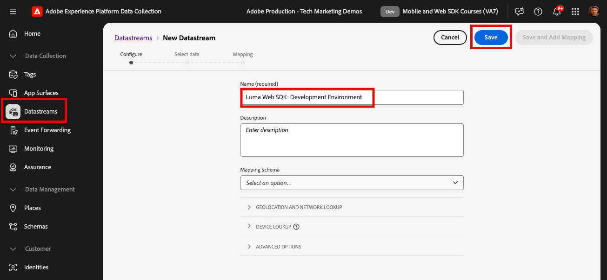

# 設定資料流

了解如何在 Adobe Experience Platform Web SDK 中設定資料流。

[資料串流](https://experienceleague.adobe.com/en/docs/experience-platform/datastreams/overview) 告訴Adobe Experience Platform Edge Network要將由Platform Web SDK收集的資料傳送至何處。 在資料串流設定中，您可以啟用Experience Cloud應用程式、Experience Platform帳戶和事件轉送。

## 學習目標

在本課程結束時，您將能夠：

* 建立資料串流
* 開始使用資料流覆寫

## 先決條件

在設定資料流之前，您必須先完成下列課程：

* [設定結構描述](configure-schemas.md)
* [設定身分名稱空間](configure-identities.md)

## 建立資料串流

現在，您可以建立資料串流，告訴PlatformEdge Network要將Web SDK收集的資料傳送至何處。

**若要建立資料串流：**

1. 開啟 [資料收集介面](https://launch.adobe.com/tw/){target="_blank"}
1. 確定您位於正確的沙箱

   >[!NOTE]
   >
   >如果您是Real-Time CDP或Journey Optimizer等平台型應用程式的客戶，我們建議您在本教學課程中使用開發沙箱。 如果沒有，請使用 **[!UICONTROL Prod]** 沙箱。

1. 前往 **[!UICONTROL 資料串流]** 在左側導覽列中
1. 選取 **[!UICONTROL 新增資料串流]**
1. 輸入 `Luma Web SDK: Development Environment` 作為 **[!UICONTROL 名稱]**. 稍後當您在標籤屬性中設定Web SDK擴充功能時，會參考此名稱。
1. 選取 **[!UICONTROL 儲存]**

   

   >[!NOTE]
   >
   >您不需要選取結構描述。 只有在您使用 [資料收集的資料準備](/help/data-collection/edge/data-prep.md) 功能。

在下一個畫面中，您可以將Adobe應用程式等服務新增至資料流，但此時您不會新增任何服務。 您將在稍後的課程中執行此動作 [設定Experience Platform](setup-experience-platform.md)， [設定Analytics](setup-analytics.md)， [設定Audience Manager](setup-audience-manager.md)， [設定目標](setup-target.md)，或 [事件轉送](setup-event-forwarding.md).

>[!NOTE]
>
>在您自己的網站上實作Platform Web SDK時，您應該建立三個資料串流以對應至您的三個標籤環境（開發、預備和生產）。 如果您使用Platform Web SDK搭配Adobe Real-time Customer Data Platform或Adobe Journey Optimizer等平台式應用程式，請務必在適當的Platform沙箱中建立這些資料串流。

## 覆寫資料流

[資料流覆寫](https://experienceleague.adobe.com/en/docs/experience-platform/datastreams/overrides) 可讓您為資料流定義其他設定，然後在特定條件下覆寫預設設定。

資料流設定覆寫分為兩個步驟：

1. 首先，您可以在資料流服務設定中定義資料流覆寫。 例如，您可以定義替代的Analytics報表套裝、Target工作區或Platform資料集以用作覆寫。
1. 然後，您會透過Web SDK傳送事件動作，或透過Web SDK標籤擴充功能中的設定，將覆寫傳送至Edge Network。

在 [設定Adobe Analytics](setup-analytics.md) 課程，您可以使用Platform Web SDK傳送事件動作覆寫頁面的報表套裝。

您現在已準備好在標籤屬性中安裝Platform Web SDK擴充功能！

[下一步： ](install-web-sdk.md)

>[!NOTE]
>
>感謝您投入時間學習Adobe Experience Platform Web SDK。 如果您有疑問、想分享一般意見或有關於未來內容的建議，請分享這些內容 [Experience League社群討論貼文](https://experienceleaguecommunities.adobe.com/t5/adobe-experience-platform-data/tutorial-discussion-implement-adobe-experience-cloud-with-web/td-p/444996)
