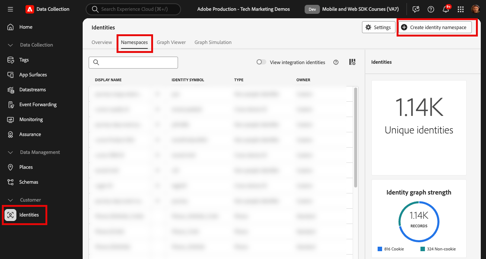
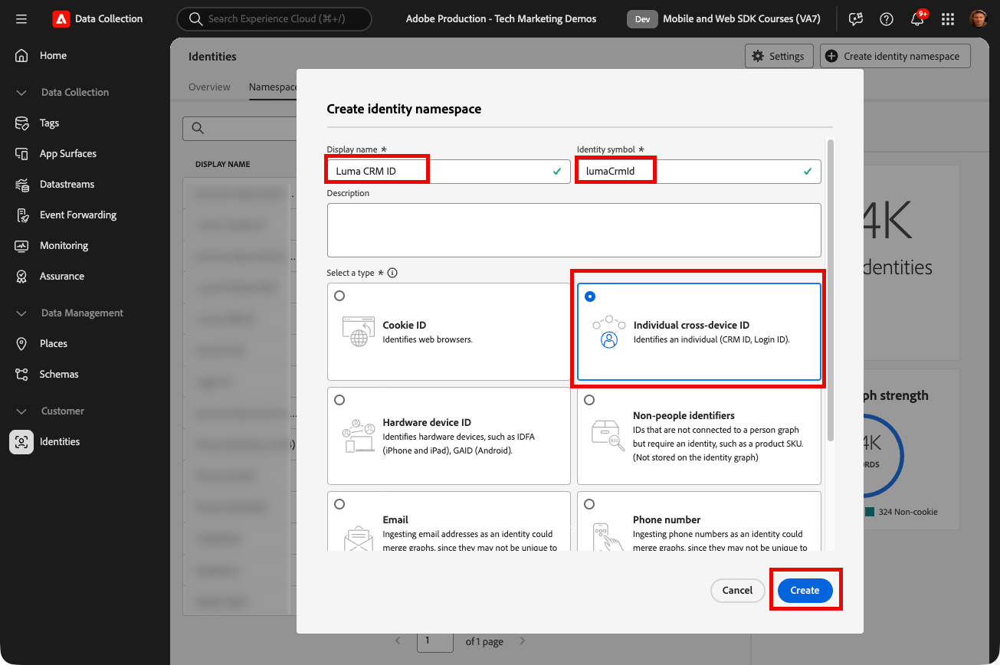
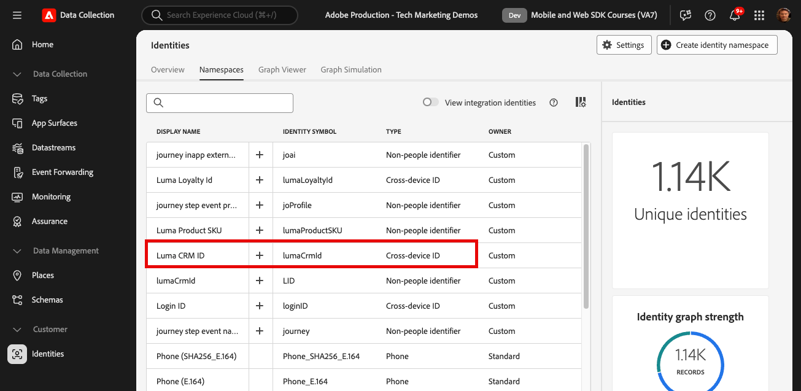

# 設定身分名稱空間

瞭解如何設定身分識別名稱空間以搭配Adobe Experience Platform Web SDK使用。

此 [Adobe Experience Cloud Identity服務](https://experienceleague.adobe.com/docs/id-service/using/home.html) 跨以SDK為基礎的Adobe應用程式設定通用訪客ID (ECID)，以便支援Experience Cloud功能，例如應用程式之間的受眾共用。 您也可以將自己的客戶ID傳送至此服務，以啟用跨裝置目標鎖定及與其他系統(例如客戶關係管理(CRM)系統)的整合。

此 [Adobe Experience Platform Identity服務](https://experienceleague.adobe.com/docs/experience-platform/identity/home.html?lang=zh-Hant) （是的，有兩個專案！） 使用ECID和客戶ID來產生身分圖表，好讓您將屬性和行為合併到即時客戶個人檔案中。

>[!NOTE]
>
> 為了示範，本課程中的練習可讓您擷取已登入的虛構客戶的身分詳細資訊 [Luma示範網站](https://luma.enablementadobe.com/content/luma/us/en.html) 使用認證， **使用者： `test@adobe.com` /密碼：測試**.

## 學習目標

在本課程結束時，您將能夠：

* 瞭解身分名稱空間
* 建立自訂身分名稱空間以擷取內部CRM ID

## 先決條件

您必須已完成先前的課程：

* [設定結構描述](configure-schemas.md)

>[!IMPORTANT]
>
>此 [Experience CloudID擴充功能](https://exchange.adobe.com/experiencecloud.details.100160.adobe-experience-cloud-id-launch-extension.html) 實作Adobe Experience Platform Web SDK時不需要使用，因為Web SDK JavaScript程式庫包含訪客ID服務功能。
>
> 如果您的網站已透過訪客API或Experience CloudID服務標籤擴充功能在網站上使用Experience CloudID服務，而您想要在移轉至Adobe Experience Platform Web SDK時繼續使用該服務，則您必須使用最新版本的訪客API或Experience CloudID服務標籤擴充功能。 另請參閱 [ID移轉](https://experienceleague.adobe.com/docs/experience-platform/edge/identity/overview.html?lang=en) 以取得詳細資訊。

## 建立身分名稱空間

在本練習中，您將為Luma的自訂身分欄位建立身分名稱空間， `lumaCrmId`. 身分識別命名空間在建立即時客戶設定檔方面扮演關鍵角色，因為相同命名空間中的兩個相符值可讓兩個資料來源形成身分識別圖表。

在開始練習之前，請觀看此短片，進一步瞭解Adobe Experience Platform中的身分識別：

>[!VIDEO](https://video.tv.adobe.com/v/27841?learn=on)

現在，為Luma CRM ID建立名稱空間：

1. 開啟 [資料收集介面](https://launch.adobe.com/tw/){target="_blank"}
1. 選取您在本教學課程中使用的沙箱

   >[!NOTE]
   >
   >如果您是Real-Time CDP或Journey Optimizer等平台型應用程式的客戶，我們建議您在本教學課程中使用開發沙箱。 如果沒有，請使用 **[!UICONTROL Prod]** 沙箱。

1. 選取 **[!UICONTROL 身分]** 在左側導覽列中
1. 選取 **[!UICONTROL 瀏覽]**

   身分名稱空間清單會顯示在頁面的主要介面中，顯示其名稱、身分符號、上次更新日期，以及是否為標準或自訂名稱空間。 右側欄包含的相關資訊 [!UICONTROL 身分圖表強度].

1. 選取 **[!UICONTROL 建立身分名稱空間]**

   

1. 提供詳細資訊，如下所示，並選取 **[!UICONTROL 建立]**.

   | 欄位 | 值 |
   |---------------|-----------|
   | 顯示名稱 | Luma CRM ID |
   | 身分符號 | lumaCrmId |
   | 類型 | 個別跨裝置ID |

   

   身分名稱空間會填入 **[!UICONTROL 身分]** 畫面。

   

>[!NOTE]
>
> 在 [建立身分](create-identities.md) 課程，您將學習在傳送身分識別到PlatformEdge Network時如何使用此名稱空間。

## 在您的生產沙箱中建立身分名稱空間

由於Web SDK擴充功能目前的限制，身分名稱空間也必須在生產沙箱中建立，才能使用名稱空間將資料傳送至開發沙箱。 因此，如果您在本教學課程中使用了開發沙箱，請同時建立 `Luma CRM ID` 生產沙箱中的名稱空間。

現在身分已準備就緒，可以設定資料流。

[下一步： ](configure-datastream.md)

>[!NOTE]
>
>感謝您投入時間學習Adobe Experience Platform Web SDK。 如果您有疑問、想分享一般意見或有關於未來內容的建議，請分享這些內容 [Experience League社群討論貼文](https://experienceleaguecommunities.adobe.com/t5/adobe-experience-platform-launch/tutorial-discussion-implement-adobe-experience-cloud-with-web/td-p/444996)
