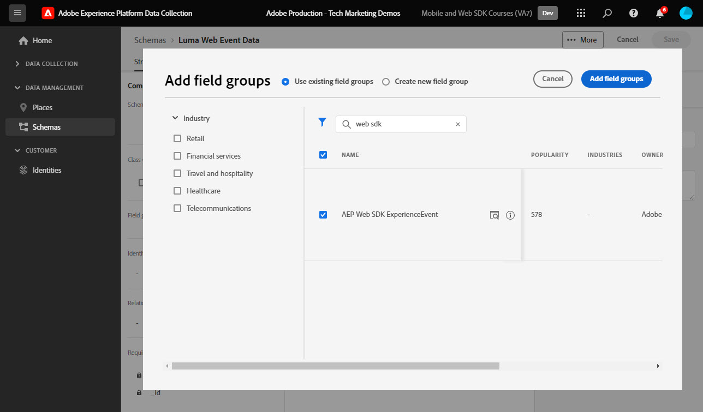

# 為Web資料建立XDM結構

了解如何在資料收集介面中為Web資料建立XDM結構。

Experience Data Model(XDM)結構是合成Adobe Experience Platform結構的基礎要素、原則及最佳實務。

Platform Web SDK使用您的結構，將您的Web事件資料標準化、傳送至Platform Edge Network，並最終將資料轉送至資料流中設定的任何Experience Cloud應用程式。 此步驟非常重要，因為它定義了將客戶體驗資料擷取至Experience Platform所需的標準資料模型，並支援以這些標準為基礎的下游服務和應用程式。

>[!NOTE]
>
> 為了示範，本課程中的練習會建立範例結構，以擷取客戶在 [Luma示範網站](https://luma.enablementadobe.com/content/luma/us/en.html). 雖然您可以使用這些步驟來建立不同的架構以供您自己使用，但建議您先按照建立範例架構的步驟來了解架構編輯器的功能。

若要進一步了解XDM結構，請參閱課程「[使用XDM建立客戶體驗資料模型](https://experienceleague.adobe.com/?recommended=ExperiencePlatform-D-1-2021.1.xdm)」或查看 [XDM系統概觀](https://experienceleague.adobe.com/docs/experience-platform/xdm/home.html?lang=zh-Hant).

## 學習目標

在本課程結束時，您將能夠：

* 從資料收集介面中建立XDM結構
* 新增欄位群組至XDM結構
* 使用最佳實務建立網頁事件資料的XDM結構

## 先決條件

資料收集和Adobe Experience Platform的所有必要布建和使用者權限，如 [設定權限](configure-permissions.md) 教訓。

## 建立 XDM 結構描述

XDM結構是描述Experience Platform中資料的標準方式，可讓所有符合結構的資料在組織間重複使用，而不會產生衝突，甚至可在多個組織間共用。 若要進一步了解，請參閱 [結構構成基本知識](https://experienceleague.adobe.com/docs/experience-platform/xdm/schema/composition.html?lang=zh-Hant).

在本練習中，您將使用建議的基線欄位群組來建立XDM結構，以擷取 [Luma示範網站](https://luma.enablementadobe.com/content/luma/us/en.html){target=&quot;_blank&quot;}:

1. 開啟 [資料收集介面](https://launch.adobe.com/tw/){target=&quot;_blank&quot;}
1. 請確定您位在正確的沙箱中

   >[!NOTE]
   >
   >如果您是Platform型應用程式（例如即時CDP）的客戶，建議您在本教學課程中使用開發沙箱。 若非如此，請使用 **[!UICONTROL 生產]** 沙箱。

1. 前往 **[!UICONTROL 結構]** 在左側導覽列中
1. 選取 **[!UICONTROL 建立結構]** 按鈕
1. 從下拉式功能表中，選取 **[!UICONTROL XDM ExperienceEvent]**

## 新增欄位群組

如前所述，XDM是核心架構，可借由提供通用結構和定義以用於下游Adobe Experience Platform服務，將客戶體驗資料標準化。 遵循XDM標準， _所有客戶體驗資料_ 可合併到共同表示中。 此方法可讓您從客戶動作中獲得寶貴的深入分析、透過區段定義客戶受眾，以及使用來自多個來源的資料表達客戶屬性以用於個人化目的。 請參閱 [資料模型最佳實務](https://experienceleague.adobe.com/docs/experience-platform/xdm/schema/best-practices.html?lang=en) 以取得更多資訊。

建議您盡可能使用現有欄位群組，並遵循產品無關的模型和命名慣例。 對於您組織的特定資料，如果不符合上述預先定義的欄位群組，您可以建立自訂欄位群組。 請參閱 [使用架構編輯器建立架構](https://experienceleague.adobe.com/docs/experience-platform/xdm/tutorials/create-schema-ui.html?lang=en#create) 以取得自訂結構的詳細步驟。

>[!TIP]
> 
>在本練習中，您為Web資料收集新增了建議的預先定義欄位群組： _**[!UICONTROL AEP Web SDK ExperienceEvent]**_，和 _**[!UICONTROL 消費者體驗事件]**_.

1. 在 **[!UICONTROL 欄位群組]** 部分，選擇 **[!UICONTROL 新增]**
1. 搜尋 [!UICONTROL `AEP Web SDK ExperienceEvent`]
1. 核取方塊
1. 搜尋 [!UICONTROL `Consumer Experience Event`]
1. 核取方塊
1. 選擇 **[!UICONTROL 新增欄位群組]**

   

選取欄位群組後，即可為架構命名。 XDM結構的常見命名慣例是在資料來源後命名結構：

1. 在**[!UICONTROL 合成**] 面板，選擇 `Untitled schema name`
1. 在 **[!UICONTROL 架構屬性]** ，輸入 **[!UICONTROL 顯示名稱]** `Luma Web Event Data`
1. 選取外部的任何項目 **[!UICONTROL 顯示名稱]** 欄位以啟用 **[!UICONTROL 儲存]** 選項
1. 選擇 **[!UICONTROL 儲存]**

對於這兩個欄位群組，請注意您有權存取網路上資料收集所需最常用的索引鍵值組。 此 [!UICONTROL 顯示名稱] 在平台型應用程式的區段產生器介面中，行銷人員會看到每個欄位，而您可以變更標準欄位的顯示名稱以符合您的需求。 您也可以移除不想要的欄位。 按一下任一欄位群組名稱時，介面會反白標示其所屬的鍵值組群組。 在以下範例中，您會看到屬於哪些群組 **[!UICONTROL 消費者體驗事件]**.

這個教訓只是一個起點。 建立您自己的Web事件結構時，您必須探索並記錄您的業務需求。 此程式類似於建立 [業務需求文檔](https://experienceleague.adobe.com/docs/analytics-learn/tutorials/implementation/implementation-basics/creating-a-business-requirements-document.html) 和 [解決方案設計參考](https://experienceleague.adobe.com/docs/analytics-learn/tutorials/implementation/implementation-basics/creating-and-maintaining-an-sdr.html) Adobe Analytics實作，但應包含 _所有下游資料收件者_ 例如平台、目標和事件轉送目的地。

### identityMap物件

識別名為的網頁使用者需要一組特殊資料 `[!UICONTROL identityMap]`.

這是任何Web相關資料收集的必要物件，因為它會放置識別Web使用者所需的Experience CloudID。 也是為已驗證的使用者設定內部客戶ID的關鍵。 `[!UICONTROL identityMap]` 在 [設定身分](configure-identities.md) 教訓。 它會自動包含在所有結構中，使用 **[!UICONTROL XDM ExperienceEvent]** 類別。

>[!IMPORTANT]
>
> 可以啟用 **[!UICONTROL 設定檔]** ，然後儲存您的架構。 **不要** 此時啟用。 為設定檔啟用架構後，即無法停用或刪除該架構。 此外，在此時間點後，無法從架構中移除欄位。 在生產環境中處理您自己的資料時，請務必留意以下這些意涵。
>
>此設定將在 [設定Experience Platform](setup-experience-platform.md) 教訓。
>

現在，當您新增Web SDK擴充功能至標籤屬性時，即可參考此結構。

[下一個： ](configure-identities.md)

>[!NOTE]
>
>感謝您花時間學習Adobe Experience Platform Web SDK。 如果您有任何疑問、想要分享一般意見，或對未來內容有任何建議，請就此分享 [Experience League社群討論貼文](https://experienceleaguecommunities.adobe.com/t5/adobe-experience-platform-launch/tutorial-discussion-implement-adobe-experience-cloud-with-web/td-p/444996)
